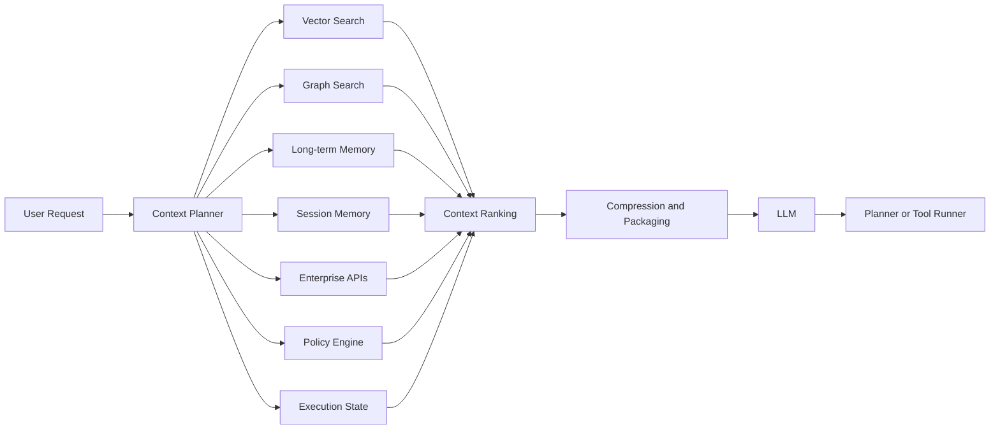

# Context Engineering: The Architecture Discipline Beyond Prompting

> Prompt engineering optimizes instructions. Context engineering optimizes everything the model knows before it starts reasoning.

## Executive summary

Many production AI systems fail because they provide the model with the wrong working set, not because the instruction is poorly worded. Context engineering is the discipline of selecting, ranking, compressing, governing, and assembling the information an LLM needs for a specific task.

That working set may include retrieved documents, user and project memory, execution state, tool definitions, policies, code, architecture decisions, prior failures, and intermediate artifacts.

A useful mental model is:

```text
LLM quality
= model capability
× context quality
× tool quality
× execution strategy
```

## From prompting to context assembly

A first-generation AI interaction looks like this:

```text
User → Prompt → LLM → Answer
```

A retrieval-augmented system adds a document lookup:

```text
User → Retriever → Prompt → LLM → Answer
```

A mature agentic system uses a context assembly layer:

```text
User request
   ↓
Context planner
   ├── session memory
   ├── long-term memory
   ├── vector retrieval
   ├── graph retrieval
   ├── execution state
   ├── enterprise policies
   ├── tool manifests
   └── live APIs
   ↓
Context ranking and compression
   ↓
LLM
   ↓
Plan, action, tool call, or answer
```

## Architecture



## Core model

A context builder should produce a structured object rather than an unbounded text prompt.

```json
{
  "goal": "Migrate a Mule flow to Spring Boot",
  "task": "Generate the Salesforce adapter",
  "authoritative_sources": [],
  "retrieved_knowledge": [],
  "project_state": {},
  "prior_decisions": [],
  "constraints": [],
  "available_tools": [],
  "security_labels": [],
  "provenance": []
}
```

The model may still receive serialized text, but the system should manage the context as typed, versioned data before serialization.

## Internal mechanics

### 1. Retrieval

Enterprise context rarely comes from one retrieval method. Typical sources include:

- semantic vector search
- BM25 or keyword search
- SQL queries
- graph traversal
- source-code indexes
- APIs and live telemetry
- Git history
- architecture repositories
- workflow state stores

Vector similarity is strong for semantic recall. It is weak for questions such as dependency impact, ownership, lineage, or current transactional state.

### 2. Ranking

Retrieval may return hundreds of candidate items. Ranking determines which items deserve context-window space.

Useful factors include:

- relevance to the current task
- authority of the source
- freshness
- confidence
- user and project scope
- security classification
- previous usefulness
- dependency proximity

A document that is highly similar but obsolete should normally rank below a current architecture decision record.

### 3. Compression

Context windows are large but not infinite, and excessive context can reduce performance. Compression strategies include:

- deduplication
- extractive selection
- hierarchical summaries
- parent-child chunk expansion
- task-specific condensation
- state snapshots
- retaining references while omitting low-value detail

Compression must preserve facts, constraints, identifiers, and provenance. A fluent summary that loses a critical constraint is not useful compression.

### 4. State injection

Long-running agents require explicit state, such as:

- current task
- completed and remaining tasks
- generated artifacts
- failed tests
- unresolved risks
- current branch and commit
- approved architecture decisions
- migration progress

Without state injection, the agent repeatedly reconstructs the project from conversation history and eventually drifts.

### 5. Tool manifests

Tools are also context. A model needs to know each tool's name, purpose, input schema, permissions, cost, latency, and failure semantics.

Poor tool descriptions create poor tool selection even when the model is capable.

## Concrete example: migration accelerator

For a MuleSoft-to-Spring Boot migration, a weak invocation is:

```text
Convert this Mule flow to Spring Boot.
```

A context-engineered invocation includes:

- the normalized flow in `canonical.json`
- connector inventory
- target architecture
- approved migration strategy
- coding standards
- unsupported components
- generated code already present
- source-to-target traceability
- failed parity tests
- target runtime and cloud constraints
- available migration skills

The model is no longer guessing the surrounding architecture. It is operating within a governed project state.

## Implementation pattern

```python
from dataclasses import dataclass
from typing import Any

@dataclass
class ContextItem:
    source: str
    authority: int
    freshness: float
    relevance: float
    payload: Any

class ContextBuilder:
    def build(self, task: dict) -> dict:
        candidates = []
        candidates += self.load_project_state(task)
        candidates += self.retrieve_documents(task)
        candidates += self.retrieve_subgraph(task)
        candidates += self.load_policies(task)
        candidates += self.load_prior_failures(task)

        ranked = sorted(
            candidates,
            key=lambda item: (
                item.relevance,
                item.authority,
                item.freshness,
            ),
            reverse=True,
        )

        return {
            "goal": task["goal"],
            "working_set": self.compress(ranked[:40]),
            "tools": self.available_tools(task),
            "provenance": self.provenance(ranked[:40]),
        }
```

In Java or Go, use the same pattern with immutable context records, typed interfaces for sources, and a deterministic assembly pipeline.

## Failure modes

### Context flooding

Injecting everything wastes tokens and distracts the model. More context is not automatically better context.

### Retrieval myopia

Using only vector search misses relationships, live state, exact identifiers, and authoritative structured data.

### Context drift

Long-running sessions accumulate stale or contradictory information. Context should be refreshed and pruned rather than endlessly appended.

### Mixed trust levels

Generated text, approved specifications, runtime telemetry, and internet material should not be treated as equally authoritative. Every item should carry source, timestamp, confidence, and access metadata.

### Hidden truncation

A system may silently truncate the most important section. Context packaging should be observable, measured, and tested.

## Enterprise design guidance

Treat context engineering as a first-class platform capability:

1. Define a versioned context schema.
2. Separate immutable knowledge from mutable execution state.
3. Attach provenance, timestamps, confidence, and security labels.
4. Instrument retrieval precision, context utilization, token cost, latency, and outcome quality.
5. Cache expensive retrieval and summarization with explicit invalidation.
6. Test context assembly independently from model prompts.
7. Build task-specific context policies rather than a single universal retriever.

## Relationship to adjacent concepts

| Concept | Primary focus | Limitation |
|---|---|---|
| Prompt engineering | Instruction phrasing | Usually ignores state, memory, and retrieval quality |
| RAG | Knowledge retrieval | Often document-centric and stateless |
| Agent memory | Persistence across interactions | Does not define the complete working set |
| Graph engineering | Relationship-aware knowledge | One context source, not the entire assembly process |
| Loop engineering | Execution and feedback cycles | Depends on good context at every iteration |
| Context engineering | End-to-end working-set construction | Requires infrastructure, governance, and evaluation |

## Architectural takeaway

The important design question is no longer merely:

> What prompt should we send?

It is:

> What is the smallest, highest-value, most authoritative working set that allows the model to make the correct decision?

For an AI modernization platform, `canonical.json`, OKF documents, migration history, generated code, test results, and architecture decisions are not secondary documentation. Together they form the context layer that powers planning, generation, validation, review, and future iterations.

## Recommended reading

- [Anthropic — Building Effective AI Agents](https://www.anthropic.com/research/building-effective-agents)
- [OpenAI Agents SDK](https://openai.github.io/openai-agents-python/)
- [OpenAI Agents SDK — Sessions](https://openai.github.io/openai-agents-python/sessions/)
- [LangGraph — Memory](https://docs.langchain.com/oss/python/langgraph/add-memory)
- [Microsoft Semantic Kernel — Agent Memory](https://learn.microsoft.com/en-us/semantic-kernel/frameworks/agent/agent-memory)
- [LlamaIndex — Condense Plus Context](https://docs.llamaindex.ai/en/stable/examples/chat_engine/chat_engine_condense_plus_context/)
