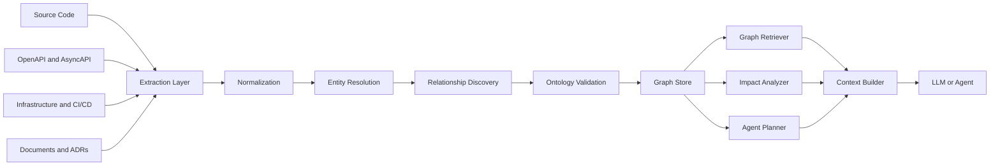
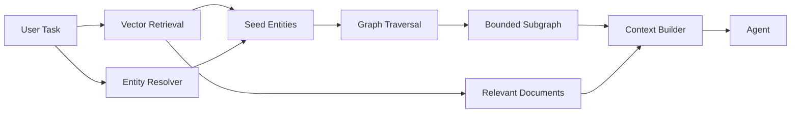

# Graph Engineering: A World Model for Agentic Systems

> Vectors tell an AI system what is similar. Graphs tell it what is connected.

## Executive summary

Graph engineering is the discipline of representing enterprise entities, dependencies, execution state, provenance, and knowledge as a traversable graph that AI agents can query and update.

This matters because many high-value architecture questions are relational rather than semantic:

- Which services depend on this API?
- Which generated class came from this Mule flow?
- What tests are affected by this connector change?
- Which team owns the downstream consumer?
- What is the blast radius of replacing this database?

A vector database is excellent at finding similar text. It is not designed to perform dependency traversal, lineage analysis, or multi-hop impact reasoning.

## Core model

A graph consists of four main elements.

### Nodes

Examples:

- Application
- Service
- API
- Event
- Database
- Connector
- Migration task
- Source artifact
- Generated artifact
- Test
- Policy
- Team
- Cloud resource

### Edges

Examples:

- `CALLS`
- `DEPENDS_ON`
- `PUBLISHES`
- `SUBSCRIBES_TO`
- `READS_FROM`
- `WRITES_TO`
- `GENERATED_FROM`
- `IMPLEMENTS`
- `OWNED_BY`
- `DEPLOYED_TO`
- `VALIDATED_BY`

### Properties

Examples:

- version
- owner
- environment
- language
- framework
- confidence
- freshness
- risk
- repository
- status

### Traversals

The value comes from traversals such as:

```text
Start with Flow A
→ follow CALLS
→ find Salesforce Connector
→ follow IMPLEMENTED_BY
→ find Spring Adapter
→ follow VALIDATED_BY
→ find failed parity test
```

## Architecture



## Internal mechanics

### 1. Extraction

Graph facts can come from:

- Java, Python, and Go ASTs
- OpenAPI specifications
- AsyncAPI and event schemas
- Terraform and CloudFormation
- Kubernetes manifests
- Git history
- CI/CD pipelines
- database schemas
- runtime traces
- logs and metrics
- architecture documentation

Use deterministic parsers where structure is explicit. Use LLMs primarily for semantic enrichment, undocumented intent, classification, and ambiguous relationships.

### 2. Normalization

Different sources describe the same concept differently. A Java package, deployment manifest, and architecture document may use different identifiers for one service.

Normalization converts source-specific records into a common graph vocabulary.

```json
{
  "type": "Service",
  "canonicalId": "customer-profile-service",
  "aliases": [
    "CustomerProfileService",
    "customer-profile",
    "svc_customer_profile"
  ]
}
```

### 3. Ontology design

An ontology defines valid node types, edge types, constraints, and semantics.

A weak ontology creates a graph that is technically connected but operationally inconsistent. For example, separate teams may model the same concept as `Application`, `App`, `Product`, or `System`.

Start with a small, governed ontology and extend it only when a real query requires new semantics.

### 4. Entity resolution

Entity resolution determines whether differently named records refer to the same object.

Signals may include:

- repository path
- deployment name
- endpoint hostname
- schema identifiers
- owner
- runtime trace correlation
- naming similarity
- explicit aliases

False merges are dangerous because they create incorrect dependency paths. Resolution should produce confidence scores and preserve source evidence.

### 5. Relationship discovery

Relationships may be explicit:

- a Feign client calls a REST endpoint
- a Kafka producer publishes to a topic
- a foreign key references a table
- a Terraform module provisions a resource

They may also be inferred:

- two components use the same schema
- a generated class resembles a source flow
- a deployment artifact and repository appear to represent the same service

Inferred edges should be labeled with provenance and confidence.

## Knowledge graph versus execution graph

Not every graph is a knowledge graph.

A **knowledge graph** represents domain entities and facts:

```text
Service → CALLS → API
API → OWNED_BY → Team
```

An **execution graph** represents workflow and state:

```text
Discover → Normalize → Plan → Execute → Review → Parity Test
```

An agentic platform often needs both. The execution graph tells the agent what happens next. The knowledge graph tells it what the task affects.

## Concrete example: migration accelerator

Consider a MuleSoft flow being migrated to Spring Boot.

```text
Mule Flow: createCustomer
   ├── CALLS → Salesforce Connector
   ├── PUBLISHES → customer-created topic
   └── READS_FROM → Oracle customer table

Generated Spring Service
   ├── GENERATED_FROM → Mule Flow: createCustomer
   ├── IMPLEMENTS → Customer API
   └── VALIDATED_BY → parity-test-104
```

With this graph, the migration planner can answer:

- Which connectors must be replaced?
- Which downstream event consumers are affected?
- Which generated files should be regenerated after a flow change?
- Which parity tests validate the migrated path?
- Which architecture decisions constrain the target design?

This is much harder to implement with document similarity alone.

## Bounded subgraph retrieval

Agents should not receive the entire enterprise graph. They should receive a task-specific subgraph.

```python
from dataclasses import dataclass
from typing import Iterable

@dataclass
class TraversalPolicy:
    max_depth: int
    edge_types: set[str]
    max_nodes: int

class GraphContextBuilder:
    def build(self, start_node: str, policy: TraversalPolicy) -> dict:
        subgraph = self.graph.traverse(
            start=start_node,
            max_depth=policy.max_depth,
            allowed_edges=policy.edge_types,
            limit=policy.max_nodes,
        )

        return {
            "start_node": start_node,
            "nodes": subgraph.nodes,
            "edges": subgraph.edges,
            "provenance": subgraph.provenance,
        }
```

A migration task might allow only:

```text
DEPENDS_ON
CALLS
GENERATED_FROM
VALIDATED_BY
IMPLEMENTS
```

and restrict traversal to two or three hops.

## Hybrid graph and vector retrieval

The strongest architecture combines both retrieval styles.

1. Vector search identifies semantically relevant documents or entities.
2. Graph traversal expands from those entities to dependencies, owners, lineage, or tests.
3. A context builder ranks and serializes the resulting subgraph plus selected documents.



## Failure modes

### Graph explosion

Adding every possible node and edge creates a graph that is expensive to traverse and difficult to govern.

Use domain boundaries, typed edges, retention policies, and query-driven modeling.

### Weak ontology

An inconsistent vocabulary produces duplicate node types and ambiguous relationships. Ontology governance is an architecture concern, not just a data-model concern.

### Stale relationships

A stale graph can produce confident but incorrect impact analysis. Update the graph incrementally from source code, deployment pipelines, and runtime telemetry.

### Excessive LLM inference

Using an LLM to infer facts that can be parsed deterministically increases cost and uncertainty. Prefer ASTs, schema parsers, and runtime evidence for structural relationships.

### Uncontrolled traversal

Broad traversal can create huge contexts and expose unrelated or unauthorized data. Apply edge allowlists, depth limits, node limits, tenant boundaries, and security filtering.

### Missing provenance

An edge without evidence is difficult to trust. Record whether each edge came from source code, runtime telemetry, documentation, or model inference.

## Enterprise use cases

### Application modernization

Model legacy components, dependencies, generated replacements, and validation evidence for incremental migration planning.

### API governance

Trace providers, consumers, owners, schemas, policies, and lifecycle status.

### Cloud architecture

Represent dependencies across AWS, Azure, and GCP resources for impact analysis and cost or resilience reviews.

### Security

Identify the blast radius of a vulnerable package, compromised credential, or exposed service.

### Data lineage

Track how data moves through APIs, events, ETL jobs, databases, and analytics systems.

### Agent collaboration

Give planning, coding, testing, and review agents a shared, queryable world model.

## Relationship to adjacent concepts

| Concept | Primary focus | Best at |
|---|---|---|
| Vector database | Semantic similarity | Finding related unstructured content |
| Knowledge graph | Entities and relationships | Multi-hop reasoning, lineage, impact analysis |
| Workflow graph | Execution control | State transitions and orchestration |
| Context engineering | Working-set assembly | Selecting what the model should see |
| Agent memory | Persistence | Retaining facts and experiences across runs |
| Graph engineering | Building and governing graph systems | Creating reliable graph-backed reasoning infrastructure |

## Design recommendation for a modernization platform

Use four cooperating layers:

1. **Canonical state store** for authoritative migration state.
2. **Knowledge graph** for dependencies, lineage, ownership, and provenance.
3. **Vector index** for semantic retrieval across OKF and architectural documents.
4. **Context builder** for producing a bounded, task-specific working set.

In this model:

- `canonical.json` is the control-plane state.
- OKF documents capture rich knowledge.
- The graph binds artifacts and dependencies.
- Vector retrieval locates semantically related knowledge.
- The context builder decides what the agent sees.

## Architectural takeaway

A practical mental model is:

- Vectors tell you what is similar.
- Graphs tell you what is connected.
- Context engineering decides what the model should see.
- Loop engineering decides what happens next.

For enterprise AI systems, graphs become valuable when they are treated not as a visualization layer, but as an operational world model that agents can traverse with bounded, governed queries.

## Recommended reading

- [Microsoft GraphRAG](https://microsoft.github.io/graphrag/)
- [Microsoft GraphRAG GitHub Repository](https://github.com/microsoft/graphrag)
- [Neo4j GraphRAG](https://neo4j.com/developer/genai-ecosystem/graphrag/)
- [Neo4j Developer Resources](https://neo4j.com/developer/)
- [LangGraph Documentation](https://docs.langchain.com/oss/python/langgraph/)
- [LlamaIndex Documentation](https://docs.llamaindex.ai/)
- [Stanford CS520 — Knowledge Graphs](https://web.stanford.edu/class/cs520/)
