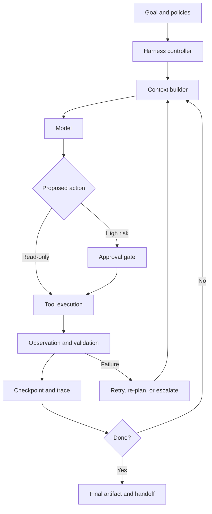

# Agent Harness Engineering: The Control Plane Around the Model

**Published:** 2026-07-27  
**Topic:** Agent architecture, long-running systems, migration automation

## Executive summary

An **agent harness** is the operational control plane around a model. It determines what the model can see, which tools it can call, how state is persisted, when work is retried, where human approval is required, how failures are surfaced, and how one session hands work to the next.

The model supplies reasoning capability. The harness supplies continuity, bounded autonomy, safety, observability, and recoverability.

For short tasks, a prompt plus tools may be enough. For work spanning repositories, hours, multiple context windows, or regulated systems, harness design becomes the dominant architecture problem. Anthropic's work on long-running agents emphasizes explicit initialization, incremental progress, and durable handoff artifacts. LangGraph exposes similar concerns through checkpointing, persistence, durable execution, and human-in-the-loop controls. OpenAI's Agents SDK places orchestration, handoffs, guardrails, tracing, and controlled execution around the agent loop.

## Core model

A production agent should be treated as a stateful process rather than a single model invocation.



The harness owns five concerns that should not be delegated entirely to the model:

1. **State** — task progress, decisions, artifacts, failures, and pending work.
2. **Control flow** — iteration limits, routing, retries, approval boundaries, and termination.
3. **Capability boundaries** — tools, permissions, sandboxes, credentials, and quotas.
4. **Validation** — tests, schemas, policy checks, quality gates, and acceptance criteria.
5. **Observability** — traces, checkpoints, costs, latency, tool calls, and failure classification.

## Harness versus adjacent concepts

| Concept | Primary responsibility |
|---|---|
| Prompt engineering | Shape one model interaction |
| Context engineering | Assemble the model's working set |
| Agent framework | Provide abstractions for agents and tools |
| Workflow engine | Execute predetermined steps reliably |
| Agent harness | Govern an adaptive loop over state, tools, checks, and approvals |
| Evaluation system | Measure outcomes and trajectories |

A harness may use a workflow engine underneath it, but the two are not identical. A conventional workflow knows the route in advance. An agent harness supports dynamic routing while retaining deterministic boundaries around risk and correctness.

## Internal mechanics

### 1. Initialization

A strong first run establishes the workspace before implementation begins. Typical outputs include:

- repository inventory;
- architecture and dependency map;
- task ledger;
- acceptance criteria;
- test commands;
- known constraints;
- persistent progress file.

This prevents every later session from rediscovering the environment. Anthropic describes an initializer agent and an incremental coding agent as separate roles for long-running work.

### 2. Durable state

Conversation history is not sufficient state. Durable state should be external, structured, and resumable.

```json
{
  "task_id": "migrate-customer-api",
  "phase": "execute",
  "completed_steps": ["discover", "normalize", "plan"],
  "current_unit": "salesforce-connector",
  "artifacts": [
    "migration/canonical.json",
    "src/main/java/.../CustomerController.java"
  ],
  "failed_checks": ["contract-test-17"],
  "next_action": "repair payload mapping",
  "attempt": 2
}
```

The model should receive a task-specific projection of this state, not the entire history.

### 3. Bounded loop

Every iteration should have an explicit contract:

```text
observe → decide → act → validate → checkpoint
```

A useful harness enforces:

- maximum iterations and token budget;
- tool timeouts;
- retry policies by failure class;
- required validation after mutation;
- stop conditions based on acceptance criteria;
- escalation when confidence or safety thresholds are not met.

### 4. Checkpointing and recovery

Checkpoint at meaningful boundaries, not arbitrary token intervals. LangGraph's persistence model saves state snapshots at execution steps, enabling fault recovery, human intervention, memory, and replay. Smaller nodes improve recovery granularity but increase orchestration overhead.

For enterprise work, checkpoint contents should include:

- input state and selected context;
- model decision and tool arguments;
- tool output hashes or references;
- repository commit or workspace snapshot;
- validation results;
- cost and latency metadata.

### 5. Permission tiers

| Tier | Example | Default handling |
|---|---|---|
| Read | search code, read schema | automatic |
| Reversible write | create branch, draft file | automatic with checkpoint |
| Shared-state write | update main branch, change database | approval or policy gate |
| Irreversible/high impact | production deployment, deletion | explicit human approval |

This is safer than asking the model to judge risk from scratch on every call.

### 6. Validation as architecture

Validation should be executable and external to the model wherever possible:

- JSON Schema for canonical artifacts;
- compiler and static analysis for generated code;
- contract and parity tests for migration;
- policy-as-code for security;
- deterministic diff checks for generated configuration;
- evaluator models only for subjective dimensions.

The harness should treat validation failure as a state transition, not as an exception that ends the run.

## Concrete example: MuleSoft-to-Spring migration

Your migration accelerator already contains the beginnings of a harness:

```text
/discover → /normalize → /plan → /validate-plan → /execute → /review → /parity-test
```

The next architectural step is to make the control rules explicit.

```python
from dataclasses import dataclass, field
from enum import Enum

class Phase(str, Enum):
    DISCOVER = "discover"
    NORMALIZE = "normalize"
    PLAN = "plan"
    EXECUTE = "execute"
    REVIEW = "review"
    PARITY = "parity-test"
    DONE = "done"

@dataclass
class MigrationState:
    application: str
    phase: Phase
    canonical_path: str
    attempt: int = 0
    failures: list[str] = field(default_factory=list)
    artifacts: list[str] = field(default_factory=list)

class MigrationHarness:
    def __init__(self, tools, validators, checkpoint_store):
        self.tools = tools
        self.validators = validators
        self.checkpoints = checkpoint_store

    def run_step(self, state: MigrationState) -> MigrationState:
        context = self.build_context(state)
        proposal = self.tools.agent.plan(context)

        self.enforce_permissions(proposal)
        result = self.tools.execute(proposal)
        validation = self.validators.validate(state.phase, result)

        if not validation.ok:
            state.attempt += 1
            state.failures.extend(validation.errors)
            if state.attempt >= 3:
                raise RuntimeError("Escalation required")
        else:
            state = self.advance(state, result)

        self.checkpoints.save(state, proposal, result, validation)
        return state
```

The model proposes work, but the harness decides whether it is permitted, how it is executed, how success is tested, and whether the process advances.

For `canonical.json`, add harness-level fields such as:

```json
{
  "execution": {
    "run_id": "2026-07-27-001",
    "phase": "execute",
    "checkpoint": 18,
    "approval_required": false,
    "retry_budget": 2,
    "last_validation": {
      "status": "failed",
      "checks": ["schema", "compile", "parity"],
      "failed": ["parity"]
    }
  }
}
```

Keep rich reverse-engineered knowledge in OKF-style Markdown, but keep machine-operational state compact and structured.

## Implementation patterns

### Python

Use LangGraph when you need explicit state, checkpointing, interrupts, and custom routing. Use an Agents SDK when you need standardized tools, handoffs, guardrails, and tracing with less orchestration code. Keep domain validators outside the agent framework.

### Java

For enterprise Java, separate the harness service from generated Spring Boot applications. A practical stack is Spring Boot for the harness API and policy layer, Temporal or Camunda for durable activities and approvals, PostgreSQL for run state, isolated workers for tool execution, OpenTelemetry for traces, and JSON Schema plus Maven/Gradle tests for validation.

### Go

Go is well suited to a lightweight execution plane: goroutines for controlled parallel work, explicit typed state machines, container or microVM sandboxes, OpenTelemetry spans for every iteration, and Temporal when runs span process lifetimes.

## Cloud deployment guidance

### AWS

- Step Functions or Temporal for durable orchestration;
- Bedrock or external providers behind a model gateway;
- ECS/Fargate, EKS, or isolated CodeBuild jobs for tool execution;
- DynamoDB or PostgreSQL for checkpoints;
- CloudWatch and OpenTelemetry for traces;
- IAM roles per tool capability;
- KMS and Secrets Manager for credentials.

### Azure

- Durable Functions or Temporal;
- Azure OpenAI behind API Management;
- Container Apps jobs or AKS sandboxes;
- Cosmos DB or PostgreSQL for state;
- Managed Identity and Key Vault;
- Application Insights and OpenTelemetry.

### GCP

- Workflows or Temporal;
- Vertex AI behind a model gateway;
- Cloud Run jobs or GKE for tools;
- Firestore, Spanner, or PostgreSQL for checkpoints;
- service accounts with least privilege;
- Cloud Logging, Trace, and OpenTelemetry.

## Failure modes

### Harness overfitting

A harness often encodes compensations for weaknesses of the current model. As models improve, these rules may become unnecessary or harmful. Version harness policies independently from model configuration and re-evaluate them during upgrades.

### Hidden infinite loops

Detect repeated tool signatures, unchanged diffs, recurring validation errors, and cost growth without progress.

### Context loss across sessions

A progress summary written only in prose may omit constraints. Persist both structured state and narrative handoff notes.

### Non-idempotent tools

Retries can duplicate messages, deployments, records, or commits. Mutable tools need idempotency keys or reconciliation logic.

### Validation theatre

A model reviewing its own output is not an independent quality gate. Prefer deterministic checks and separate evaluators.

### Excessive autonomy

Capability boundaries belong in infrastructure and policy, not merely in prompts.

## Design recommendations for the migration platform

1. Make `canonical.json` the durable run-state projection, not the entire knowledge store.
2. Introduce a Run Controller above slash commands to enforce phase transitions.
3. Store checkpoints by application, flow, phase, and attempt.
4. Require a validator bundle before each phase can advance.
5. Generate a handoff artifact after every run: completed work, evidence, failures, and exact next action.
6. Execute generated code and tests in isolated workspaces.
7. Trace every model call, tool call, decision, checkpoint, and validation result.
8. Evaluate the harness separately from the model: completion rate, recovery rate, human interventions, repeated-work ratio, cost per migrated flow, and parity success.

## Key takeaway

> The model is a reasoning component. The harness is the production system.

For long-running enterprise agents, better prompts produce incremental gains; better harnesses produce dependable behaviour. The differentiator is whether the system can make measurable progress, recover safely, preserve intent across sessions, and prove that the result satisfies its acceptance criteria.

## Further reading

- [Anthropic — Effective harnesses for long-running agents](https://www.anthropic.com/engineering/effective-harnesses-for-long-running-agents)
- [Anthropic — Harness design for long-running application development](https://www.anthropic.com/engineering/harness-design-long-running-apps)
- [Anthropic — Scaling Managed Agents](https://www.anthropic.com/engineering/managed-agents)
- [LangGraph overview](https://docs.langchain.com/oss/python/langgraph/overview)
- [LangGraph persistence](https://docs.langchain.com/oss/python/langgraph/persistence)
- [OpenAI — New tools for building agents](https://openai.com/index/new-tools-for-building-agents/)
- [OpenAI — The next evolution of the Agents SDK](https://openai.com/index/the-next-evolution-of-the-agents-sdk/)
- [Anthropic — Demystifying evals for AI agents](https://www.anthropic.com/engineering/demystifying-evals-for-ai-agents)
