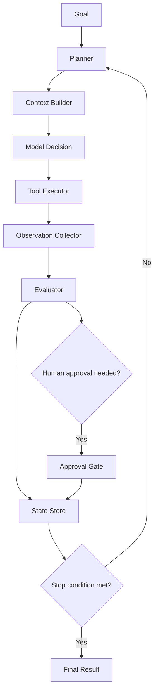

# Loop Engineering: Designing Convergent Agent Execution

**Date:** 2026-07-28  
**Topic:** Agents  
**Primary source:** [Anthropic — Building effective agents](https://www.anthropic.com/research/building-effective-agents)

## Executive summary

Production agents are not single model calls. They are controlled execution loops that repeatedly plan, act, observe, evaluate, and decide whether to continue. **Loop engineering** is the discipline of making those cycles convergent, bounded, observable, recoverable, and safe.

Prompt engineering improves one interaction. Context engineering improves what the model sees. Harness engineering supplies runtime infrastructure. Loop engineering determines how the system progresses over time and whether repeated work actually moves it closer to the goal.

## Core model

A robust agent loop maintains durable state containing the goal, current plan, completed actions, evidence, unresolved risks, budgets, iteration count, and termination status.

```text
state(t+1) = transition(state(t), action(t), observation(t), evaluation(t))
```

The model may propose an action, but deterministic code should own state transitions, budget enforcement, permissions, retries, and stopping decisions.



## Internal mechanics

### Goal decomposition

The loop converts a broad objective into the smallest useful next action. For migration, “convert the application” is not executable; “extract the HTTP listener contract from flow `order-api`” is.

A planner should emit a precise objective, required context, allowed tools, expected artifacts, validation criteria, and a cost/time budget.

### Action execution

Tool execution should be idempotent. Replaying an action after a worker crash must not corrupt a repository, create duplicate resources, or overwrite accepted artifacts without version checks.

### Observation normalization

Compiler logs, test reports, API responses, and generated files should be normalized into structured observations rather than appended as unbounded transcripts.

```json
{
  "action": "compile-generated-service",
  "status": "failed",
  "evidence": {
    "error_count": 2,
    "errors": [
      {"file": "OrderRoute.java", "line": 41, "code": "cannot_find_symbol"}
    ]
  }
}
```

### Evaluation

Evaluation asks whether the action advanced the goal—not merely whether the tool returned successfully. Useful evaluators include deterministic validators, model-based reviewers, comparative parity evaluators, and portfolio-level progress evaluators.

### Termination

Stopping logic should combine positive completion criteria and defensive limits: required artifacts exist, acceptance tests pass, unresolved critical risks are zero, no material improvement is occurring, budgets are exhausted, repeated actions are detected, or human approval is required.

## Convergence engineering

The central problem is not iteration; it is **convergence**. A loop is useful only when each cycle reduces uncertainty, defects, or remaining work.

Track explicit progress measures such as:

```text
progress_score = completed_acceptance_criteria / total_acceptance_criteria
```

For migration, combine compilation, contract parity, test coverage, unsupported constructs, security findings, and review severity. If the score stalls or regresses, change strategy rather than repeating the same prompt.

## Failure modes

### Infinite repetition

The agent retries the same action with cosmetically different wording. Use action fingerprints, retry limits per error class, and forced strategy changes.

### Oscillation

One iteration fixes component A but breaks B; the next reverses the change. Use regression tests, accepted-artifact baselines, dependency-aware planning, and rollback checkpoints.

### Premature completion

The model claims success when only a local step passed. Use deterministic completion gates and acceptance criteria evaluated outside the model.

### Context accumulation

Every observation is appended until the model receives a noisy, contradictory transcript. Use structured state, bounded working context, summaries with provenance, and targeted retrieval.

### Reward hacking

The agent optimizes a visible metric while violating the real objective—for example, deleting failing tests to obtain a green build. Protect critical files, use multi-dimensional evaluation, policy checks, and audit trails.

## Concrete implementation: migration loop

```python
from dataclasses import dataclass, field
from typing import Any

@dataclass
class LoopState:
    goal: str
    iteration: int = 0
    completed: bool = False
    observations: list[dict[str, Any]] = field(default_factory=list)
    progress_score: float = 0.0

class MigrationLoop:
    def __init__(self, planner, executor, evaluator, store, max_iterations=12):
        self.planner = planner
        self.executor = executor
        self.evaluator = evaluator
        self.store = store
        self.max_iterations = max_iterations

    def run(self, state: LoopState) -> LoopState:
        while not state.completed and state.iteration < self.max_iterations:
            action = self.planner.next_action(state)
            result = self.executor.execute(action)
            evaluation = self.evaluator.assess(state, action, result)

            state.iteration += 1
            state.observations.append(evaluation.observation)
            state.progress_score = evaluation.progress_score
            state.completed = evaluation.acceptance_criteria_met
            self.store.checkpoint(state)

            if evaluation.repeated_failure:
                self.planner.force_strategy_change(state)

        return state
```

A practical MuleSoft-to-Spring Boot loop is:

1. discover Mule flow and dependencies;
2. normalize into `canonical.json`;
3. generate one Spring component;
4. compile;
5. run contract and parity tests;
6. classify failures;
7. revise the plan;
8. regenerate only affected components;
9. complete when all acceptance gates pass.

## Relationship to adjacent disciplines

| Discipline | Primary question |
|---|---|
| Prompt engineering | How should one model call be instructed? |
| Context engineering | What information should the model receive now? |
| Graph engineering | Which entities and relationships should be traversable? |
| Harness engineering | Which runtime controls and tools surround the model? |
| Loop engineering | How does repeated execution make bounded, verified progress? |
| Workflow orchestration | How are durable tasks scheduled and recovered? |

Loop engineering often uses workflow orchestration, but they are not identical. Temporal or Step Functions can guarantee durable execution; they do not decide whether an LLM-generated plan is productive or whether semantic acceptance criteria have been met.

## Implementation guidance

### Python

Use typed state models with Pydantic or dataclasses. Separate planner, executor, evaluator, and state-store interfaces. Use Temporal, LangGraph, or a durable queue when work spans processes or hours. Persist checkpoints after every tool-changing action.

### Java

Represent state with immutable records and explicit transition services. Spring Boot workers can execute tools, while Temporal Java SDK, AWS Step Functions, or Camunda can provide durable orchestration. Keep model calls behind interfaces so they can be tested and replaced.

### Go

Use small interfaces for planning and evaluation, `context.Context` for deadlines and cancellation, and append-only event records for recovery. Temporal Go SDK is a strong fit for long-running loops. Ensure activities are idempotent because retries are normal.

### AWS

Use Step Functions for bounded workflows, ECS/Fargate or Lambda for workers, DynamoDB for state, S3 for artifacts, EventBridge for events, and CloudWatch/X-Ray for observability. Use task tokens for human approval gates.

### Azure

Use Durable Functions or Logic Apps for orchestration, Container Apps for workers, Cosmos DB for state, Blob Storage for artifacts, and Application Insights for traces and metrics.

### GCP

Use Workflows for orchestration, Cloud Run for workers, Firestore or Cloud SQL for state, Cloud Storage for artifacts, Pub/Sub for decoupling, and Cloud Logging/Trace for observability.

## Enterprise use cases

Loop engineering is especially valuable for application modernization, code remediation, architecture conformance, incident investigation, security patching, complex research, data-quality correction, and automated pull-request improvement.

For a migration platform, the strongest design is a deterministic outer loop around model-assisted inner steps. `canonical.json` should carry current migration state and acceptance evidence; OKF-style Markdown can hold explainable knowledge and provenance; evaluators should decide whether each flow advances to the next gate.

## Reading

- [Anthropic: Building effective agents](https://www.anthropic.com/research/building-effective-agents)
- [OpenAI Agents SDK: Running agents](https://openai.github.io/openai-agents-python/running_agents/)
- [LangGraph documentation](https://docs.langchain.com/oss/python/langgraph/)
- [Temporal documentation](https://docs.temporal.io/)
- [Microsoft Semantic Kernel](https://learn.microsoft.com/semantic-kernel/)
