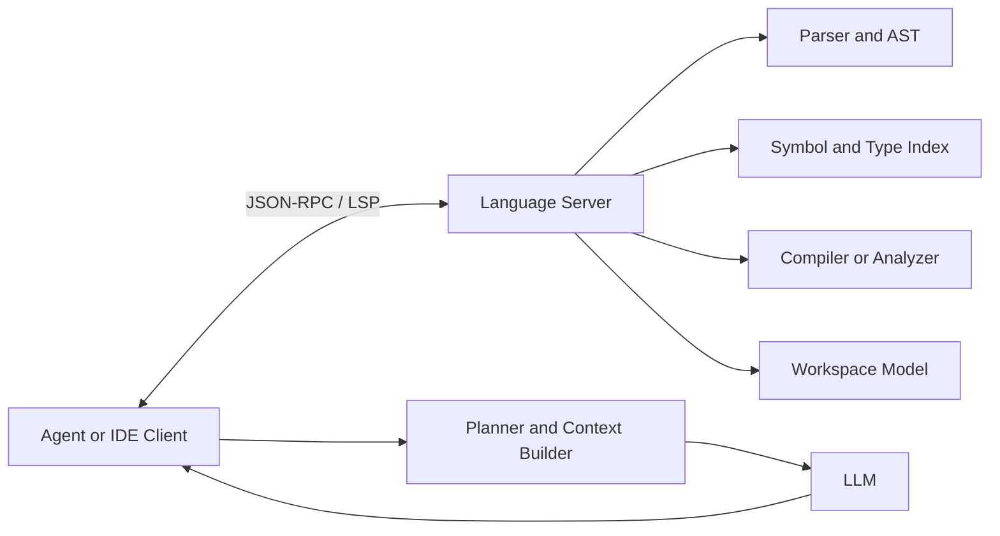
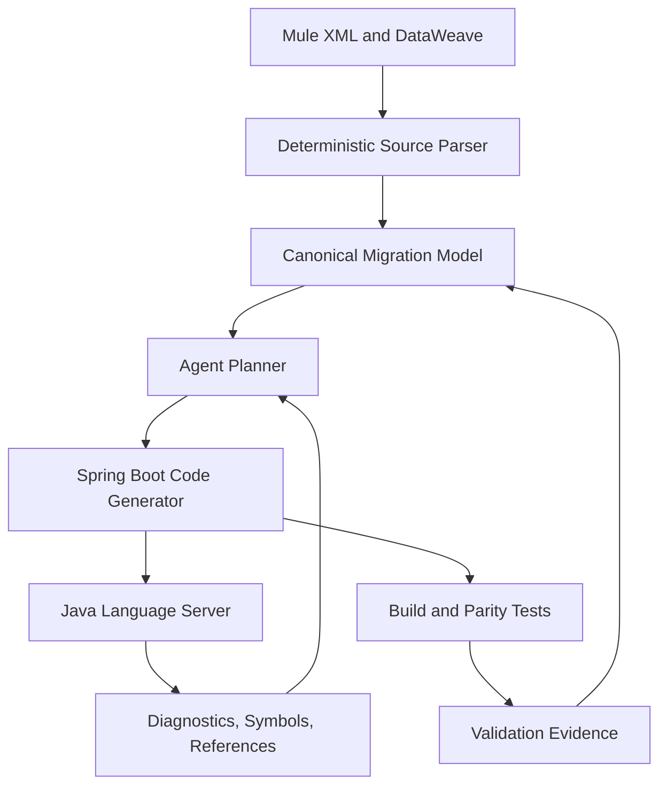

# LSPs as Semantic Infrastructure for Coding and Migration Agents

## Executive summary

The Language Server Protocol (LSP) is usually described as an IDE feature protocol for completion, hover, go-to-definition, diagnostics, and refactoring. For agentic software engineering, its more important role is as a **semantic control plane** between an AI agent and a codebase.

A model can read files, but reading text is not the same as understanding symbol identity, type relationships, references, compilation errors, or whether an edit remains valid across a workspace. An LSP server exposes those facts through structured JSON-RPC operations. This lets an agent combine probabilistic reasoning with deterministic program analysis.

For migration automation, LSP should not replace the canonical migration model or deterministic source parser. It should sit beside them: the parser extracts source-platform semantics, the canonical model holds migration truth, and LSP validates and navigates the generated target code.

## The core model

LSP separates a **language client** from a **language server**. The client may be an IDE, CLI agent, migration orchestrator, or code-review bot. The server owns language intelligence such as parsing, symbol tables, type analysis, diagnostics, references, and workspace edits.



Typical methods include `initialize`, `textDocument/didOpen`, `textDocument/didChange`, `textDocument/definition`, `textDocument/references`, diagnostics, code actions, workspace symbols, and structured workspace edits.

The architectural advantage is **capability negotiation**. The client and server declare what they support, allowing one agent harness to work with multiple language servers without assuming every feature exists.

## Why agents need LSP

Agents operating only through file search and text generation have predictable blind spots:

1. Identically spelled tokens may refer to different symbols.
2. A rename may require edits across many files.
3. Generated code may look plausible but violate type contracts.
4. Text search cannot reliably distinguish declarations, references, comments, and strings.
5. Build feedback often arrives only after a large change.

LSP turns these uncertainties into structured queries. Before modifying a method, an agent can resolve its definition and references. After an edit, it can request diagnostics. Before generating an adapter, it can inspect available types and signatures.

## LSP versus adjacent approaches

| Approach | Primary strength | Limitation |
|---|---|---|
| File search / embeddings | Semantic discovery across text | Weak symbol identity and dependency precision |
| AST parser | Deterministic syntax structure | Often language-specific and not workspace-aware |
| Compiler API | Authoritative type and build semantics | Usually tightly coupled to one compiler ecosystem |
| Knowledge graph | Explicit cross-system relationships | Must be built and refreshed |
| LSP | Standardized live semantic queries and edits | Capability and quality vary by language server |
| Canonical migration model | Durable migration state and decisions | Does not analyze generated code by itself |

The strongest architecture is hybrid: embeddings for discovery, parsers for structural extraction, graphs for dependency reasoning, canonical state for workflow truth, and LSP for live code semantics.

## Concrete example: MuleSoft to Spring Boot migration

Assume a Mule flow calls Salesforce, transforms a customer payload, and writes to Kafka. The pipeline generates a Spring service, DTOs, a Salesforce adapter, and a Kafka publisher.

A useful LSP-assisted loop is:

1. A deterministic Mule parser extracts the flow and DataWeave mapping.
2. `canonical.json` records the source semantics and target design.
3. The agent generates Java files.
4. The Java language server indexes the workspace.
5. The agent requests diagnostics for generated files.
6. For an unresolved type, it requests workspace symbols and candidate imports.
7. It applies a structured repair.
8. It runs compilation and parity tests.
9. Validation evidence is written back to canonical state.



The LSP server validates **target-language semantics**. It should not be forced to understand Mule XML unless you deliberately build a Mule language server.

## Should you build a MuleSoft LSP?

Build one only when you have a repeated interactive need for Mule-aware navigation, diagnostics, refactoring, and editor support.

Good reasons include:

- go-to-flow and go-to-subflow navigation
- connector configuration validation while editing
- DataWeave symbol and type support
- reference discovery across large Mule workspaces
- quick fixes and safe refactoring
- a reusable semantic service for both IDE users and agents

Do not build one merely to parse projects for batch migration. A deterministic parser plus schema validation is cheaper and easier to test.

A sensible maturity path is:

- Version 1: deterministic Mule parser and canonical model
- Version 2: semantic index and dependency graph
- Version 3: Mule LSP only if live authoring and repeated semantic queries justify it

## Implementation pattern

### Python

Use an async JSON-RPC client and treat the language server as a long-lived subprocess. Maintain document versions, send incremental changes, and normalize responses before placing them in model context.

```python
class SemanticWorkspace:
    async def diagnostics(self, uri: str) -> list[dict]:
        return await self.lsp.request(
            "textDocument/diagnostic",
            {"textDocument": {"uri": uri}},
        )

    async def references(self, uri: str, line: int, character: int) -> list[dict]:
        return await self.lsp.request(
            "textDocument/references",
            {
                "textDocument": {"uri": uri},
                "position": {"line": line, "character": character},
                "context": {"includeDeclaration": True},
            },
        )
```

Do not pass raw LSP payloads directly to the LLM. Convert them into compact evidence records with file, range, severity, symbol, document version, and provenance.

### Java

Run a mature Java language server alongside the migration worker. Persist the generated workspace so indexing is not repeated for every loop. Use LSP diagnostics for fast feedback, but retain Maven or Gradle compilation as the final authority.

### Go

For Go, `gopls` is a strong semantic backend. Use `context.Context` for request deadlines and cancellation, especially for workspace-wide symbol and reference queries.

## Cloud deployment guidance

### AWS

Run language servers in isolated ECS or EKS workers with ephemeral workspace volumes. Store source snapshots and generated artifacts in S3, workflow state in DynamoDB or a durable workflow engine, and logs in CloudWatch. For untrusted repositories, use strict container isolation, read-only base images, outbound network controls, and per-job IAM roles.

### Azure

Use Container Apps or AKS workers, Blob Storage for artifacts, Durable Functions for orchestration, and Application Insights for traces. Managed identities should be scoped per migration job.

### GCP

Use Cloud Run jobs or GKE workers, Cloud Storage for workspaces, Workflows for orchestration, and Cloud Logging/Trace for observability. Large repositories may need persistent workers because cold indexing can dominate latency.

## Failure modes

### Stale document state

If the client sends edits with incorrect versions, diagnostics may describe an older document. Every context item should record the document version it came from.

### Indexing latency

Large monorepos can take significant time to index. Cache indexes where supported and scope the workspace to the migration unit.

### Capability assumptions

Not every server implements every LSP feature. Capability negotiation must drive the agent's tool plan.

### Over-trusting code actions

A code action is a suggested transformation, not proof of architectural correctness. Re-run diagnostics, compilation, tests, and policy checks.

### Unbounded semantic context

Workspace symbol and reference queries can return thousands of results. Rank and summarize before passing them to the model.

### Security exposure

Language servers execute against source code and may invoke compilers, build tools, or plugins. Treat them as code-execution workloads and isolate them accordingly.

## Enterprise design guidance

Use LSP as a typed tool inside the agent harness, not as an invisible background feature. Define explicit operations such as `find_definition`, `find_references`, `get_diagnostics`, `get_symbols`, and `apply_workspace_edit`. Attach provenance and document version to every result.

For a migration accelerator, the recommended responsibility split is:

- Source parser: deterministic Mule extraction
- Canonical model: migration state and approved decisions
- Knowledge graph: dependencies and impact analysis
- LSP: target-code semantic navigation and rapid diagnostics
- Compiler and tests: authoritative acceptance gates
- Agent loop: planning, repair, and escalation

## Recommended reading

- [Language Server Protocol — official overview](https://microsoft.github.io/language-server-protocol/)
- [LSP 3.17 specification](https://github.com/microsoft/language-server-protocol/blob/gh-pages/_specifications/lsp/3.17/specification.md)
- [LSP 3.18 specification](https://github.com/microsoft/language-server-protocol/blob/gh-pages/_specifications/lsp/3.18/specification.md)
- [Microsoft language-server-protocol repository](https://github.com/microsoft/language-server-protocol)

## Architectural takeaway

An LSP does not make an agent intelligent. It makes the agent's interaction with code **grounded, queryable, and testable**. For enterprise coding and migration systems, that distinction is more valuable than adding another prompt or increasing the context window.
