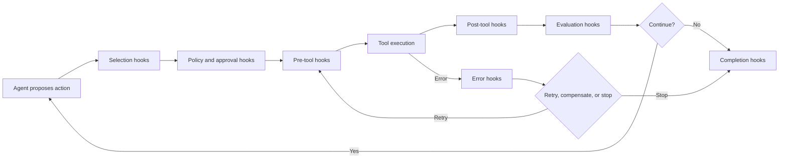

## Executive summary

MCP hooks are interception points around runtime events such as tool selection, execution, approval, errors, and completion. They allow an agent platform to enforce policy, capture telemetry, enrich context, validate outputs, and trigger compensating actions without embedding every concern inside prompts or individual tools.

The architectural value is separation of concerns: the agent decides **what** to do, while hooks govern **whether**, **how**, and **under what controls** the action runs. In enterprise systems, hooks become the control plane for security, observability, quality gates, auditability, and workflow orchestration.

## The core model

A basic agent loop reads context, chooses a tool, invokes it, observes the result, and continues. Enterprise workloads add authorization, schema validation, secret redaction, retries, audit trails, approvals, cost controls, telemetry, and rollback. Implementing these inside every tool leads to duplication and inconsistent enforcement.



## Hook types

### Selection hooks

Selection hooks run before final tool choice. They can hide or rank tools based on identity, environment, workflow stage, cost, or risk. A production deployment capability, for example, should not be exposed unless the user has the right role and an approved change record exists.

### Approval hooks

Approval hooks suspend execution for human review. The pending operation must be persisted with its arguments, policy decision, idempotency key, and workflow checkpoint so execution can resume safely without reconstructing state from chat history.

### Pre-tool hooks

Pre-tool hooks validate and transform inputs. Typical responsibilities include JSON Schema validation, path and command allow-listing, secure credential injection, idempotency-key generation, budget checks, trace propagation, policy evaluation, and input enrichment.

### Post-tool hooks

Post-tool hooks inspect and normalize results. They can redact secrets, map vendor-specific errors into a standard model, validate generated artifacts, record lineage, and attach evidence to agent state.

### Error hooks

Error hooks classify failure before deciding what happens next. A transient network error may be retried with backoff; a policy violation must stop immediately; a partial write may require compensation. Retry behavior should depend on error class, not only a generic retry count.

### Evaluation hooks

Evaluation hooks score progress and quality after an action. They can run deterministic checks, test suites, static analysis, semantic comparison, or LLM-as-judge evaluation. Their output should update explicit workflow state rather than merely produce prose.

### Completion hooks

Completion hooks produce the final audit record, publish artifacts, close traces, release locks, and verify that required destinations were actually updated.

## Composition and ordering

A practical ordering is:

1. identity and authorization
2. policy and risk classification
3. input validation
4. enrichment and credential binding
5. execution
6. output normalization
7. validation and evaluation
8. persistence and telemetry
9. notification and completion

Each hook should return a structured decision such as `continue`, `transform`, `deny`, `pause`, `retry`, or `compensate`. This is safer than relying on exceptions as the only control mechanism.

## Suggested event envelope

```json
{
  "eventId": "evt-20260730-001",
  "runId": "migration-run-42",
  "stage": "execute",
  "hook": "preTool",
  "actor": "migration-agent",
  "tool": "generate_spring_connector",
  "inputRef": "artifact://canonical/flow-17",
  "policyContext": {
    "environment": "development",
    "risk": "medium"
  },
  "traceId": "7f9d...",
  "idempotencyKey": "run-42-flow-17-generate"
}
```

The envelope creates a stable audit and observability boundary. Large payloads should be referenced rather than copied into every event.

## Applying hooks to a MuleSoft-to-Spring migration accelerator

Your migration pipeline already has explicit stages: discover, normalize, plan, validate-plan, execute, review, and parity-test. Hooks fit naturally around them:

- **Pre-discover:** verify repository scope and block unsupported binary or secret files.
- **Post-discover:** validate that every Mule flow, connector, DataWeave mapping, and error handler is represented.
- **Pre-normalize:** enforce canonical schema compatibility.
- **Post-normalize:** validate `canonical.json`, compute lineage, and persist history.
- **Pre-execute:** check that the plan was approved and unsupported connectors were dispositioned.
- **Post-execute:** invoke Java LSP diagnostics, compilation, static analysis, and architecture rules.
- **Post-review:** record every automated correction as a patch with rationale.
- **Post-parity-test:** block completion unless behavioral thresholds pass.
- **Completion:** publish the report only after generated code, canonical state, tests, and evidence are verified.

This makes the hook layer the **migration control plane**, while skills remain execution units and slash commands remain user entry points.

## Python implementation sketch

```python
from dataclasses import dataclass
from enum import Enum
from typing import Any, Awaitable, Callable

class Decision(str, Enum):
    CONTINUE = "continue"
    DENY = "deny"
    PAUSE = "pause"
    RETRY = "retry"

@dataclass
class HookResult:
    decision: Decision
    payload: Any
    reason: str | None = None

Hook = Callable[[dict[str, Any]], Awaitable[HookResult]]

async def run_pipeline(event: dict[str, Any], hooks: list[Hook]) -> HookResult:
    current = HookResult(Decision.CONTINUE, event)
    for hook in hooks:
        current = await hook(current.payload)
        if current.decision != Decision.CONTINUE:
            return current
    return current
```

Production implementations should add timeouts, per-hook retries, immutable event logs, trace spans, and idempotent persistence.

## Java and Go guidance

In Java, model hooks as ordered Spring beans or a dedicated interceptor chain. Avoid hiding workflow state in thread-local storage; use explicit context objects and persisted checkpoints. Resilience4j can provide retry and circuit-breaker behavior, while OpenTelemetry instruments each hook as a span.

In Go, define a small `Hook` interface around a typed event envelope and compose middleware-style functions. Use `context.Context` for deadlines and trace propagation, but keep resumable workflow state outside the process.

## Cloud deployment patterns

### AWS

Use Step Functions for durable orchestration, Lambda or ECS for hook execution, EventBridge for event distribution, DynamoDB for idempotency and checkpoints, IAM and Verified Permissions for authorization, KMS and Secrets Manager for secure bindings, and CloudWatch plus OpenTelemetry for observability.

### Azure

Use Durable Functions or Logic Apps for stateful orchestration, Event Grid or Service Bus for events, Entra ID and Azure Policy for identity and governance, Key Vault for secrets, and Application Insights with OpenTelemetry.

### GCP

Use Workflows for durable orchestration, Pub/Sub or Eventarc for events, IAM Conditions for policy, Secret Manager for credentials, Firestore or Cloud SQL for checkpoints, and Cloud Trace plus OpenTelemetry.

## Failure modes

- **Hook sprawl:** maintain a registry, ownership model, ordering rules, and versioned contracts.
- **Hidden mutation:** record before-and-after hashes and expose transformations in the audit trail.
- **Non-idempotent retries:** check whether external writes already exist before retrying.
- **Policy split-brain:** pin policy bundles to a run and include versions in decision records.
- **Observability without causality:** record the hook, policy, evidence, decision, and state transition together.
- **Fail-open behavior:** security, approval, and validation hooks should generally fail closed.

## Hooks versus adjacent concepts

- **Hooks vs tools:** tools perform domain actions; hooks govern their lifecycle.
- **Hooks vs skills:** skills package repeatable expertise; hooks enforce runtime controls.
- **Hooks vs prompts:** prompts influence behavior probabilistically; hooks enforce deterministic rules.
- **Hooks vs workflow engines:** hooks intercept events; workflow engines persist and coordinate the state machine.
- **Hooks vs MCP servers:** MCP servers expose capabilities and context; the host or harness generally owns invocation hooks.

## Recommended implementation path

Start with five mandatory hooks:

1. schema validation
2. policy and approval
3. idempotency and checkpointing
4. post-tool artifact validation
5. tracing and audit

Then add domain-specific hooks for canonical coverage, unsupported connector checks, Java diagnostics, security scanning, and parity thresholds. Keep hook contracts small and versioned, and require every hook to declare whether failure is blocking or non-blocking.

## Reading

- [Model Context Protocol specification](https://modelcontextprotocol.io/specification/)
- [MCP architecture overview](https://modelcontextprotocol.io/docs/learn/architecture)
- [OpenTelemetry specification](https://opentelemetry.io/docs/specs/)
- [AWS Step Functions](https://docs.aws.amazon.com/step-functions/)
- [Azure Durable Functions](https://learn.microsoft.com/azure/azure-functions/durable/)
- [Google Cloud Workflows](https://cloud.google.com/workflows/docs)
