# Temporal Knowledge-Graph Memory for Long-Running AI Agents

**Date:** 2026-07-31  
**Topic:** Agents  
**Primary source:** https://arxiv.org/abs/2603.07670

## Executive summary

Long-running agents do not merely need more context; they need a **memory system that can decide what to retain, how facts evolve, and which memories are safe to reintroduce into the next reasoning cycle**. A temporal knowledge graph is useful because it represents entities and relationships explicitly while preserving when a fact was observed, when it became valid, when it stopped being valid, and where it came from.

For an enterprise architect, the important design move is to treat memory as a governed subsystem with a **write-manage-read loop**, not as an unbounded vector database. The write path extracts candidate facts and provenance. The manage path resolves identity, supersedes stale facts, assigns confidence, applies retention and policy. The read path performs hybrid semantic, lexical, entity, temporal, and authorization filtering before injecting a compact memory view into the agent context.

The practical payoff is better multi-session consistency, lower token use than replaying full history, explicit handling of contradictory facts, and stronger support for migration agents that must remember decisions, unsupported constructs, fixes, evidence, and project state over weeks.

## Core model: memory as a write-manage-read loop

1. **Write** — decide whether an event deserves persistence and extract durable facts.
2. **Manage** — consolidate, deduplicate, invalidate, summarize, expire, and govern memory.
3. **Read** — retrieve the smallest trustworthy memory set relevant to the current task.

Conversation history is an append-only event log. Memory is a curated, queryable, evolving model derived from that log.

```mermaid
flowchart LR
    A["Agent interaction, tool result, document, or event"] --> B["Episode log"]
    B --> C["Fact extraction and entity resolution"]
    C --> D["Temporal graph write"]
    D --> E["Conflict detection and fact invalidation"]
    E --> F["Policy, retention, confidence, provenance"]
    F --> G["Hybrid memory retrieval"]
    G --> H["Trust and authorization gate"]
    H --> I["Token-budgeted context block"]
    I --> J["Planner and executor"]
    J --> A
```



## Why temporal graph memory is different from vector memory

Vector memory asks: **Which stored items are semantically similar to this query?**

Temporal graph memory can answer richer questions:

- What is the current target platform for this migration?
- Which earlier decision did the current decision supersede?
- Which connector limitation caused a previous parity failure?
- What was believed when the plan was generated?
- Which fact is authoritative: user instruction, parser output, generated inference, or tool observation?
- Which facts belong to this tenant, project, flow, or environment?

The graph does not eliminate embeddings. A production read path usually combines semantic similarity, lexical matching, entity matching, graph traversal, recency, temporal validity, provenance quality, authorization, and task-specific admission rules.

## Data model

### Episode

An immutable source event: user message, parser output, test result, pull request, architecture decision, or tool response.

```text
episode_id
project_id
source_type
source_uri
actor
observed_at
payload_hash
raw_payload
classification
```

### Entity

A canonical identity such as a Mule flow, connector, API, queue, schema, Java class, migration task, environment, or stakeholder.

```text
entity_id
entity_type
canonical_name
aliases
tenant_id
project_id
summary
embedding
```

### Temporal fact edge

```text
fact_id
subject_id
predicate
object_id_or_value
valid_from
valid_to
observed_at
invalidated_at
confidence
source_episode_id
authority
security_label
```

Use two time dimensions where practical:

- **Valid time:** when the fact is true in the domain.
- **Observation time:** when the system learned or stored it.

This prevents overwriting history when reality changes. If `target_runtime = Spring Boot 3.3` later becomes `Spring Boot 3.4`, invalidate the old fact instead of deleting it.

## Internal mechanics

### Write path

A robust write pipeline:

1. Normalize the episode and attach tenant, project, actor, source, and timestamp.
2. Classify it as decision, preference, observation, artifact, failure, constraint, or transient chatter.
3. Extract candidate entities and facts.
4. Resolve entities against aliases and project scope.
5. Compare candidate facts with current graph state.
6. Apply `ADD`, `REINFORCE`, `SUPERSEDE`, `REJECT`, or `DEFER`.
7. Store provenance and extraction confidence.
8. Emit a memory-change event for indexing and audit.

Use deterministic extraction where structure exists. Mule XML, canonical JSON, build files, diagnostics, and test reports should be parsed deterministically. Use an LLM for semantic interpretation, not for facts that a parser can establish.

### Manage path

The manage layer handles:

- entity resolution and alias merging
- contradiction detection
- temporal invalidation
- duplicate suppression
- confidence recalculation
- retention and TTL
- summary generation
- security-label propagation
- deletion and right-to-forget workflows
- compaction of low-value episodes

The model should propose a memory operation; a deterministic policy engine should approve or reject it.

### Read path

1. Derive query entities, task type, tenant, project, and time scope.
2. Run semantic, lexical, and entity retrieval in parallel.
3. Expand one or two graph hops for related decisions, failures, and artifacts.
4. Remove invalid, unauthorized, low-confidence, and source-incompatible facts.
5. Rank by relevance, authority, recency, temporal fit, and diversity.
6. Compress into a context block with episode citations.
7. Enforce a token budget and preserve unresolved contradictions explicitly.

Memory retrieval is a trust boundary. Similarity is candidate generation, not final admission. A semantically related memory may still be contextually unsafe, stale, cross-domain, or adversarial.

## Concrete implementation: MuleSoft-to-Spring migration memory

Keep `canonical.json` as the authoritative current state. Add memory around it:

- `canonical.json` remains the deterministic control plane.
- an episode store records discovery, planning, execution, review, and parity-test events.
- a temporal graph captures cross-run knowledge and relationships.
- vector indexes support fuzzy retrieval over summaries, errors, and prior fixes.

Example facts:

```text
(flow:order-api) -[USES]-> (connector:salesforce)
(connector:salesforce) -[MIGRATES_TO]-> (component:spring-salesforce-client)
(task:T-143) -[BLOCKED_BY]-> (constraint:oauth-certificate-missing)
(decision:D-22) -[SUPERSEDES]-> (decision:D-17)
(test:P-91) -[PROVES_PARITY_FOR]-> (flow:order-api)
```

A planner working on a new flow can retrieve previous migrations involving the same connector, common failures, accepted target patterns, and the evidence that justified them.

### Python service sketch

```python
from dataclasses import dataclass
from datetime import datetime
from typing import Protocol

@dataclass(frozen=True)
class CandidateFact:
    subject: str
    predicate: str
    object_value: str
    source_episode_id: str
    valid_from: datetime
    confidence: float
    authority: str

class MemoryPolicy(Protocol):
    def decide(self, fact: CandidateFact, current_facts: list[dict]) -> str: ...

class TemporalMemoryService:
    def __init__(self, graph_store, episode_store, retriever, policy: MemoryPolicy):
        self.graph_store = graph_store
        self.episode_store = episode_store
        self.retriever = retriever
        self.policy = policy

    def ingest(self, episode: dict, extracted_facts: list[CandidateFact]) -> None:
        self.episode_store.append(episode)
        for fact in extracted_facts:
            current = self.graph_store.current_facts(
                subject=fact.subject,
                predicate=fact.predicate,
            )
            action = self.policy.decide(fact, current)
            if action == "SUPERSEDE":
                self.graph_store.invalidate(current, at=fact.valid_from)
                self.graph_store.add(fact)
            elif action in {"ADD", "REINFORCE"}:
                self.graph_store.upsert(fact, action=action)

    def context_for(self, query: str, tenant_id: str, project_id: str) -> str:
        candidates = self.retriever.hybrid_search(
            query=query,
            tenant_id=tenant_id,
            project_id=project_id,
        )
        admitted = [
            c for c in candidates
            if c.authorized and c.current and c.confidence >= 0.70
        ]
        return self.retriever.compress(admitted, max_tokens=1800)
```

The key architectural seam is `MemoryPolicy`. Version and test it independently of the LLM prompt.

## Java and Go guidance

### Java

- Spring Boot API for episode ingestion and context retrieval
- Kafka or Pub/Sub for asynchronous extraction and consolidation
- Neo4j, Neptune, Cosmos DB Gremlin, or a relational temporal model for graph facts
- OpenSearch or PostgreSQL with pgvector for semantic retrieval
- Resilience4j for timeouts and circuit breakers
- OpenTelemetry spans for extraction, resolution, graph write, retrieval, admission, and compression

Model operations as sealed commands such as `AddFact`, `SupersedeFact`, `ReinforceFact`, and `RejectFact`.

### Go

- use explicit structs for episodes and facts
- run semantic, lexical, entity, and graph retrieval concurrently with `errgroup`
- enforce deadlines on every backend call
- maintain a deterministic ranking and admission pipeline
- expose provenance IDs in the returned context block
- keep LLM extraction workers outside the synchronous retrieval path

## Cloud deployment patterns

### AWS

EventBridge or MSK, Lambda or ECS workers, Neptune, OpenSearch Serverless, Aurora PostgreSQL or DynamoDB, Bedrock, KMS, IAM, and CloudTrail.

### Azure

Event Hubs or Service Bus, Functions or Container Apps, Cosmos DB Gremlin or PostgreSQL, Azure AI Search, Azure OpenAI, Entra ID, Key Vault, and Purview.

### GCP

Pub/Sub, Cloud Run, Spanner or AlloyDB or Neo4j Aura, Vertex AI Vector Search, Vertex AI, IAM Conditions, Cloud KMS, and audit logs.

## Trade-offs

### Benefits

- durable cross-session continuity
- explicit fact evolution and contradiction handling
- multi-hop retrieval over related entities
- stronger provenance and explainability
- lower prompt cost than replaying full history
- reusable project knowledge across migration flows

### Costs

- entity resolution is difficult
- write-path LLM calls may dominate cost
- graph and vector consistency must be managed
- invalidation rules are domain-specific
- retrieval evaluation is harder than chatbot testing
- deletion, residency, and tenant isolation become first-class concerns

## Failure modes and mitigations

- **Memory poisoning:** require source authority, provenance, and admission policy.
- **Stale fact resurrection:** filter by validity interval and current status before ranking.
- **Entity collapse:** scope identity resolution by tenant and project; preserve merge audit history.
- **Overwriting contradictory evidence:** store competing claims and authority rather than forcing consensus.
- **Write amplification:** use salience thresholds, batching, asynchronous extraction, and compaction.
- **Retrieval tunnel vision:** blend semantic, lexical, entity, graph, and temporal signals.
- **Cross-project leakage:** apply authorization before graph expansion and again before context assembly.
- **Self-reinforcing hallucination:** distinguish user facts, tool observations, parser facts, and agent hypotheses.
- **Small-model extraction failure:** use stronger models or deterministic parsers for high-value writes.

## Evaluation strategy

Measure memory as a pipeline.

**Write quality**

- fact precision and recall
- entity-resolution accuracy
- contradiction classification
- invalidation correctness
- write cost per episode

**Read quality**

- recall at K
- temporal correctness
- multi-hop answer accuracy
- provenance correctness
- unsafe-memory rejection
- token cost and p95 latency

**Agent outcomes**

- repeated-error reduction
- task completion rate
- unnecessary tool-call reduction
- migration parity improvement
- human correction rate

Compare controlled baselines: recent-history only, full context, basic vector RAG, and structured memory using identical language and embedding models.

## Architectural recommendation

1. Keep `canonical.json` as the authoritative current state.
2. Add an immutable episode log with strong provenance.
3. Introduce hybrid retrieval over episodes and artifacts.
4. Add a small temporal graph for decisions, flows, connectors, constraints, tasks, and test evidence.
5. Implement deterministic invalidation and authority rules before autonomous memory mutation.
6. Add a trust gate before memory enters the planner context.
7. Evaluate whether graph traversal materially improves migration outcomes before expanding the ontology.

The target is not a perfect digital brain. It is a governed, testable knowledge substrate that helps an agent avoid repeated mistakes, understand changing project truth, and retrieve the right evidence at the right moment.

## Recommended reading

- [Memory for Autonomous LLM Agents: Mechanisms, Evaluation, and Emerging Frontiers](https://arxiv.org/abs/2603.07670)
- [Mem0: Building Production-Ready AI Agents with Scalable Long-Term Memory](https://arxiv.org/abs/2504.19413)
- [Graphiti and temporal knowledge-graph concepts](https://help.getzep.com/graph-overview)
- [LangGraph memory and persistence](https://langchain-ai.github.io/langgraph/how-tos/persistence-functional/)
- [Beyond Similarity: Trustworthy Memory Search for Personal AI Agents](https://arxiv.org/abs/2606.06054)
- [MemDelta: Controlled Baselines and Hidden Confounds in Agent Memory Evaluation](https://arxiv.org/abs/2606.29914)
