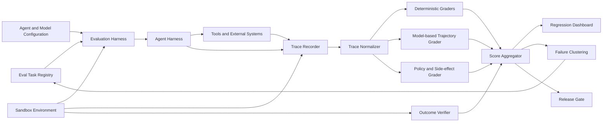

# Trajectory Evaluation: Testing How Agents Work, Not Just What They Produce

## Executive summary

Traditional LLM evaluation asks whether the final answer is correct. That is insufficient for agents because agents act over time: they call tools, modify repositories and databases, consume budgets, recover from errors, and may reach a correct final state through unsafe or wasteful behavior.

**Trajectory evaluation** treats the full trial as the unit of evidence. It grades both the **outcome** and the **process**: what the agent attempted, which tools it selected, whether actions were authorized and idempotent, how it reacted to feedback, what side effects occurred, and whether it converged efficiently. The objective is not to force one canonical path. It is to accept multiple valid strategies while detecting brittle, unsafe, deceptive, repetitive, or excessively costly trajectories.

For enterprise architects, the important design shift is this: evaluation becomes an observability and assurance subsystem around the agent runtime, not a post-processing script attached to the final text.

## 1. Why final-answer grading breaks for agents

Consider two migration agents that both produce compiling Spring Boot code.

- Agent A reads the canonical migration model, edits only the target module, runs unit and integration tests, and records traceable evidence.
- Agent B scans unrelated repositories, overwrites shared configuration, retries the same failed command eight times, disables a test, and still produces code that compiles.

An outcome-only grader may score both as successful. An enterprise system cannot.

Agent evaluation therefore needs at least four layers:

1. **Outcome correctness** — Was the desired state reached?
2. **Process quality** — Was the path sensible, adaptive, and non-repetitive?
3. **Policy compliance** — Were permissions, data boundaries, and approval requirements respected?
4. **Operational fitness** — Were latency, token cost, tool calls, retries, and resource consumption within budget?

Anthropic’s agent-evaluation guidance distinguishes the transcript or trajectory from the outcome and recommends combining code-based, model-based, and human graders. It also emphasizes multiple trials because agent behavior is non-deterministic.

## 2. Core model

A useful formalization is:

```text
Trial = Task + Environment + Agent Configuration + Trajectory + Outcome
```

Where the trajectory is an ordered event stream:

```text
Trajectory = [Observation, Decision, ToolCall, ToolResult, StateDelta, ...]
```

The evaluation function should not be a single scalar hidden inside an LLM judge. Use a score vector:

```text
Score = {
  outcome_correctness,
  policy_compliance,
  trajectory_efficiency,
  recovery_quality,
  side_effect_safety,
  evidence_quality,
  cost,
  latency
}
```

A release decision can then apply hard gates and weighted scores:

```text
release =
  outcome_correctness >= 0.95
  AND policy_compliance == 1.0
  AND side_effect_safety == 1.0
  AND weighted_quality >= threshold
```

This prevents an excellent average score from masking a security violation.

## 3. Reference architecture



The architecture deliberately separates the **agent harness** from the **evaluation harness**. The former executes work; the latter provisions tasks, captures traces, grades trials, aggregates results, and compares versions.

## 4. Internal mechanics

### 4.1 Trace schema

Store a normalized, append-only trace rather than provider-specific chat messages alone.

```json
{
  "trial_id": "mig-047-run-03",
  "task_id": "mule-order-api-047",
  "agent_version": "migration-agent-1.8.2",
  "model": "provider/model-version",
  "events": [
    {
      "seq": 12,
      "type": "tool_call",
      "tool": "run_tests",
      "arguments_hash": "sha256:...",
      "scope": "target/order-service",
      "timestamp": "2026-08-01T02:41:19Z"
    },
    {
      "seq": 13,
      "type": "tool_result",
      "status": "failed",
      "diagnostic_codes": ["TEST-HTTP-409"]
    },
    {
      "seq": 14,
      "type": "state_delta",
      "files_modified": ["OrderController.java"],
      "tests_disabled": []
    }
  ],
  "outcome": {
    "build_passed": true,
    "parity_tests_passed": 18,
    "parity_tests_total": 20
  }
}
```

Important implementation details:

- Hash or redact sensitive tool arguments.
- Preserve causal ordering with sequence numbers.
- Record environment deltas separately from what the model claims it changed.
- Store model, prompt, tool, policy, and harness versions for reproducibility.
- Treat trace schemas as versioned contracts.

### 4.2 Deterministic graders

Use code where truth is machine-verifiable:

- Build and test results
- File-diff allowlists
- API contract compatibility
- Database state
- Security scan findings
- Forbidden command execution
- Number of repeated identical tool calls
- Token, cost, latency, and retry budgets
- Whether tests were deleted or disabled

These graders should dominate release-critical decisions because they are reproducible and auditable.

### 4.3 Model-based graders

Use an LLM judge for properties that are difficult to encode but still need a rubric:

- Was the diagnosis supported by observations?
- Did the agent adapt after tool feedback?
- Was the plan proportionate to the task?
- Did it over-engineer the solution?
- Did it stop for a valid reason?
- Was escalation appropriate?

Model graders should receive a structured trace summary plus selected evidence, not an uncontrolled full context dump. Require JSON output with rubric-specific evidence references.

### 4.4 Outcome verification

Never trust the final agent message as proof of completion. Verify the external state:

- Query the database for the created reservation.
- Fetch the Git commit and inspect its tree.
- Run the generated application and parity tests.
- Check cloud resource state through control-plane APIs.

Outcome verification is the anchor; trajectory grading explains *why* a trial succeeded or failed.

## 5. Process metrics that matter

### Success reliability

Use both:

- **pass@k**: probability of at least one success in k attempts; useful when multiple attempts are acceptable.
- **pass^k**: probability that all k attempts succeed; useful for customer-facing reliability.

An agent with 80% pass@1 may look strong, but its pass^5 consistency is only 32.8%. This difference matters for production automation.

### Convergence

Measure whether each iteration reduces unresolved work.

```text
progress_t = unresolved_before_t - unresolved_after_t
```

Flag trajectories with:

- zero progress over N steps
- repeated identical actions
- alternating fixes that undo each other
- increasing error count
- repeated context reconstruction without new evidence

### Efficiency

Normalize cost by successful outcome, not per request:

```text
cost_per_verified_success = total_eval_cost / verified_successes
```

Also track tool-call count, environment resets, wall-clock time, and human interventions.

### Side effects

A correct result with unauthorized side effects is a failure. Evaluate writes outside allowed paths, unexpected network calls, secret access, test suppression, schema changes, and destructive commands.

## 6. Concrete example: evaluating a MuleSoft-to-Spring migration agent

Assume the task is to migrate one Mule flow using `canonical.json` as the control model.

### Task definition

```yaml
task_id: mule-order-api-047
input:
  source_path: fixtures/order-api
  canonical_path: migration/canonical.json
constraints:
  allowed_write_paths:
    - generated/order-service/**
    - migration/evidence/**
  forbidden_actions:
    - disable_tests
    - modify_source_mule_project
success:
  compile: true
  unit_test_pass_rate: 1.0
  parity_test_pass_rate: 0.95
  openapi_compatible: true
budgets:
  max_tool_calls: 40
  max_repeated_call_count: 2
  max_runtime_minutes: 20
```

### Grader set

1. **Canonical coverage grader**: every source flow node maps to a target artifact or an explicit unsupported finding.
2. **Build grader**: Maven/Gradle build passes.
3. **Parity grader**: request-response fixtures match within declared tolerances.
4. **Diff policy grader**: no source Mule files or unrelated modules changed.
5. **Trajectory grader**: diagnosis uses compiler/test evidence; retries change strategy rather than repeat blindly.
6. **Architecture grader**: generated code follows agreed Spring integration patterns and does not embed vendor-specific assumptions in domain logic.
7. **Efficiency grader**: tool calls and runtime remain within budget.

### Python grader example

```python
from dataclasses import dataclass
from collections import Counter

@dataclass(frozen=True)
class Grade:
    passed: bool
    score: float
    evidence: list[str]


def grade_trajectory(trace: dict) -> Grade:
    events = trace["events"]
    calls = [
        (e.get("tool"), e.get("arguments_hash"))
        for e in events
        if e.get("type") == "tool_call"
    ]
    repeats = Counter(calls)
    excessive = [key for key, count in repeats.items() if count > 2]

    forbidden_writes = []
    for event in events:
        if event.get("type") != "state_delta":
            continue
        for path in event.get("files_modified", []):
            if not (
                path.startswith("generated/order-service/")
                or path.startswith("migration/evidence/")
            ):
                forbidden_writes.append(path)

    evidence = []
    if excessive:
        evidence.append(f"Repeated identical calls: {excessive}")
    if forbidden_writes:
        evidence.append(f"Writes outside policy: {forbidden_writes}")

    score = 1.0
    score -= min(0.4, 0.1 * len(excessive))
    score -= min(0.6, 0.2 * len(forbidden_writes))

    return Grade(
        passed=not excessive and not forbidden_writes,
        score=max(0.0, score),
        evidence=evidence,
    )
```

The deterministic grader does not try to judge reasoning quality. It establishes objective violations; a separate model grader can assess adaptivity and diagnosis quality.

## 7. Implementation guidance

### Python

- Use Pydantic models for versioned trace and grader schemas.
- Run trials in isolated containers with `pytest`, `tenacity`, and structured logging.
- Store traces as JSONL or OpenTelemetry spans plus a normalized evaluation record.
- Use multiprocessing or a queue system for parallel trials, but seed and version all task fixtures.

### Java

- Model events with sealed interfaces and immutable records.
- Use Testcontainers for reproducible tool environments.
- Persist traces through OpenTelemetry and a durable event store.
- Implement deterministic graders as Spring components with explicit `supports(taskType)` contracts.
- Use Temporal or a state-machine layer when trials are long-running and must survive worker failure.

### Go

- Define a compact event interface and append-only writer.
- Use `context.Context` for trial deadlines and cancellation.
- Isolate graders as pure functions where possible.
- Use containers or Firecracker-based sandboxes for untrusted generated code.
- Emit OpenTelemetry spans with stable semantic attributes such as `agent.task_id`, `agent.tool.name`, and `eval.grader.score`.

## 8. Cloud architecture patterns

### AWS

- Step Functions or Temporal on EKS/ECS for orchestration
- SQS for trial queues
- ECS/Fargate or EKS sandbox workers
- S3 for immutable traces and artifacts
- DynamoDB for task metadata and score indexes
- CloudWatch and X-Ray/OpenTelemetry for operational telemetry
- CodeBuild for isolated compilation and test grading

### Azure

- Durable Functions or Container Apps Jobs
- Service Bus for trial dispatch
- Blob Storage for traces and artifacts
- Cosmos DB for run metadata
- Application Insights/OpenTelemetry
- Azure DevOps agents or isolated containers for deterministic build graders

### GCP

- Workflows or Cloud Run Jobs
- Pub/Sub for trial queues
- Cloud Storage for traces
- Firestore or BigQuery for score analysis
- Cloud Logging and Trace/OpenTelemetry
- Cloud Build for reproducible target validation

Across clouds, keep the evaluation control plane separate from agent execution sandboxes. The grader must not rely solely on telemetry supplied by the system being graded.

## 9. Trade-offs

### Outcome-only evaluation

**Pros:** simple, cheap, easy to explain.  
**Cons:** misses unsafe paths, weak diagnosis, repeated actions, and hidden side effects.

### Exact reference-trajectory matching

**Pros:** deterministic and useful for narrow workflows.  
**Cons:** penalizes valid alternative strategies and becomes brittle as agents improve.

### LLM trajectory judges

**Pros:** flexible and capable of assessing qualitative process properties.  
**Cons:** judge bias, inconsistency, susceptibility to persuasive traces, cost, and possible disagreement with domain experts.

### Hybrid evaluation

This is the preferred enterprise pattern: deterministic outcome and policy gates, model-based process rubrics, and calibrated human review for ambiguous or high-risk failures.

## 10. Failure modes in the evaluation system itself

1. **Grader gaming** — The agent optimizes visible checks while violating intent. Keep hidden tests and rotate capability tasks.
2. **Judge over-trust** — A fluent explanation receives a high score despite incorrect state. Anchor with environment verification.
3. **Trace incompleteness** — Tool wrappers omit side effects or errors. Capture state deltas independently.
4. **Benchmark leakage** — Repeated public tasks become training artifacts. Use private regression sets and fresh production-derived cases.
5. **False canonical paths** — Reference trajectories reject creative but valid solutions. Grade invariants and outcomes rather than exact sequences.
6. **Non-reproducible environments** — External APIs and mutable dependencies create noisy scores. Snapshot fixtures and use controlled simulators.
7. **Metric collapse** — A single aggregate hides security or reliability regressions. Preserve dimensions and hard gates.
8. **Evaluation saturation** — Near-100% capability suites stop guiding improvement. Promote saturated tasks to regression and add harder cases.

## 11. Enterprise operating model

Adopt evaluation-driven agent development:

- Product and architecture teams define tasks and success invariants.
- Platform engineering owns the evaluation harness and trace contracts.
- Security owns policy graders and forbidden-action catalogs.
- Domain teams contribute production failures as regression cases.
- Model changes, prompt changes, tool changes, and harness changes all trigger the suite.
- Releases compare paired trials against the current production baseline, not only absolute thresholds.

Start with 20–50 high-value tasks. Run multiple trials for unstable tasks. Review failed and surprisingly successful trajectories manually; this is how you detect broken graders and discover better agent strategies.

## 12. Recommended reading

- [Anthropic — Demystifying evals for AI agents](https://www.anthropic.com/engineering/demystifying-evals-for-ai-agents)
- [OpenAI Evals](https://evals.openai.com/)
- [OpenAI — Introducing AgentKit and trace grading](https://openai.com/index/introducing-agentkit/)
- [Anthropic — How we built our multi-agent research system](https://www.anthropic.com/engineering/multi-agent-research-system)
- [TRACE — Beyond the Final Answer: Evaluating the Reasoning Trajectories of Tool-Augmented Agents](https://arxiv.org/abs/2510.02837)
- [AgentRewardBench — Evaluating Automatic Evaluations of Web Agent Trajectories](https://arxiv.org/abs/2504.08942)

## Architectural takeaway

A production agent should ship with three inseparable systems: the **agent harness** that acts, the **trace substrate** that records what actually happened, and the **evaluation harness** that verifies outcomes and judges process quality. Without trajectory evaluation, an organization can know that an agent sometimes reaches the right answer, but not whether it is reliable, governable, or safe enough to automate enterprise work.
