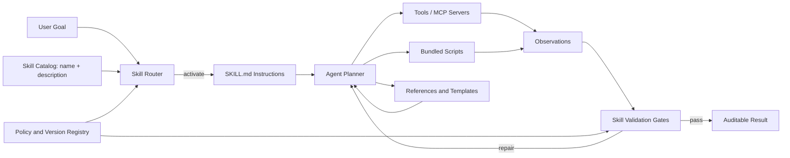

# Agent Skills as Capability Contracts

## Executive summary

Agent Skills are becoming an important portability layer for AI engineering: a skill is not merely a long prompt, but a versioned capability package containing activation metadata, operating instructions, executable scripts, references, templates, and validation rules. The open Agent Skills format uses a `SKILL.md` file as the entry point and relies on progressive disclosure: agents initially see only skill metadata, load the full instructions when a task matches, and fetch supporting resources only when required.

For an enterprise architect, the key design insight is to treat a skill as a **capability contract** between an agent runtime and a governed body of procedural knowledge. Tools expose actions; MCP exposes remote capabilities and context; prompts express immediate intent; workflows control sequence and state. Skills sit between these layers: they teach an agent **when and how** to combine tools, domain rules, and validation steps for a repeatable outcome.

The architecture challenge is therefore not “how to write a better Markdown file.” It is how to build a skill supply chain with precise routing, bounded authority, deterministic scripts, tests, provenance, versioning, observability, and lifecycle governance.

## The core model

A production skill package typically contains:

```text
migration-discovery/
├── SKILL.md
├── scripts/
│   ├── parse_mule.py
│   └── validate_canonical.py
├── references/
│   ├── canonical-schema.md
│   └── connector-taxonomy.md
├── assets/
│   └── canonical-template.json
└── tests/
    ├── fixtures/
    └── expected/
```

`SKILL.md` has two responsibilities:

1. **Discovery contract** — metadata such as `name` and `description` tells the runtime when the skill is relevant.
2. **Execution contract** — instructions define the ordered procedure, allowed tools, decision points, outputs, validation checks, and failure behaviour.

The remaining files prevent the skill from becoming a monolithic prompt. Scripts carry deterministic computation; references hold detailed domain knowledge; assets provide templates; tests make the package governable.

## Progressive disclosure and internal mechanics

The Agent Skills model is based on three loading levels:

1. **Discovery** — the runtime indexes a small amount of metadata for every installed skill.
2. **Activation** — a router selects one or more relevant skills and injects their full instructions into the working context.
3. **Resource loading** — the agent reads referenced documents or invokes bundled scripts only when the procedure needs them.

This matters because a large organisation may have hundreds of skills. Loading all of them into every request would waste context and increase instruction conflicts. Progressive disclosure keeps the initial footprint small while allowing rich domain depth.



A mature runtime should record:

- skill ID and version selected;
- routing score and reason;
- instructions and resource hashes;
- tools and scripts invoked;
- validation results;
- approvals and policy decisions;
- final outcome and rollback information.

Without this trace, failures are hard to distinguish: was the model weak, the wrong skill selected, a script defective, a reference stale, or a tool unavailable?

## Skills compared with adjacent abstractions

| Abstraction | Primary responsibility | Typical failure when misused |
|---|---|---|
| Prompt | Express the current task and constraints | Becomes huge, repetitive, and non-versioned |
| `AGENTS.md` or repository instructions | Persistent repository-wide guidance | Too broad for specialised procedures |
| Tool or function | Perform a concrete action | Does not teach when or why to call it |
| MCP server | Expose tools, resources, and prompts across a protocol boundary | Capability exists but procedural use remains underspecified |
| Workflow or state machine | Control sequence, retries, and durable state | Becomes rigid when semantic judgement is required |
| Agent | Plan and reason toward a goal | Reinvents procedures and varies between runs |
| **Skill** | Package reusable procedural expertise and supporting resources | Becomes an untested “prompt folder” without contracts or validation |

Skills complement, rather than replace, workflow orchestration. A durable migration pipeline may use Temporal or Step Functions for stage control while each stage invokes a skill for semantic work. The workflow owns state and retries; the skill owns domain procedure.

## Concrete implementation example: a MuleSoft discovery skill

For a MuleSoft-to-Spring Boot accelerator, a strong first skill boundary is `discover-mule-application`.

### Skill contract

```markdown
---
name: discover-mule-application
description: Discover Mule 4 applications and produce a technology-neutral canonical model. Use when the input repository contains Mule XML flows, DataWeave, connectors, APIKit definitions, or Mule configuration files.
---

## Required inputs
- Repository root
- Canonical schema version
- Connector taxonomy version

## Procedure
1. Verify the repository contains Mule artifacts.
2. Run `scripts/parse_mule.py`; do not infer XML structure with the LLM.
3. Map parsed processors to the canonical taxonomy.
4. Record unresolved processors as explicit `unsupported` nodes.
5. Generate flow DAGs, connector inventory, configuration references, and DataWeave dependencies.
6. Run `scripts/validate_canonical.py`.
7. Fail the skill if schema validation fails or if required secrets are copied into output.

## Outputs
- `migration/canonical.json`
- `migration/discovery/flow-dag.json`
- `migration/discovery/connectors.json`
- `migration/discovery/report.md`

## Completion criteria
- Every source flow has a canonical flow ID.
- Every processor is mapped or marked unsupported.
- Canonical JSON passes schema validation.
- No secret values appear in generated artifacts.
```

### Deterministic script interface

```python
from __future__ import annotations

import json
import subprocess
from dataclasses import dataclass
from pathlib import Path


@dataclass(frozen=True)
class SkillResult:
    canonical_file: Path
    unsupported_count: int
    validation_passed: bool


def run_discovery(repo: Path, schema: Path) -> SkillResult:
    output = repo / "migration" / "canonical.json"
    output.parent.mkdir(parents=True, exist_ok=True)

    subprocess.run(
        ["python", "scripts/parse_mule.py", str(repo), "--out", str(output)],
        check=True,
        capture_output=True,
        text=True,
    )

    validate = subprocess.run(
        ["python", "scripts/validate_canonical.py", str(output), "--schema", str(schema)],
        capture_output=True,
        text=True,
    )

    document = json.loads(output.read_text(encoding="utf-8"))
    unsupported = sum(
        1
        for flow in document.get("flows", [])
        for step in flow.get("steps", [])
        if step.get("classification") == "unsupported"
    )

    return SkillResult(
        canonical_file=output,
        unsupported_count=unsupported,
        validation_passed=validate.returncode == 0,
    )
```

The model may interpret ambiguous semantics and write the human-readable report, but deterministic parsing and schema validation are kept outside model reasoning. This separates probabilistic judgement from structural truth.

## Skill routing patterns

### Metadata routing

Match the task against skill name and description. This is cheap but sensitive to vague descriptions. Descriptions should contain positive triggers, important inputs, and clear exclusions.

### Classifier routing

Use a small model or embedding classifier to rank skills. Require a minimum confidence and expose the routing reason in traces.

### Hierarchical routing

First select a domain such as `migration`, then a stage such as `discover`, then a technology-specific skill such as `mule4-discovery`. This scales better than comparing every request with every skill.

### Explicit orchestration

A workflow or slash command names the required skill directly. This is preferable for regulated or repeatable enterprise pipelines because the runtime is not allowed to substitute an unapproved capability.

A practical design uses explicit skill selection for production pipelines and semantic routing for exploratory developer assistance.

## Enterprise governance model

Treat skills like internal software packages.

### Identity and versioning

Use a stable skill name plus semantic version. Pin production workflows to an approved version rather than silently consuming the latest skill.

### Provenance

Record author, owner, source repository, review status, supported runtimes, external dependencies, and the hashes of scripts and references.

### Authority declaration

Each skill should declare its required capabilities:

```yaml
capabilities:
  filesystem:
    read: ["src/**", "pom.xml"]
    write: ["migration/**"]
  network: false
  commands:
    allow: ["python scripts/parse_mule.py", "mvn -q test"]
  secrets:
    access: []
```

The runtime, not the Markdown instructions, must enforce these boundaries.

### Testing pyramid

- **Static validation:** frontmatter, links, file references, prohibited instructions.
- **Script tests:** deterministic unit and integration tests.
- **Routing tests:** tasks that should and should not activate the skill.
- **Trajectory tests:** expected tool sequence and forbidden actions.
- **Outcome tests:** schema correctness, generated-code compilation, parity tests.
- **Adversarial tests:** prompt injection in repository files and hostile tool output.

### Release gates

Promote a skill from experimental to approved only after it meets measurable success, safety, and cost thresholds. Keep a rollback path to the last approved package.

## Failure modes and mitigations

### Ambiguous activation descriptions

Two skills may claim the same task, causing unstable selection. Maintain negative examples and ownership boundaries, and test routing as a first-class interface.

### Skill instruction collision

Multiple activated skills can contain contradictory rules. Define precedence: platform policy, organisation policy, repository policy, workflow instruction, then skill instruction. Avoid activating several broad skills simultaneously.

### Hidden nondeterminism

A skill may instruct the model to perform parsing, calculation, or formatting that should be deterministic. Move such work into scripts with machine-readable output.

### Stale references

Bundled documentation can age while the skill still appears valid. Store source URLs and retrieval dates, run link and freshness checks, and prefer live retrieval from approved primary sources when the task permits it.

### Excessive authority

A useful skill may quietly require shell, network, cloud, and repository write access. Apply least privilege per skill and require approval for high-impact transitions such as deployment, deletion, or production configuration changes.

### Context bloat

A 1,000-line `SKILL.md` defeats progressive disclosure. Keep the execution contract concise and move deep reference material into focused files that can be loaded independently.

### Skill supply-chain compromise

A third-party skill can contain unsafe instructions or scripts. Pin versions, verify provenance, scan code, sandbox execution, maintain allowlists, and never auto-install from untrusted repositories in enterprise environments.

### Evaluation blind spots

A skill may produce a correct final result through an unsafe path. Evaluate both outcome and trajectory: tool calls, accessed files, policy violations, retries, and side effects.

## Implementation guidance

### Python

Use Pydantic or JSON Schema for skill manifests, subprocess isolation for scripts, structured JSON on stdout, and OpenTelemetry spans around routing, activation, tool calls, and validation. Build a `SkillRegistry` abstraction so runtime-specific directories are adapters rather than business logic.

### Java

Model manifests with records and Jackson; use a policy service before process or network execution. For durable multi-stage work, combine skills with Temporal, Camunda, or Spring-based orchestration. Run scripts in containers or restricted workers instead of the application JVM.

### Go

Go is well suited for a portable skill runner: static binary, filesystem traversal, YAML frontmatter parsing, capability enforcement, and concurrent validation. Use `context.Context` for cancellation and deadlines, `os/exec` with explicit command allowlists, and interfaces for runtime adapters.

## Cloud deployment patterns

### AWS

- S3 or CodeArtifact for versioned skill bundles.
- DynamoDB for registry metadata and approval state.
- Step Functions or Temporal on ECS/EKS for durable orchestration.
- Lambda or Fargate workers for isolated script execution.
- IAM roles scoped per skill capability.
- CloudWatch and X-Ray/OpenTelemetry for activation and execution traces.

### Azure

- Azure Repos or Artifacts for skill packages.
- Container Apps Jobs or Azure Functions for bounded execution.
- Durable Functions for orchestration.
- Managed Identity and Azure Policy for least privilege.
- Application Insights for skill-level telemetry.

### GCP

- Artifact Registry or Cloud Storage for bundles.
- Cloud Run Jobs for isolated scripts.
- Workflows for stage orchestration.
- Workload Identity and IAM Conditions for capability boundaries.
- Cloud Trace and Logging for audit records.

Across clouds, keep the skill bundle immutable after release. Configuration, credentials, and environment bindings should be injected by the runtime rather than embedded in the skill.

## Recommended architecture for a migration skill library

Organise the library by stable capability rather than by one giant “migrate application” skill:

```text
skills/
├── discover-mule-application/
├── normalize-canonical-model/
├── plan-spring-migration/
├── generate-spring-rest-api/
├── generate-connector-adapter/
├── validate-architecture/
├── compile-and-test-spring/
└── compare-runtime-parity/
```

The `/migrate` command or durable workflow orchestrates these skills. Each skill has narrow inputs and outputs, independent tests, explicit completion criteria, and limited authority. This makes partial reruns, parallel flow processing, and technology extension—such as IBM ACE or Boomi—far easier than maintaining a single massive instruction file.

## Key architectural takeaway

The durable value of Agent Skills is not Markdown portability by itself. It is the emergence of a reusable **procedural capability layer** above tools and below orchestration. Enterprises that treat skills as governed packages—with contracts, deterministic helpers, policy boundaries, tests, provenance, and observability—can move domain expertise out of individual prompts and into a maintainable engineering system.

## High-quality reading

- [Agent Skills specification](https://agentskills.io/specification)
- [Agent Skills reference repository](https://github.com/agentskills/agentskills)
- [GitHub Docs: About agent skills](https://docs.github.com/en/copilot/concepts/agents/about-agent-skills)
- [Microsoft Azure Agent Skills](https://github.com/MicrosoftDocs/Agent-Skills)
- [Microsoft skills, MCP servers and agent customisation](https://github.com/microsoft/skills)
