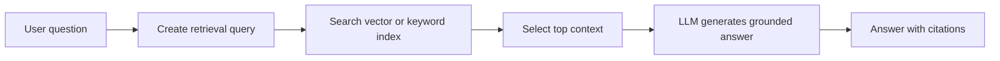
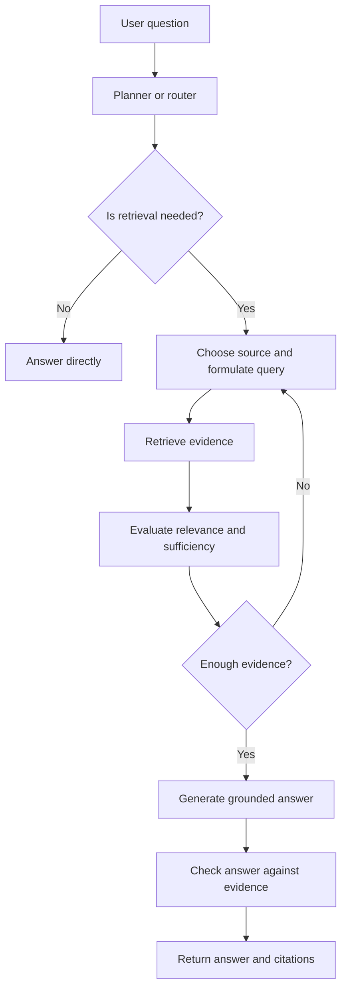

# Basic RAG vs. Agentic RAG

## Executive Summary

Retrieval-Augmented Generation (RAG) gives a language model access to external knowledge before it answers. In a basic RAG pipeline, retrieval happens once using a fixed query-and-retrieve flow. In agentic RAG, the system can decide whether retrieval is needed, choose a source, inspect the result, reformulate the query, and retrieve again.

The difference is not the vector database. The difference is **control flow**.

## Why This Matters

Enterprise questions rarely fit a single document. A migration assistant may need to search architecture decisions, connector inventories, source code, product documentation, and previous migration reports. A fixed top-k search can return relevant text but still miss the evidence required to make a decision.

Basic RAG is usually the correct starting point because it is simpler, faster, cheaper, and easier to evaluate. Agentic RAG is useful when the task genuinely requires multiple retrieval steps or multiple knowledge sources.

## Simple Mental Model

Think of the LLM as an engineer.

- **Without RAG:** the engineer answers from memory.
- **Basic RAG:** the engineer opens one folder, reads the most relevant pages, and answers.
- **Agentic RAG:** the engineer chooses which folders to inspect, checks whether the evidence is sufficient, searches again when needed, and then answers.

## Basic RAG Request Flow



Basic RAG normally performs one retrieval pass.

## Agentic RAG Request Flow



The loop is what makes the retrieval workflow agentic.

## Core Components

| Component | Role |
|---|---|
| Document store | Holds source documents, code, reports, or API specifications |
| Index | Supports semantic, keyword, or hybrid search |
| Retriever | Returns candidate chunks |
| Reranker | Reorders candidates using a stronger relevance model |
| Planner or router | Decides whether and where to search |
| Sufficiency check | Determines whether retrieved evidence is enough |
| Generator | Produces the answer using selected evidence |
| Citation layer | Links claims to evidence |

## Basic RAG vs. Agentic RAG

| Dimension | Basic RAG | Agentic RAG |
|---|---|---|
| Retrieval steps | Usually one | One or more |
| Query strategy | Fixed | Adaptive |
| Sources | Usually one index | Multiple indexes and tools |
| Latency | Lower | Higher |
| Cost | Lower | Higher |
| Debugging | Easier | Harder |
| Best for | Lookup and FAQ | Investigation and multi-step analysis |

## Concrete Example: Migration Knowledge Assistant

A user asks:

> Which MuleSoft connectors in this application require custom migration work?

### Basic RAG approach

1. Embed the question.
2. Retrieve the five most similar connector documents.
3. Send the documents to the LLM.
4. Generate an answer.

This works when the connector catalogue is complete and well indexed.

### Agentic RAG approach

1. Inspect `canonical.json` to identify connectors used by the application.
2. Search the internal connector support matrix.
3. Search version-specific product documentation.
4. Search previous migration reports for similar connectors.
5. Mark unsupported or ambiguous connectors.
6. Produce a recommendation with evidence for each connector.

The second approach is more expensive, but the task itself is also more complex.

## Minimal Python Pattern

```python
from dataclasses import dataclass
from typing import Protocol


class Retriever(Protocol):
    def search(self, query: str, top_k: int = 5) -> list[str]: ...


@dataclass
class Evidence:
    passages: list[str]
    sufficient: bool


def basic_rag(question: str, retriever: Retriever, llm) -> str:
    passages = retriever.search(question, top_k=5)
    return llm.answer(question=question, context=passages)


def agentic_rag(question: str, retrievers: dict[str, Retriever], llm) -> str:
    evidence: list[str] = []

    for _ in range(3):  # hard stop to prevent uncontrolled loops
        plan = llm.plan_retrieval(question=question, evidence=evidence)

        if not plan.need_retrieval:
            break

        retriever = retrievers[plan.source]
        evidence.extend(retriever.search(plan.query, top_k=plan.top_k))

        if llm.is_evidence_sufficient(question=question, evidence=evidence):
            break

    return llm.answer(question=question, context=evidence)
```

The production version should use structured outputs, tool allow-lists, timeouts, tracing, and deterministic stopping conditions.

## Common Mistakes and Failure Modes

### 1. Starting with agentic RAG too early

A well-designed basic RAG pipeline with hybrid search, metadata filters, reranking, and good chunking often solves the problem. Add an agent only when evaluation shows a real need.

### 2. Weak chunking

Chunks that are too small lose context. Chunks that are too large introduce noise. Prefer logical sections such as an API operation, configuration block, connector definition, or architecture decision.

### 3. Ignoring metadata

Filter using product, version, application, environment, document type, owner, and effective date. Semantic similarity alone is not enough for enterprise retrieval.

### 4. Treating retrieval scores as certainty

A high similarity score means the text resembles the query. It does not prove that the text answers the question.

### 5. Endless search loops

Agentic RAG needs limits: maximum retrieval steps, maximum sources, cost limits, timeout, and a clear fallback when evidence remains incomplete.

### 6. No citation or provenance

The system should retain document ID, section, version, source URL, and retrieval timestamp for every evidence item.

## Enterprise Use Cases

Use basic RAG for:

- policy and procedure lookup
- product documentation assistants
- internal FAQ systems
- support knowledge bases
- architecture standards search

Use agentic RAG for:

- incident investigation
- source-code and architecture analysis
- migration planning
- compliance evidence collection
- multi-repository engineering research
- complex customer-support diagnosis

## Cloud Service Mapping

| Cloud | Basic building blocks |
|---|---|
| AWS | Amazon Bedrock, Bedrock Knowledge Bases, OpenSearch Serverless, S3 |
| Azure | Azure AI Foundry, Azure AI Search, Blob Storage |
| GCP | Vertex AI, Vertex AI Search or RAG Engine, Cloud Storage |

The agentic control loop can run in Lambda, Azure Functions, Cloud Run, containers, or a workflow engine. The important design choice is not the hosting service; it is the retrieval policy and stopping logic.

## Hands-on Exercise — 30 to 60 Minutes

1. Create ten small Markdown files about connectors, APIs, or architecture patterns.
2. Build a basic retriever using a local vector store or simple keyword search.
3. Return the top three passages for a question.
4. Add metadata such as `product`, `version`, and `document_type`.
5. Add one adaptive rule: when no result passes a confidence threshold, rewrite the query and search once more.
6. Log both the original and rewritten query.

The goal is to understand adaptive retrieval without building a full autonomous agent.

## What to Learn Next

**Tool Calling and Structured Outputs**

The next lesson should explain how an LLM requests an external action using a typed schema, why free-form tool instructions are unreliable, and how structured outputs create a safer boundary between reasoning and execution.

## Recommended Reading

- [Azure AI Search: Retrieval-Augmented Generation overview](https://learn.microsoft.com/azure/search/retrieval-augmented-generation-overview)
- [Anthropic: Building effective agents](https://www.anthropic.com/engineering/building-effective-agents)
- [LangChain: Retrieval concepts](https://python.langchain.com/docs/concepts/retrieval/)
- [LlamaIndex documentation](https://docs.llamaindex.ai/)
- [Google Cloud: Vertex AI RAG Engine](https://cloud.google.com/vertex-ai/generative-ai/docs/rag-overview)
