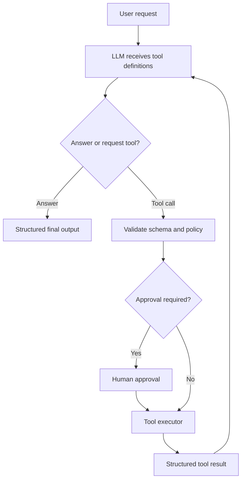

# Tool Calling and Structured Outputs

## Executive Summary

Tool calling is the mechanism that lets an LLM ask your application to perform an action such as reading a file, querying a database, calling an API, or running tests. The model does **not** execute the action itself. It produces a structured request, your application validates and executes it, and the result is sent back to the model.

Structured outputs solve a related but different problem: they constrain the model's response to a schema so that downstream software can parse it reliably. Together, tool calling and structured outputs form the boundary between probabilistic reasoning and deterministic enterprise systems.

## Why This Matters

An LLM can explain how to update a customer address, but an enterprise agent must interact safely with APIs, authorization policies, validation rules, and audit systems. Free-form text is not a safe integration contract.

A typed tool call can state:

```json
{
  "tool": "update_customer_address",
  "arguments": {
    "customer_id": "C123",
    "postal_code": "700091",
    "city": "Kolkata"
  }
}
```

Your application can validate the schema, check permissions, request approval, execute the API, and return a structured result.

## Simple Mental Model

Think of the LLM as a junior architect working through a service desk.

- The LLM decides **which request form** to submit.
- The schema defines the fields on the form.
- Your application checks whether the form is valid and authorized.
- The tool executor performs the real action.
- The result is returned to the LLM for interpretation.

The model proposes an action; your code remains in control.

## Tool Calling vs. Structured Outputs

| Concept | Purpose | Example |
|---|---|---|
| Tool calling | Request an external action | Search repository, call API, run tests |
| Structured output | Return data in a predictable shape | Migration plan JSON, risk assessment, extracted fields |
| Tool result | Return the execution outcome to the model | HTTP response, compiler output, search results |

A model may produce structured output without calling a tool. It may also call a tool and later produce a structured final response.

## Core Request Flow



The loop can repeat, but each action passes through deterministic controls.

## Core Components

| Component | Responsibility |
|---|---|
| Tool definition | Name, description, argument schema, and usage guidance |
| Model | Selects a tool and proposes arguments |
| Validator | Checks types, required fields, ranges, and formats |
| Policy layer | Checks identity, scope, approvals, and business rules |
| Executor | Calls the real API, function, command, or service |
| Result normalizer | Converts raw results into a stable response contract |
| Orchestrator | Returns the result to the model and controls the loop |

## Concrete Example: Migration Assistant

Suppose the user asks:

> Analyse this MuleSoft project and tell me which connectors need manual migration.

The assistant may have these tools:

- `list_project_files`
- `read_file`
- `extract_connector_inventory`
- `lookup_migration_pattern`
- `write_migration_plan`

A good flow is:

1. The model calls `list_project_files`.
2. Your harness validates that the requested path is inside the allowed workspace.
3. The executor returns a normalized file list.
4. The model calls `extract_connector_inventory` with selected XML files.
5. A deterministic parser returns connector names and versions.
6. The model calls `lookup_migration_pattern` for each connector.
7. The final answer is returned as a structured migration assessment.

The model decides the sequence, but deterministic tools perform source inspection and parsing.

## Example Tool Schema

```json
{
  "name": "lookup_migration_pattern",
  "description": "Find the approved migration pattern for a connector and version.",
  "parameters": {
    "type": "object",
    "properties": {
      "connector": {
        "type": "string",
        "description": "Canonical connector name"
      },
      "version": {
        "type": "string",
        "description": "Connector version found in the source application"
      }
    },
    "required": ["connector", "version"],
    "additionalProperties": false
  }
}
```

Good schemas are narrow, explicit, and easy to validate.

## Minimal Python Pattern

```python
from dataclasses import dataclass
from typing import Any, Callable

from pydantic import BaseModel, Field, ValidationError


class PatternRequest(BaseModel):
    connector: str = Field(min_length=1, max_length=100)
    version: str = Field(pattern=r"^[0-9A-Za-z._-]+$")


@dataclass
class Tool:
    name: str
    validator: type[BaseModel]
    execute: Callable[[BaseModel], dict[str, Any]]


def lookup_pattern(request: PatternRequest) -> dict[str, Any]:
    return {
        "connector": request.connector,
        "version": request.version,
        "pattern": "REST client adapter",
        "confidence": "approved"
    }


TOOLS = {
    "lookup_migration_pattern": Tool(
        name="lookup_migration_pattern",
        validator=PatternRequest,
        execute=lookup_pattern,
    )
}


def run_tool(tool_name: str, arguments: dict[str, Any]) -> dict[str, Any]:
    tool = TOOLS.get(tool_name)
    if tool is None:
        return {"ok": False, "error": "tool_not_allowed"}

    try:
        request = tool.validator.model_validate(arguments)
    except ValidationError as exc:
        return {"ok": False, "error": "invalid_arguments", "details": exc.errors()}

    try:
        result = tool.execute(request)
        return {"ok": True, "result": result}
    except Exception as exc:
        return {"ok": False, "error": "execution_failed", "message": str(exc)}
```

The important separation is:

1. model-generated arguments
2. schema validation
3. policy checks
4. execution
5. normalized result

## Structured Final Output

A migration assistant should not always return prose. A stable final schema makes the result usable by dashboards, pipelines, or later agents.

```json
{
  "application": "order-integration",
  "connectors": [
    {
      "name": "salesforce",
      "version": "10.15",
      "migration_type": "custom_adapter",
      "manual_review": true,
      "reason": "No approved one-to-one replacement"
    }
  ],
  "overall_risk": "medium"
}
```

## Common Mistakes and Failure Modes

### 1. Treating tool arguments as trusted input

The model's arguments are untrusted. Validate them exactly as you would validate an external API request.

### 2. Giving one tool too much authority

Avoid a tool named `manage_customer` or `run_any_command`. Prefer narrow tools such as `read_customer_address` and `request_address_update`.

### 3. Weak tool descriptions

The model uses the name and description to decide when to call a tool. State what the tool does, when to use it, and what it must not be used for.

### 4. Mixing planning and execution

Do not let the model invent shell commands and execute them directly. Provide controlled tools with bounded inputs.

### 5. Returning raw tool output

Large stack traces, HTML pages, or database rows can overwhelm the model. Normalize, truncate, and classify results.

### 6. No idempotency

A retried tool call must not create duplicate payments, profile updates, tickets, or deployments. Use idempotency keys for side-effecting operations.

### 7. No approval boundary

Read operations may run automatically. High-impact writes should require policy checks or human approval.

## Enterprise Safety Pattern

Classify tools by impact:

| Class | Examples | Typical control |
|---|---|---|
| Read-only | Search docs, read code, fetch status | Automatic with scope checks |
| Reversible write | Create draft, open branch, add comment | Policy check and audit log |
| High-impact write | Update customer, deploy, delete resource | Explicit approval and strong authorization |

Authorization must be enforced by the tool or downstream service, not by the prompt alone.

## Enterprise Use Cases

- customer-service agents calling CRM APIs
- coding assistants reading files and running tests
- incident assistants querying logs and ticket systems
- migration agents inspecting repositories and generating plans
- cloud assistants provisioning approved infrastructure
- compliance assistants gathering evidence from several systems

## Java and Go Notes

**Java:** use records or POJOs for tool arguments, Jakarta Bean Validation for constraints, and an allow-listed dispatcher. Keep authorization in service-layer policies rather than model prompts.

**Go:** define a struct per tool request, decode with `json.Decoder`, reject unknown fields, validate explicitly, and use context deadlines for every external call.

## Cloud Mapping

| Cloud | Useful building blocks |
|---|---|
| AWS | Amazon Bedrock tool use or Agents, Lambda, API Gateway, IAM, Step Functions |
| Azure | Azure AI Foundry, Azure Functions, API Management, Entra ID, Logic Apps |
| GCP | Vertex AI or ADK, Cloud Run, API Gateway, IAM, Workflows |

The critical controls remain the same across clouds: typed contracts, least privilege, timeouts, approval, audit, and idempotency.

## Hands-on Exercise — 30 to 60 Minutes

Build a small command-line assistant with three tools:

1. `read_text_file(path)`
2. `search_files(keyword)`
3. `create_summary(title, findings)`

Requirements:

- define a JSON schema or Pydantic model for each tool
- restrict file access to one test directory
- reject unknown fields
- log every proposed tool call and normalized result
- require confirmation before `create_summary`
- return the final answer as JSON with `summary`, `sources`, and `warnings`

Test at least five cases, including an invalid path and malformed arguments.

## What to Learn Next

**Sandboxing Untrusted Code and Tools**

The next lesson should explain why schema validation is not enough when a coding agent can run commands or generated code, and how process isolation, filesystem boundaries, network controls, resource limits, and disposable environments reduce the blast radius.

## Recommended Reading

- [OpenAI: Function calling](https://platform.openai.com/docs/guides/function-calling)
- [Anthropic: Tool use](https://docs.anthropic.com/en/docs/agents-and-tools/tool-use/overview)
- [Google ADK: Function tools](https://google.github.io/adk-docs/tools-custom/function-tools/)
- [JSON Schema documentation](https://json-schema.org/learn/getting-started-step-by-step)
- [OWASP: Top 10 for LLM Applications](https://genai.owasp.org/llm-top-10/)
