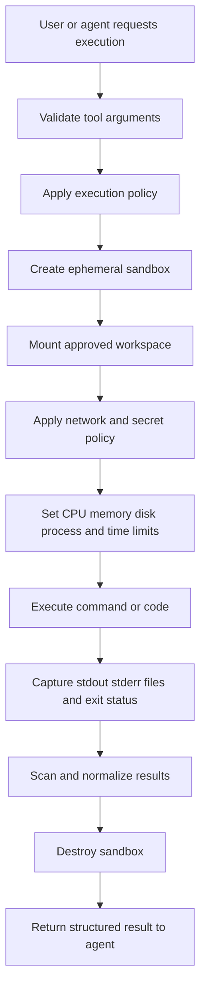

# Sandboxing Untrusted Code and Tools

## Executive Summary

An AI agent becomes materially more dangerous when it can execute code, invoke a shell, install packages, or call external systems. Schema validation helps ensure a tool call is well formed, but it cannot make arbitrary code safe.

A **sandbox** is an isolated execution environment designed to reduce the blast radius of untrusted or partially trusted work. The core idea is simple: assume the generated command or code may be incorrect or hostile, then restrict what it can read, write, consume, and communicate with.

For most enterprise coding assistants, a practical baseline is an ephemeral container or microVM with a read-only base image, a temporary workspace, no host credentials, restricted network access, strict CPU/memory/time limits, and complete execution logs.

## Why This Matters

A coding agent may be asked to fix a test, generate a migration project, or inspect an archive. During that work it might:

- run a destructive shell command
- read secrets from environment variables
- overwrite files outside the project
- install a malicious or compromised package
- send source code to an external endpoint
- consume all CPU, memory, storage, or process slots
- start a long-running process that outlives the request
- exploit a vulnerable runtime or container boundary

The important principle is:

> A tool schema controls the shape of an action. A sandbox controls the consequences of the action.

Both are required.

## Simple Mental Model

Think of generated code as a contractor performing work in a secured workshop.

- The contractor receives only the materials needed for the job.
- The workshop is separated from the main office.
- Dangerous equipment requires additional approval.
- Internet access is blocked unless explicitly required.
- Power, time, and storage are limited.
- Everything that happens is recorded.
- The workshop is destroyed and rebuilt after the job.

A sandbox is not primarily about making the code trustworthy. It is about making failure containable.

## What Is Untrusted?

Treat the following as untrusted or partially trusted:

- code generated by an LLM
- shell commands proposed by an agent
- user-uploaded projects and archives
- third-party dependencies downloaded during execution
- build scripts such as `pom.xml`, `package.json`, `setup.py`, Gradle plugins, and Makefiles
- repository hooks and test fixtures
- tool output that may contain prompt injection or command fragments

Even source code from an internal repository may be unsafe to execute automatically because build and test processes can run arbitrary logic.

## Core Request Flow



The sandbox lifecycle should be deterministic and controlled by the harness, not by the model.

## Core Isolation Layers

| Layer | Purpose | Typical controls |
|---|---|---|
| Identity | Limit operating-system authority | Non-root user, no host UID mapping, short-lived workload identity |
| Filesystem | Limit readable and writable data | Read-only base, scoped workspace mount, temporary filesystem, path validation |
| Process | Limit process capabilities | PID namespace, process-count limit, blocked privileged syscalls |
| Resources | Prevent denial of service | CPU, memory, disk, file-size and execution-time limits |
| Network | Prevent exfiltration and uncontrolled access | No egress by default, allow-listed endpoints, DNS controls, proxy mediation |
| Secrets | Prevent credential theft | No inherited environment secrets, scoped tokens, brokered access |
| Kernel boundary | Reduce host compromise risk | Containers with hardened runtime, gVisor, Kata Containers, microVMs |
| Lifecycle | Prevent persistence | Fresh environment per task, automatic teardown, immutable images |
| Observability | Support audit and diagnosis | Command logs, resource metrics, file manifest, network records, trace ID |

## Containers, Hardened Containers, and MicroVMs

### Standard containers

Containers use kernel namespaces and control groups to isolate processes while sharing the host kernel.

**Strengths:** fast startup, familiar tooling, low cost.

**Limitations:** the shared kernel remains an important security boundary. A kernel or runtime escape can affect the host.

Use standard containers for lower-risk internal workloads when the host is hardened and no sensitive credentials are present.

### Hardened container runtimes

Runtimes such as gVisor add an additional user-space kernel boundary between the application and the host kernel. Kata Containers uses lightweight virtual machines behind a container-compatible interface.

**Strengths:** stronger isolation while preserving much of the container workflow.

**Limitations:** compatibility and performance overhead for some syscalls or workloads.

### MicroVMs

MicroVMs, such as those built with Firecracker, provide a virtual-machine boundary with a small device model and fast startup compared with conventional VMs.

**Strengths:** stronger tenant and kernel isolation.

**Limitations:** higher operational complexity, image management, and startup overhead than ordinary containers.

### Practical decision rule

- Use a container for controlled, read-only analysis with no network and no secrets.
- Use a hardened runtime for generated code and third-party build execution.
- Use a microVM or managed isolated execution service for multi-tenant, internet-facing, high-risk, or regulated workloads.

## Concrete Example: Migration Code Generator

Suppose an agent converts a MuleSoft application into a Spring Boot project. After generating code, it wants to run:

```text
mvn test
```

This looks harmless, but Maven may execute plugins, download dependencies, run test fixtures, start network listeners, or invoke native commands.

A safer design is:

1. Copy only the generated project into a fresh sandbox.
2. Use a pinned JDK and Maven image.
3. Run as a non-root user.
4. Mount the source workspace as writable but keep the base filesystem read-only.
5. Provide an isolated Maven cache containing approved artifacts, or route downloads through an allow-listed repository proxy.
6. Block general outbound internet access.
7. Set a five-minute timeout, memory limit, CPU quota, disk quota, and process limit.
8. Capture test reports and generated files.
9. Return only normalized results to the agent.
10. Destroy the environment after execution.

The agent receives evidence such as test failures, but it never receives authority over the host machine.

## Minimal Python Implementation

The following example runs a command in Docker with basic restrictions. It is an educational baseline, not a complete production sandbox.

```python
from __future__ import annotations

import subprocess
from dataclasses import dataclass
from pathlib import Path


@dataclass(frozen=True)
class SandboxResult:
    exit_code: int
    stdout: str
    stderr: str
    timed_out: bool


def run_in_sandbox(
    workspace: Path,
    command: list[str],
    *,
    image: str = "python:3.12-slim@sha256:PINNED_DIGEST",
    timeout_seconds: int = 60,
) -> SandboxResult:
    workspace = workspace.resolve(strict=True)

    if not workspace.is_dir():
        raise ValueError("workspace must be a directory")

    docker_command = [
        "docker", "run", "--rm",
        "--network", "none",
        "--read-only",
        "--user", "65532:65532",
        "--cap-drop", "ALL",
        "--security-opt", "no-new-privileges",
        "--pids-limit", "64",
        "--memory", "512m",
        "--cpus", "1.0",
        "--tmpfs", "/tmp:rw,noexec,nosuid,size=64m",
        "--mount", f"type=bind,src={workspace},dst=/workspace,rw",
        "--workdir", "/workspace",
        image,
        *command,
    ]

    try:
        completed = subprocess.run(
            docker_command,
            capture_output=True,
            text=True,
            timeout=timeout_seconds,
            check=False,
        )
        return SandboxResult(
            exit_code=completed.returncode,
            stdout=completed.stdout[-20_000:],
            stderr=completed.stderr[-20_000:],
            timed_out=False,
        )
    except subprocess.TimeoutExpired as exc:
        return SandboxResult(
            exit_code=124,
            stdout=(exc.stdout or "")[-20_000:],
            stderr=(exc.stderr or "")[-20_000:],
            timed_out=True,
        )
```

Important production additions include:

- a hardened runtime such as gVisor or Kata
- an allow-list of executable operations instead of arbitrary commands
- image signature and provenance verification
- seccomp or equivalent syscall restrictions
- disk quotas and output file limits
- network egress through an authenticated proxy
- malware and secret scanning of produced artifacts
- central audit records and distributed tracing
- sandbox pool isolation between users and tenants

## Do Not Pass Raw Shell Strings

Prefer a typed request:

```json
{
  "tool": "run_tests",
  "arguments": {
    "project_id": "order-migration",
    "test_profile": "unit",
    "timeout_seconds": 300
  }
}
```

The executor maps `test_profile=unit` to a known command. This is safer than allowing the model to submit arbitrary shell syntax.

A sandbox is necessary, but narrow tools still reduce risk and improve observability.

## Network Policy

Network access is one of the most important sandbox decisions.

### Default position

Use **no outbound network access** unless the task requires it.

### When network access is required

Route traffic through a controlled proxy that can:

- allow-list domains and ports
- block private address ranges and cloud metadata services
- attach workload identity only to approved destinations
- log DNS and connection metadata
- enforce download size and content-type limits
- scan downloaded packages

Avoid giving the sandbox broad cloud credentials. Use a broker service that performs a narrow action after checking the request.

## Secret Handling

Never inherit the host process environment into a sandbox by default.

Prefer:

- no secrets for read-only work
- short-lived, task-scoped credentials
- identity-based access rather than static keys
- a credential broker outside the sandbox
- explicit redaction of stdout, stderr, and generated files
- separate credentials for each tool and tenant

The model should not see credentials, even when the sandbox needs them.

## Common Mistakes and Failure Modes

### 1. Treating a container as a complete security solution

Containers improve isolation, but configuration and shared-kernel risk remain. Remove capabilities, block privilege escalation, use non-root execution, and consider a hardened runtime.

### 2. Mounting the whole repository or home directory

Mount only the task workspace. Never mount the Docker socket, host root, SSH directory, cloud configuration, or package-manager credentials.

### 3. Allowing unrestricted internet access

Generated code can exfiltrate source, prompts, and secrets. Start with no egress and add narrow exceptions.

### 4. Using mutable or unpinned images

Pin images by digest, scan them, sign them, and rebuild regularly. Tags such as `latest` are unsuitable for repeatable execution.

### 5. Failing to limit output

A task can generate gigabytes of logs or files. Limit stdout, stderr, individual file size, total workspace size, and artifact count.

### 6. Reusing dirty sandboxes

State from one task can affect another or leak between tenants. Prefer fresh environments; if pooling is required, reset and verify every boundary.

### 7. Returning raw execution output to the model

Compiler logs and test output may contain secrets or prompt-injection content. Normalize, redact, classify, and truncate before returning results.

### 8. Depending on prompts for security

Instructions such as “do not access the network” are not controls. Enforce restrictions below the model layer.

## Enterprise Use Cases

- coding assistants that run tests or linters
- migration accelerators that compile generated applications
- data agents that execute Python or SQL
- document-processing systems that open user files
- CI troubleshooting agents
- security analysis and malware detonation
- plugin and extension testing
- infrastructure agents that generate and validate plans

## Java and Go Notes

**Java:** launch sandbox tasks through a separate execution service rather than `Runtime.exec` inside the main application. Use typed job requests, immutable container images, strict timeouts, and a result DTO. For Kubernetes, apply a dedicated namespace, service account, NetworkPolicy, security context, and resource quota.

**Go:** use `exec.CommandContext` only to invoke a trusted sandbox runtime or execution API. Avoid constructing shell strings. Model the sandbox request as a struct, enforce context deadlines, stream bounded logs, and terminate the entire process group on cancellation.

## Cloud Service Mapping

| Cloud | Useful building blocks | Design note |
|---|---|---|
| AWS | Lambda, ECS/Fargate, EKS, Firecracker-based services, IAM, VPC endpoints, Network Firewall | Use task roles and private networking; do not expose instance credentials |
| Azure | Azure Container Apps Jobs, Azure Functions, AKS, confidential containers, Managed Identity, Azure Firewall | Use job-scoped identity and deny outbound traffic by default |
| GCP | Cloud Run Jobs, GKE Sandbox with gVisor, Workload Identity, VPC Service Controls, Cloud NAT | GKE Sandbox is useful when stronger container isolation is required |

Managed serverless products can reduce host-management work, but application-level controls—workspace scoping, network policy, credentials, timeouts, and result scanning—remain necessary.

## Sandboxing vs. Approval

Sandboxing and human approval solve different problems.

- **Sandboxing** limits technical impact if execution is malicious or incorrect.
- **Approval** ensures a person or policy authorizes a high-impact action.

Running `mvn test` may need a sandbox but no human approval. Deploying the resulting application may require both a sandboxed validation step and explicit approval.

## Hands-on Exercise — 30 to 60 Minutes

Create a small local execution service that runs a Python script inside a restricted container.

Requirements:

1. Accept only a workspace path and a predefined operation such as `run_unit_tests`.
2. Run as a non-root user.
3. Disable network access.
4. Use a read-only root filesystem and a writable `/workspace` mount.
5. Apply a 256–512 MB memory limit, one CPU, a process limit, and a 30-second timeout.
6. Capture bounded stdout, stderr, and exit status.
7. Test these failure cases:
   - an infinite loop
   - an attempt to read `/etc/shadow`
   - an attempt to connect to the internet
   - creation of an excessively large file
8. Document which controls stop each case and which gaps remain.

The goal is to see that sandboxing is a layered control system, not a single Docker flag.

## What to Learn Next

**Evals: What to Measure and Why**

The next lesson should explain how to define success before choosing an evaluation framework. It will cover task success, groundedness, tool-selection accuracy, safety-policy compliance, latency, cost, and reliability—and why a small representative dataset is more valuable than vague “looks good” testing.

## Recommended Reading

- [gVisor documentation](https://gvisor.dev/docs/)
- [Firecracker documentation](https://firecracker-microvm.github.io/)
- [Kubernetes: Pod Security Standards](https://kubernetes.io/docs/concepts/security/pod-security-standards/)
- [Docker: Runtime security](https://docs.docker.com/engine/security/)
- [OWASP Top 10 for LLM Applications](https://genai.owasp.org/llm-top-10/)
