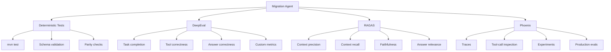

# Open-Source Frameworks for LLM and Agent Evals

There are several good open-source frameworks, and they solve slightly different evaluation problems.

For a foundation-first learning path, start with **DeepEval**, add **RAGAS** when evaluating RAG systems, and use **Arize Phoenix** later when you want evaluation together with tracing and observability.

## Framework Comparison

| Framework | Best for | Why it matters |
| --- | --- | --- |
| **DeepEval** | General LLM and agent testing | Pytest-like evaluation model; useful for task correctness, tool usage, structured outputs, custom metrics, regression tests, and CI/CD. |
| **RAGAS** | RAG and Agentic RAG | Focuses on retrieval and grounding metrics such as context precision, context recall, faithfulness, and answer relevance. |
| **Arize Phoenix** | Evals + tracing + observability | Useful when you need to understand why an agent failed, inspect traces, compare experiments, and evaluate production interactions. |
| **Promptfoo** | Prompt/model regression testing | Good for comparing prompts and models, defining test matrices, red-team cases, and running evaluations in CI. |
| **Giskard** | Quality and security testing | Useful for broader model/application testing, including vulnerability and safety-oriented checks. |

## Recommended Architecture for a Migration Agent



The important design point is that **AI-specific eval frameworks should complement deterministic software tests, not replace them**.

For a migration system, compilers, unit tests, API-contract checks, schema validation, and behavioral parity checks remain stronger signals whenever they can provide a deterministic answer.

## Why Start with DeepEval

DeepEval is a good first framework because it maps naturally to normal software testing. You define test cases, metrics, thresholds, and expected behavior and then execute them as regression tests.

Conceptually, it feels similar to applying JUnit or pytest thinking to probabilistic AI behavior.

A minimal example looks like this:

```python
from deepeval import assert_test
from deepeval.test_case import LLMTestCase
from deepeval.metrics import AnswerRelevancyMetric


def test_connector_analysis():
    result = migration_agent.run(
        "Which connector requires manual migration?"
    )

    case = LLMTestCase(
        input="Which connector requires manual migration?",
        actual_output=result.answer,
        expected_output="Salesforce connector"
    )

    assert_test(
        case,
        [AnswerRelevancyMetric(threshold=0.8)]
    )
```

In a real migration accelerator, combine this with deterministic checks such as connector inventory comparison, generated-project compilation, unit/integration tests, and API parity validation.

## Where RAGAS Fits

RAGAS becomes useful once your system includes retrieval.

A RAG pipeline has at least two independent questions:

1. **Did I retrieve the right evidence?**
2. **Did the LLM use that evidence correctly?**

If those are evaluated only through final-answer accuracy, retrieval failures and generation failures become difficult to distinguish.

RAGAS provides metrics aimed at separating these concerns, including context precision, context recall, faithfulness, and answer relevance.

For an Agentic RAG migration assistant, this can help determine whether poor answers originate from the knowledge base, retrieval strategy, query rewriting, or final generation.

## Where Phoenix Fits

Phoenix becomes valuable when the question changes from:

> Did this test pass?

into:

> Why did this agent behave this way?

Phoenix combines evaluation with tracing and observability. That makes it useful for inspecting prompts, retrieved context, tool calls, model responses, latency, token usage, errors, and execution trajectories.

For an agent that performs multiple steps, this becomes particularly important because a correct final answer can hide unnecessary or unsafe intermediate actions.

## Promptfoo and Giskard

**Promptfoo** is attractive when the main problem is prompt or model comparison. For example, you can run the same migration-discovery cases against different prompts or models and detect regressions in CI.

**Giskard** is useful when evaluation needs to include broader testing and security concerns, particularly when you want systematic checks beyond normal answer-quality metrics.

## Recommended Learning Order

Do not learn all of these frameworks simultaneously.

### Stage 1 — pytest + DeepEval

Learn test cases, datasets, metrics, thresholds, regression testing, and deterministic versus LLM-based graders.

### Stage 2 — RAGAS

Add RAG-specific evaluation when you build an Agentic RAG pipeline. Focus on separating retrieval quality from generation quality.

### Stage 3 — Phoenix + OpenTelemetry

Introduce Phoenix when you start studying observability and trajectory evaluation. At this stage the question is no longer only whether an agent succeeded, but how it got there.

## Suggested Stack for the Migration Accelerator

A pragmatic first version would be:

```text
pytest
  +
Deterministic migration checks
  +
DeepEval
```

Later extend it to:

```text
pytest
  +
DeepEval
  +
RAGAS
  +
OpenTelemetry / Phoenix
```

This keeps the evaluation architecture incremental rather than introducing a large evaluation platform before you know which metrics actually matter.

## Key Principle

**Use the simplest evaluator that can reliably prove the behavior you care about.**

Prefer, in order:

1. deterministic software checks
2. rule-based metrics
3. reference-based semantic metrics
4. LLM-as-a-judge

The framework is secondary. The quality of your test dataset and the clarity of the behavior being measured are more important.

## Recommended Reading

- [DeepEval documentation](https://deepeval.com/docs/introduction)
- [RAGAS documentation](https://docs.ragas.io/)
- [Arize Phoenix documentation](https://arize.com/docs/phoenix)
- [Promptfoo documentation](https://www.promptfoo.dev/docs/intro/)
- [Giskard documentation](https://docs.giskard.ai/)