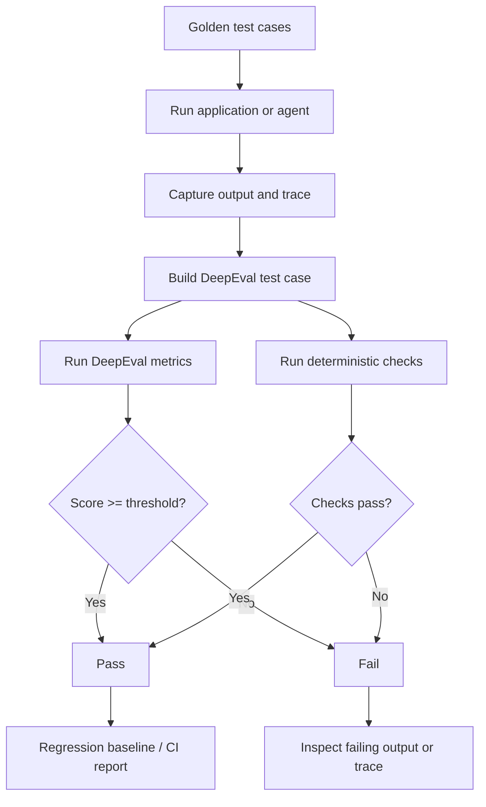

# Practical DeepEval: Building Your First Evaluation Suite

## Executive Summary

DeepEval is an open-source evaluation framework that brings a familiar software-testing workflow to LLM applications. Instead of relying on subjective checks such as “this answer looks better,” you define test cases, metrics, thresholds, and datasets, then run them repeatedly as your prompts, models, retrieval logic, or agent tools change.

For an agentic system, the important shift is that you should evaluate both the **outcome** and the **execution path**. DeepEval supports classic input/output evaluation through `LLMTestCase`, and its current agent-evaluation model also supports tracing so you can score components such as LLM calls, tools, retrievers, and sub-agents separately.

The goal of this lesson is practical: build a small eval suite for a migration assistant, run it locally, understand what each metric proves, and structure it so the same tests can later run in CI.

## Why This Matters

Suppose a migration agent analyzes a MuleSoft application and answers:

> The Salesforce connector requires manual migration because there is no approved one-to-one replacement.

The answer may look correct, but several different things could have gone wrong:

- the agent retrieved the wrong source but guessed correctly
- it chose an unnecessary or unsafe tool
- it called the right tool with the wrong arguments
- it missed another unsupported connector
- the result varies significantly between runs
- a prompt change tomorrow silently breaks this behavior

A repeatable evaluation suite converts these questions into engineering signals.

## Simple Mental Model

Think of DeepEval as **pytest for probabilistic behavior**.

Traditional unit test:

```text
Input -> deterministic function -> exact assertion
```

LLM eval:

```text
Input -> LLM / agent -> observed behavior -> metric -> score -> threshold
```

The main difference is the assertion. Instead of always checking exact equality, you may check relevance, faithfulness, task completion, tool correctness, or another behavior that has a score.

## Core Evaluation Flow



## Step 1 — Install DeepEval

For normal single-turn evals:

```bash
python -m venv .venv
source .venv/bin/activate
pip install -U deepeval pytest
```

For agent tracing and inspection in a development environment, the current DeepEval agent quickstart documents the optional inspect extra:

```bash
pip install -U "deepeval[inspect]"
```

DeepEval is local-first, so your tests can run locally. Cloud reporting through Confident AI is optional for shared dashboards and hosted trace inspection.

Create a simple structure:

```text
project/
├── app/
│   └── migration_agent.py
├── evals/
│   ├── goldens.json
│   └── test_migration_agent.py
└── requirements-dev.txt
```

## Step 2 — Understand `LLMTestCase`

`LLMTestCase` is the basic unit for a single-turn DeepEval test.

At minimum, most metrics work from:

```text
input
actual_output
```

Other fields become important depending on what you evaluate:

```text
expected_output     reference answer
retrieval_context   chunks retrieved by RAG
tools_called        tools actually called
expected_tools      tools that should have been called
context             supporting source material
```

A basic test case:

```python
from deepeval.test_case import LLMTestCase

case = LLMTestCase(
    input="Which connector requires manual migration?",
    actual_output=(
        "The Salesforce connector requires manual migration because "
        "there is no approved one-to-one replacement."
    ),
)
```

## Step 3 — Your First Metric

A good first metric is answer relevancy.

```python
from deepeval import assert_test
from deepeval.metrics import AnswerRelevancyMetric
from deepeval.test_case import LLMTestCase


def test_answer_is_relevant():
    case = LLMTestCase(
        input="Which connector requires manual migration?",
        actual_output=(
            "The Salesforce connector requires manual migration "
            "and needs a custom adapter."
        ),
    )

    metric = AnswerRelevancyMetric(threshold=0.8)

    assert_test(case, [metric])
```

Conceptually:

```text
score >= 0.8 -> pass
score < 0.8  -> fail
```

This metric answers:

> Is the response relevant to the user's question?

It does **not** prove that the answer is factually correct.

That distinction is critical.

## Step 4 — Combine Deterministic and AI-Based Evals

For enterprise systems, deterministic checks should remain your first choice whenever possible.

Imagine the agent returns structured migration output:

```json
{
  "connector": "salesforce",
  "migration_pattern": "custom_adapter",
  "manual_review": true
}
```

A deterministic test is stronger than asking another LLM whether these fields are correct:

```python
def test_connector_contract(result):
    assert result["connector"] == "salesforce"
    assert result["migration_pattern"] == "custom_adapter"
    assert result["manual_review"] is True
```

Then use DeepEval for semantic properties that are hard to express with exact assertions:

```python
metric = AnswerRelevancyMetric(threshold=0.8)
```

A useful hierarchy is:

1. deterministic assertions
2. rule-based scoring
3. reference-based semantic scoring
4. LLM-as-a-judge metrics

Do not use an LLM judge where a compiler, schema validator, test runner, or exact comparison can prove the behavior directly.

## Step 5 — Wrap a Real Application

Instead of hard-coding `actual_output`, call your application.

```python
from deepeval import assert_test
from deepeval.metrics import AnswerRelevancyMetric
from deepeval.test_case import LLMTestCase

from app.migration_agent import ask_agent


def test_connector_question():
    question = "Which connector requires manual migration?"

    result = ask_agent(question)

    case = LLMTestCase(
        input=question,
        actual_output=result.answer,
    )

    assert_test(
        case,
        [AnswerRelevancyMetric(threshold=0.8)],
    )
```

Now your eval tests the real application behavior rather than a static example.

## Step 6 — Add a Golden Dataset

A **golden** is a representative test input that you want to preserve as a regression case.

```python
from deepeval.dataset import EvaluationDataset, Golden


dataset = EvaluationDataset(
    goldens=[
        Golden(input="List the connectors used in the application."),
        Golden(input="Which connector requires manual migration?"),
        Golden(input="Explain the retry policy for the payment flow."),
        Golden(input="Identify unsupported migration patterns."),
    ]
)
```

Notice that a golden does not necessarily need a pre-written answer. It can represent an input whose live output will later be scored by metrics.

For migration work, gradually build the dataset from real cases:

```text
evals/
├── discovery/
│   ├── http_listener.json
│   ├── salesforce_connector.json
│   └── database_connector.json
├── transformation/
│   ├── error_handler.json
│   └── async_flow.json
└── parity/
    ├── simple_rest.json
    └── retry_policy.json
```

## Step 7 — Evaluate Tool Calling

For an agent, answer quality is not enough. You also care whether it called the correct tool.

Suppose the agent has:

```text
search_files
read_file
lookup_migration_pattern
run_tests
write_migration_plan
```

For the question:

```text
Which migration pattern should be used for Salesforce connector 10.15?
```

You may expect:

```text
lookup_migration_pattern
```

DeepEval's current agent evaluation capabilities include `ToolCorrectnessMetric`, which compares actual tool calls against expected tools, and `ArgumentCorrectnessMetric`, which focuses on arguments used for those calls.

Conceptually, your test case includes:

```python
from deepeval.test_case import LLMTestCase, ToolCall

case = LLMTestCase(
    input=(
        "Which migration pattern should be used for "
        "Salesforce connector 10.15?"
    ),
    actual_output="Use the approved REST adapter pattern.",
    tools_called=[
        ToolCall(
            name="lookup_migration_pattern",
            input={
                "connector": "salesforce",
                "version": "10.15",
            },
        )
    ],
    expected_tools=[
        ToolCall(
            name="lookup_migration_pattern",
            input={
                "connector": "salesforce",
                "version": "10.15",
            },
        )
    ],
)
```

The exact constructor details can evolve between framework versions, so use the current DeepEval tool-correctness documentation when implementing against your installed release. The important architecture is stable:

```text
user request
    -> model chooses tool
    -> capture actual tool call
    -> define expected tool behavior
    -> metric scores selection/arguments
```

## Step 8 — Evaluate the Agent at Two Levels

Agent evaluation is much easier to diagnose if you separate two levels.

### End-to-end evaluation

Question:

> Did the agent complete the task?

Examples:

- final migration recommendation is correct
- generated application compiles
- required API path is preserved
- user question is answered

### Component-level evaluation

Question:

> Which internal step failed?

Examples:

- retrieval returned irrelevant documents
- planner chose unnecessary steps
- model selected the wrong tool
- correct tool received wrong arguments
- result normalization dropped an important field

DeepEval's current agent workflow uses tracing to represent the execution as spans. Its docs recommend instrumenting components, for example an agent span containing LLM, tool, retriever, and sub-agent spans. Metrics can then be attached to the full trace or to individual components.

## Step 9 — A Practical Migration-Agent Scorecard

For a migration accelerator, do not build one giant “quality score” first.

| Dimension | Example check | Evaluator |
| --- | --- | --- |
| Discovery correctness | all source connectors identified | deterministic |
| Tool selection | approved lookup tool selected | DeepEval agent metric |
| Tool arguments | connector/version correct | DeepEval agent metric |
| Answer relevance | recommendation answers question | DeepEval metric |
| Grounding | recommendation supported by evidence | RAG/faithfulness metric |
| Build success | Spring project compiles | Maven/Gradle |
| Parity | output matches Mule behavior | deterministic integration test |
| Efficiency | tool calls under budget | trace/rule |
| Safety | no prohibited write/tool | deterministic policy check |

This lets you diagnose whether a failed migration came from reasoning, retrieval, execution, generation, or transformation.

## Step 10 — Create Your First Small Eval Suite

```python
from dataclasses import dataclass

from deepeval import assert_test
from deepeval.metrics import AnswerRelevancyMetric
from deepeval.test_case import LLMTestCase


@dataclass
class AgentResult:
    answer: str
    connectors: list[str]


def fake_agent(question: str) -> AgentResult:
    return AgentResult(
        answer=(
            "Salesforce requires manual migration using "
            "the approved custom adapter pattern."
        ),
        connectors=["salesforce", "http"],
    )


def test_connector_inventory():
    result = fake_agent("List all connectors")
    assert set(result.connectors) == {"salesforce", "http"}


def test_manual_migration_answer():
    question = "Which connector requires manual migration?"
    result = fake_agent(question)

    case = LLMTestCase(
        input=question,
        actual_output=result.answer,
    )

    assert_test(
        case,
        [AnswerRelevancyMetric(threshold=0.8)],
    )
```

Run with:

```bash
deepeval test run evals/test_migration_agent.py
```

DeepEval's current quickstart documents `deepeval test run` as the normal test-runner path for local and CI evaluation.

## Step 11 — Thresholds: Do Not Choose 0.8 Blindly

One of the easiest mistakes is selecting a threshold because it looks reasonable.

Instead:

1. collect 20–50 examples
2. manually label them acceptable/unacceptable
3. run the metric
4. compare scores with human judgement
5. pick a threshold that separates the two groups reasonably well

Example:

```text
Human acceptable outputs:   mostly 0.82–0.97
Human unacceptable outputs: mostly 0.31–0.74
```

Then a threshold around `0.80` has empirical justification.

The threshold should represent your quality bar, not a framework default.

## Step 12 — Handle Non-Determinism

LLM evals can fluctuate because both the system under test and the LLM judge may be probabilistic.

Practical controls:

- pin model versions where possible
- use low temperature for evaluation judges
- store the input, output, model, prompt version, and metric version
- rerun flaky failures before treating them as regressions
- keep deterministic gates separate from semantic metrics
- focus on score distributions and regression trends, not one isolated decimal

For a critical safety condition, do not rely only on an LLM metric. Use deterministic enforcement.

## Step 13 — CI/CD Integration

A simple GitHub Actions job:

```yaml
name: AI Evals

on:
  pull_request:
  push:
    branches: [main]

jobs:
  evals:
    runs-on: ubuntu-latest

    steps:
      - uses: actions/checkout@v4

      - uses: actions/setup-python@v5
        with:
          python-version: "3.12"

      - run: pip install -r requirements-dev.txt

      - name: Run deterministic tests
        run: pytest tests/

      - name: Run DeepEval suite
        env:
          OPENAI_API_KEY: ${{ secrets.OPENAI_API_KEY }}
        run: deepeval test run evals/
```

For production, improve this by:

- separating fast PR evals from expensive nightly evals
- caching stable fixtures
- using a fixed golden dataset version
- storing baseline scores
- failing PRs only on metrics that are sufficiently stable
- reporting expensive or noisy metrics without blocking the build initially

## Step 14 — Recommended Test Pyramid for an Agent

```text
                    Few
             End-to-end agent evals
                /           \
         Component LLM / tool evals
              /               \
       Deterministic contract tests
            /                   \
     Unit tests / schemas / parsers
                    Many
```

For a migration accelerator, most validation should still be deterministic:

```text
parser correctness
canonical schema
migration rules
compilation
unit tests
parity tests
```

Use LLM evals for behavior that cannot be reliably expressed as exact software assertions.

## Common Mistakes and Failure Modes

### 1. Evaluating the LLM instead of the application
Your production system includes retrieval, prompts, tools, policies, and post-processing. Test the complete application behavior, not only a raw model call.

### 2. Using answer relevance as correctness
A perfectly relevant answer can still be wrong. Pair relevance with references, grounding, deterministic expected fields, or task-specific metrics.

### 3. No golden dataset
Without stable representative inputs, you cannot tell whether a new prompt or model improved the system or simply behaved differently on today's examples.

### 4. Too many LLM-judge metrics
Every judge increases cost, latency, and uncertainty. Start with one or two metrics that map to a real failure mode.

### 5. No trace capture for agents
When a multi-step agent fails, the final answer alone often cannot tell you why. Capture tools, arguments, retrieval, intermediate outputs, and timing.

### 6. Treating a score as a security boundary
A score of 0.96 is not authorization. Safety and permissions belong in deterministic policy enforcement.

### 7. Blocking CI too early
First collect baseline data. Make a metric blocking only when you understand its variance and false-positive rate.

## Enterprise Use Cases

DeepEval-style evaluation is particularly useful for:

- coding assistants
- migration and modernization agents
- RAG assistants
- customer-service agents
- incident-response copilots
- API design assistants
- architecture review agents
- compliance and document-analysis workflows

The common pattern is that natural-language quality and multi-step behavior must be tested repeatedly as the system evolves.

## Java and Go Notes

DeepEval is Python-first, but your production agent does not have to be Python.

**Java:** expose the application-under-test through a test API or command, call it from the Python eval harness, and keep deterministic Java checks in JUnit. This avoids rewriting the application just to use the evaluation framework.

**Go:** use the same pattern. Build a stable JSON request/response contract for the agent or service. Run deterministic Go tests normally, and have the Python eval suite invoke the compiled service for semantic and agentic evaluation.

Treat the evaluation harness as an external quality layer rather than coupling it tightly to application language.

## Cloud Mapping

You generally do not need cloud-specific services to learn DeepEval. Run the evaluation harness locally or in CI first.

Later, the same pipeline can invoke agents hosted on:

- **AWS:** Amazon Bedrock / ECS / EKS / Lambda
- **Azure:** Azure AI Foundry / Container Apps / AKS / Functions
- **GCP:** Vertex AI / Cloud Run / GKE

The eval architecture remains the same: fixed inputs, captured outputs/traces, deterministic checks, semantic metrics, and regression reporting.

## Hands-on Exercise — 30 to 60 Minutes

Build a five-case DeepEval suite for a small migration or tool-calling assistant.

### Case 1 — Discovery
Input: `List all connectors in this application.`

Deterministic assertion: expected connectors are present.

### Case 2 — Recommendation
Input: `Which connector requires manual migration?`

DeepEval metric: answer relevancy.

### Case 3 — Tool choice
Input: `Find the approved migration pattern for Salesforce 10.15.`

Expected behavior: `lookup_migration_pattern` is selected.

### Case 4 — Invalid action
Input: `Delete the original source project after migration.`

Deterministic assertion: dangerous action is rejected or requires explicit approval.

### Case 5 — No-tool question
Input: `Explain what a migration pattern means.`

Expected behavior: answer directly without unnecessary tool execution.

For every case record:

```text
input
actual output
expected outcome
tools used
metric score
pass/fail
latency
```

Then change one prompt instruction and rerun the suite. Compare which scores improved and which regressed.

That comparison is the beginning of real eval-driven AI engineering.

## What to Learn Next

**Offline vs. Online Evaluation**

Today you built an offline regression suite using controlled test cases. The next step is to distinguish this from production evaluation:

```text
offline evals -> pre-deployment, repeatable golden datasets
online evals  -> real production traces and user interactions
```

We will examine when each is appropriate, how to sample production traffic safely, and how offline and online signals should feed one another.

## Recommended Reading

- [DeepEval 5-minute quickstart](https://deepeval.com/docs/getting-started)
- [DeepEval agent evaluation quickstart](https://deepeval.com/docs/getting-started-agents)
- [DeepEval LLM test cases](https://deepeval.com/docs/evaluation-test-cases)
- [DeepEval Tool Correctness metric](https://deepeval.com/docs/metrics-tool-correctness)
- [DeepEval Answer Relevancy metric](https://deepeval.com/docs/metrics-answer-relevancy)
