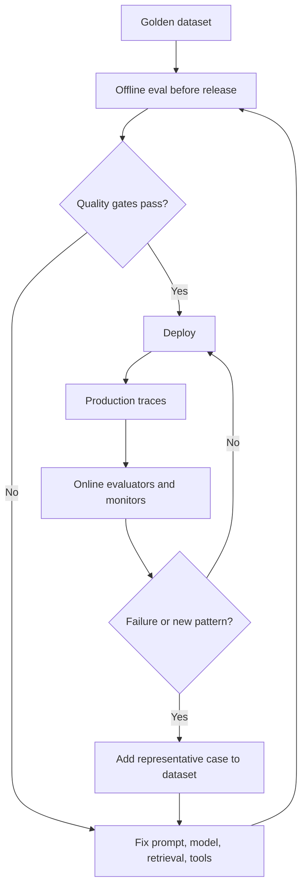

# Offline vs. Online Evaluation: From Lab Tests to Production Signals

## Executive Summary

Offline and online evaluation solve different problems.

**Offline evaluation** asks: *Before I ship a change, does the system still behave well on known scenarios?*

**Online evaluation** asks: *Now that the system is serving real users, is it behaving well on the traffic, edge cases, and failures that actually occur?*

A mature AI engineering process uses both. Offline evals protect releases; online evals discover reality. The most important pattern is the feedback loop between them: production failures become new offline test cases, the fix is validated against the enlarged dataset, and only then is it released again.

## Why This Matters

Traditional software has a familiar lifecycle: unit tests and integration tests before release, telemetry and alerts after release. Agentic AI needs the same separation, but the production signals are broader because behavior is probabilistic.

Imagine a migration agent passes all 40 of your curated MuleSoft test cases. You deploy it, and the first real customer has a project with a custom connector, an unusual error-handler structure, and a 20 MB XML configuration. The agent chooses an expensive sequence of tools and eventually produces an incomplete plan.

Your offline suite was not necessarily wrong. It simply did not contain that case.

That is the fundamental reason you need both forms of evaluation.

## Simple Mental Model

Think of a driving test.

- **Offline evaluation** is the closed test track: controlled scenarios, repeatable conditions, known expectations.
- **Online evaluation** is real traffic: unexpected drivers, weather, roadworks, congestion, and situations the test designer did not anticipate.

You should not put a driver on the road without the test track. But passing the test track does not prove that every real-world situation is covered.

## Core Evaluation Loop



The loop is more important than any particular evaluation framework.

## What Is Offline Evaluation?

Offline evaluation runs against a controlled dataset outside normal production request handling.

Typical uses:
- comparing two prompts
- changing an LLM model
- changing retrieval strategy
- modifying tool descriptions
- testing a new agent workflow
- regression testing before a pull request is merged

The inputs are usually **goldens**: representative examples you intentionally preserve because they capture important expected behavior.

DeepEval defines an evaluation dataset as a collection of goldens. A golden acts as a reusable precursor to a test case; each run produces fresh application outputs that can be scored again. This makes the same dataset reusable across prompt, model, or architecture changes.

### Example

Suppose version 1 of your migration agent uses model A and prompt v12. Version 2 uses model B and prompt v13.

Run both against the same 50 goldens:

```text
                         v1      v2
Connector discovery     92%     96%
Tool correctness        89%     94%
Answer relevance        91%     93%
Build success           88%     90%
Average tool calls      12       18
```

Version 2 is more accurate but significantly less efficient. That is a useful engineering trade-off to see before production.

## What Is Online Evaluation?

Online evaluation scores or monitors actual production interactions.

The important distinction is that you usually do **not** have a reference answer for each live request.

Therefore online evaluators often use signals such as:
- schema or format validity
- policy violations
- tool errors
- excessive retries
- latency
- token or cost budgets
- user feedback
- reference-free LLM-as-a-judge
- task completion signals
- downstream business outcomes

LangSmith's current evaluation model separates offline experiments from online evaluators that run on production traces. Its recommended loop is to capture failing production traces, add them to a dataset, validate the fix offline, and redeploy.

Phoenix similarly supports evaluations on production traces as well as datasets and experiment results, and combines those evaluations with OpenTelemetry-based trace inspection.

## Offline vs. Online

| Dimension | Offline | Online |
| --- | --- | --- |
| When | Before deployment or during development | After deployment on real traffic |
| Data | Curated or synthetic dataset | Production traces and outcomes |
| Reference answer | Often available | Usually unavailable |
| Main goal | Regression prevention and comparison | Monitoring and discovery |
| Repeatability | High | Lower; traffic changes |
| Cost control | Known and bounded | Requires sampling and filters |
| Typical action | Block or approve release | Alert, investigate, curate new case |

## Concrete Example: Migration Agent

Consider a migration workflow:

```text
/discover -> /normalize -> /plan -> /validate-plan -> /execute -> /review -> /parity-test
```

### Offline checks before release

For a curated MuleSoft application:

1. Did discovery identify every connector?
2. Did normalization preserve flow topology?
3. Did the planner select approved migration patterns?
4. Did the generated Spring Boot project compile?
5. Did parity tests preserve expected API behavior?
6. Did the agent stay within a tool-call budget?

These can run in CI.

### Online checks after deployment

For actual migration jobs:

1. How often does `/discover` need a retry?
2. Which connector types cause human escalation?
3. What percentage of generated projects compile on first attempt?
4. Which tool calls most often fail?
5. Which migrations exceed the expected token or runtime budget?
6. Where do architects override the generated plan?

These are operational signals rather than static test cases.

## A Practical Python Pattern

Keep your offline evaluation code simple first.

```python
from dataclasses import dataclass


@dataclass
class EvalResult:
    task_success: bool
    tool_calls: int
    policy_violations: int


def offline_gate(results: list[EvalResult]) -> bool:
    success_rate = sum(r.task_success for r in results) / len(results)
    max_tool_calls = max(r.tool_calls for r in results)
    violations = sum(r.policy_violations for r in results)

    return (
        success_rate >= 0.90
        and max_tool_calls <= 20
        and violations == 0
    )
```

Then combine those deterministic gates with DeepEval metrics for semantic quality.

For production, capture a normalized evaluation event:

```python
from dataclasses import dataclass


@dataclass
class ProductionEvalEvent:
    trace_id: str
    task_type: str
    success: bool
    tool_calls: int
    latency_ms: int
    human_override: bool
    policy_violation: bool
```

The online pipeline can sample these events and run additional evaluators asynchronously, without delaying every user request.

## Sampling Matters Online

Running an expensive LLM judge on every production interaction is often unnecessary.

A better strategy is layered evaluation:

```text
100% traffic
    -> deterministic safety / schema / error checks

10% sample
    -> quality heuristics

1-5% sample
    -> expensive LLM judge

100% of suspicious traces
    -> detailed evaluation
```

You can also oversample high-risk categories such as:
- write operations
- customer-data access
- repeated tool failures
- high token consumption
- low-confidence retrieval

Online evaluation is therefore as much a **sampling and observability design problem** as an evaluation-metric problem.

## What Should Block Deployment?

Not every metric deserves to be a CI gate.

Good hard gates include:
- prohibited tool use = 0
- schema violations = 0
- compile success above agreed threshold
- critical parity cases = 100%
- known security regression = 0

Metrics such as answer style, average tool count, or an LLM judge score may initially be **non-blocking trends** until you understand their normal variance.

A useful model is:

```text
Hard gate     -> must pass
Soft gate     -> warn on regression
Monitor only  -> collect baseline first
```

## Turning Production Failures into Goldens

This is the highest-leverage practice in the whole lesson.

Suppose production reveals:

> SAP connector with nested retry-until-success was classified incorrectly.

Do not only fix the prompt.

Create a regression case:

```json
{
  "case_id": "sap-nested-retry-001",
  "input_fixture": "fixtures/sap_nested_retry",
  "expected_connector": "sap",
  "expected_retry_semantics": "retry_until_success",
  "expected_manual_review": true
}
```

Now that production incident can never silently disappear from your test history.

This creates the cycle:

```text
Production failure
      ↓
Golden test case
      ↓
Fix
      ↓
Offline regression suite
      ↓
Deployment
```

## Common Mistakes and Failure Modes

### 1. Treating offline scores as production truth
A 95% offline score only means 95% on that dataset. If the dataset is narrow, the score can be misleading.

### 2. Sending every production request to an LLM judge
This creates cost, latency, privacy, and rate-limit problems. Sample intelligently.

### 3. Monitoring averages only
An average success rate can hide a severe failure in one connector, tenant, language, or workflow stage. Slice metrics by meaningful dimensions.

### 4. Never updating the golden dataset
A static dataset slowly becomes disconnected from real production behavior.

### 5. Blocking deployment on noisy metrics too early
First understand metric variance. Use deterministic high-confidence gates for critical conditions.

### 6. Storing production traces without governance
Traces may contain source code, customer data, secrets, prompts, or tool outputs. Apply redaction, retention, access control, and data classification.

### 7. Confusing observability with evaluation
A trace tells you **what happened**. An evaluator tells you **whether it was acceptable**. You need both.

## Enterprise Use Cases

The offline/online split is useful for:
- coding assistants
- migration and modernization agents
- RAG assistants
- customer-service agents
- document extraction
- incident-response copilots
- automated architecture reviews
- AI-generated API specifications
- cloud operations agents

## Java and Go Notes

**Java:** run offline semantic evals as a separate test service or Python evaluation job while keeping deterministic contract, compile, and integration checks in JUnit. Emit production traces and evaluation attributes through OpenTelemetry.

**Go:** use table-driven tests for golden cases and deterministic gates. For production, attach trace attributes such as task type, tool count, retry count, model version, and outcome, then evaluate sampled traces out of band.

## Cloud Mapping

Cloud services matter mainly for the online pipeline.

| Cloud | Useful building blocks |
| --- | --- |
| AWS | CloudWatch, OpenTelemetry/ADOT, Bedrock evaluation capabilities, S3/Athena for curated datasets |
| Azure | Azure Monitor, Application Insights/OpenTelemetry, Azure AI evaluation tooling, Blob Storage |
| GCP | Cloud Trace/Monitoring, OpenTelemetry, Vertex AI evaluation, BigQuery/GCS |

The architectural pattern is more important than the specific cloud product: capture traces, compute cheap signals broadly, run expensive evaluators selectively, and feed important failures back into your regression dataset.

## 30–60 Minute Hands-On Exercise

Extend yesterday's DeepEval project.

### Part 1 — Offline

Create five goldens for your migration assistant:
1. standard HTTP listener
2. Salesforce connector
3. database connector
4. unsupported custom connector
5. malformed project

For each case capture:
- task success
- expected tool
- answer relevancy
- policy violation
- tool-call count

Define one hard gate and one soft gate.

### Part 2 — Simulated online stream

Create a JSONL file containing 20 fake production runs with fields:

```json
{
  "trace_id": "t-001",
  "task_type": "connector-discovery",
  "success": true,
  "tool_calls": 6,
  "latency_ms": 2400,
  "human_override": false
}
```

Write a Python script that reports:
- success rate
- p95 latency
- average tool calls
- human-override rate

Select the worst production record and turn it into a sixth golden case.

That final step is the important one: **production evidence improves the offline suite**.

## What to Learn Next

**Building a Simple Coding Assistant**

You now have the key safety and quality foundations: tool contracts, sandboxing, eval design, a practical DeepEval implementation, and the offline/online feedback loop. The next useful step is to combine them into a small coding assistant that can inspect files, propose a change, run a bounded tool, and be evaluated end-to-end.

## Recommended Reading

- [LangSmith — Evaluation](https://docs.langchain.com/langsmith/evaluation)
- [DeepEval — Evaluation datasets](https://deepeval.com/docs/evaluation-datasets)
- [DeepEval — Introduction to LLM evals](https://deepeval.com/docs/evaluation-introduction)
- [Arize Phoenix — Evaluation](https://arize.com/docs/phoenix/evaluation/llm-evals/evaluator-traces)
- [Arize Phoenix — Running evals on traces](https://arize.com/docs/phoenix/tracing/how-to-tracing/feedback-and-annotations/evaluating-phoenix-traces)