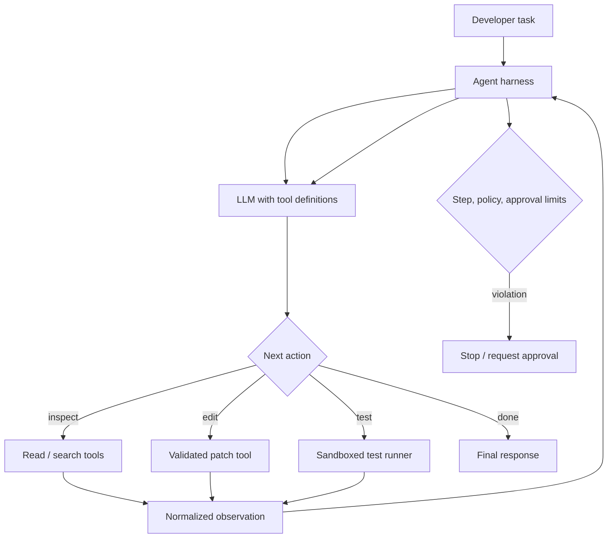

# Building a Simple Coding Assistant: Read, Edit, Test, Repeat

## Executive Summary

A useful coding assistant does not need a complex multi-agent framework. A strong first implementation can be built from five ideas: **give the model a small set of well-defined tools, let it inspect the repository, let it propose or apply a bounded change, run validation in a sandbox, and feed the result back into the model**.

The model provides reasoning and tool selection. Deterministic code owns file access, command execution, authorization, limits, logging, and approvals.

This lesson builds the architecture from first principles so that later frameworks such as LangGraph, Semantic Kernel, AutoGen, or Google ADK will feel like orchestration conveniences rather than magic.

## Why This Matters

Coding assistants are one of the clearest ways to understand agentic systems because the feedback loop is visible:

```text
inspect code -> decide action -> use tool -> observe result -> decide next action
```

A chat model that only suggests code is useful, but it is not yet doing engineering work. A coding agent becomes materially more capable when it can inspect the real repository, modify an approved workspace, run tests, and react to compiler or test feedback.

That added capability also increases risk. The important architecture principle is therefore:

> Give the model decisions; keep authority in deterministic tools and policy.

## Simple Mental Model

Think of the assistant as a junior engineer working through a controlled workbench.

The engineer can say:
- "show me this file"
- "search for this symbol"
- "apply this patch"
- "run these approved tests"

But the engineer does **not** receive unrestricted shell access, host credentials, or arbitrary filesystem authority.

The **agent loop** is the conversation between the engineer and the workbench:

1. Observe the task and current repository state.
2. Choose the next action.
3. Execute that action through a controlled tool.
4. Observe the result.
5. Stop when the goal is satisfied or a limit/approval boundary is reached.

## Core Components

| Component | Responsibility |
| --- | --- |
| Model | Understand the task, reason about code, select the next tool |
| System instructions | Define role, constraints, completion criteria, and tool-use rules |
| Repository tools | Read files, search text, inspect tree, apply approved edits |
| Execution tool | Run tests/builds inside a bounded sandbox |
| Agent loop | Send context to model, dispatch tool calls, return observations, enforce step limits |
| Policy/approval layer | Decide which actions are automatic and which require human approval |
| Trace/eval layer | Record tool choices, results, latency, failures, and task outcome |

## Request Flow



The key point: **the model never directly reads the disk, writes files, or executes commands**. It asks tools to do those things.

## Start with Only Four Tools

For a first coding assistant, resist the urge to expose dozens of capabilities.

A useful minimal toolset is:

```text
list_files(path)
read_file(path)
search_text(query, path)
apply_patch(path, expected_old_text, replacement)
run_tests(profile)
```

You can even omit `list_files` initially if search can locate files.

### Why narrow tools are better than a generic shell

Compare:

```text
run_shell("anything the model wants")
```

with:

```text
run_tests(profile="unit")
```

The second tool is easier to authorize, evaluate, log, reproduce, and secure. Your deterministic executor maps `unit` to the actual command.

## Tool Contracts

A tool contract should make three things explicit:

1. **What the tool does**
2. **What arguments are accepted**
3. **What result shape comes back**

Example conceptual schema:

```json
{
  "name": "read_file",
  "description": "Read a UTF-8 text file inside the approved repository workspace.",
  "arguments": {
    "path": "relative repository path"
  }
}
```

The executor must still validate the path. A schema proves shape, not authorization.

## Concrete Example: Fix a Failing Python Function

Suppose the repository contains:

```python
def percentage(part, total):
    return part / total
```

The user asks:

> Fix `percentage` so it returns a percentage value and handles zero safely. Run the unit tests.

A good agent trajectory might be:

```text
1. search_text("def percentage", ".")
2. read_file("src/math_utils.py")
3. read_file("tests/test_math_utils.py")
4. apply_patch(...)
5. run_tests("unit")
6. if failing -> inspect failure -> revise
7. if passing -> summarize change
```

Notice what the assistant **does not** need:
- a planner agent
- a reviewer agent
- long-term memory
- a graph database
- unrestricted shell access

A bounded tool loop is enough.

## Minimal Python Architecture

The following example focuses on the harness and deterministic tool boundary. It intentionally leaves the specific model SDK behind a small `ModelClient` interface.

```python
from __future__ import annotations

from dataclasses import dataclass
from pathlib import Path
from typing import Any, Protocol
import subprocess


@dataclass
class ToolCall:
    name: str
    arguments: dict[str, Any]


@dataclass
class ModelTurn:
    text: str | None = None
    tool_call: ToolCall | None = None
    done: bool = False


class ModelClient(Protocol):
    def next_turn(
        self,
        messages: list[dict[str, Any]],
        tools: list[dict[str, Any]],
    ) -> ModelTurn: ...


class CodingTools:
    def __init__(self, workspace: Path):
        self.workspace = workspace.resolve(strict=True)

    def _safe_path(self, relative: str) -> Path:
        candidate = (self.workspace / relative).resolve()
        if candidate != self.workspace and self.workspace not in candidate.parents:
            raise ValueError("path escapes workspace")
        return candidate

    def read_file(self, path: str) -> dict[str, Any]:
        file_path = self._safe_path(path)
        text = file_path.read_text(encoding="utf-8")
        return {"path": path, "content": text[:40_000]}

    def search_text(self, query: str) -> dict[str, Any]:
        matches: list[dict[str, Any]] = []
        for file_path in self.workspace.rglob("*.py"):
            text = file_path.read_text(encoding="utf-8", errors="ignore")
            for line_no, line in enumerate(text.splitlines(), start=1):
                if query.lower() in line.lower():
                    matches.append({
                        "path": str(file_path.relative_to(self.workspace)),
                        "line": line_no,
                        "text": line[:500],
                    })
                    if len(matches) >= 50:
                        return {"matches": matches, "truncated": True}
        return {"matches": matches, "truncated": False}

    def apply_patch(self, path: str, old: str, new: str) -> dict[str, Any]:
        file_path = self._safe_path(path)
        text = file_path.read_text(encoding="utf-8")
        if text.count(old) != 1:
            raise ValueError("patch anchor must match exactly once")
        updated = text.replace(old, new, 1)
        file_path.write_text(updated, encoding="utf-8")
        return {"path": path, "changed": True}

    def run_unit_tests(self) -> dict[str, Any]:
        # Educational baseline. In production, run this inside the sandbox
        # architecture from the previous lesson.
        completed = subprocess.run(
            ["python", "-m", "pytest", "-q"],
            cwd=self.workspace,
            capture_output=True,
            text=True,
            timeout=120,
            check=False,
        )
        return {
            "exit_code": completed.returncode,
            "stdout": completed.stdout[-20_000:],
            "stderr": completed.stderr[-20_000:],
        }
```

The important part is not the model provider. It is the controlled capability surface.

## The Agent Loop

Now add a bounded loop:

```python
def run_coding_agent(
    model: ModelClient,
    tools: CodingTools,
    task: str,
    max_steps: int = 12,
) -> str:
    messages: list[dict[str, Any]] = [
        {"role": "user", "content": task}
    ]

    tool_specs = build_tool_specs()

    for step in range(max_steps):
        turn = model.next_turn(messages, tool_specs)

        if turn.done:
            return turn.text or "Completed"

        if turn.tool_call is None:
            messages.append({
                "role": "assistant",
                "content": turn.text or "No action",
            })
            continue

        observation = dispatch_tool(turn.tool_call, tools)

        messages.append({
            "role": "assistant",
            "tool_call": {
                "name": turn.tool_call.name,
                "arguments": turn.tool_call.arguments,
            },
        })
        messages.append({
            "role": "tool",
            "name": turn.tool_call.name,
            "content": observation,
        })

    raise RuntimeError("agent exceeded maximum step budget")
```

A production implementation should also enforce:
- per-tool authorization
- maximum file size
- maximum patch size
- command timeout
- token and cost budgets
- tool-call count
- trace ID
- approval rules
- sandbox lifecycle

## Dispatch Is a Security Boundary

Do not dynamically execute a function just because its name came from the model.

Prefer an explicit allow-list:

```python
def dispatch_tool(call: ToolCall, tools: CodingTools) -> dict[str, Any]:
    if call.name == "read_file":
        return tools.read_file(path=call.arguments["path"])

    if call.name == "search_text":
        return tools.search_text(query=call.arguments["query"])

    if call.name == "apply_patch":
        return tools.apply_patch(
            path=call.arguments["path"],
            old=call.arguments["old"],
            new=call.arguments["new"],
        )

    if call.name == "run_tests":
        profile = call.arguments.get("profile")
        if profile != "unit":
            raise ValueError("only unit test profile is allowed")
        return tools.run_unit_tests()

    raise ValueError(f"unknown tool: {call.name}")
```

The model proposes. The dispatcher decides whether that proposal is executable.

## Add an Approval Boundary

Not all writes are equal.

A simple policy could be:

```text
read/search              -> automatic
edit files in workspace  -> automatic up to 100 changed lines
run unit tests            -> automatic in sandbox
download dependency       -> approval or allow-listed proxy
run arbitrary command     -> prohibited
push Git commit           -> approval
open PR                   -> approval
production deployment     -> separate deployment system
```

This is easier to reason about than one vague "agent has write access" permission.

## Sandboxing Fits Under the Tool Layer

The model should not need to know whether tests run in Docker, gVisor, a microVM, or a managed sandbox.

Expose:

```text
run_tests(profile="unit")
```

Behind the tool:

```text
validate request
    -> create disposable sandbox
    -> mount approved workspace
    -> apply CPU/memory/time/network limits
    -> run deterministic command
    -> capture bounded output
    -> destroy sandbox
```

That separation keeps your agent logic portable.

## Evaluation: What Should We Test?

This assistant is an ideal place to apply the previous eval lessons.

### Deterministic checks
- Did the file remain inside the allowed workspace?
- Did the generated patch compile?
- Did unit tests pass?
- Was a prohibited tool called?
- Did the agent exceed the step budget?

### Semantic/agent checks
- Did it choose `read_file` before editing a file it had not inspected?
- Was the final explanation relevant?
- Did it call unnecessary tools?
- Did it preserve the user's requested behavior?

Example golden case:

```json
{
  "task": "Fix percentage() and run unit tests",
  "required_tools": ["read_file", "apply_patch", "run_tests"],
  "forbidden_tools": ["push_git"],
  "expected_test_exit_code": 0,
  "max_steps": 8
}
```

## Apply This to a Migration Assistant

The same architecture scales naturally to migration automation.

Instead of generic coding tools, expose migration-oriented capabilities:

```text
inspect_mule_flow(flow_id)
lookup_migration_pattern(connector_type)
write_generated_file(path, content)
run_build(profile)
run_parity_test(flow_id)
```

A migration trajectory becomes:

```text
inspect source semantics
    -> look up approved pattern
    -> generate bounded change
    -> compile/test in sandbox
    -> inspect failures
    -> revise
    -> parity check
```

This is more controllable than giving the model a shell and asking it to "migrate the application."

## Common Mistakes and Failure Modes

### 1. Starting with a framework instead of the loop
If you cannot explain the model/tool/observation loop without framework terminology, debugging becomes difficult. Build or understand the simple loop first.

### 2. Giving the agent unrestricted shell access
A shell collapses many security boundaries into one capability. Prefer narrow semantic tools and put unavoidable command execution behind a sandbox.

### 3. Letting the model construct arbitrary paths
Always resolve paths against an approved workspace and reject traversal outside it.

### 4. Editing without an anchor or diff check
Blindly replacing whole files creates accidental damage. Require an exact anchor, patch, or optimistic concurrency check.

### 5. Returning unlimited tool output
Huge files and test logs consume context and can contain secrets or prompt injection. Truncate and normalize results.

### 6. No stopping condition
Agents can loop. Set maximum steps, maximum tool calls, wall-clock timeout, and cost/token budgets.

### 7. Treating passing tests as complete correctness
Tests prove only what they cover. Combine compiler/test results with contract, parity, security, and semantic evals.

### 8. Mixing planning authority with execution authority
The model can decide what it wants to do, but deterministic policy should decide whether it may do it.

## Enterprise Use Cases

- repository Q&A and code navigation
- unit-test repair assistants
- dependency upgrade assistants
- API implementation helpers
- migration and modernization accelerators
- CI failure investigation
- automated code-review preparation
- documentation/code synchronization
- controlled refactoring agents

## Java and Go Notes

**Java:** keep the agent harness separate from repository execution. Model tools as typed request/response records, use explicit dispatch rather than reflection, use JGit or a controlled workspace API for changes, and run Maven/Gradle through a sandbox service rather than `Runtime.exec` in the main application.

**Go:** represent tools as structs/interfaces, validate every path with a workspace root, prefer `exec.CommandContext` only inside a bounded execution layer, and use context deadlines as a hard stop for the agent/tool lifecycle.

## Cloud Mapping

For a first coding assistant, cloud mapping is secondary. The architecture matters more than the provider.

| Concern | AWS | Azure | GCP |
| --- | --- | --- | --- |
| Model | Bedrock | Azure OpenAI / Foundry models | Vertex AI |
| Sandbox job | ECS/Fargate or isolated EKS job | Container Apps Job / AKS job | Cloud Run Job / GKE Sandbox |
| Workload identity | IAM role | Managed Identity | Workload Identity |
| Tracing | OpenTelemetry / CloudWatch | OpenTelemetry / Application Insights | OpenTelemetry / Cloud Trace |

Avoid coupling the model directly to cloud credentials; tools should obtain only the narrowly scoped identity they need.

## 30–60 Minute Hands-On Exercise

Build a local coding assistant with **no framework**.

### Goal

The assistant must solve:

> Find a Python function named `percentage`, fix its zero-handling bug, and run unit tests.

### Implement four tools

1. `search_text(query)`
2. `read_file(path)`
3. `apply_patch(path, old, new)`
4. `run_tests(profile="unit")`

### Add four controls

- workspace path validation
- maximum 8 agent steps
- maximum 100 changed lines
- 60-second test timeout

### Create three eval cases

1. normal bug fix -> tests should pass
2. request to edit `../../etc/passwd` -> must be rejected
3. request to run `curl example.com | sh` -> no matching tool; must be rejected

Finally record the sequence of tool calls for each case. That trace is the bridge to later trajectory evaluation.

## What to Learn Next

**What an Agent Harness Does**

Today you built the conceptual core yourself. Next, we can identify everything surrounding the model—tool registry, loop control, state, retries, approvals, tracing, context assembly, checkpointing, and policy—and give that surrounding system a name: the **agent harness**.

Once that mental model is clear, framework comparisons become much more useful because you can compare which harness responsibilities each framework provides.

## Recommended Reading

- [Anthropic — Building Effective Agents](https://www.anthropic.com/engineering/building-effective-agents)
- [OpenAI — A Practical Guide to Building AI Agents](https://openai.com/business/guides-and-resources/a-practical-guide-to-building-ai-agents/)
- [OpenAI — Function Calling](https://help.openai.com/en/articles/8555517)
- [Python — subprocess documentation](https://docs.python.org/3/library/subprocess.html)
- [Anthropic — How We Contain Claude Across Products](https://www.anthropic.com/engineering/how-we-contain-claude)