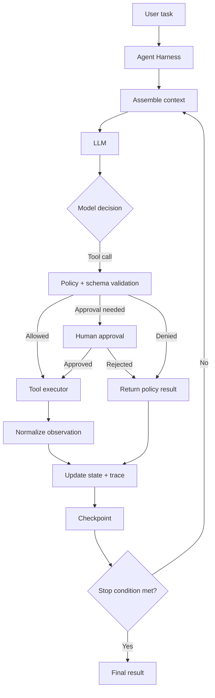

# What an Agent Harness Does: The Control Plane Around the Model

## Executive Summary

Yesterday we built a simple coding assistant as a loop: **model → tool call → execution → observation → model**. That loop is the core of an agent, but production systems need something around it to control state, permissions, retries, context, persistence, and observability.

That surrounding layer is commonly described as an **agent harness**.

A useful mental model is:

> **The model decides what it wants to do; the harness decides how the system is allowed to do it.**

The harness is not the LLM and it is not the business tool itself. It is the control plane that assembles context, exposes tools, dispatches calls, enforces policies, stores state, decides when to retry or stop, pauses for approval, checkpoints progress, and records traces.

Modern frameworks package different parts of this responsibility. LangGraph describes itself as an orchestration runtime focused on durable execution, persistence, streaming, and human-in-the-loop; Microsoft AutoGen exposes stateful agents, tools, termination conditions, and runtime concepts; Semantic Kernel centralizes services/plugins in its kernel and provides agent/process orchestration; Google ADK exposes sessions, state, events, tools, and runtime abstractions. The names differ, but the architectural concerns are similar.

## Why This Matters

A basic agent loop can work in a demo and still fail badly in enterprise use.

Suppose a migration agent is asked:

> Migrate the payment Mule flow to Spring Boot and verify parity.

The model might need to:

1. inspect source files
2. load migration rules
3. select a transformation pattern
4. generate code
5. compile it
6. inspect errors
7. retry
8. run parity tests
9. request approval if a risky change is required
10. resume after approval

If all of this logic is buried inside prompt text or ad-hoc Python, you quickly get problems:

- lost state after a failure
- duplicated tool calls
- uncontrolled retries
- inconsistent authorization
- prompts that grow without bounds
- no way to resume after human approval
- poor traceability
- difficult testing

The harness makes these concerns explicit software responsibilities.

## Simple Mental Model

Think of an airport.

The **LLM** is the pilot deciding how to fly the aircraft.

The **tools** are aircraft capabilities: engines, navigation systems, landing gear.

The **agent harness** is closer to air-traffic control plus operating procedures:

- which route is allowed
- what state the flight is in
- which action is permitted
- when approval is required
- what happens after a failure
- how many retries are acceptable
- where progress is recorded
- when the flight is considered complete

The harness does not replace reasoning. It **constrains and operationalizes reasoning**.

## Core Responsibilities of an Agent Harness

| Responsibility | What it means |
| --- | --- |
| State management | Keep task state, messages, tool results, progress, and execution metadata |
| Context assembly | Choose what instructions, history, retrieved data, and tool descriptions enter the next model call |
| Tool registry | Expose approved tools and their schemas |
| Dispatch | Validate and execute a model-requested tool through deterministic code |
| Policy | Authorize, reject, or require approval for an action |
| Loop control | Decide whether to continue, retry, pause, or terminate |
| Retry handling | Apply bounded retry policies for model/tool failures |
| Checkpointing | Persist progress so long-running work can resume |
| Human-in-the-loop | Pause execution for review or approval and resume later |
| Observability | Trace model calls, tools, state transitions, cost, latency, and failures |
| Evaluation hooks | Capture the data needed to score outcomes and trajectories |

## Request Flow



Notice the LLM appears in only one box. Most production reliability comes from the surrounding deterministic system.

## 1. State: More Than Chat History

A beginner implementation often treats `messages` as the entire agent state.

For real work, state should be structured.

```python
from dataclasses import dataclass, field


@dataclass
class AgentState:
    run_id: str
    task: str
    phase: str = "discover"
    messages: list[dict] = field(default_factory=list)
    artifacts: dict[str, str] = field(default_factory=dict)
    tool_calls: int = 0
    retries: int = 0
    approved_actions: set[str] = field(default_factory=set)
    completed: bool = False
```

For a migration system, state might include:

```text
source_application
current_phase
canonical_model_path
selected_migration_patterns
generated_files
validation_results
approval_status
retry_budget
```

This is much safer than hoping the model reconstructs everything from conversation history.

## 2. Context Assembly: Decide What the Model Sees

A model has a finite context window. The harness should assemble the smallest useful context for the next step.

Possible inputs:

```text
system instructions
current task
current phase
recent messages
relevant source files
retrieved migration rules
tool schemas
current validation failures
```

Do not dump the entire repository and full conversation into every call.

A simple context builder:

```python
def build_context(state: AgentState) -> list[dict]:
    context = [
        {
            "role": "system",
            "content": (
                "You are a migration assistant. Use only the supplied tools. "
                "Do not claim completion until validation passes."
            ),
        },
        {"role": "user", "content": state.task},
    ]

    context.extend(state.messages[-8:])

    if "latest_validation" in state.artifacts:
        context.append({
            "role": "system",
            "content": (
                "Latest validation result:\n" +
                state.artifacts["latest_validation"]
            ),
        })

    return context
```

Later, context management may include summarization, retrieval, caching, or memory. But the basic responsibility already belongs in the harness.

## 3. Tool Registry and Dispatch

The harness decides which tools are visible for the current phase.

For example:

```python
TOOLS_BY_PHASE = {
    "discover": {
        "list_files",
        "read_file",
        "extract_mule_semantics",
    },
    "plan": {
        "read_canonical_model",
        "lookup_migration_pattern",
        "write_migration_plan",
    },
    "execute": {
        "write_generated_file",
        "run_build",
        "run_tests",
    },
}
```

This is better than exposing every capability all the time.

The harness should validate that the requested tool is both **known** and **allowed in the current state**.

```python
def authorize_tool(state: AgentState, tool_name: str) -> None:
    allowed = TOOLS_BY_PHASE.get(state.phase, set())
    if tool_name not in allowed:
        raise PermissionError(
            f"{tool_name} not allowed during phase={state.phase}"
        )
```

This principle maps well to enterprise authorization: capability exposure should depend on task, phase, identity, and risk.

## 4. Loop Control and Termination

An agent needs explicit stopping rules.

Typical stop conditions:

- model returns a final answer
- task success criteria are satisfied
- maximum steps reached
- maximum tool calls reached
- token/cost budget exceeded
- unrecoverable tool failure
- human rejects an approval
- policy blocks the requested action

```python
def should_stop(state: AgentState) -> bool:
    if state.completed:
        return True

    if state.tool_calls >= 20:
        return True

    if state.retries >= 3:
        return True

    return False
```

The important architectural point is that **the model should not be the only component deciding when execution ends**.

## 5. Retry Policy

Retries should be owned by the harness, not improvised by the model.

Different failures need different treatment:

```text
HTTP 503 from tool        -> retry with backoff
schema validation error   -> return error to model for correction
permission denied         -> do not retry
approval required         -> pause
compiler error            -> give output to model, allow bounded revision
model timeout             -> retry model call within budget
```

A useful retry classification:

```python
class RetryableToolError(Exception):
    pass


class PermanentToolError(Exception):
    pass
```

Then the harness can apply deterministic retry logic instead of repeatedly asking the model to guess what happened.

## 6. Human-in-the-Loop

Some actions should pause execution.

Examples:

- modifying more than 20 files
- changing a public API contract
- deleting code
- accessing production data
- pushing a commit
- deploying

The harness needs three capabilities:

```text
persist current state
emit an approval request
resume from the same state later
```

This is why persistence matters. LangGraph, for example, explicitly combines checkpointers with interrupts so execution can pause and resume after external input.

A framework-independent representation might be:

```python
@dataclass
class ApprovalRequest:
    action_id: str
    description: str
    risk: str
    proposed_arguments: dict
```

The tool should execute only after the harness records a valid approval for that `action_id`.

## 7. Checkpointing and Durable Execution

A coding fix may finish in seconds. A migration job can run for hours and involve humans.

If the process crashes after generating 70 files, restarting from the first model call is wasteful and potentially unsafe.

Checkpoint state after meaningful boundaries:

```text
after discovery
after canonical normalization
after plan approval
after each transformation batch
after build
before and after human approval
```

A checkpoint should contain enough deterministic state to resume the workflow without asking the model to reconstruct history.

LangGraph's persistence model saves graph state as checkpoints and uses thread identifiers to restore execution. That is a concrete implementation of the same architectural concern.

## 8. Observability

A harness should produce a trace such as:

```text
run_id: MIG-2026-0811-001
phase: execute
step: 17
model: <model-version>
tool: run_build
arguments: {profile: "unit"}
latency_ms: 4280
exit_code: 1
retry: 0
policy: allowed
```

For agent systems, observability should cover both traditional telemetry and the agent trajectory:

- model calls
- prompt/context size
- retrieved context
- tool selection
- tool arguments
- tool result
- state transition
- retry reason
- approval event
- final outcome

This gives your eval system something concrete to measure.

## Minimal Python Harness

The following intentionally avoids a framework so the responsibilities are visible.

```python
from dataclasses import dataclass
from typing import Any, Protocol


@dataclass
class ToolCall:
    name: str
    arguments: dict[str, Any]


@dataclass
class ModelResult:
    final_text: str | None = None
    tool_call: ToolCall | None = None


class ModelClient(Protocol):
    def invoke(self, messages: list[dict], tools: list[dict]) -> ModelResult:
        ...


class Harness:
    def __init__(self, model, registry, checkpoint_store, tracer):
        self.model = model
        self.registry = registry
        self.checkpoints = checkpoint_store
        self.tracer = tracer

    def run(self, state: AgentState) -> str:
        while not should_stop(state):
            messages = build_context(state)
            tool_specs = self.registry.schemas_for(state.phase)

            result = self.model.invoke(messages, tool_specs)

            if result.final_text is not None and result.tool_call is None:
                state.completed = True
                self.checkpoints.save(state)
                return result.final_text

            call = result.tool_call
            if call is None:
                raise RuntimeError("model produced no final answer or tool call")

            authorize_tool(state, call.name)
            self.registry.validate(call)

            if self.registry.requires_approval(call):
                self.checkpoints.save(state)
                raise ApprovalRequired(call)

            observation = self.registry.execute(call)
            state.tool_calls += 1

            state.messages.append({
                "role": "tool",
                "name": call.name,
                "content": observation,
            })

            self.tracer.record(state, call, observation)
            self.checkpoints.save(state)

        raise RuntimeError("agent stopped because a harness limit was reached")
```

Real implementations need asynchronous I/O, structured model messages, exception classification, sandbox management, cancellation, and concurrency control. But the responsibilities remain recognizable.

## Concrete Migration-Agent Example

Consider a migration pipeline:

```text
/discover
/normalize
/plan
/validate-plan
/execute
/review
/parity-test
```

Without a harness, these may become a collection of prompts and scripts.

With a harness, each stage has explicit state and rules.

### `/discover`

Harness exposes only read-only tools:

```text
list_files
read_file
extract_mule_semantics
```

Exit condition:

```text
canonical discovery model exists and validates
```

### `/plan`

Harness exposes:

```text
read_canonical_model
lookup_migration_pattern
write_plan
```

Exit condition:

```text
all discovered components mapped to a plan or flagged for review
```

### `/execute`

Harness exposes write/build tools:

```text
write_generated_file
run_build
run_tests
```

Additional rules:

```text
sandbox required
max changed files per batch
no production credentials
max retry count
```

### `/review`

Harness can pause for human approval if the generated diff exceeds a threshold.

This is the practical meaning of a harness as a **control plane around the model**.

## Harness vs. Framework vs. Runtime

These terms are often used loosely, so a useful distinction is:

| Term | Practical meaning |
| --- | --- |
| Agent loop | The repeated model → tool → observation cycle |
| Harness | The application-level control layer around that loop |
| Framework | Reusable abstractions/APIs that help you build agents and harness behavior |
| Runtime | Execution infrastructure for state, scheduling, persistence, messaging, or durable work |

There is overlap. A product may bundle all four.

For example, current LangChain documentation explicitly describes Deep Agents as an agent harness, LangChain as an agent framework, and LangGraph as an orchestration runtime. That vocabulary is useful because it separates **agent behavior** from **operational execution infrastructure**.

## How Current Frameworks Map to Harness Concerns

### LangGraph

Strong emphasis on:

- shared state
- nodes and edges
- durable execution
- checkpoints/persistence
- human-in-the-loop interrupts
- streaming

Useful when you need explicit, stateful orchestration.

### AutoGen

Its AgentChat layer provides stateful agents, tool execution, teams, termination conditions, and human-in-the-loop patterns. Its Core layer provides lower-level runtimes and tool abstractions. AutoGen documentation also exposes `max_tool_iterations`, demonstrating that loop limits are a runtime/harness responsibility rather than just a prompt instruction.

### Semantic Kernel

The **Kernel** is the central service/plugin container, and the Agent/Process frameworks add agent and process orchestration. This tends to fit naturally into enterprise .NET/Java/Python applications where dependency injection, plugins, filters, and observability already matter.

### Google ADK

ADK exposes sessions, session state, events, tools, agents, and runner/runtime concepts. Its session service APIs explicitly manage creation, retrieval, events, and state—again showing that agent state is an application/runtime concern, not just chat history.

We will compare these frameworks more systematically later. For now, focus on the common responsibilities rather than product syntax.

## Common Mistakes and Failure Modes

### 1. Putting orchestration rules in the prompt

"Retry three times, ask approval before writes, never exceed ten tools" sounds simple, but these are software policies. Enforce them in code.

### 2. Treating chat history as durable state

Messages are useful context, not a reliable workflow database.

### 3. Letting every tool be visible at every step

Reduce the capability surface based on phase, user, task, and risk.

### 4. Retrying every error

Permission failures and policy denials should not be blindly retried.

### 5. No checkpoint before approval

If you pause for a human but cannot resume from deterministic state, the approval workflow is fragile.

### 6. Logging only the final answer

For debugging and evals, record the trajectory and state transitions.

### 7. Building a large framework before understanding the loop

Use a framework when its persistence, graph, runtime, middleware, or tooling saves engineering effort—not because agents require one by definition.

## Enterprise Use Cases

Harnesses become particularly important for:

- application modernization agents
- coding assistants
- production-support agents
- customer-service workflows with write actions
- infrastructure remediation agents
- document-processing pipelines
- agentic RAG workflows
- long-running research or compliance workflows
- human-approved business processes

Any workflow with **side effects, long duration, expensive execution, sensitive data, or approvals** benefits from explicit harness responsibilities.

## Java and Go Notes

**Java:** model the harness as normal application infrastructure: typed state objects, a tool registry, policy interceptors, retry policies, persistence, and OpenTelemetry. Frameworks such as Semantic Kernel can provide higher-level abstractions, but the security boundary should remain explicit Java code/services.

**Go:** interfaces and explicit state machines work well for lightweight harnesses. Keep model adapters, tool executors, checkpoint storage, and policy checks behind separate interfaces. Use `context.Context` for cancellation/deadlines and persist resumable state outside the model conversation.

## Cloud Mapping

The harness itself is usually application code, but cloud services can provide supporting infrastructure.

| Concern | AWS | Azure | GCP |
| --- | --- | --- | --- |
| Durable state | DynamoDB / RDS | Cosmos DB / Azure SQL | Firestore / Cloud SQL |
| Long-running orchestration | Step Functions | Durable Functions | Workflows |
| Queue/event | SQS / EventBridge | Service Bus / Event Grid | Pub/Sub |
| Tracing | ADOT / CloudWatch | Application Insights / OpenTelemetry | Cloud Trace / OpenTelemetry |

Do not automatically move agent logic into a cloud workflow engine. Use these services when you need durable orchestration across processes or long waits; keep model/tool reasoning in the agent application layer.

## 30–60 Minute Hands-On Exercise

Extend yesterday's coding assistant with a tiny harness.

### Part 1 — Add structured state

Create:

```python
@dataclass
class AgentState:
    task: str
    phase: str
    tool_calls: int = 0
    retries: int = 0
    completed: bool = False
```

### Part 2 — Phase-restrict tools

Allow:

```text
inspect -> read_file, search_text
edit    -> read_file, apply_patch
verify  -> run_tests
```

Reject any tool requested outside its phase.

### Part 3 — Add limits

Enforce:

```text
max tool calls = 8
max retries = 2
```

### Part 4 — Add checkpointing

After every tool call, serialize `AgentState` to `checkpoint.json`.

Kill the program after step 3 and make it resume from the checkpoint rather than start from scratch.

### Part 5 — Add one approval

Require approval before `apply_patch` if more than 20 lines would change.

When you finish, you will have implemented the most important harness concepts without using an agent framework.

## What to Learn Next

**Comparing LangGraph, Semantic Kernel, AutoGen, Google ADK, and Lightweight Custom Loops**

Now that the responsibilities of a harness are clear, framework comparison becomes much more useful. Instead of asking "which framework is best?", we can compare which one provides the state, orchestration, persistence, tool, approval, observability, and deployment capabilities your architecture actually needs.

## Recommended Reading

- [LangGraph overview](https://docs.langchain.com/oss/python/langgraph/overview)
- [LangGraph persistence](https://docs.langchain.com/oss/python/langgraph/persistence)
- [AutoGen AgentChat agents](https://microsoft.github.io/autogen/stable/user-guide/agentchat-user-guide/tutorial/agents.html)
- [Semantic Kernel Agent Framework](https://learn.microsoft.com/en-us/semantic-kernel/frameworks/agent/)
- [Google ADK session service API](https://google.github.io/adk-docs/api-reference/java/com/google/adk/sessions/BaseSessionService.html)
