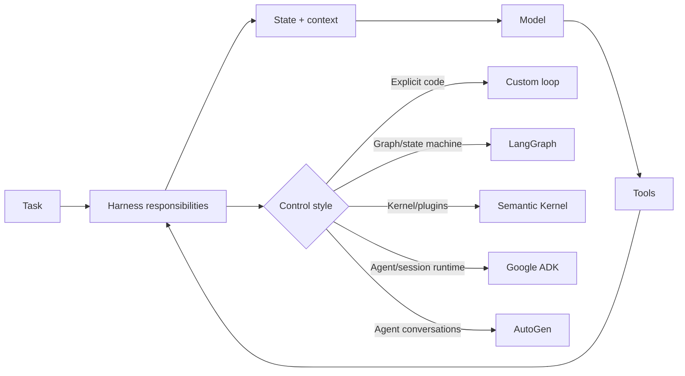

# Choosing an Agent Framework: LangGraph vs Semantic Kernel vs AutoGen vs Google ADK vs Custom Loops

## Executive Summary
There is no universally best agent framework. The useful question is: **which harness responsibilities do you want the framework to own, and which do you want to keep explicit in your application?**

Default guidance: **custom loop for learning and narrow agents; LangGraph for explicit stateful workflows and durable execution; Semantic Kernel when .NET/Java and enterprise plugin integration dominate; Google ADK when building strongly around Google's agent/runtime ecosystem; AutoGen when conversational multi-agent collaboration is the central pattern.**

Do not choose a framework because it has the most abstractions. Choose the smallest abstraction that makes state, recovery, approvals, tracing, and testing easier rather than harder.

## Why This Matters
An agent harness contains state, context assembly, tool dispatch, policy, loop control, retries, checkpoints, approvals, and traces. Frameworks package some or all of these concerns. Compare them by **runtime semantics**, not syntax: how work progresses, where state lives, how execution resumes, and how much control remains deterministic.

## Simple Mental Model
Frameworks are different workflow engines around the same core ingredients:

```text
LLM + instructions + tools + state + control loop
```

A **custom loop** gives raw building blocks. A **graph framework** makes states and transitions explicit. An **agent SDK** gives higher-level agent/session/tool abstractions. A **multi-agent framework** emphasizes collaboration between autonomous participants.

## Core Comparison
| Option | Mental model | Good fit |
|---|---|---|
| Custom loop | Your own harness | Narrow controlled agents, learning, specialized migration automation |
| LangGraph | State machine / graph runtime | Long-running stateful workflows, checkpoints, approvals |
| Semantic Kernel | Enterprise AI application kernel | .NET/Java/Python estates, plugins, enterprise integration |
| Google ADK | Agent development kit + runtime | Google ecosystem, sessions/state, hierarchical agents |
| AutoGen | Agent conversations and teams | Multi-agent experimentation and collaborative patterns |

## Request Flow


The model and tools are not the differentiator. The important difference is how the framework manages the **control plane around them**.

## Lightweight Custom Loop
A custom loop is often the right production choice when the workflow is small and domain-specific.

```python
for step in range(MAX_STEPS):
    context = build_context(state)
    decision = model.invoke(context, tools=allowed_tools(state))
    if decision.is_final:
        return decision.output
    authorize(decision.tool_call, state)
    observation = execute(decision.tool_call)
    state.record(observation)
    checkpoint(state)
```

Strengths: maximum transparency, minimal dependencies, domain-specific policy, easy unit testing. Trade-off: you own persistence, resumability, streaming, retries, human interrupts, tracing, concurrency, and runtime evolution.

## LangGraph
LangGraph models execution as a graph over shared state. Nodes perform work; edges decide what runs next. Its architectural value is making **state transitions and durable execution explicit**.

Use it when you need checkpoints, pause/resume, human approval, branching, cycles, or long-running workflows. It maps naturally to migration stages such as discover → normalize → plan → execute → validate.

Watch for turning every function into a graph node. Keep deterministic business logic as ordinary code; use the graph for orchestration boundaries.

## Semantic Kernel
Semantic Kernel organizes AI capabilities around a **kernel**, services, plugins/functions, prompts, and agent/process abstractions. It is attractive where AI orchestration must coexist with established enterprise application architecture.

Use it when the agent is one part of a larger enterprise application, particularly in Microsoft-heavy or .NET/Java estates. Keep a narrow semantic capability layer rather than exposing the service landscape wholesale as plugins.

## Google ADK
Google ADK provides agent, tool, session, state, event, and runner/runtime concepts and supports composing agents hierarchically.

Use it when Vertex AI/Gemini is strategically important, or when you want an SDK treating sessions and agent composition as first-class concepts. Keep business tools and canonical state behind your own interfaces where portability matters.

## AutoGen
AutoGen is useful for **conversation as orchestration**: agents exchange messages, invoke tools, and participate in teams with termination rules.

Use it when the problem genuinely benefits from distinct roles—for example generator, reviewer, and test analyst agents. Do not create multiple agents merely because the framework makes it easy; they multiply prompts, latency, context, failure modes, and evaluation complexity.

## Architecture Comparison
| Criterion | Custom | LangGraph | Semantic Kernel | Google ADK | AutoGen |
|---|---|---|---|---|---|
| Control visibility | Highest | High | High | High | Medium |
| Durable workflow | You build it | Core strength | Orchestration patterns | Runtime/session oriented | Not primary differentiator |
| Human approval | You build it | Strong fit | Can be modeled | Can be modeled | Can be modeled |
| Multi-agent | You build it | Possible | Supported | Strong composition | Core strength |
| Enterprise integration | Excellent | Excellent | Excellent, especially .NET | Strong in Google stack | Good |

## Concrete Example: Migration Accelerator
Suppose the workflow is:

```text
/discover → /normalize → /plan → /validate-plan → /execute → /review → /parity-test
```

Keep **domain state framework-neutral**:

```python
from dataclasses import dataclass, field

@dataclass
class MigrationState:
    application_id: str
    phase: str
    canonical_path: str | None = None
    generated_files: list[str] = field(default_factory=list)
    validation_errors: list[str] = field(default_factory=list)
```

Then place an orchestration adapter around it. This prevents your canonical migration model from becoming a LangGraph state object, Semantic Kernel object, or ADK session schema.

For a migration pipeline with deterministic stages, approval gates, retries, and resumability, **LangGraph or a custom state-machine harness** is usually a more natural starting point than a multi-agent conversation framework.

## Practical Selection Rule
1. Write the workflow as states and transitions.
2. Identify where the LLM actually makes a decision.
3. Identify persistence and approval boundaries.
4. Classify retryable versus human-intervention failures.
5. Build one vertical slice with a custom loop.
6. Introduce a framework only when it removes runtime complexity you would otherwise maintain.

A framework should reduce **accidental complexity**, not hide **essential complexity**.

## Common Mistakes and Failure Modes
- Framework-first architecture before defining domain state and success criteria.
- Representing ordinary deterministic functions as graph nodes.
- Premature multi-agent design without measurable benefit.
- Letting framework-specific message/session types leak into core domain models.
- Choosing a pleasant API while ignoring resumability and durability.
- Tying evals to framework trace formats instead of task outcomes and tool trajectories.
- Assuming framework abstractions replace authorization, sandboxing, secrets controls, or approvals.

## Enterprise Use Cases
**Custom loop:** focused code assistants, API spec assistants, bounded remediation agents.

**LangGraph:** migration pipelines, incident investigation, approval-heavy operations, long-running workflows.

**Semantic Kernel:** AI embedded in enterprise .NET/Java applications, plugin-heavy business workflows.

**Google ADK:** Gemini/Vertex-centered applications and hierarchical agent composition.

**AutoGen:** reviewer/executor teams, collaborative research, role-oriented multi-agent workflows.

## Java and Go Notes
**Java:** Semantic Kernel deserves consideration when Java/.NET interoperability and enterprise application structure matter. Keep orchestration separate from domain state.

**Go:** for narrow production agents, a custom harness is attractive because explicit state machines, typed tool contracts, contexts/timeouts, and concurrency are straightforward. Keep model-provider clients behind interfaces.

## Cloud Mapping
Framework selection is an application architecture decision, not a cloud mapping decision.

- **AWS:** Bedrock for models; DynamoDB/PostgreSQL for state; ECS/EKS or dedicated sandbox for execution.
- **Azure:** Azure AI model services; Cosmos DB/PostgreSQL for state; Semantic Kernel aligns naturally with Microsoft-centric estates.
- **GCP:** Vertex AI/Gemini; Google ADK is the natural provider-aligned option; Firestore/Cloud SQL for state.

## 30-60 Minute Exercise
Take one existing agent workflow and create a one-page framework decision record. Define states/transitions, tools, LLM decision points, checkpoints, approvals, retry policy, expected run duration, and whether multi-agent behavior is necessary.

Score **Custom Loop, LangGraph, Semantic Kernel, Google ADK, and AutoGen** from 1-5 for control, durability, ecosystem fit, operational complexity, and team familiarity.

Finally answer: **What concrete runtime capability am I buying by introducing this framework?** If the answer is vague, stay with the simpler design.

## What to Learn Next
Next: **Context Windows, Memory, and Retrieval** — separating what fits in the current model call, what the application remembers across calls, and what information it retrieves on demand.

## Reading
1. [LangGraph overview](https://docs.langchain.com/oss/python/langgraph/overview)
2. [Microsoft Semantic Kernel documentation](https://learn.microsoft.com/en-us/semantic-kernel/overview/)
3. [Google Agent Development Kit documentation](https://google.github.io/adk-docs/)
4. [Microsoft AutoGen documentation](https://microsoft.github.io/autogen/stable/)
5. [Anthropic — Building effective agents](https://www.anthropic.com/engineering/building-effective-agents)
