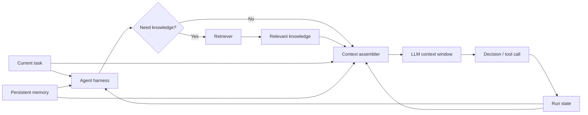

# Context Windows, Memory, and Retrieval: Three Different Problems

## Executive Summary

An agent does **not** need to remember everything. It needs the **right information at the right time**.

- **Context window** — information visible to the model for one inference.
- **Memory** — information intentionally persisted across turns or runs.
- **Retrieval** — fetching relevant information from an external source when needed.

The architecture rule is simple: **context is the working set, memory is persisted information, retrieval is a lookup mechanism.** A good agent harness assembles these into a small, task-specific context instead of continuously growing the prompt.

## Why This Matters

Long-running coding and migration agents accumulate source files, tool results, conversation history, rules, and test logs. Copying all of that into every model request increases cost and latency and can bury the information that matters.

A large context window increases capacity; it does not remove the need for context engineering.

## Simple Mental Model

Think of an architect working at a desk.

- **Context window = desk:** documents currently visible.
- **Memory = notebook:** important facts and decisions retained for later.
- **Retrieval = filing system:** find a relevant document when it is needed.

Making the desk larger does not mean the entire company archive belongs on it.

## Core Components

| Component | Purpose | Lifetime |
| --- | --- | --- |
| Context window | Information supplied to the current model call | One inference |
| Run state | Current task, progress, intermediate results | One run/thread |
| Long-term memory | Persisted facts, preferences, decisions | Across runs |
| Retrieval | Find relevant external knowledge | On demand |
| Context assembler | Select what enters the next model call | Every step |

## Request Flow



The important boundary is between **storage** and **selection**. The model receives selected information, not everything stored by the system.

## Structured State Before Chat History

For a migration agent, the current phase, flow, selected pattern, generated files and latest build result should normally be structured state.

```python
from dataclasses import dataclass, field

@dataclass
class MigrationState:
    run_id: str
    phase: str
    current_flow: str
    selected_patterns: dict[str, str] = field(default_factory=dict)
    generated_files: list[str] = field(default_factory=list)
    latest_build_error: str | None = None
```

The harness can checkpoint this state and inject only fields needed for the next step. This is more reliable than expecting the model to reconstruct execution state from a long transcript.

## Long-Term Memory

Persist information only when it deserves to survive the current run. Good candidates include approved architectural decisions, repository conventions, team preferences, confirmed migration mappings, and stable environment facts.

Raw compiler logs, every tool response, speculative model statements, and information easily obtained from an authoritative source usually do not belong in long-term memory.

A useful test is: **if this fact disappeared after the run, would the next run become meaningfully worse?**

## Retrieval

Retrieval answers: **where can the agent obtain information when it needs it?**

For migration automation, approved connector mappings may live in a migration knowledge base. Retrieve the relevant mapping when the connector is encountered instead of storing every mapping in model context or memory.

```python
def retrieve_patterns(connector_type: str, store) -> list[str]:
    query = f"approved migration pattern for {connector_type}"
    return store.search(query=query, top_k=4)
```

Retrieval can use semantic search, keyword search, SQL, graph traversal, repository search, or a normal API. **Retrieval is broader than vector databases.**

## Context Assembly

The harness brings these mechanisms together.

```python
def build_context(state, recent_messages, retrieved_docs):
    messages = [
        {
            "role": "system",
            "content": (
                "You are a migration agent. Follow approved patterns and "
                "validate before completion."
            ),
        },
        {
            "role": "user",
            "content": f"Current task: migrate {state.current_flow}",
        },
    ]

    if state.latest_build_error:
        messages.append({
            "role": "system",
            "content": "Latest build error:\n" + state.latest_build_error[-4000:],
        })

    for doc in retrieved_docs[:4]:
        messages.append({
            "role": "system",
            "content": "Approved reference:\n" + doc[:6000],
        })

    messages.extend(recent_messages[-6:])
    return messages
```

Notice what is absent: the complete repository, all old logs, the full conversation, and the entire knowledge base.

## Concrete Migration Example

Suppose the agent is migrating an SFTP integration.

**Run state** says the pipeline is in the execute phase and the current component is `invoice-sftp`.

**Long-term memory** records an approved project decision to use Spring Integration for file-oriented integrations.

**Retrieval** finds the organization's approved Mule SFTP → Spring Integration migration pattern.

**Current context** contains only the component semantics, that approved decision, the retrieved pattern, relevant generated files, and the latest test result.

The LLM reasons from a small authoritative working set rather than everything the agent has ever seen.

## Memory vs RAG

RAG primarily brings external knowledge into the current generation. Memory primarily retains information from previous interaction or execution. They may use similar infrastructure, but their semantics differ.

```text
RAG:     What does our SFTP migration guide say?
Memory:  Which SFTP strategy did this team approve?
State:   Which component am I migrating now?
Context: What should the model see for this step?
```

Keeping these concepts separate makes storage, retention, security, and evaluation much clearer.

## Context Reduction Techniques

Start simple:

1. Keep only recent messages.
2. Store structured state outside the prompt.
3. Truncate verbose tool output.
4. Retrieve source material on demand.
5. Summarize older trajectory sections only when necessary.
6. Cache stable prompt prefixes where supported.
7. Split large tasks into explicit phases with checkpoints.

Do not automatically summarize everything. Summaries can lose details and introduce errors.

## Common Mistakes and Failure Modes

### Treating chat history as memory
Important execution facts should become structured state or explicit memory.

### Saving everything to a vector database
IDs, workflow status, approvals, and exact mappings often belong in relational, document, or key-value storage.

### Retrieving too much
More chunks can reduce quality because irrelevant information competes for attention.

### Storing model speculation as fact
Memory writes need policy and validation.

### Missing provenance
Retained knowledge should keep source, version/timestamp, scope, and validation status.

### Stale memory overriding authoritative systems
Retrieve authoritative data again rather than allowing memory to become a competing system of record.

### Weak isolation
Scope memory and retrieval by user, project, tenant, and authorization domain.

## Enterprise Use Cases

- coding assistants retaining repository conventions while retrieving source and architecture docs
- migration agents retaining approved transformation decisions while retrieving current patterns
- architecture assistants retrieving standards and ADRs
- incident assistants combining current telemetry with previous incident knowledge
- long-running workflow agents resuming from checkpoints

## Practical Storage Choices

| Information | Good default |
| --- | --- |
| Workflow state | SQL, document DB, or checkpoint store |
| Exact facts and mappings | SQL or key-value store |
| Semantic knowledge | Vector or hybrid search |
| Source code | Repository + code search/index |
| Large artifacts | Object storage + metadata |

## Cloud Mapping

| Concern | AWS | Azure | GCP |
| --- | --- | --- | --- |
| Structured state | DynamoDB / Aurora | Cosmos DB / Azure SQL | Firestore / Cloud SQL |
| Artifacts | S3 | Blob Storage | Cloud Storage |
| Retrieval | Bedrock Knowledge Bases / OpenSearch | Azure AI Search | Vertex AI Search / vector-capable data services |

## Java and Go Notes

**Java:** keep typed agent state independent of provider-specific chat messages. Put retrieval behind an interface so search, SQL, and API implementations can be swapped.

**Go:** use explicit state structs and store interfaces, and pass `context.Context` for cancellation and lifecycle. Avoid using provider chat-message structures as the application's domain state.

## 30–60 Minute Exercise

Take the simple coding assistant from the earlier lesson and create four information buckets:

```text
RUN STATE
- task
- changed files
- test status

LONG-TERM MEMORY
- repository conventions
- approved coding decisions

RETRIEVABLE KNOWLEDGE
- source files
- architecture docs
- API documentation

CURRENT CONTEXT
- current task
- relevant files
- latest test failure
- 3–5 recent messages
```

Then implement a Python `build_context()` function with at least two hard limits, such as a maximum of four retrieved documents and 4,000 characters of test output. The goal is not to build a vector database; it is to make **information lifecycle and selection explicit**.

## What to Learn Next

Next: **Guardrails and Approvals** — separating model guidance, deterministic policy, tool authorization, output validation, and human approval.

## Reading

1. LangGraph — Memory: https://docs.langchain.com/oss/python/langgraph/add-memory
2. LangChain — Short-term memory: https://docs.langchain.com/oss/python/langchain/short-term-memory
3. LangChain — Long-term memory: https://docs.langchain.com/oss/python/langchain/long-term-memory
4. Anthropic — Contextual Retrieval: https://www.anthropic.com/news/contextual-retrieval
5. Google ADK — Sessions and Memory: https://google.github.io/adk-docs/sessions/
