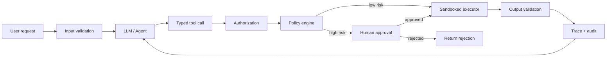

# Guardrails and Approvals: Keep Authority Outside the Model

## Executive Summary

An enterprise agent should be allowed to **reason broadly but act narrowly**. The LLM may propose an action, but deterministic software should decide whether that action is valid, authorized, safe to execute automatically, or requires human approval.

The useful architecture is not one giant "guardrail." It is a stack: **input validation → tool schema → authorization → policy → approval → sandbox/execution limits → output validation → audit**.

## Why This Matters

Once an agent can call APIs, modify code, update customer data, or run migration tools, prompt instructions alone are not a security boundary. A model can misunderstand instructions, receive malicious retrieved content, or simply make a bad decision.

> The model proposes intent. Deterministic controls grant authority.

## Simple Mental Model

Think of the LLM as an employee making requests inside an enterprise system. The employee can ask to run a parity test or apply a patch, but IAM, policy, workflow approval, and the execution platform decide whether the request actually happens.

A **guardrail** constrains or validates agent behavior. An **approval** deliberately pauses execution until a trusted human or external authority authorizes a specific proposed action.

## Core Components and Request Flow



Policy runs **after the model proposes an action but before the side effect occurs**.

## Five Layers of Guardrails

### 1. Input guardrails
Validate user-controlled input before it becomes trusted agent state. Retrieved documents and tool results must also remain untrusted data.

### 2. Structured tool contracts
Prefer `run_tests(profile="unit")` over a generic `run_shell(command="...")`. Schemas constrain shape; they do not prove authorization.

### 3. Authorization
Authorization asks: **May this caller/agent perform this capability on this resource?** Base this on authenticated identity, delegated permissions, resource scope, environment, and task—not model-generated text.

### 4. Policy
Policy asks: **Given that the action is authorized, may it execute automatically under these conditions?** An agent may be allowed to edit files while policy requires approval for a 20+ file change.

### 5. Human approval
Use approval for high-impact, ambiguous, or irreversible actions. Bind it to the exact action and arguments, not a vague "allow the agent to continue."

## Concrete Example: Migration Agent Policy

```python
from dataclasses import dataclass
from enum import Enum

class Decision(Enum):
    ALLOW = "allow"
    APPROVAL = "approval"
    DENY = "deny"

@dataclass
class Principal:
    user_id: str
    roles: set[str]

@dataclass
class Action:
    tool: str
    changed_files: int = 0
    deletes_public_api: bool = False
    environment: str = "workspace"

def evaluate_policy(principal: Principal, action: Action) -> Decision:
    if action.environment == "production":
        return Decision.DENY
    if action.tool == "apply_migration_patch":
        if "migration-editor" not in principal.roles:
            return Decision.DENY
        if action.deletes_public_api or action.changed_files > 20:
            return Decision.APPROVAL
    return Decision.ALLOW
```

The harness owns enforcement:

```python
decision = evaluate_policy(principal, action)
if decision is Decision.DENY:
    raise PermissionError("action denied by policy")
if decision is Decision.APPROVAL:
    checkpoint(state)
    raise ApprovalRequired(action)
result = sandbox.execute(action)
```

The LLM cannot override this by claiming the operation is safe.

## Make Approval Specific and Replay-Safe

```python
@dataclass
class ApprovalRequest:
    action_id: str
    run_id: str
    tool: str
    arguments_hash: str
    reason: str
    expires_at: str
```

When execution resumes, recompute the arguments hash. If the proposed action changed after approval, require a new approval.

## Risk-Tier the Tools

| Risk | Examples | Default handling |
| --- | --- | --- |
| Read-only | search code, read docs | automatic |
| Reversible workspace write | generated file, draft update | automatic with limits |
| Significant write | large patch, delete file, contract change | approval |
| External side effect | push commit, create PR, update business system | explicit authorization + policy/approval |
| Production/destructive | deploy, delete production data, rotate secrets | separate privileged workflow |

## Guardrails for Retrieved Content

Agentic RAG creates another trust boundary. Treat retrieved text as **data, not authority**. Keep system policy separate, restrict tool availability, validate side effects, and never let retrieved content dynamically expand permissions.

## Output Guardrails

Validate what can be checked deterministically: schema correctness, required fields, paths, compiler/build result, secret/PII rules, business invariants, patch size, and API compatibility. Semantic quality still needs evals.

## Guardrails vs Evals

**Guardrail:** Should this action be allowed right now?

**Eval:** How well does the agent behave across representative cases?

A policy can block production deployment while an eval measures whether the agent selects the right migration pattern. You need both.

## Framework Support

Frameworks can help with pause/resume and hooks, but they should not own your enterprise authorization model. LangGraph interrupts, for example, can pause execution, persist state, and resume with external input. Keep business policy reusable so changing orchestration frameworks does not rewrite your security model.

## Enterprise Use Cases

This pattern is especially important for coding agents, modernization, customer-service write APIs, financial workflows, infrastructure agents, data-access agents, and security automation.

For migration automation: discovery is read-only; planning writes artifacts; execution writes a sandbox/workspace; large/destructive diffs require approval; parity tests are automatic; repository push/PR is separately authorized.

## Java and Go Notes

**Java:** model policies as typed records/enums and enforce them in a service/interceptor before tool invocation. Integrate IAM at the executor boundary.

**Go:** keep policy evaluation pure where possible, pass authenticated principal/context separately from model arguments, and use `context.Context` for cancellation/deadlines.

For larger policy estates, consider an external policy engine such as Open Policy Agent instead of scattering conditionals throughout agent code.

## Cloud Mapping

AWS IAM/Verified Permissions, Azure Entra ID and authorization controls, and Google Cloud IAM can establish identity and resource permissions. Human approval usually fits better in your workflow/control-plane layer than inside the LLM provider.

## Common Mistakes and Failure Modes

1. Using the system prompt as a security boundary.
2. Giving a generic shell/API tool broad credentials.
3. Letting model arguments carry identity.
4. Approval without checkpointing.
5. Approval that is too broad.
6. Guarding only user input while trusting retrieval/tool output.
7. Approving every action and creating approval fatigue.
8. Confusing safety with quality; guardrails do not replace evals.

## 30–60 Minute Exercise

Add a policy gate to the coding/migration harness. Implement `read_file`, `apply_patch`, and `push_commit`. Make reads automatic; allow patches automatically up to 20 changed lines and require approval above that; always require approval for pushes. Add an `action_id` and arguments hash, checkpoint before pausing, and write five tests covering allow, approval, deny, changed arguments after approval, and expired approval.

The goal is to make **authority deterministic and testable**.

## What to Learn Next

Next: **Observability and Tracing for Agents**—tracing model calls, retrieval, tool execution, state transitions, approvals, latency, token usage, and failures as one end-to-end trajectory.

## Reading

1. LangGraph — Interrupts and human-in-the-loop: https://docs.langchain.com/oss/python/langgraph/interrupts
2. Open Policy Agent documentation: https://www.openpolicyagent.org/docs/
3. OWASP Top 10 for LLM Applications: https://genai.owasp.org/llm-top-10/
4. Google Secure AI Framework: https://saif.google/
5. NIST AI Risk Management Framework: https://www.nist.gov/itl/ai-risk-management-framework
