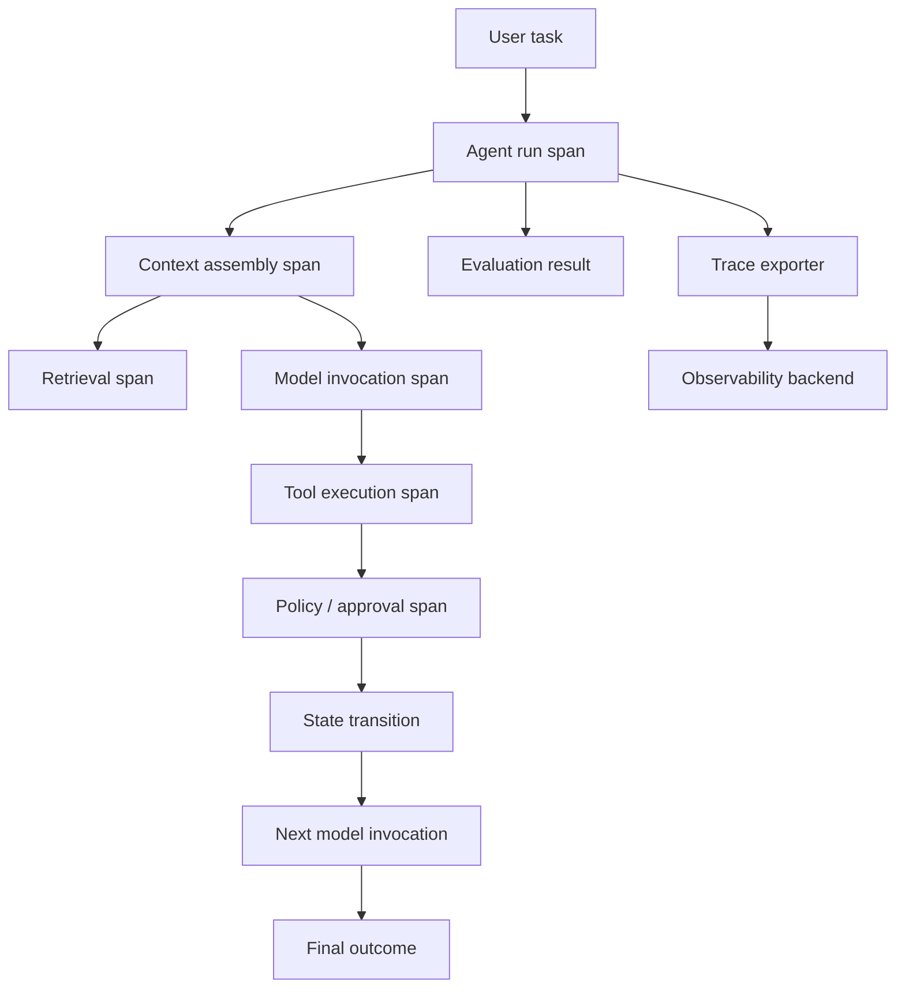

# Observability and Tracing for AI Agents: See the Whole Trajectory

## Executive Summary

Traditional application monitoring tells you that an API took 18 seconds. Agent observability should tell you **why**: retrieval took 300 ms, the first model call selected a tool, the tool failed, the harness retried, the second model call used 12K input tokens, and a human approval paused execution for 11 seconds.

The useful unit is therefore not one LLM call. It is the **agent trajectory**: the ordered sequence of decisions, model calls, retrievals, tool executions, state transitions, retries, approvals, and outcomes that produced the result.

OpenTelemetry is increasingly useful here because GenAI semantic conventions provide common attributes for models, token usage, agents, workflows, conversations, and retrieval. The architectural goal is not to log everything; it is to create a correlated trace that lets engineering teams answer: **what happened, where did time/cost go, why did the agent choose this path, and did the run achieve the intended outcome?**

## Why This Matters

A normal service is largely deterministic: request A follows code path B. An agent is different because the model can choose different tools and paths for similar requests.

Consider a migration agent asked to migrate one Mule flow. Run 1 succeeds in six steps. Run 2 takes sixteen steps and produces the wrong connector configuration. CPU and HTTP dashboards may look healthy in both runs.

Without trajectory-level telemetry you cannot easily distinguish:
- bad retrieval from bad reasoning
- model latency from tool latency
- one expensive prompt from repeated unnecessary model calls
- tool failure from harness retry behavior
- a policy denial from a model error
- successful completion from a plausible-looking final answer

Observability is therefore part of the **agent control plane**, not merely an operations add-on.

## Simple Mental Model

Think of an agent run as a distributed transaction whose participants include an LLM, retriever, tools, sandbox, policy engine, and sometimes a human.

A **trace** represents the complete run. A **span** represents one meaningful operation inside it. Attributes describe the operation. Metrics aggregate behavior across many runs. Logs preserve detailed events that need investigation.

```text
Trace = one agent run
Span  = one meaningful operation
Attribute = searchable metadata about that operation
Metric = aggregated operational signal
Log = detailed event correlated to the trace
```

Do not equate tracing with storing prompts. You can trace latency, model, tool name, token counts, status, document IDs, policy decisions, and evaluation results while deliberately excluding sensitive prompt and response content.

## Core Components and Request Flow



A practical trace hierarchy might look like:

```text
agent.run migration-flow-123
├── context.build
│   └── retrieval migration-patterns
├── gen_ai.chat model-call-1
├── tool inspect_mule_flow
├── gen_ai.chat model-call-2
├── tool write_generated_file
├── tool run_build
├── gen_ai.chat model-call-3
├── tool run_parity_test
└── eval task_success
```

The parent-child relationship is important because it reconstructs the trajectory without requiring you to infer ordering from unrelated log lines.

## What Should You Capture?

Capture enough information to answer engineering questions, but avoid uncontrolled high-cardinality or sensitive data.

### Run-level attributes

```text
agent.name
agent.version
workflow.name
run.id
session.id
environment
release.version
outcome
```

### Model-call attributes

OpenTelemetry GenAI conventions define common concepts such as model/provider, input/output token usage, finish reason, agent/workflow identity, and conversation identity.

Useful operational fields include:

```text
gen_ai.provider.name
gen_ai.request.model
gen_ai.usage.input_tokens
gen_ai.usage.output_tokens
gen_ai.response.finish_reasons
```

### Retrieval attributes

Record retriever/index identity, query strategy, document IDs and relevance scores, result count, and latency. Do not automatically store entire retrieved documents in telemetry.

### Tool attributes

Record tool name/version, policy decision, latency, status, retry count, sandbox ID, and exit code. Tool arguments and results may contain source code, credentials, customer data, or PII, so full payload capture should be governed and opt-in.

## Concrete Example: Trace a Migration Agent

Suppose the task is:

> Migrate `customer-update.xml` to Spring Boot and validate behavioral parity.

The final answer says migration succeeded, but the run took 42 seconds instead of the normal 12 seconds.

```text
agent.run                           42.1 s
├── retrieval patterns              0.4 s
├── model call 1                    2.7 s   4,100 input tokens
├── inspect_mule_flow               0.2 s
├── model call 2                    3.1 s   7,800 input tokens
├── write_generated_file            0.1 s
├── run_build                       8.9 s   FAILED
├── model call 3                    3.4 s  13,200 input tokens
├── write_generated_file            0.1 s
├── run_build                       9.2 s   PASSED
├── run_parity_test                13.8 s   PASSED
└── eval task_success               PASS
```

You now know the slowdown was not simply "the LLM." A failed build caused another reasoning/edit cycle, and parity testing dominated the final portion. The third model call also had unusually large context, which is worth investigating.

## Minimal Python Instrumentation

Start with OpenTelemetry at the harness boundary. Instrument business-level operations even if your model SDK later adds automatic GenAI instrumentation.

```python
from opentelemetry import trace

tracer = trace.get_tracer("migration-agent")


def run_migration(task, agent):
    with tracer.start_as_current_span("agent.run") as run_span:
        run_span.set_attribute("agent.name", "mule-migration-agent")
        run_span.set_attribute("workflow.name", "mule-to-spring")
        run_span.set_attribute("migration.flow_id", task.flow_id)

        with tracer.start_as_current_span("retrieval.migration_patterns") as span:
            patterns = agent.retrieve_patterns(task)
            span.set_attribute("retrieval.document_count", len(patterns))

        with tracer.start_as_current_span("agent.model_decision") as span:
            decision = agent.decide(task, patterns)
            span.set_attribute("agent.decision", decision.action)

        with tracer.start_as_current_span(f"tool.{decision.action}") as span:
            result = agent.execute(decision)
            span.set_attribute("tool.status", result.status)
            span.set_attribute("tool.retry_count", result.retry_count)

        run_span.set_attribute("agent.outcome", result.status)
        return result
```

Production instrumentation should use standard GenAI semantic conventions where available instead of inventing duplicate attributes, propagate trace context across remote tool/sandbox calls, and export through an OpenTelemetry Collector.

## Add Model Token and Latency Signals

```python
import time
from opentelemetry import trace

tracer = trace.get_tracer("agent-model")


def invoke_model(client, messages, model):
    started = time.perf_counter()

    with tracer.start_as_current_span("gen_ai.chat") as span:
        span.set_attribute("gen_ai.request.model", model)
        response = client.invoke(messages=messages, model=model)
        span.set_attribute("gen_ai.usage.input_tokens", response.usage.input_tokens)
        span.set_attribute("gen_ai.usage.output_tokens", response.usage.output_tokens)
        span.set_attribute("app.model_latency_ms", (time.perf_counter() - started) * 1000)
        return response
```

Prefer official provider/OpenTelemetry instrumentation when it correctly emits the conventions. Manual wrappers are most useful for your own harness-level semantics.

## Traces, Metrics, and Logs Have Different Jobs

**Traces** answer: what happened during this particular run?

**Metrics** answer: how is the system behaving across thousands of runs?

Useful metrics include `agent_run_duration`, `agent_success_rate`, `tool_error_rate`, `model_calls_per_run`, `tokens_per_successful_run`, `approval_rate`, `retry_rate`, `retrieval_latency`, and `parity_test_failure_rate`.

**Logs** answer: what detailed event or diagnostic record should I inspect? Correlate logs with trace/span IDs so you can move from an aggregate alert to a run and then to its detailed evidence.

## Observability Is Not Evaluation

**Observability** captures what happened. **Evaluation** judges whether it was good.

A trace may show retrieved document IDs, the tool sequence, and latency. An evaluator can add retrieval relevance, trajectory correctness, behavioral parity, and policy compliance scores.

The strongest architecture connects them: production traces become candidate eval cases, and eval scores become searchable attributes associated with runs.

## Privacy and Security

OpenTelemetry explicitly warns that GenAI input/output messages, system instructions, and retrieval queries may contain sensitive information.

A sensible default is to capture model/provider/token counts, tool name/status/latency, document IDs/scores, and policy outcomes, while excluding full prompts, responses, retrieved text, secrets, and credentials. If content capture is enabled for debugging, sample it, redact before export, restrict access, and use short retention.

## Common Mistakes and Failure Modes

1. **Logging only the final answer.** You lose the trajectory, where many agent failures originate.
2. **Treating each model call as an independent trace.** Use one parent run correlating retrieval, tools, model calls, approvals, and evaluation.
3. **Capturing every prompt and tool payload.** This creates privacy, security, cost, and retention problems.
4. **Inventing provider-specific telemetry everywhere.** Prefer common semantic conventions plus domain-specific attributes where necessary.
5. **No stable agent/workflow version.** Regressions become difficult to attribute.
6. **Measuring latency but not outcome.** A fast incorrect migration is not healthy.
7. **High-cardinality metric labels.** Run IDs, prompts, file paths, and user IDs belong in traces/logs, not metric labels.

## Enterprise Use Cases

Agent tracing is particularly valuable for migration and modernization pipelines, coding assistants, RAG/research agents, customer-service agents with tool access, approval-heavy workflows, incident investigation, CI repair agents, and multi-step API orchestration.

For migration automation, trace each canonical phase (`discover`, `normalize`, `plan`, `execute`, `review`, `parity-test`) as a span or nested workflow operation. This makes phase-level reliability, cost, and latency measurable across an entire portfolio.

## Java and Go Notes

**Java:** use the OpenTelemetry Java SDK/agent for infrastructure instrumentation, then add manual spans around harness state transitions, tool dispatch, retrieval, and evaluation boundaries. Avoid putting source code or customer payloads into span attributes.

**Go:** use `go.opentelemetry.io/otel` and propagate `context.Context` through the harness and tool interfaces. Losing context breaks parent-child correlation across goroutines and remote tool calls.

## Cloud Mapping

Keep the architecture vendor-neutral: Agent/Harness → OpenTelemetry SDK → OTLP → OpenTelemetry Collector → AWS, Azure Monitor/Application Insights, Google Cloud Observability, or another backend. Keep agent-specific semantic instrumentation in the application/harness rather than coupling it to one cloud dashboard.

## Hands-On Exercise: Instrument One Agent Run

Spend 30–60 minutes instrumenting the simple coding assistant or migration-agent loop from earlier lessons.

1. Create one root `agent.run` span.
2. Add child spans for context building, one model call, one tool call, and validation.
3. Record model name, token counts, tool status, retry count, and final outcome.
4. Do **not** record prompt or source-code content.
5. Run one successful case and one failing case.
6. Compare the span trees and identify exactly where the failing trajectory diverged.

Bonus: calculate `tokens_per_successful_run`. This connects cost to outcome and is often more useful than raw token consumption.

## What to Learn Next

Next, move from observing **one agent trajectory** to deciding when work should be split across **multiple agents**. The key question is not "how do I create more agents?" but **when does role separation genuinely improve control, context isolation, or parallelism enough to justify the coordination cost?**

## Reading

1. [OpenTelemetry — Inside the LLM Call: GenAI Observability with OpenTelemetry](https://opentelemetry.io/blog/2026/genai-observability/)
2. [OpenTelemetry — GenAI Semantic Conventions](https://opentelemetry.io/docs/specs/semconv/registry/attributes/gen-ai/)
3. [OpenTelemetry — Semantic Conventions](https://opentelemetry.io/docs/specs/semconv/)
4. [LangSmith — Observability Concepts](https://docs.langchain.com/langsmith/observability-concepts)
5. [OpenTelemetry — Trace Semantic Conventions](https://opentelemetry.io/docs/specs/semconv/general/trace/)
