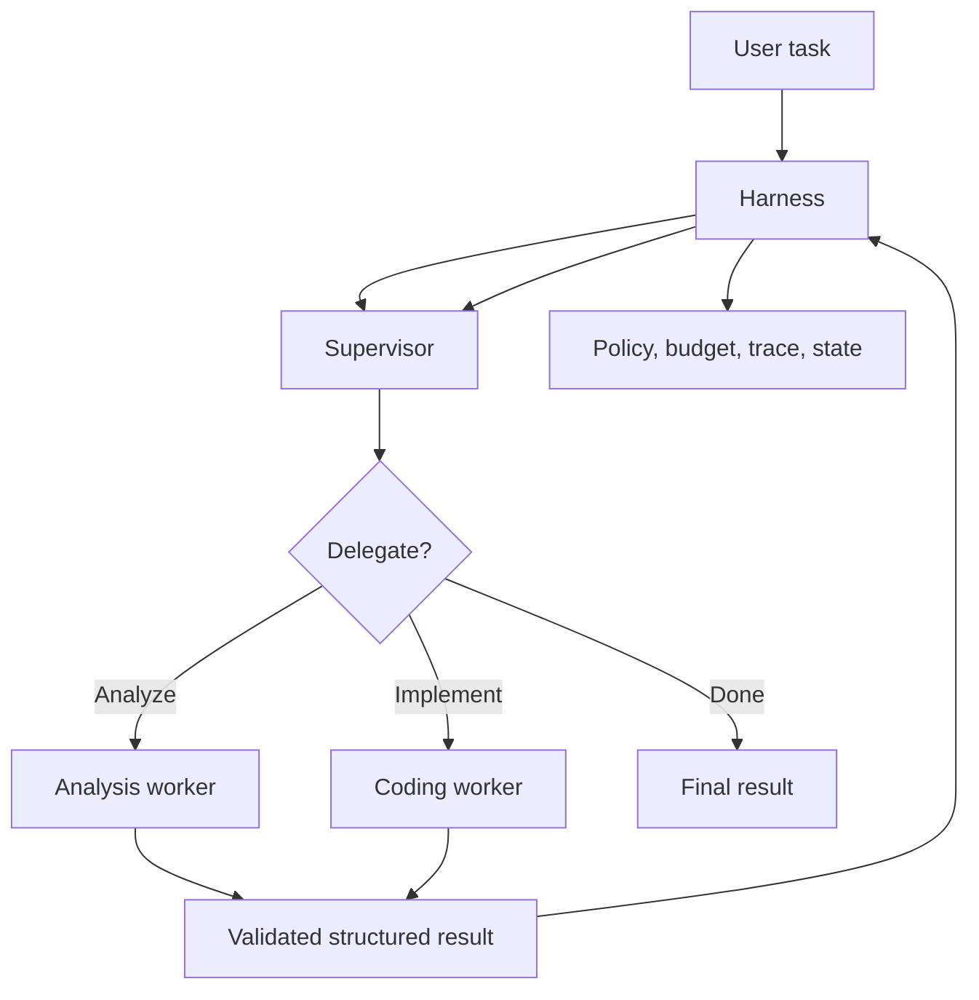

# Multi-Agent Patterns: When More Than One Agent Actually Helps

## Executive Summary
A multi-agent system uses more than one model-driven agent to complete a task. The key design rule is: **do not split one capable agent into many unless the split creates a useful architectural boundary**.

Good reasons include specialized context, different permissions, independent review, or safe parallel work. For most enterprise workflows, begin with one agent, typed tools, and deterministic orchestration; add another agent only when you can state exactly what problem it solves.

## Why This Matters
Multi-agent designs resemble human teams, but every added agent creates another model call, context boundary, failure mode, latency source, and coordination problem. In migration automation, discovery, planning, execution, and testing do not automatically need separate agents; many are better represented as deterministic workflow stages.

## Simple Mental Model
Think of an engineering team. One senior engineer can inspect code, edit it, run tests, and review results with different tools. Add another specialist only for a reason: different expertise, access rights, independent review, separate context, or parallel work.

## Important Terms
- **Agent:** model-driven component that chooses actions, often through tools.
- **Supervisor:** agent or controller that delegates bounded tasks.
- **Worker:** specialized agent performing one bounded responsibility.
- **Handoff:** transfer of responsibility and structured state.
- **Shared state:** authoritative workflow information available across steps.
- **Orchestration:** logic deciding who runs, when, and when execution ends.

## Core Patterns
| Pattern | Best fit |
| --- | --- |
| Sequential handoff | Distinct stages requiring different expertise |
| Supervisor-worker | Dynamic routing to specialists |
| Parallel workers | Independent analysis that can safely be merged |
| Producer-reviewer | Independent quality or policy checking |

Avoid unconstrained agent-to-agent conversation as the default enterprise architecture.

## Request Flow


The harness still owns execution control, policy, state, and termination.

## When One Agent Is Better
Stay with one agent when the same context, tools, and permissions apply; tasks are short and sequential; and tool feedback is sufficient. A flow such as `inspect → edit → compile → revise → test` is normally one coding agent with tools, not five agents.

## When Multiple Agents Help
### Independent review
A coding agent generates an implementation. A separate reviewer receives source semantics, acceptance rules, the generated diff, and test evidence, then checks parity independently.

### Context isolation
A security reviewer may need policies and a diff, while the coding agent needs source files and compiler errors. Separate contexts reduce irrelevant tokens and unnecessary data exposure.

### Permission isolation
An analysis worker can be read-only while an implementation worker writes only to an isolated workspace.

### Safe parallelism
Independent applications or modules can be analyzed concurrently and their structured results merged later.

## Concrete Migration Example
```python
from dataclasses import dataclass

@dataclass
class ReviewResult:
    approved: bool
    issues: list[str]

def migrate(component, coder, reviewer):
    generated = coder.run({
        "source_semantics": component.semantics,
        "migration_rules": component.rules,
    })

    build = run_in_sandbox(generated.files)
    if not build.passed:
        return {"status": "build_failed", "errors": build.errors}

    review: ReviewResult = reviewer.run({
        "source_semantics": component.semantics,
        "migration_rules": component.rules,
        "generated_diff": generated.diff,
        "test_results": build.tests,
    })

    if not review.approved:
        return {"status": "review_failed", "issues": review.issues}

    return {"status": "ready_for_human_review"}
```

Orchestration remains deterministic. The second agent is introduced only where independent semantic judgment adds value.

## Use Structured Handoffs
Agent-to-agent integration should resemble an API contract rather than an open-ended conversation. Pass identifiers, relevant evidence, acceptance criteria, and bounded artifacts. Return typed results such as `approved`, `issues`, `severity`, and `evidence`.

Keep authoritative workflow state outside individual agents. Each agent receives a projection of that state, and the harness decides which structured outputs are merged back.

## Common Mistakes
- **Agent per workflow step:** use normal functions or workflow nodes where reasoning is unnecessary.
- **Shared chat as protocol:** prefer typed handoff contracts.
- **No termination rule:** set revision, time, token, and cost budgets.
- **Supervisor with unlimited authority:** keep authorization in deterministic policy.
- **Correlated review:** give reviewers evidence and criteria, not the producer's internal reasoning.
- **Parallel writes:** isolate workspaces and use explicit merge rules.

## Enterprise Use Cases
Useful cases include independent code generation/review, isolated security or compliance review, parallel modernization analysis, specialist routing across technical domains, and independent incident hypotheses. Multi-agent architecture is less compelling for simple tool-calling assistants or deterministic pipelines.

## Practical Implementation Guidance
Start with ordinary Python interfaces and typed Pydantic request/result models. Add per-agent tool allow-lists, separate context builders, trace propagation, budgets, deterministic merge logic, and evaluation of both worker output and handoff quality.

In Java, model agents as typed services and keep orchestration in a workflow layer. In Go, use explicit interfaces and structs; use `context.Context` for cancellation and deadlines, and concurrency only for genuinely independent tasks.

## Evaluation Strategy
Evaluate three levels: worker quality, handoff quality, and complete system outcome. Track task success, handoff validity, unnecessary delegation, reviewer defect detection, revision count, total model calls, latency, cost, and policy violations.

A five-agent design that performs like one agent but costs several times more is not an architectural improvement.

## 30–60 Minute Exercise
Take a coding or migration agent and add exactly one reviewer agent. Define typed `ImplementationResult` and `ReviewResult` contracts, keep contexts separate, give the reviewer read-only capabilities, require evidence for every issue, permit at most one automatic revision, and trace both calls under one run ID. Compare defect detection, latency, and token use against self-review by the original agent.

## What to Learn Next
Next: **planning**—when an agent should dynamically create or revise a plan, how this differs from a deterministic workflow, and how to keep planning from becoming uncontrolled execution.

## Reading
1. Google ADK — Multi-Agent Systems: https://google.github.io/adk-docs/agents/multi-agents/
2. Microsoft AutoGen — AgentChat: https://microsoft.github.io/autogen/stable/user-guide/agentchat-user-guide/index.html
3. LangChain — Multi-agent: https://docs.langchain.com/oss/python/langchain/multi-agent
4. Anthropic — Building Effective Agents: https://www.anthropic.com/engineering/building-effective-agents
5. Semantic Kernel — Agent orchestration: https://learn.microsoft.com/en-us/semantic-kernel/frameworks/agent/agent-orchestration/
