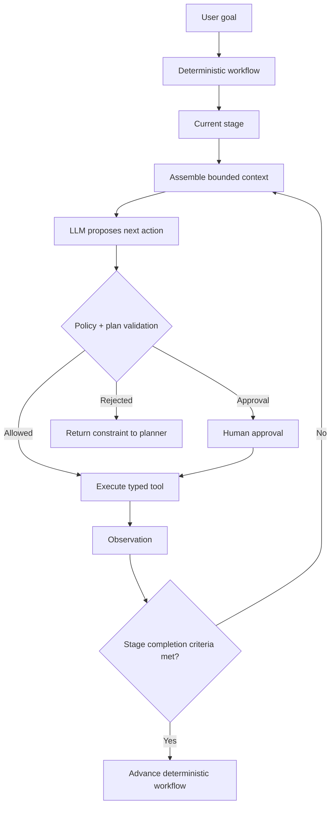

# Agent Planning: Dynamic Plans vs Deterministic Workflows

## Executive Summary
Planning is useful when an agent cannot know every step before it starts. But many enterprise processes do know their major stages, so asking an LLM to plan everything often reduces reliability.

The practical pattern is **deterministic outer workflow + bounded model-driven planning inside selected stages**. Code owns mandatory phases, policies, budgets, approvals, and completion criteria; the model chooses among permitted next actions when the local path is uncertain.

## Why This Matters
After tool use, harnesses, guardrails, observability, and multi-agent patterns, planning is the next important distinction. Without it, teams often make one of two mistakes: encode every possible branch in code, or hand the whole workflow to an LLM.

For migration automation, neither extreme is ideal. `/discover -> /normalize -> /plan -> /execute -> /review -> /parity-test` is largely deterministic. But inside `/execute`, the correct next action may depend on compiler errors, connector type, retrieved migration patterns, and previous attempts.

## Simple Mental Model
Think of a GPS route. A **workflow** is the road network and mandatory checkpoints. A **plan** is the route chosen through that network given current conditions. **Replanning** happens when new evidence makes the current route unsuitable.

The model should not be allowed to invent a new destination or remove mandatory checkpoints. It can choose a route within the boundaries supplied by the harness.

## Key Terms
- **Workflow:** predefined states and transitions controlled by software.
- **Plan:** an ordered or partially ordered set of intended actions toward a goal.
- **Planner:** logic, sometimes an LLM, that proposes those actions.
- **Replanning:** revising the plan after new observations.
- **Executor:** the component that performs an approved action through tools.
- **Completion criteria:** deterministic conditions that define success.

## Three Useful Planning Styles
| Style | Best fit | Main trade-off |
| --- | --- | --- |
| Deterministic workflow | Known business process | Reliable but less adaptive |
| Plan-then-execute | Goal needs several discoverable steps | Clear plan, but plans can become stale |
| ReAct-style step planning | Next action depends heavily on observations | Adaptive, but harder to predict and bound |

For enterprise agents, a **hybrid** is usually strongest: deterministic stage transitions with local model-driven decisions.

## Request Flow


## Concrete Example: Migration Execution
Suppose a Mule flow contains HTTP ingress, DataWeave transformation, Salesforce lookup, and an error handler. The deterministic workflow has already completed discovery and planning.

Inside `/execute`, the agent receives this local goal:

```text
Implement component customer-sync-17 according to approved plan.
Completion requires:
- project compiles
- unit tests pass
- generated files stay inside target module
- no unsupported connector remains unresolved
```

The model might choose:

```text
1. inspect approved migration plan
2. retrieve Salesforce connector pattern
3. generate service adapter
4. run build
5. inspect compiler error
6. revise generated mapping
7. rerun build and tests
8. report stage completion
```

The model chooses tactical steps dynamically. It does **not** decide to skip parity testing, deploy to production, or rewrite the approved architecture.

## Practical Python Pattern
Represent the model's decision as data rather than prose:

```python
from dataclasses import dataclass
from typing import Literal

@dataclass
class PlannedAction:
    tool: Literal[
        "read_plan", "lookup_pattern", "write_file",
        "run_build", "run_tests",
    ]
    reason: str
    arguments: dict

ALLOWED_BY_STAGE = {
    "execute": {
        "read_plan", "lookup_pattern", "write_file",
        "run_build", "run_tests",
    }
}

def validate_action(stage: str, action: PlannedAction) -> None:
    if action.tool not in ALLOWED_BY_STAGE[stage]:
        raise PermissionError(
            f"Tool {action.tool} is not allowed in stage {stage}"
        )
```

Keep the planning loop bounded:

```python
def execute_stage(state, planner, tools, max_steps=12):
    for _ in range(max_steps):
        if completion_criteria_met(state):
            return state

        context = build_planning_context(state)
        action = planner.next_action(context)
        validate_action(state.stage, action)
        enforce_budget(state, action)

        if requires_approval(action):
            checkpoint_and_pause(state, action)

        observation = tools.execute(action.tool, action.arguments)
        state.record(action, observation)
        checkpoint(state)

    raise RuntimeError("planning step budget exhausted")
```

The planner does not own authorization, execution, checkpointing, budgets, or success criteria.

## Plan-Then-Execute vs Step-by-Step Planning
**Plan-then-execute** asks the model to create several steps first. It works well when the task is decomposable and the environment is reasonably stable. It also gives humans something to review before execution.

**Step-by-step planning** asks only for the next action after each observation. It is better when tool results strongly influence what comes next, such as debugging a failed build.

A useful migration pattern is:

```text
human-approved high-level migration plan
        +
model-selected next action during implementation/debugging
```

This separates architectural intent from tactical adaptation.

## When Not to Use LLM Planning
Do not use a planner for steps that are already known and safety-critical: mandatory schema validation, security scanning, artifact signing, approval gates, parity-test execution, deployment policy, and audit logging.

If the next action can be expressed as `if X, do Y`, deterministic code is usually cheaper, faster, and easier to test.

## Common Mistakes and Failure Modes
1. **Planning the entire business process with an LLM.** Mandatory workflow controls become probabilistic.
2. **Treating the generated plan as trusted instructions.** A plan is model output and must be validated like any other model output.
3. **Huge plans created upfront.** Long plans become stale as soon as tools return unexpected evidence.
4. **No completion criteria.** The agent may keep improving or exploring indefinitely.
5. **No step/cost budget.** Replanning can become an expensive loop.
6. **Mixing plan with execution authority.** A proposed dangerous step must not become executable merely because the planner produced it.
7. **Replanning without history.** The model repeats failed actions because the harness did not preserve attempts and observations.

## Enterprise Use Cases
Planning is useful for incident investigation, coding and debugging assistants, migration execution, data-quality remediation, research workflows, complex support resolution, and cloud modernization assessments.

It is less useful for stable approval workflows, compliance gates, deterministic ETL pipelines, and standard deployment pipelines.

## Architecture Guidance
Separate four contracts:

```text
Goal contract       -> what outcome is requested
Planning contract   -> what actions may be proposed
Tool contract       -> what capabilities may execute
Success contract    -> what proves the stage is complete
```

This separation makes planning observable and evaluable. Trace the proposed action, reason, validation result, tool result, retry/replan count, and final outcome.

Useful planning evals include task success rate, unnecessary-tool-call rate, repeated-action rate, average steps to success, policy rejection rate, and recovery rate after a failed tool call.

## Java and Go Notes
**Java:** model planned actions as sealed interfaces or records and validate them before dispatch. Keep orchestration in a state machine or workflow service; do not use reflection to execute arbitrary model-produced method names.

**Go:** use typed action structs plus explicit switch-based dispatch. `context.Context` is a natural place for deadlines and cancellation, while persisted workflow state should remain separate from model conversation history.

## Cloud Mapping
The planner can use a model from AWS Bedrock, Azure AI Foundry/Azure OpenAI, or Google Vertex AI while the workflow/harness remains provider-neutral. Keep state, policy, tools, and planning contracts outside the model-provider SDK where possible.

## 30-60 Minute Exercise
Take one stage of an agentic workflow you know well—for example migration `/execute`.

1. Write the deterministic entry and exit criteria.
2. Define five tools the planner may choose from.
3. Define two tools/actions it must never choose.
4. Implement a `PlannedAction` schema.
5. Write `validate_action()` and a 10-step execution budget.
6. Simulate a failed build and decide what observation the planner needs to choose the next step.

The design is successful if you can clearly point to what is **deterministic** and what is **model-decided**.

## What to Learn Next
Next, study **advanced loop engineering**: stopping conditions, retry taxonomy, context compaction, progress detection, and preventing agents from getting stuck in repetitive tool loops.

## Reading
- [Anthropic — Building Effective Agents](https://www.anthropic.com/engineering/building-effective-agents)
- [LangGraph — Workflows and Agents](https://docs.langchain.com/oss/python/langgraph/workflows-agents)
- [Google ADK — Agents](https://google.github.io/adk-docs/agents/)
- [Microsoft AutoGen — AgentChat](https://microsoft.github.io/autogen/stable/user-guide/agentchat-user-guide/index.html)
- [OpenAI — A Practical Guide to Building Agents](https://openai.com/business/guides-and-resources/a-practical-guide-to-building-ai-agents/)
