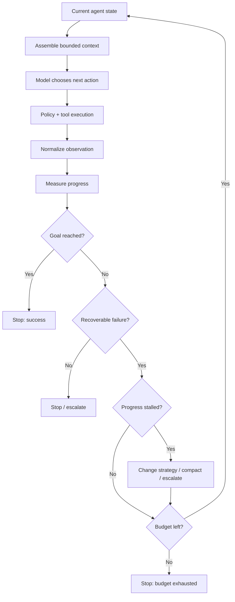

# Advanced Loop Engineering: Making Agents Stop, Recover, and Progress

## Executive Summary
A basic agent loop is easy to write: call the model, execute a tool, feed the result back, and repeat. The difficult part is deciding **when to continue, when to retry, when to change strategy, and when to stop**.

This is **loop engineering**: designing the deterministic control logic around iterative model reasoning so an agent makes measurable progress instead of spinning indefinitely.

A useful rule is: **the model proposes the next action; the harness owns the execution budget and proof of progress.**

## Why This Matters
Production agents fail differently from ordinary request-response applications. A model may repeatedly call the same tool, alternate between two failed approaches, keep expanding context, or interpret a recoverable error as success.

For a migration agent, an uncontrolled loop can regenerate the same Spring Boot file ten times because the compiler error never changes. That wastes tokens and time while creating the appearance of activity.

Loop engineering turns this into explicit software behavior.

## Simple Mental Model
Think of an agent loop as a **control loop**, not a chat loop.

Every iteration should answer four questions:

1. What changed since the previous iteration?
2. Did that change move us closer to the goal?
3. Is the latest failure recoverable?
4. Is another iteration worth its cost and risk?

If you cannot answer those questions, you do not have a reliable loop—you have an unbounded conversation.

## Core Components
- **Iteration** — one model decision plus its resulting action/observation.
- **Budget** — a deterministic limit such as maximum steps, tool calls, elapsed time, or cost.
- **Stop condition** — a rule that ends execution because success, failure, or a limit has been reached.
- **Retry policy** — rules describing which failures may be retried and how.
- **Progress signal** — measurable evidence that state is moving toward completion.
- **Stall detection** — detection of repeated states, actions, or errors.
- **Context compaction** — replacing old detailed history with a smaller summary/state representation.
- **Recovery path** — a deliberate alternative after the current strategy stops making progress.

## Request Flow


## 1. Stop Conditions Should Be Deterministic
Do not rely only on the model saying `done`.

```python
def stop_reason(state) -> str | None:
    if state.validation_passed:
        return "success"
    if state.steps >= 20:
        return "max_steps"
    if state.tool_calls >= 30:
        return "max_tool_calls"
    if state.elapsed_seconds >= 300:
        return "timeout"
    if state.stall_count >= 3:
        return "no_progress"
    if state.permanent_failure:
        return "permanent_failure"
    return None
```

For a migration task, **validation passing** is stronger evidence of completion than a model-generated statement such as “migration complete.”

## 2. Classify Errors Before Retrying
A generic retry loop is dangerous. Different failures need different responses.

| Failure | Example | Response |
|---|---|---|
| Transient | HTTP 503 | retry with backoff |
| Correctable | compiler error | return structured error to model |
| Policy | write outside workspace | deny; do not retry |
| Approval | public API change | pause for human |
| Permanent | missing required source artifact | stop/escalate |
| Repetitive | identical compiler error three times | change strategy or stop |

```python
from enum import Enum

class FailureKind(Enum):
    TRANSIENT = "transient"
    CORRECTABLE = "correctable"
    POLICY = "policy"
    APPROVAL = "approval"
    PERMANENT = "permanent"
    STALLED = "stalled"
```

**Retry the operation only when repeating it can plausibly produce a different result.**

## 3. Detect Progress, Not Activity
Tool calls are activity. They are not necessarily progress.

Useful migration progress signals include fewer compiler errors, more parity tests passing, fewer unmapped components, changed artifacts after corrective action, and improving validation scores.

```python
def progress_score(state) -> float:
    return (
        state.tests_passed * 2.0
        - state.compiler_errors * 1.5
        - state.unmapped_components * 2.0
    )
```

Do not over-engineer the score initially. Even `(compiler_errors, failing_tests)` is better than no progress definition.

## 4. Detect Repetitive Loops
A common failure is `read -> edit -> compile -> same error`, repeated indefinitely.

```python
import hashlib

def fingerprint(text: str) -> str:
    normalized = " ".join(text.split())
    return hashlib.sha256(normalized.encode()).hexdigest()

def is_repeating(history: list[str], latest: str, limit: int = 3) -> bool:
    fp = fingerprint(latest)
    return sum(fingerprint(x) == fp for x in history[-5:]) >= limit
```

A stronger implementation fingerprints **state + action + outcome**, not raw text alone. When repetition is detected, change something structural: retrieve different context, switch tool, roll back, ask for approval, or escalate.

## 5. Compact Context as the Loop Grows
Keep two layers: durable structured state and a short working context.

```text
Durable structured state
  - current phase
  - artifacts
  - decisions
  - unresolved errors
  - approvals
  - progress metrics

Short working context
  - current objective
  - latest relevant files
  - last few actions
  - current failure
```

```python
def working_context(state):
    return {
        "objective": state.current_objective,
        "unresolved_errors": state.errors[:10],
        "relevant_artifacts": state.relevant_artifacts,
        "recent_events": state.events[-6:],
        "progress": state.progress,
    }
```

Explicit state is more robust than treating the transcript as the database.

## 6. Recovery Should Change the Strategy
A retry repeats an operation. A **recovery** changes the plan.

```text
Attempt 1: generate adapter -> compile fails
Attempt 2: fix imports -> same compile failure
Attempt 3: same error fingerprint
Recovery: retrieve reference implementation and re-plan adapter
```

Recovery can retrieve new evidence, revert an edit, reduce scope, switch to diagnostic mode, use a deterministic parser, ask a reviewer agent, or request human input. Give recovery its own small budget.

## Concrete Example: Migration Execution Loop
```python
def execute_component(state, model, tools):
    MAX_ATTEMPTS = 6

    for attempt in range(MAX_ATTEMPTS):
        before = state.progress_tuple()
        action = model.next_action(state.working_context())
        result = tools.execute(action)
        state.record(action, result)

        validation = tools.run_validation()
        state.update_validation(validation)

        if validation.passed:
            return "completed"

        after = state.progress_tuple()

        if state.same_failure_count(validation) >= 3:
            state.recovery_mode = True
            return "replan_required"

        if after >= before:
            state.no_progress_count += 1
        else:
            state.no_progress_count = 0

        if state.no_progress_count >= 2:
            return "replan_required"

    return "attempt_budget_exhausted"
```

In production, expose an explicit progress comparison method rather than relying casually on tuple ordering.

For a staged migration workflow such as `/discover -> /normalize -> /plan -> /validate-plan -> /execute -> /review -> /parity-test`, keep outer stage transitions deterministic. Use bounded agent loops mainly **inside** stages where observations legitimately affect the next action.

## Common Mistakes and Failure Modes
- Only max-steps protection: prevents infinity but detects waste late.
- Model-owned termination: the model can claim success without evidence.
- Retrying permission failures: retries cannot create authority.
- Counting tool calls as progress: activity can hide stalls.
- Keeping the full transcript forever: cost rises and context dilutes.
- Recovery with no strategy change: “try again” is still a retry.
- No idempotency: replay can duplicate side effects.
- One global retry budget: different failure classes have different semantics.

## Enterprise Use Cases
Loop engineering matters in application modernization, incident remediation, cloud configuration, data-quality repair, security investigation, coding assistants, validated document processing, and long-running research agents.

The more expensive or side-effecting the tools, the more important deterministic loop controls become.

## Practical Implementation Guidance
Start with five fields:

```python
@dataclass
class LoopControl:
    step: int = 0
    max_steps: int = 20
    retry_count: dict[str, int] = field(default_factory=dict)
    last_progress: float = 0.0
    stall_count: int = 0
```

Then add, in order: objective success criteria, per-error retry taxonomy, progress metric, repetition fingerprinting, context compaction, recovery transitions, checkpointing/idempotency, and telemetry/evals.

Do not begin with a sophisticated autonomous planner. A well-engineered bounded loop around a few tools is easier to test and often more reliable.

### Java note
Use sealed error types or enums plus a workflow state object. Resilience4j can handle infrastructure retries, but agent-semantic retries belong in harness logic.

### Go note
Represent loop control explicitly in a state struct and use `context.Context` for cancellation/deadlines. Keep semantic retry classification separate from generic HTTP retry middleware.

## Cloud Mapping
Loop engineering belongs mainly in application code. For durable long-running execution, use managed workflow services as the outer reliability boundary when useful:

- **AWS:** Step Functions; Bedrock for model access when appropriate.
- **Azure:** Durable Functions; Azure AI model services.
- **GCP:** Workflows; Vertex AI.

A useful pattern is **durable outer workflow + bounded in-process agent loop**.

## 30–60 Minute Exercise
Take a coding or migration agent loop and add four controls:

1. maximum 8 iterations
2. separate transient and permanent failures
3. detect the same error appearing 3 times
4. stop only when a deterministic validation function returns success

Simulate:

```text
A. transient tool failure -> succeeds on retry
B. compiler error -> improves after model correction
C. identical compiler error repeated 3 times -> replan/escalate
D. model says "done" but tests fail -> continue
```

The exercise is complete when all four outcomes are controlled by code rather than prompt instructions.

## What to Learn Next
Next, study **skill engineering and reusable agent capabilities**: how to package domain instructions, tools, examples, and constraints into reusable capabilities without turning every capability into another agent.

## Reading
1. [LangGraph — Thinking in LangGraph](https://docs.langchain.com/oss/python/langgraph/thinking-in-langgraph)
2. [LangGraph — Durable Execution](https://docs.langchain.com/oss/python/langgraph/durable-execution)
3. [OpenAI — Building Agents](https://platform.openai.com/docs/guides/agents)
4. [Microsoft AutoGen — AgentChat](https://microsoft.github.io/autogen/stable/user-guide/agentchat-user-guide/index.html)
5. [Google ADK — Runtime](https://google.github.io/adk-docs/runtime/)
