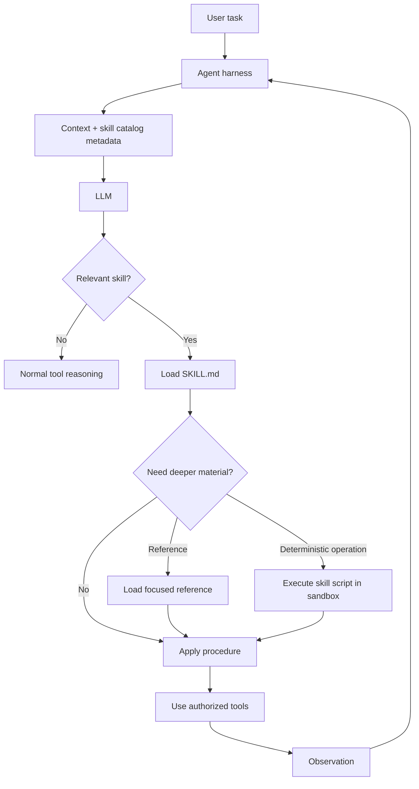

# Skill Engineering: Packaging Reusable Agent Capabilities

## Executive Summary

A **tool** gives an agent an action it can perform. A **skill** teaches the agent *how and when to combine knowledge, instructions, tools, scripts, and resources to perform a specialized task well*.

That distinction matters once an agent grows beyond a few prompts. If every domain rule, example, migration pattern, and operating procedure lives in the system prompt, context becomes expensive and hard to maintain. If every capability becomes a new hard-coded tool, the tool surface becomes too large.

Skill engineering provides a middle layer: package domain expertise into discoverable, reusable modules that are loaded only when relevant. Anthropic's Agent Skills formalize this as folders containing a `SKILL.md` plus optional scripts, references, and assets, using **progressive disclosure** so the agent loads detail only when it needs it.

For an enterprise migration accelerator, this is especially useful: `extract_mule_semantics`, `map_error_handling`, `convert_dataweave`, or `generate_spring_route` can each become focused capabilities rather than one enormous migration prompt.

## Why This Matters

A production agent accumulates knowledge quickly: coding conventions, architecture rules, migration patterns, validation procedures, domain terminology, tool usage instructions, examples, and deterministic helper scripts.

Putting everything into the system prompt creates three problems: irrelevant context consumes tokens, unrelated instructions interfere with each other, and domain knowledge becomes difficult to version and test.

A skill lets the harness expose a small description first and load detailed guidance only when the task requires it. The architectural goal is not merely shorter prompts. It is **modular capability management**.

## Simple Mental Model

Think of a skilled engineer with access to four different things:

- **Prompt/instructions** — operating principles they are always told.
- **Tool** — equipment they can operate.
- **Skill** — a playbook explaining how to solve a particular class of problems, including procedures, examples, references, and helper automation.
- **Workflow** — the larger sequence of stages through which work must progress.

```text
Workflow: /discover -> /normalize -> /plan -> /execute -> /parity-test

Skill: extract_mule_semantics
  teaches how to identify flows, connectors, transformations and error handlers

Tool: read_file(path)
  provides filesystem access

Script: parse_xml.py
  performs deterministic XML extraction
```

The skill may *use* tools and scripts, but it is not itself the execution authority.

## Skill vs Tool vs Prompt vs Agent vs Workflow

| Concept | Primary job | Example |
| --- | --- | --- |
| Prompt | Set general behavior and constraints | "Never claim migration parity without tests" |
| Tool | Provide an executable capability | `read_file`, `run_build` |
| Skill | Package reusable domain procedure and knowledge | `extract_mule_semantics` |
| Agent | Reason and decide what to do next | Migration coding agent |
| Workflow | Control larger deterministic stages | discover → plan → execute → validate |
| Harness | Control state, context, tools, policy and loop | runtime around the migration agent |

A useful rule: **if the question is "what action can the system execute?", think tool. If it is "what specialized procedure should the agent know?", think skill.**

## Progressive Disclosure

The most important skill-design idea is **progressive disclosure**: reveal information in layers rather than injecting everything into context up front.

```text
Level 1: name + description
         always cheap enough for discovery

Level 2: SKILL.md body
         loaded when the skill is selected

Level 3: references / scripts / examples
         loaded or executed only when needed
```

## Request Flow



The harness still owns authorization, sandboxing, state, approvals, limits, and tracing. A skill should not bypass those boundaries.

## Anatomy of a Practical Skill

```text
skills/
  extract_mule_semantics/
    SKILL.md
    references/
      mule-components.md
      error-handling.md
      dataweave.md
    scripts/
      extract_flows.py
      validate_canonical.py
    examples/
      choice-router.md
      until-successful.md
```

A minimal `SKILL.md`:

```markdown
---
name: extract_mule_semantics
description: Extract behavioral semantics from Mule XML into the canonical migration model. Use during discovery when analyzing Mule flows, subflows, connectors, transformations, routing, retries, and error handling.
---

# Goal
Produce a semantic representation of the Mule application. Do not generate target Spring code.

# Procedure
1. Identify flows and subflows.
2. Capture inbound triggers and connector operations.
3. Capture routing and branching semantics.
4. Capture transformation intent.
5. Capture error handling and retry behavior.
6. Record unsupported or ambiguous constructs explicitly.
7. Validate the generated canonical model.

# References
- Read `references/error-handling.md` when error handlers are present.
- Read `references/dataweave.md` only when DataWeave transformations exist.

# Deterministic helpers
Use `scripts/extract_flows.py` for XML structure extraction. Treat its output as evidence, not as the final semantic interpretation.
```

Notice what is deliberately absent: Spring Boot generation rules. Discovery and target generation are different responsibilities.

## Concrete Implementation: Lightweight Skill Loader in Python

```python
from dataclasses import dataclass
from pathlib import Path
import yaml

@dataclass
class Skill:
    name: str
    description: str
    root: Path
    instructions: str

def load_skill(path: Path) -> Skill:
    text = (path / "SKILL.md").read_text(encoding="utf-8")
    if not text.startswith("---"):
        raise ValueError("SKILL.md requires YAML frontmatter")
    _, frontmatter, body = text.split("---", 2)
    metadata = yaml.safe_load(frontmatter)
    return Skill(
        name=metadata["name"],
        description=metadata["description"],
        root=path,
        instructions=body.strip(),
    )

def discover_skills(root: Path) -> list[Skill]:
    return [load_skill(d) for d in root.iterdir()
            if d.is_dir() and (d / "SKILL.md").exists()]

def skill_catalog(skills: list[Skill]) -> str:
    return "\n".join(f"- {s.name}: {s.description}" for s in skills)
```

At startup, inject the compact catalog, not every full skill body. After the model selects a skill, load detailed instructions into the next context assembly. This is progressive disclosure even without a product-specific Skills runtime.

## Deterministic Scripts Inside Skills

Skills become more reliable when they separate **judgment** from **mechanical work**.

Good script candidates include XML parsing, JSON Schema validation, normalization, checksums, dependency extraction, deterministic manifests, and static checks. Semantic interpretation should generally remain with the model or another explicitly evaluated component.

```text
script extracts facts
       ↓
LLM interprets facts
       ↓
validator checks structured result
```

## Skill Selection

A skill's description is part of its routing mechanism.

Weak: `Helps with MuleSoft.`

Better: `Extract behavioral semantics from Mule XML into the canonical migration model. Use during discovery for flows, connectors, routing, transformations, retries, and error handlers. Do not use for target Spring code generation.`

The better description contains positive triggers and a boundary. For a large catalog, evolve toward metadata catalog → semantic candidate retrieval → model chooses top candidate → selected `SKILL.md` is loaded.

## Skill Composition

Real tasks may need several skills:

```text
Task: migrate an API-led Mule flow

1. extract_mule_semantics
2. map_api_contract
3. map_error_handling
4. generate_spring_integration
5. validate_behavioral_parity
```

The workflow/harness should usually own stage boundaries. Skills provide specialized capability *within* those boundaries. This avoids turning skills into a hidden orchestration system.

## Evaluating Skills

Do not judge a skill by whether its Markdown looks good. Evaluate whether agent behavior improves.

Representative cases might include a simple HTTP listener, choice router, global error handler, retry, DataWeave transformation, and unsupported custom connector.

Measure correct skill selection, semantic completeness, unsupported-case detection, unnecessary reference loading, tool/script correctness, token/context cost, and final task success.

Use an A/B mindset:

```text
baseline agent without skill
          vs
same agent + skill
```

If the skill does not improve target evals, adding more instructions is not automatically the answer. The scope, examples, description, or boundary between reasoning and deterministic code may be wrong.

## Security and Governance

A skill can contain executable scripts and instructions, so treat it as code plus policy-bearing content.

Enterprise controls should include trusted repositories, code review, versioning, dependency scanning, script allow-listing, sandboxed execution, network restrictions, ownership metadata, and eval gates before promotion.

A downloaded skill should never gain authority merely because its instructions ask for it. Tool authorization remains with the harness.

## Common Mistakes and Failure Modes

1. **Turning every prompt into a skill.** One-off instructions belong in the task prompt.
2. **Building one giant domain skill.** Split along stable capability boundaries.
3. **Treating skills as tools.** Instructions do not grant execution rights.
4. **Loading every reference eagerly.** This defeats progressive disclosure.
5. **Hiding orchestration inside skills.** Mandatory stage order belongs in workflow/harness code.
6. **No eval set.** Every skill needs representative tasks and measurable success criteria.
7. **Executing bundled scripts without sandboxing.** Skills are a supply-chain boundary.

## Enterprise Use Cases

Skills are useful for modernization and migration patterns, secure coding standards, API governance, incident procedures, cloud architecture reviews, domain-specific interpretation, repository conventions, compliance evidence, test-generation strategies, and internal platform onboarding.

For modernization, a curated skill library can become a versioned **knowledge-and-procedure layer** shared across coding agents while the harness provides common security, execution, and observability.

## Java and Go Notes

**Java:** represent skill metadata as immutable records and load Markdown/YAML through a controlled registry. Keep script execution in a separate sandbox service; do not let a skill invoke `ProcessBuilder` directly.

**Go:** model skills as structs loaded from versioned directories. Keep selection/context assembly separate from execution and use `context.Context` deadlines for external operations.

The skill format is less important than preserving the boundaries: **knowledge package, execution authority, and orchestration are separate concerns**.

## Cloud Mapping

Skills themselves do not require a cloud service. Store them in Git and let the runtime load approved versions.

| Concern | AWS | Azure | GCP |
| --- | --- | --- | --- |
| Agent/model runtime | Bedrock / app runtime | Azure AI Foundry / app runtime | Vertex AI / app runtime |
| Skill artifacts | S3/GitHub | Azure Repos/Blob/GitHub | Cloud Storage/GitHub |
| Sandbox execution | ECS/EKS/Lambda | Container Apps/AKS | Cloud Run/GKE |
| Secrets | Secrets Manager | Key Vault | Secret Manager |
| Tracing | CloudWatch + OTel | Azure Monitor + OTel | Cloud Trace/Monitoring + OTel |

## 30–60 Minute Hands-On Exercise

Create a first migration skill named `extract_mule_semantics`.

1. Create `SKILL.md`, `references/error-handling.md`, and `scripts/validate_output.py`.
2. Define a precise name and description, including when the skill should *not* be used.
3. Write a seven-step procedure covering flows, connectors, routing, transformations, error handling, retries, and unsupported constructs.
4. Keep detailed error-handler mappings outside the main file and load them only when needed.
5. Make the validator check required fields in your canonical discovery output.
6. Evaluate three cases: simple HTTP flow, choice router with error handling, and unsupported custom connector.
7. Record skill selection, unnecessary reference loads, and canonical validation result.

## Architecture Takeaway

```text
Workflow       -> controls stages
Harness        -> controls runtime and authority
Agent/LLM      -> reasons and selects actions
Skills         -> provide reusable procedures and domain expertise
Tools          -> provide executable capabilities
Sandbox        -> constrains execution
Evals/Tracing  -> measure behavior
```

Each layer changes at a different rate. Migration knowledge can evolve as skills without rewriting the runtime; tools can change without rewriting domain guidance; workflow governance can remain deterministic as models improve.

## What to Learn Next

Next, move from individual skills to **skill discovery, versioning, composition, and evaluation at scale**. After that, the natural advanced topic is **context engineering for agent systems**: deciding what belongs in the system prompt, skill metadata, retrieved references, working memory, and persisted state.

## Reading

1. Anthropic — *Equipping agents for the real world with Agent Skills*: https://www.anthropic.com/engineering/equipping-agents-for-the-real-world-with-agent-skills
2. Anthropic — *The Complete Guide to Building Skills for Claude*: https://resources.anthropic.com/hubfs/The-Complete-Guide-to-Building-Skill-for-Claude.pdf
3. Anthropic — *Effective context engineering for AI agents*: https://www.anthropic.com/engineering/effective-context-engineering-for-ai-agents
4. Anthropic — *Code execution with MCP: building more efficient AI agents*: https://www.anthropic.com/engineering/code-execution-with-mcp

## Final Checklist

Before promoting a skill, ask whether the capability is reusable, its trigger is precise, its scope is testable, detail is progressively disclosed, deterministic operations are code where appropriate, the harness retains authorization, scripts are sandboxed, evals show measurable improvement, and the skill is versioned and owned.