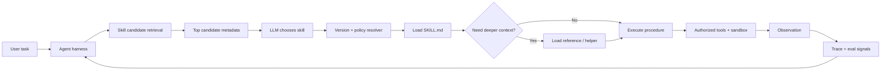

# Skill Discovery and Versioning: Operating an Agent Skill Catalog

## Executive Summary

Yesterday's skill-engineering foundation established a useful boundary: **skills package reusable procedural knowledge; the harness retains runtime authority**. The next architectural problem appears when the catalog grows from five skills to fifty or five hundred.

At that point, the question is no longer just *how do I write a good skill?* It becomes: **how does an agent find the right skill, load the right version, combine it safely with other skills, and prove that a change did not reduce quality?**

The practical answer is to treat skills like an internal software capability catalog: searchable metadata, immutable versions, explicit dependencies, controlled promotion, telemetry, and evaluation gates.

## Why This Matters

A small agent can preload the name and description of every skill. At enterprise scale that becomes noisy and expensive. Similar descriptions create routing ambiguity; independent teams introduce overlapping capabilities; a changed skill can silently alter agent behavior; and helper scripts introduce a supply-chain surface.

Anthropic's Agent Skills use progressive disclosure: lightweight metadata is available for discovery, the full `SKILL.md` is loaded only after selection, and deeper references/scripts are accessed only when needed. The same principle should extend to the catalog itself: **retrieve candidates first; load full capability packages second**.

## Simple Mental Model

Think of an internal package registry combined with a service catalog.

- **Skill package** — reusable capability.
- **Catalog metadata** — enough information to find it.
- **Version** — immutable release of the capability.
- **Resolver** — selects candidate skills for a task.
- **Policy** — decides which versions are allowed.
- **Eval gate** — determines whether a version can be promoted.

The model should choose among relevant candidates. It should not scan hundreds of full skill documents on every request.

## Core Components

| Component | Responsibility |
| --- | --- |
| Skill repository | Stores version-controlled skill packages |
| Catalog/index | Stores compact searchable metadata |
| Candidate retriever | Finds a small relevant skill set |
| Skill resolver | Applies compatibility, version and policy rules |
| Context loader | Loads selected `SKILL.md` and references progressively |
| Harness | Retains tool authorization, sandboxing, state and budgets |
| Eval pipeline | Tests selection and task quality before promotion |
| Telemetry | Records selection, version, latency, cost and outcome |

## Request Flow



Discovery and execution are separate. Finding a skill does not grant that skill additional authority.

## Design Catalog Metadata for Retrieval

A skill description should be written for routing, not marketing.

```yaml
name: extract_mule_semantics
version: 1.4.0
description: >
  Extract behavioral semantics from Mule XML into the canonical migration
  model. Use during discovery for flows, connectors, routing, transformations,
  retries and error handlers. Do not use for Spring code generation.
tags: [mulesoft, migration, discovery]
inputs: [mule_application]
outputs: [canonical_semantics]
owner: modernization-platform
risk: low
```

Good metadata answers four questions: **what does it do, when should it be selected, when should it not be selected, and what contract does it expose?**

## Retrieve Candidates Before Asking the Model

For ten skills, passing all descriptions to the model is reasonable. For hundreds, use a two-stage strategy.

```text
Task
  ↓
metadata / semantic retrieval
  ↓
5 candidate descriptions
  ↓
LLM chooses 0–2 skills
  ↓
load full SKILL.md only for selected skills
```

Start simple. Tags and keyword matching are often sufficient. Add embeddings only when the catalog becomes semantically diverse enough to justify them.

### Python Example

```python
from dataclasses import dataclass

@dataclass(frozen=True)
class SkillMeta:
    name: str
    version: str
    description: str
    tags: frozenset[str]
    status: str = "approved"


def retrieve_candidates(task: str, catalog: list[SkillMeta], limit: int = 5):
    words = set(task.lower().replace("/", " ").split())

    def score(skill: SkillMeta) -> int:
        haystack = set(skill.description.lower().split()) | set(skill.tags)
        return len(words & haystack)

    eligible = [s for s in catalog if s.status == "approved"]
    return sorted(eligible, key=score, reverse=True)[:limit]
```

This deliberately keeps retrieval deterministic. Later you can replace `score()` with hybrid keyword + embedding retrieval without changing the harness contract.

## Version Skills Like Software

A skill changes agent behavior, so treat releases as software artifacts rather than mutable documentation.

```text
1.3.2
│ │ └─ patch: clarification or safe bug fix
│ └─── minor: backward-compatible capability improvement
└───── major: contract or behavior change
```

Do not let an active run resolve `latest`. Resolve an exact approved version when the run begins and record it in trace state.

```python
run.skill_versions = {
    "extract_mule_semantics": "1.4.0",
    "map_error_handling": "2.1.3",
}
```

That gives reproducibility: a failed migration can be replayed with the same model, prompts, skill versions, tool versions and test inputs.

## Lifecycle and Promotion

Use an explicit lifecycle:

```text
DEV → EVAL → APPROVED → DEPRECATED → RETIRED
```

Only approved versions should be available to production agents by default. Promotion should require passing eval thresholds and security checks.

```yaml
workflow: mule-to-spring
skills:
  extract_mule_semantics: "1.4.x"
  generate_spring_route: "3.2.1"
```

This prevents a new skill release from changing every running migration workflow immediately.

## Compose Skills Without Creating Hidden Workflows

Composition means several skills can contribute to one task. It does **not** mean each skill should orchestrate arbitrary other skills.

```text
extract_mule_semantics
        ↓
map_error_handling
        ↓
generate_spring_route
        ↓
validate_behavioral_parity
```

If this order is mandatory, encode it in the workflow or graph. Keep each skill focused on its own stable capability.

Allow dependencies only when they are genuine capability dependencies:

```yaml
depends_on:
  canonical-schema: ">=2.0,<3.0"
```

Avoid dependencies such as `run skill B after me`; that is orchestration disguised as metadata.

## Evaluate the Catalog at Three Levels

### Selection evaluation

Did the system retrieve and choose the correct skill? Measure candidate recall, selection precision, false activation rate and no-skill accuracy.

### Skill evaluation

Given the correct skill, did it improve the task? Measure correctness, robustness, context/token cost, tool behavior and safety.

### Workflow evaluation

Did composed skills produce the correct end-to-end outcome? For migration automation, that might mean semantic completeness, successful build, generated-test quality and behavioral parity.

Do not collapse these into one score. If a migration fails because retrieval never surfaced the correct skill, rewriting the skill instructions will not fix the problem.

## Promotion Pipeline

```text
Pull request
   ↓
format + metadata validation
   ↓
script/security checks
   ↓
selection evals
   ↓
skill task evals
   ↓
regression suite
   ↓
human review
   ↓
publish immutable version
   ↓
mark APPROVED
```

Store eval results alongside release metadata. The catalog can answer not only *what skills exist?* but also *which version is approved and why?*

## Observability: Record Skill Decisions

Every production trace should include:

```text
candidate_skills
selected_skill
selected_version
selection_reason
references_loaded
scripts_executed
skill_latency_ms
skill_token_cost
final_eval_result
```

This separates routing problems from skill-quality problems.

## Common Mistakes and Failure Modes

1. **Putting every skill body into the system prompt.** You lose progressive disclosure.
2. **Using `latest` in production.** Runs become irreproducible.
3. **Letting descriptions overlap heavily.** Routing becomes unstable.
4. **Treating vector search as mandatory.** Start with simple metadata retrieval.
5. **Allowing skills to orchestrate one another freely.** Workflow control becomes invisible.
6. **Promoting without selection evals.** A good skill is useless if it is never discovered.
7. **No owner or lifecycle state.** Stale capabilities accumulate indefinitely.
8. **Allowing skill scripts to bypass the harness.** Discovery must never imply authority.

## Enterprise Use Cases

A governed skill catalog fits migration factories, coding standards, cloud architecture review, incident response, API governance, compliance evidence generation and domain-specific copilots.

For a modernization platform, teams can own capability families independently while the central agent platform owns the catalog contract, approval policy, runtime sandbox and telemetry.

## Java and Go Notes

**Java:** model metadata as immutable records and resolve versions through a registry interface. Cache approved catalog metadata, but load skill bodies lazily. Keep process execution behind a sandbox service.

**Go:** use immutable structs plus an interface such as `SkillRegistry.Resolve(ctx, name, constraint)`. Pin the returned digest/version into run state and use `context.Context` for cancellation and deadlines.

## Cloud Mapping

You do not need a dedicated cloud product for skills. A simple enterprise implementation can use Git as the source of truth plus an indexed catalog.

| Concern | AWS | Azure | GCP |
| --- | --- | --- | --- |
| Artifact storage | GitHub + S3 | GitHub/Azure Repos + Blob | GitHub + Cloud Storage |
| Metadata search | OpenSearch | AI Search | Vertex AI Search / AlloyDB |
| CI/eval pipeline | CodeBuild/GitHub Actions | Azure Pipelines/GitHub Actions | Cloud Build/GitHub Actions |
| Sandbox | ECS/EKS | Container Apps/AKS | Cloud Run/GKE |
| Telemetry | CloudWatch + OTel | Azure Monitor + OTel | Cloud Monitoring + OTel |

## 30–60 Minute Exercise

Extend `extract_mule_semantics` into a tiny governed catalog.

1. Add `version`, `tags`, `owner`, `risk`, and `status` metadata.
2. Create two metadata-only skills: `map_error_handling` and `generate_spring_route`.
3. Implement the deterministic Python candidate retriever above.
4. Write 10 task descriptions with an expected skill or `NONE`.
5. Calculate candidate recall@3 and final selection accuracy.
6. Create a second `extract_mule_semantics` version with a changed description and check whether routing improves or regresses.
7. Record the exact selected version in a mock run trace.

The goal is to experience the separation between **catalog retrieval, model selection, skill execution and evaluation**.

## Architecture Takeaway

```text
Git / Skill packages
        ↓
Governed catalog + immutable versions
        ↓
Candidate retrieval
        ↓
Model selects relevant capability
        ↓
Harness resolves approved version
        ↓
Progressive context loading
        ↓
Authorized tools / sandbox
        ↓
Tracing + eval feedback
```

This is the point where skill engineering becomes platform engineering.

## What to Learn Next

Next: **Context Engineering for Agent Systems** — deciding precisely what belongs in the system prompt, skill metadata, retrieved references, short-term working context, persisted state and tool observations, and how to compact context without losing task-critical information.

## Reading

1. Anthropic — *Equipping agents for the real world with Agent Skills*: https://www.anthropic.com/engineering/equipping-agents-for-the-real-world-with-agent-skills
2. Anthropic — *The Complete Guide to Building Skills for Claude*: https://resources.anthropic.com/hubfs/The-Complete-Guide-to-Building-Skill-for-Claude.pdf
3. Anthropic — *Effective context engineering for AI agents*: https://www.anthropic.com/engineering/effective-context-engineering-for-ai-agents
4. Anthropic — *Demystifying evals for AI agents*: https://www.anthropic.com/engineering/demystifying-evals-for-ai-agents
5. Anthropic — *Introducing advanced tool use on the Claude Developer Platform*: https://www.anthropic.com/engineering/advanced-tool-use

## Final Checklist

Before operating a skill catalog at scale, verify that metadata is optimized for discovery, production runs resolve immutable versions, only approved versions are eligible, mandatory sequencing lives outside skills, scripts remain subject to sandbox and policy, selection and task evals are separate, every skill has an owner, and production traces record the exact skill version used.