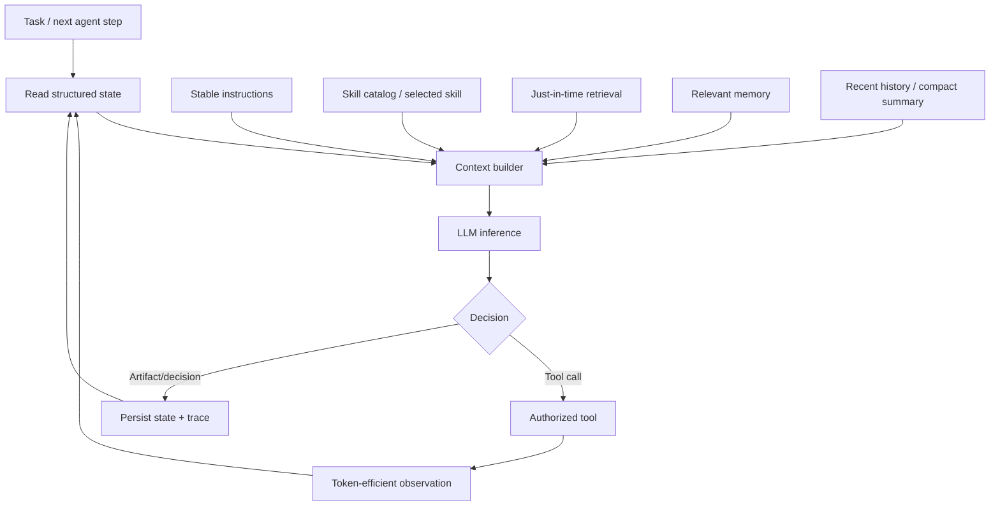

# Context Engineering for Agents: Build the Right Working Set

## Executive Summary

**Context engineering** is the discipline of deciding what information the model should see *for this specific inference*. Prompt engineering writes instructions; context engineering assembles the complete working set around those instructions.

For an agent, the useful architecture is not “put everything into the prompt.” Keep durable rules small, discover specialized procedures through skills, retrieve authoritative evidence just in time, maintain structured execution state outside the model, and compact history when it stops earning its token cost.

The design objective is simple: **the smallest set of high-signal information that lets the model make the next correct decision.**

## Why This Matters

Agent systems continuously create information: user messages, plans, tool results, retrieved documents, source code, errors, approvals, summaries, and intermediate artifacts. If all of it is appended forever, cost and latency rise, important evidence becomes harder to notice, and stale information competes with current truth.

A large context window is capacity, not an information architecture.

For a migration agent, blindly injecting the whole MuleSoft repository, migration standards, conversation history, generated Spring code, compiler logs, and test results into every call is equivalent to giving an engineer every document in the project before asking one question.

## Simple Mental Model: The Architect's Workbench

Think of the model's context as a **workbench**, not a warehouse.

- **System prompt** = permanent operating rules pinned above the bench.
- **Skill metadata** = catalog telling the engineer which playbooks exist.
- **Selected skill** = the playbook opened for the current task.
- **Retrieved evidence** = files and standards brought to the bench when needed.
- **Working state** = current phase, goals, constraints, and known decisions.
- **Tool observations** = fresh measurements such as build/test output.
- **Long-term memory** = information stored elsewhere and fetched selectively.
- **Compaction** = clearing completed work while preserving important conclusions.

The warehouse can be enormous. The workbench should stay focused.

## Core Components

| Layer | What belongs there | Example |
| --- | --- | --- |
| System instructions | Stable behavior and hard reasoning guidance | Never claim parity without validation |
| Structured state | Authoritative workflow facts | `phase=execute`, `retry_budget=2` |
| Skill catalog | Compact capability descriptions | `map_error_handling` |
| Selected skill | Current procedure | error-handler mapping procedure |
| Retrieval | Task-specific external evidence | relevant Mule XML + migration standard |
| Tool observations | Fresh execution evidence | compiler error, test result |
| Conversation | Recent useful interaction | latest user clarification |
| Memory | Persisted reusable facts | approved architectural decision |

The key boundary: **authoritative application state should not exist only inside natural-language history.** Store it as structured data and render only the relevant subset into context.

## Request Flow



The **context builder** is a harness responsibility. The model can request information, but deterministic application code decides how sources are assembled, bounded, filtered, and labelled.

## Context Engineering vs Prompt Engineering

Prompt engineering asks: **How should I phrase the instructions?**

Context engineering asks: **What should the model know right now, where should it come from, how fresh is it, and how much should be included?**

Prompt design is therefore one component of context engineering. A beautifully written system prompt cannot compensate for an obsolete architecture document, 30,000 tokens of irrelevant logs, or missing build output.

## Concrete Example: Migration Agent

Suppose the agent is executing: `Migrate order-api Mule error handling to Spring Boot.`

A focused working set is:

```text
Stable instructions
  - preserve behavior
  - do not claim success without tests

Execution state
  phase: execute
  component: order-api
  target: error handling
  approved_plan: ADR-42

Selected skill
  map_error_handling

Retrieved evidence
  order.xml: relevant error-handler blocks
  canonical.json: error semantics
  standards/error-handling.md: relevant section

Recent observation
  mvn test: 2 failures
  OrderTimeoutTest expected 504, received 500
```

The next model call now has a precise problem to solve.

## Lightweight Python Context Builder

```python
from dataclasses import dataclass, field

@dataclass
class RunState:
    task: str
    phase: str
    component: str
    decisions: list[str] = field(default_factory=list)
    recent_observations: list[str] = field(default_factory=list)

@dataclass
class ContextBudget:
    max_evidence_chars: int = 20_000
    max_observation_chars: int = 8_000
    recent_messages: int = 6


def clip(text: str, limit: int) -> str:
    if len(text) <= limit:
        return text
    return text[:limit] + "\n...[truncated]"


def build_context(state, skill, evidence, messages, budget):
    system = """You are a migration engineering agent.
Preserve observable behavior. Use supplied evidence as the source of truth.
Do not claim completion until deterministic validation passes."""

    working_state = f"""Task: {state.task}
Phase: {state.phase}
Component: {state.component}
Approved decisions: {state.decisions}"""

    evidence_text = "\n\n".join(
        f"SOURCE: {name}\n{content}" for name, content in evidence
    )
    observations = "\n".join(state.recent_observations[-5:])

    return [
        {"role": "system", "content": system},
        {"role": "system", "content": working_state},
        {"role": "system", "content": f"ACTIVE SKILL:\n{skill}"},
        {"role": "system", "content": "EVIDENCE:\n" + clip(evidence_text, budget.max_evidence_chars)},
        *messages[-budget.recent_messages:],
        {"role": "system", "content": "LATEST OBSERVATIONS:\n" + clip(observations, budget.max_observation_chars)},
    ]
```

This keeps **storage** separate from **rendering into context**. In production, budget in tokens rather than characters and rank evidence before clipping.

## Just-in-Time Retrieval

Traditional RAG often retrieves a bundle before the first model call. Agentic systems can also retrieve **during** execution. For repository work, retain lightweight references such as paths, symbols, artifact IDs, or URLs and fetch exact implementation, test, ADR, or schema when the next decision requires it.

Use retrieval for information that is large, authoritative, externally changing, or occasionally relevant. Do not use retrieval as a substitute for small deterministic state such as `current_phase` or `approval_status`.

## Tool Responses Are Context Too

A tool returning 50,000 lines of build logs can damage the next inference even when the tool itself worked correctly. Prefer structured summaries plus references for deeper inspection.

```json
{
  "status": "failed",
  "failed_tests": 2,
  "errors": [{
    "test": "OrderTimeoutTest",
    "expected": 504,
    "actual": 500,
    "log_ref": "artifact://build/184/log"
  }]
}
```

Keep the full log outside context and expose a tool to fetch a focused range when necessary.

## Compaction for Long-Running Agents

**Compaction** means replacing an increasingly long interaction history with a smaller representation of what must survive into the next context window.

Preserve original goal and acceptance criteria, decisions and approvals, unresolved problems, artifact references, validation status, important failed approaches, and exact identifiers needed to resume. Externalize repetitive tool chatter and obsolete intermediate details.

For long-running engineering work, write durable artifacts such as `progress.md`, `canonical.json`, plan files, commits, or checkpoints. Reconstruct state from durable evidence rather than trust a prose summary alone.

## Common Mistakes and Failure Modes

1. **Using the context window as storage.** Persist state outside the LLM.
2. **Loading everything because it fits.** Relevance matters even when capacity is available.
3. **Confusing memory with context.** Memory is stored information; context is what is currently presented.
4. **Huge tool outputs.** Return summaries plus references.
5. **Stale retrieved evidence.** Attach source identity/version and prefer authoritative artifacts.
6. **Compacting away constraints.** Preserve acceptance criteria, approvals, and unresolved risks.
7. **One global context builder.** Different workflow phases need different evidence and tools.
8. **No context evals.** Measure whether the right evidence was selected, not only the final answer.

## Enterprise Use Cases

Context engineering matters in coding assistants, migration accelerators, incident agents, customer-service agents, architecture-review agents, regulated RAG, security investigation, and long-running research.

For enterprise migration automation:

```text
canonical model     -> durable semantic state
Git repository      -> authoritative source/target artifacts
skills              -> procedural knowledge
retrieval           -> standards + focused source evidence
checkpoint store    -> workflow state
context builder     -> phase-specific working set
LLM                 -> reasoning over that working set
```

This architecture also improves auditability: traces can record which context sources and versions influenced each decision.

## Java and Go Notes

**Java:** model context sections as typed records rather than concatenated strings. Use explicit token-budget policies and immutable workflow state. Keep retrieval and rendering behind independently testable interfaces.

**Go:** represent context inputs as structs and build a deterministic `ContextAssembler`. Use `context.Context` for execution deadlines, but do not confuse Go's `context.Context` cancellation mechanism with LLM context.

## Cloud Mapping

No cloud service is required for context engineering itself. Typical building blocks are artifact stores, search/vector services, checkpoint stores, model runtimes, and OpenTelemetry-compatible tracing.

On AWS this may combine Bedrock with S3/OpenSearch/DynamoDB; on Azure, Azure AI Foundry with AI Search/Blob/Cosmos DB; on GCP, Vertex AI with Cloud Storage/Vertex AI Search or vector search/Firestore. The architectural separation matters more than the vendor mapping.

## 30–60 Minute Hands-On Exercise

Take one migration-agent stage such as `/execute` and create a `build_context()` function.

Start with six candidate sources: system instructions, full chat history, `canonical.json`, selected skill, source XML, and build logs. Assign each one a policy: **always include, retrieve on demand, summarize, structured state, or exclude**.

Create two test scenarios: initial code generation and a failing parity test. Assert that each receives a different working set. Record approximate token count and identify one source you can replace with a compact reference.

Success criterion: each step contains everything required to decide correctly, but no large source is included merely because it exists.

## Architecture Takeaway

```text
Prompt engineering  = design instructions
Context engineering = design the model's complete working set
Memory              = persist reusable information
Retrieval           = fetch relevant information
State               = authoritative execution facts
Compaction          = preserve signal while shrinking history
```

Treat context as a **runtime dependency assembled per decision**, not as an ever-growing transcript.

## What to Learn Next

Next: **Context Evaluation and RAG Failure Analysis** — measuring whether the agent retrieved the right evidence, whether useful evidence survived context assembly, and whether the model actually used it correctly.

## Reading

1. Anthropic — Effective context engineering for AI agents: https://www.anthropic.com/engineering/effective-context-engineering-for-ai-agents
2. Anthropic — Writing effective tools for agents: https://www.anthropic.com/engineering/writing-tools-for-agents
3. Anthropic — Effective harnesses for long-running agents: https://www.anthropic.com/engineering/effective-harnesses-for-long-running-agents
4. Anthropic — Agent Skills: https://www.anthropic.com/engineering/equipping-agents-for-the-real-world-with-agent-skills
5. Anthropic — Building Effective AI Agents: https://resources.anthropic.com/building-effective-ai-agents
