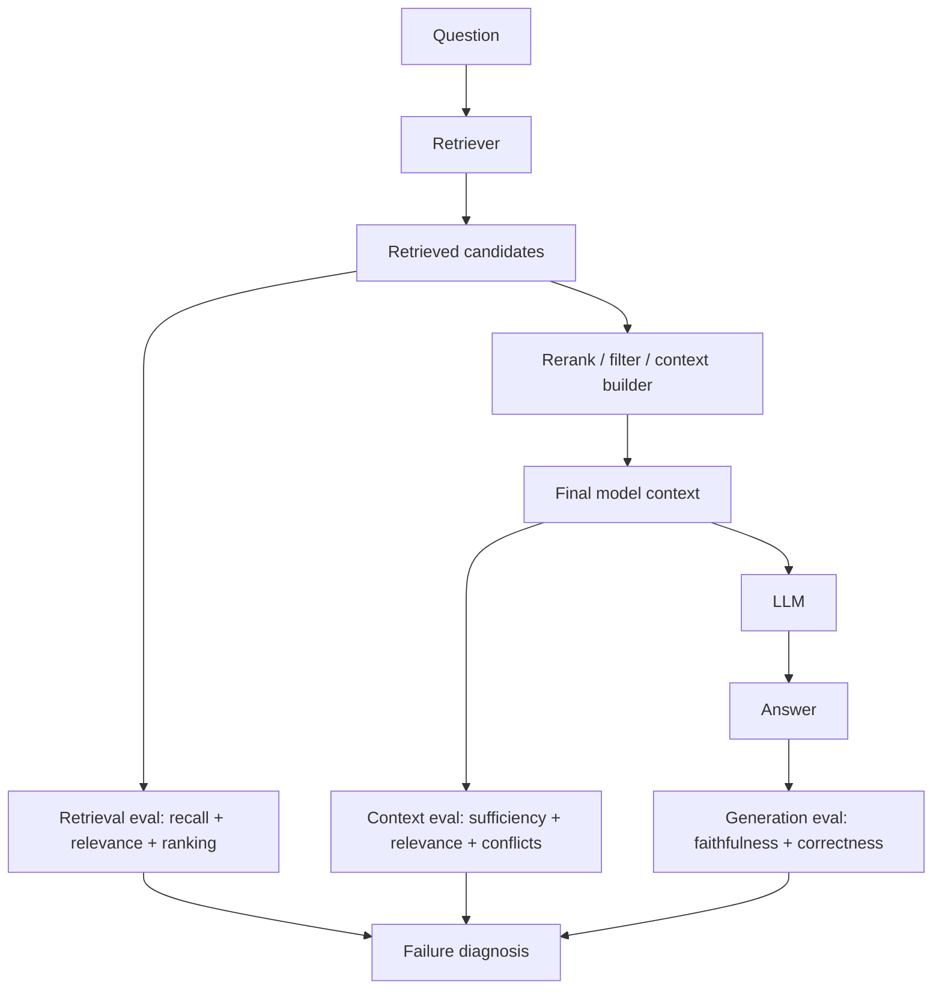

# Context Evaluation and RAG Failure Analysis: Find the Broken Stage

## Executive Summary

A RAG system can produce a wrong answer for several very different reasons. The retriever may return the wrong chunks. The retriever may return the right chunk but the context builder may discard it, truncate it, or bury it in noise. Or the model may receive excellent evidence and still produce an unsupported answer.

The key engineering principle is **evaluate the pipeline by stage, not only by final answer**.

For practical debugging, separate three failure classes:

1. **Retrieval failure** — the required evidence was not retrieved.
2. **Context failure** — useful evidence existed but the final model context was incomplete, noisy, stale, or incorrectly assembled.
3. **Reasoning/generation failure** — the model received sufficient evidence but produced an incorrect or unsupported answer.

This decomposition prevents a common anti-pattern: changing the embedding model whenever a RAG answer looks bad.

## Why This Matters

Suppose a migration assistant is asked:

> How should an until-successful Mule scope be migrated, and what retry semantics must be preserved?

The final answer incorrectly recommends a generic exception retry. That symptom does not tell you what to fix. The correct guide may never have been retrieved, may have ranked below the top-K cutoff, may have been removed during context compaction, or the model may simply have ignored correct evidence.

Without stage-level evaluation, teams often tune the wrong component.

## Simple Mental Model

Think of diagnosing a failed database query through an application. You inspect the chain rather than immediately replacing the database.

```text
question -> retrieval -> ranking/filtering -> context assembly -> generation -> answer
```

Each boundary should expose evidence that can be evaluated.

## Important Terms

- **Ground truth** — a known-good answer or known-relevant source used as a reference.
- **Relevance** — whether a retrieved chunk helps answer the question.
- **Recall** — whether the retriever found the evidence that should have been found.
- **Precision** — how much retrieved content was useful rather than noise.
- **Faithfulness / groundedness** — whether answer claims are supported by supplied context.
- **Answer correctness** — whether the final answer is actually correct.

These metrics answer different questions. A faithful answer can still be wrong if its retrieved source is wrong.

## Core Request and Evaluation Flow



Persist both **retrieved candidates** and **final model context**. If you store only the answer, you lose the evidence needed to locate the failure.

## Layer 1 — Evaluate Retrieval

Retrieval evaluation asks: **Did we find the evidence needed to answer the question?**

```python
from dataclasses import dataclass

@dataclass
class RetrievalCase:
    query: str
    expected_doc_ids: set[str]


def hit_at_k(expected: set[str], retrieved: list[str], k: int) -> bool:
    return bool(expected.intersection(retrieved[:k]))


def recall_at_k(expected: set[str], retrieved: list[str], k: int) -> float:
    if not expected:
        return 1.0
    return len(expected.intersection(retrieved[:k])) / len(expected)
```

For a migration case, the expected document might be `retry-pattern-until-successful`. If `recall@5 = 0`, do not tune the answer prompt: the required evidence never reached the model pipeline.

Useful retrieval metrics include **Hit@K**, **Recall@K**, **Precision@K**, **MRR**, and **NDCG**. For an early system, Hit@K and Recall@K are usually enough to start.

## Layer 2 — Evaluate Context Assembly

Retrieval results are not necessarily the content that reaches the LLM. Between retrieval and generation you may have reranking, metadata filters, deduplication, token trimming, compression, authorization filtering, conversation history, skill instructions, and tool observations.

Evaluate the **final assembled context** separately:

- **Context sufficiency:** does it contain enough evidence?
- **Context relevance:** how much supplied context is useful?
- **Context conflict:** are there contradictory sources or instructions?

```python
@dataclass
class ContextEval:
    required_evidence_present: bool
    relevant_chunks: int
    total_chunks: int
    conflicting_sources: bool

    @property
    def context_precision(self) -> float:
        return self.relevant_chunks / max(self.total_chunks, 1)
```

If retrieval returned the correct rule at rank 4 but the context builder retained only three chunks, retrieval worked; **context assembly failed**.

## Layer 3 — Evaluate Generation

Now ask: **Given this context, did the model use it correctly?**

Two metrics matter most:

- **Faithfulness:** are claims supported by context?
- **Correctness:** does the answer match the expected outcome?

They are not equivalent. A model can faithfully repeat an incorrect source. It can also give a factually correct answer from memorized knowledge without grounding it in supplied enterprise evidence.

## Failure Matrix

| Retrieval | Context | Answer | Likely diagnosis |
| --- | --- | --- | --- |
| Bad | Bad | Bad | Fix retrieval/indexing first |
| Good | Bad | Bad | Fix reranking, filtering, token budget, or context builder |
| Good | Good | Bad | Fix generation prompt/model/reasoning strategy |
| Good | Good | Good but unsupported | Improve grounding constraints and citations |
| Good | Noisy | Good | Reduce context cost and future failure risk |

This matrix is more actionable than one end-to-end score.

## Concrete Migration Example

Assume the knowledge base contains retry, error handling, Spring Retry, and approved-pattern documents. Instrument the pipeline:

```python
@dataclass
class RagTrace:
    query: str
    retrieved_ids: list[str]
    final_context_ids: list[str]
    answer: str


def diagnose(trace: RagTrace, required_doc: str,
             context_sufficient: bool,
             answer_faithful: bool) -> str:
    if required_doc not in trace.retrieved_ids:
        return "retrieval_failure"
    if required_doc not in trace.final_context_ids or not context_sufficient:
        return "context_assembly_failure"
    if not answer_faithful:
        return "generation_failure"
    return "pipeline_looks_healthy"
```

LLM judges can enrich this later, but the first diagnostic layer should remain understandable and deterministic where possible.

## Build an Evaluation Dataset

Start with 20–50 high-value cases rather than hundreds of generic questions. For migration automation, include common flows plus retry, error handling, transformations, unsupported connectors, ambiguous patterns, and deprecated-versus-current guidance.

Store more than a reference answer:

```json
{
  "query": "How should until-successful be migrated?",
  "expected_doc_ids": ["retry-pattern-until-successful"],
  "required_facts": ["retry count is bounded", "delay semantics are preserved"],
  "forbidden_claims": ["retry indefinitely"]
}
```

One golden case can then support retrieval, context, and answer evaluation.

## LLM-as-a-Judge: Where It Helps

Use evaluator models for semantic judgments such as chunk relevance, context sufficiency, and answer faithfulness, but calibrate them against human-labeled examples.

```text
human-label 30-50 examples
        -> run evaluator
        -> compare with humans
        -> refine rubric
        -> scale evaluation
```

An evaluator prompt is not objective truth. It is another model component with its own error rate.

## Offline and Online Use

Offline evaluation asks whether a new chunking strategy, embedding model, reranker, context builder, or prompt improves known cases. Online evaluation asks which real production queries fail and at which stage.

A production trace might show:

```text
retrieval_relevance = 0.42
context_sufficient = false
faithfulness = 0.91
user_feedback = negative
```

That tells a useful story: the model stayed faithful to insufficient evidence. The defect is upstream, not simply "hallucination."

## Common Mistakes and Failure Modes

1. **Evaluating only the final answer.** You know it failed but not why.
2. **Calling every bad answer a hallucination.** Many failures begin upstream.
3. **Optimizing semantic similarity only.** Similarity is not answer usefulness.
4. **Increasing top-K whenever recall is poor.** More context can reduce precision and increase latency.
5. **Ignoring authorization filters.** Correctly removing unauthorized evidence is not a retrieval defect.
6. **Ignoring document versions.** Trace document ID, version, effective date, and source authority.
7. **Using one aggregate score.** Slice by task, tenant, source, connector type, and other meaningful dimensions.

## Enterprise Use Cases

This pattern applies to architecture assistants, repository-aware coding assistants, migration agents, customer-service RAG, policy assistants, incident copilots, API documentation assistants, and internal developer portals.

## Practical Architecture Guidance

Treat each RAG stage as an observable contract. Persist query, rewritten query, retrieved IDs and scores, reranked IDs, final context IDs, token count, source versions, answer, citations, model version, context-builder version, and evaluation results.

For agentic RAG, also capture **why retrieval happened**. The agent may choose whether to retrieve, rewrite a query, call several knowledge sources, or stop. Evaluation then expands from retrieval quality to retrieval-decision quality.

## Java and Go Notes

**Java:** model evaluation records as immutable records and emit retrieval/context metadata through OpenTelemetry. Keep ranking metrics in deterministic tests; run semantic judges through an evaluation service.

**Go:** table-driven tests work well for retrieval goldens. Store expected document IDs and required facts in JSON/YAML fixtures, compute Hit@K/Recall@K deterministically, and run semantic evaluation asynchronously.

## Cloud Mapping

| Concern | AWS | Azure | GCP |
| --- | --- | --- | --- |
| Managed retrieval | Bedrock Knowledge Bases / OpenSearch | Azure AI Search | Vertex AI Search |
| Model evaluation | Bedrock evaluation capabilities | Azure AI Foundry evaluation | Vertex AI evaluation |
| Tracing | CloudWatch + OpenTelemetry | Azure Monitor + OpenTelemetry | Cloud Trace/Monitoring + OpenTelemetry |
| Golden datasets | S3 | Blob Storage | Cloud Storage / BigQuery |

Keep the evaluation schema portable even when the underlying search service changes.

## 30–60 Minute Hands-On Exercise

Take a small RAG prototype and create **10 evaluation questions**. For each question, record one expected document ID and 2–3 required facts.

1. Run retrieval with `k=3` and `k=6`.
2. Compute Hit@K and Recall@K.
3. Save the final context actually sent to the LLM.
4. Manually label context sufficiency yes/no.
5. Label the answer for faithfulness and correctness.
6. Bucket each failure as retrieval, context assembly, or generation.
7. Change exactly **one** component and rerun the same dataset.

The goal is not the highest score. The goal is learning which stage responds to which engineering change.

## Architecture Takeaway

```text
Bad answer
   |
   +-- Was required evidence retrieved?
   |       no -> retrieval/index problem
   |
   +-- Did required evidence reach final context?
   |       no -> context assembly problem
   |
   +-- Was final context sufficient and coherent?
   |       no -> context quality problem
   |
   +-- Did model use evidence correctly?
           no -> generation/reasoning problem
```

This debugging discipline turns RAG from prompt experimentation into an engineered system.

## What to Learn Next

**Query Planning and Retrieval Routing for Agentic RAG** — when an agent should retrieve, how it chooses among multiple knowledge sources, when query rewriting helps, and how to evaluate routing decisions without giving the agent unlimited freedom.

## Recommended Reading

1. [LangSmith — Evaluate a RAG application](https://docs.langchain.com/langsmith/evaluate-rag-tutorial)
2. [LangSmith — Evaluation concepts](https://docs.langchain.com/langsmith/evaluation)
3. [Arize Phoenix — Evaluation](https://arize.com/docs/phoenix/evaluation/llm-evals)
4. [Arize Phoenix — Tracing](https://arize.com/docs/phoenix/tracing)
5. [OpenAI — Evaluation best practices](https://platform.openai.com/docs/guides/evals)
