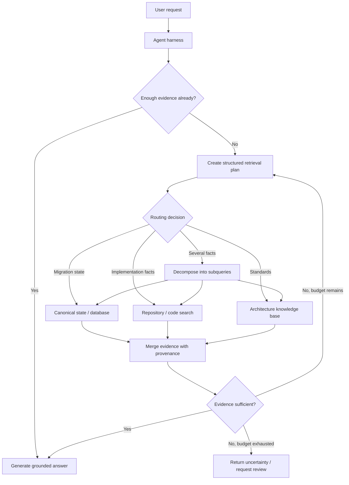

# Query Planning and Retrieval Routing for Agentic RAG

## Executive Summary

Traditional RAG usually follows one fixed path: take the user's question, run one search, put the top results into the prompt, and ask the model to answer.

**Agentic RAG adds a control decision before and during retrieval.** The system can decide whether retrieval is needed, which source should be queried, whether the question must be rewritten or decomposed, whether more evidence is needed, and when retrieval should stop.

The important architectural shift is this:

> **Retrieval becomes a governed runtime capability, not a mandatory preprocessing step.**

For enterprise agents, this matters more than adding another vector database. A migration agent may need source code for one question, architecture standards for another, a canonical migration model for a third, and sometimes no retrieval at all.

## Why This Matters

A production agent rarely has one knowledge source. It may have repository source code, indexed documents, structured databases, API catalogs, migration state, tickets and design decisions, operational runbooks, and external documentation.

Sending every question to every source creates four problems: higher latency, higher cost, noisy context, and unnecessary data exposure.

The harder problem is therefore not **"How do I search?"** but **"What retrieval action is justified for this specific request?"**

That decision is the job of a **retrieval router** or **query planner**.

## Simple Mental Model

Think of an experienced architect responding to a question.

If someone asks, "What stage is the current migration in?", you look at the migration state store. You do not search all source code.

If they ask, "Does this Mule flow retry a non-idempotent POST?", you inspect the flow implementation.

If they ask, "Does that behavior violate our target retry standard?", you additionally open the architecture standard.

If they ask all three at once, you break the question into smaller evidence requests.

The agent should behave the same way:

```text
Question
   ↓
Do I already have enough evidence?
   ├── yes → answer
   └── no
        ↓
Which source owns the required fact?
        ↓
Is the query clear enough for that source?
   ├── yes → retrieve
   └── no  → rewrite or decompose
        ↓
Evaluate evidence
   ├── sufficient → answer
   └── insufficient → bounded next retrieval
```

## Important Terms

**Retrieval routing** means choosing which knowledge source or retrieval tool should handle a request.

**Query rewriting** means transforming the user's wording into a search-oriented query while preserving the original intent and constraints.

**Query decomposition** means splitting a complex question into smaller subqueries that can be answered independently or sequentially.

**Retrieval plan** is a structured description of the sources, queries, filters, budgets, and stopping rules to use.

**Evidence sufficiency** means deciding whether the retrieved information is adequate to support the required answer or action.

**Retrieval budget** limits cost and runaway behavior—for example, at most three source calls, ten returned chunks, or two planning iterations.

## Core Components

A practical agentic retrieval layer needs six components.

1. **Intent and evidence classifier** — determines whether current context is sufficient.
2. **Source catalog** — describes available knowledge sources, what they contain, authorization requirements, and supported query styles.
3. **Query planner** — chooses source, query, filters, decomposition, and execution order.
4. **Retrievers** — deterministic adapters around vector search, code search, SQL, APIs, or document stores.
5. **Evidence evaluator** — determines whether results cover the information need.
6. **Harness controls** — enforce authorization, budgets, tracing, retries, and stopping conditions.

The LLM can propose the retrieval plan. The harness should still control what is actually allowed to execute.

## Request Flow



## Concrete Example: Migration Risk Analysis

Suppose the user asks:

> "Find payment APIs whose Mule implementation uses `until-successful` around a non-idempotent outbound call, compare them with our Spring retry standard, and identify migrations requiring manual review."

A basic RAG implementation might embed the entire question and search one document index.

An agentic retrieval plan should recognize three distinct evidence needs:

```text
Need 1: Which payment flows use until-successful?
Source: canonical migration index or Mule repository

Need 2: Which retried operations are non-idempotent?
Source: flow semantics + outbound connector configuration

Need 3: What does the target retry standard allow?
Source: architecture standards knowledge base
```

The agent can first query the canonical model to narrow candidates. It then reads source code only for those candidates and retrieves the retry standard once. This is both cheaper and more precise than searching every source immediately.

The final answer should preserve provenance:

```text
payment-authorize-flow
  evidence: payments.xml lines 120-168
  behavior: until-successful around POST /authorizations
  standard: RETRY-04 requires idempotency key for retried POST
  decision: manual review required
```

## A Lightweight Python Retrieval Planner

The plan should be structured data rather than prose so the harness can validate it before execution.

```python
from enum import Enum
from pydantic import BaseModel, Field

class Source(str, Enum):
    MIGRATION_STATE = "migration_state"
    CODE = "code"
    STANDARDS = "standards"

class RetrievalStep(BaseModel):
    source: Source
    query: str
    filters: dict[str, str] = {}
    reason: str

class RetrievalPlan(BaseModel):
    needs_retrieval: bool
    steps: list[RetrievalStep] = []
    max_calls: int = Field(default=3, ge=0, le=5)

SOURCE_CATALOG = {
    Source.MIGRATION_STATE: "Canonical facts about discovered applications, flows and migration status",
    Source.CODE: "Repository source code and configuration; use for implementation evidence",
    Source.STANDARDS: "Approved target architecture, coding and migration standards",
}
```

The model receives only the source descriptions needed for routing and returns a `RetrievalPlan` using structured output.

A deterministic validator then applies policy:

```python
def validate_plan(plan: RetrievalPlan, allowed_sources: set[Source]) -> None:
    if len(plan.steps) > plan.max_calls:
        raise ValueError("retrieval budget exceeded")

    for step in plan.steps:
        if step.source not in allowed_sources:
            raise PermissionError(f"source not authorized: {step.source}")
        if not step.query.strip():
            raise ValueError("empty retrieval query")
```

The key boundary is deliberate: **the model proposes the plan; the harness authorizes and executes it.**

## Query Rewriting: Useful but Dangerous

User questions are often poor search queries.

Example user question:

```text
Which ones have the same retry issue we discussed yesterday?
```

A retrieval query must resolve conversation context first:

```text
payment Mule flows using until-successful around non-idempotent HTTP POST operations
```

But rewriting can accidentally remove constraints. If the original question says **payment APIs only**, the rewritten query must not silently widen the search to the entire enterprise.

Store both forms in the trace:

```text
original_query
rewritten_query
reason_for_rewrite
source
filters
```

This makes retrieval behavior auditable and evaluable.

## When to Decompose a Query

Do not decompose every question. Decomposition adds model calls, retrieval calls, merging work, and failure modes.

Use it when the question contains independent facts, comparison across entities, multiple sources of authority, or a dependency where one answer determines the next query.

Simple question:

```text
What is the retry policy for outbound HTTP calls?
```

One standards retrieval is enough.

Complex question:

```text
Which migrated payment APIs violate the retry policy and also lack parity tests?
```

This likely needs separate retrieval for implementation behavior, target policy, and test status.

## Parallel vs Sequential Retrieval

Independent subqueries can run in parallel.

```text
retrieve retry standard ─┐
retrieve parity status ──┼─→ merge
retrieve candidate flows ┘
```

Dependent queries should be sequential.

```text
find flows using until-successful
        ↓
extract candidate repository paths
        ↓
inspect only those paths
```

Parallelism reduces latency. Sequential planning reduces unnecessary search. The planner should explicitly know which dependency exists instead of simply running everything concurrently.

## Evidence Sufficiency and Stopping

An agentic RAG loop needs a stopping rule just like any other agent loop.

Bad stopping rule:

```text
keep searching until the model feels confident
```

Better stopping rules are observable:

- required evidence categories are covered;
- at least one authoritative source supports each material claim;
- retrieved documents are above a relevance threshold;
- no unresolved contradiction remains;
- maximum calls or latency budget has been reached.

For the migration example, a decision should not be made until three evidence slots are populated:

```python
required = {"source_behavior", "target_policy", "migration_status"}
found = set(evidence.keys())

enough = required.issubset(found)
```

The model may help judge semantic sufficiency, but the harness should own hard limits.

## Source Routing Should Include Authorization

Routing is not just relevance ranking.

A source may contain customer data, production logs, restricted repositories, or architecture documents limited to a business unit. Therefore a source catalog should include both semantic metadata and access metadata.

```python
source = {
    "name": "payments-prod-logs",
    "purpose": "production diagnostic evidence",
    "classification": "restricted",
    "required_scope": "logs:payments:read",
}
```

The planner can request the source. The authorization layer decides whether it may be used.

Never rely on the LLM prompt to enforce source permissions.

## Evaluation Strategy

Agentic retrieval introduces several evaluation layers beyond normal answer quality.

**Routing accuracy** — did the planner choose the correct source?

**No-retrieval accuracy** — did it avoid retrieval when existing context was already sufficient?

**Rewrite fidelity** — did the rewritten query preserve entities, constraints, dates, and scope?

**Decomposition quality** — do the subqueries collectively cover the original information need without unnecessary work?

**Evidence coverage** — were all required evidence categories retrieved?

**Answer groundedness** — are final claims supported by returned evidence?

**Efficiency** — how many model calls, retrieval calls, tokens, and milliseconds were consumed?

A useful test record is:

```json
{
  "question": "Which payment migrations violate retry policy?",
  "expected_sources": ["migration_state", "code", "standards"],
  "max_retrieval_calls": 4,
  "required_evidence": ["source_behavior", "target_policy", "migration_status"]
}
```

Evaluate the retrieval trajectory separately from the final answer. A correct answer produced through an unsafe or excessively expensive route is not a fully successful agent run.

## Common Mistakes and Failure Modes

1. **Retrieving on every turn.** Some questions are answerable from structured state already in context.
2. **Searching every source.** This creates noise, cost, latency, and data-exposure risk.
3. **Using the user question unchanged everywhere.** Code search, vector search, SQL, and web search need different query forms.
4. **Rewriting without preserving constraints.** Scope, dates, entities, and negations are easily lost.
5. **Decomposing simple questions.** Agentic behavior is not automatically better behavior.
6. **No hard retrieval budget.** A weak planner can repeatedly search without adding evidence.
7. **No provenance.** Merged chunks without source identity make audit and debugging difficult.
8. **Letting source descriptions grant authority.** Retrieval permissions belong in deterministic policy.
9. **Evaluating only the final answer.** Routing and query-planning defects remain invisible.

## Enterprise Use Cases

Retrieval routing is valuable wherever an agent spans heterogeneous enterprise knowledge: application modernization and migration, coding assistants combining repository code with documentation and tickets, incident agents combining runbooks and telemetry, customer-service agents combining documentation with account systems and policy, API governance agents, and compliance agents.

In each case, the architectural pattern is the same: **sources expose evidence; the planner proposes where to look; policy controls access; the harness controls execution; the answer retains provenance.**

## Practical Architecture Guidance

Start with a small explicit source catalog rather than a fully autonomous planner. Three to five well-described source types are enough for a first implementation.

Use structured output for retrieval plans. Validate every plan deterministically before execution. Keep source adapters narrow and testable. Capture original query, rewritten query, filters, source, latency, result count, and relevance/evidence signals in traces.

Add query decomposition only after single-source routing works reliably. Add iterative retrieval only after you have a measurable evidence-sufficiency rule and a hard budget.

For migration automation, prefer deterministic outer stages:

```text
/discover → /normalize → /plan → /execute → /parity-test
```

Inside a stage, bounded agentic retrieval can locate the evidence required for the stage. The retrieval planner should not silently reorganize the migration workflow itself.

## Java and Go Notes

**Java:** model the retrieval plan with records or sealed types, validate it before dispatch, and expose each retriever behind a narrow interface. Use `CompletableFuture` or structured concurrency only for independent subqueries.

**Go:** represent steps as typed structs, propagate `context.Context` deadlines through every retriever, and enforce source and call budgets before launching goroutines. Keep provenance in the result type rather than returning raw strings.

## Cloud Mapping

**AWS:** Amazon Bedrock Knowledge Bases provides retrieval, reranking, query generation for structured stores, and `AgenticRetrieveStream`, which can decompose complex queries, retrieve iteratively, and report trace events. For custom enterprise routing, keep a harness-level source policy above these capabilities.

**Azure:** Azure AI Search agentic retrieval formalizes knowledge sources and knowledge bases, with LLM-assisted query planning, query decomposition, parallel retrieval, semantic ranking, and execution metadata. It is a useful reference architecture for separating the agent from the retrieval control plane.

**GCP:** Vertex AI Search and Vertex AI RAG Engine can provide retrieval capabilities; source selection, query planning, and iterative orchestration can remain in the agent or application layer when you need explicit enterprise routing and policy boundaries.

## 30–60 Minute Hands-On Exercise

Build a small retrieval router with three mocked sources: `migration_state`, `code`, and `standards`.

Create eight test questions covering: no retrieval needed, one-source lookup, ambiguous conversational query requiring rewrite, a two-source comparison, and a three-part migration risk question requiring decomposition.

Your router should return structured JSON containing `needs_retrieval`, `steps`, `source`, `query`, `filters`, and `max_calls`.

Then add deterministic checks for authorized sources and maximum calls. Do not connect a vector database yet; use Python dictionaries or small text files for retrieval.

Measure only four things in the first iteration: correct source selection, preservation of query constraints, unnecessary retrieval calls, and whether required evidence categories were populated.

If those work, you have built the control plane required before adding more sophisticated retrieval infrastructure.

## Architecture Takeaway

```text
User intent
   ↓
Agent / planner          proposes information needs
   ↓
Retrieval policy         validates sources + budgets
   ↓
Retrieval adapters       fetch evidence
   ↓
Evidence evaluator       checks coverage
   ↓
Harness                  decides continue / stop
   ↓
LLM                      produces grounded response
```

The vector database is only one component. The important enterprise abstraction is the **retrieval control plane** around it.

## What to Learn Next

Next: **Retrieval Budgets and Evidence Sufficiency — How an Agent Knows When It Has Searched Enough.**

That lesson will focus on stopping criteria, evidence contracts, contradictory sources, confidence versus coverage, and evals for iterative retrieval loops.

## Reading

1. Microsoft — *Quickstart: Agentic Retrieval, Azure AI Search*: https://learn.microsoft.com/en-us/azure/search/search-get-started-agentic-retrieval
2. Microsoft — *RAG and Generative AI with Azure AI Search*: https://learn.microsoft.com/en-us/azure/search/retrieval-augmented-generation-overview
3. Amazon Web Services — *Retrieving information using Amazon Bedrock Knowledge Bases*: https://docs.aws.amazon.com/bedrock/latest/userguide/kb-how-retrieval.html
4. Anthropic — *Effective context engineering for AI agents*: https://www.anthropic.com/engineering/effective-context-engineering-for-ai-agents
5. Amazon Web Services — *Configure query decomposition and reranking in Bedrock Knowledge Bases*: https://docs.aws.amazon.com/bedrock/latest/userguide/kb-test-config.html

## Final Checklist

Before making retrieval agentic, verify that you can answer these questions clearly:

- Can the agent choose **not** to retrieve?
- Is every knowledge source described by purpose and authority?
- Does query rewriting preserve hard constraints?
- Is decomposition used only for genuinely complex information needs?
- Are retrieval calls authorized outside the LLM?
- Is every piece of evidence traceable to its source?
- Is there a deterministic budget?
- Is there an explicit evidence-sufficiency or stopping rule?
- Can routing and retrieval trajectories be evaluated independently from final answer quality?
