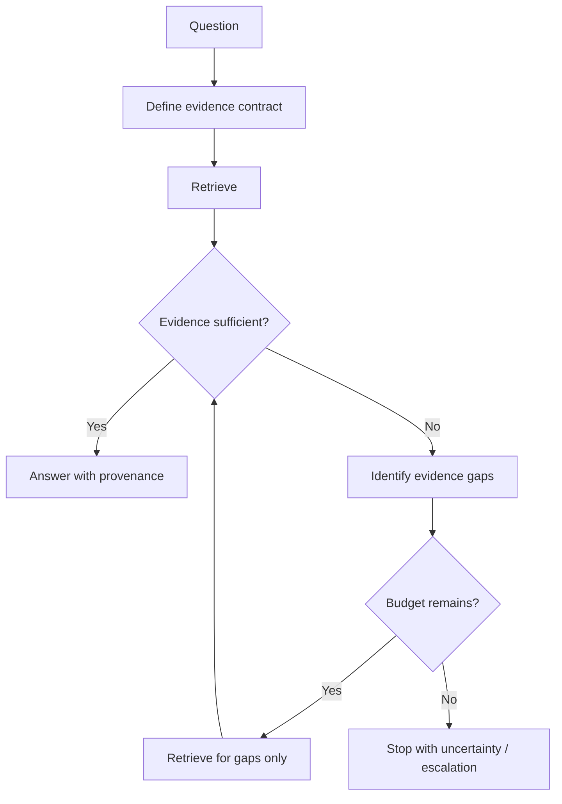

# Retrieval Budgets and Evidence Sufficiency

## Executive Summary

Agentic RAG should not keep searching until the model merely *feels confident*. Production retrieval needs two explicit controls: **an evidence-sufficiency rule** that says what must be known before answering, and **a retrieval budget** that limits how much work the agent may spend trying to know it.

Recent 2026 research makes this increasingly concrete. S2G-RAG uses a controller that judges whether current evidence is sufficient and, when it is not, emits structured gaps that drive the next retrieval. Budget-constrained agentic-search studies separately show that more retrieval is not automatically better: gains tend to flatten after a small number of searches, while cost continues to rise.

> **Architectural rule: semantic sufficiency decides whether more evidence is useful; deterministic budgets decide whether more retrieval is allowed.**

## Why This Matters

Yesterday's retrieval router answered **where should the agent look?** Today's problem is the other half of the control loop: **when should it stop looking?**

Without a stopping policy, iterative RAG can produce runaway tool calls, repeated evidence, larger contexts, higher latency, and even lower answer quality because distractors accumulate.

## Mental Model

For a migration-risk decision, define the evidence contract before retrieval:

```text
Required evidence
├── source_behavior
├── target_policy
└── migration_status
```

After each retrieval round, ask which slots are supported by authoritative evidence. If all required slots are covered, stop. If something is missing and budget remains, retrieve specifically for the gap. If budget is exhausted, stop and report the unresolved gap rather than inventing an answer.



## Evidence Sufficiency Is Not Model Confidence

A model can sound confident while missing an authoritative fact. Treat sufficiency as an **evidence coverage problem**, not a confidence score.

```python
required = {"source_behavior", "target_policy", "migration_status"}
covered = {e.kind for e in evidence if e.authoritative}

is_sufficient = required.issubset(covered)
missing = required - covered
```

The LLM can help judge whether a document actually supports an evidence slot, but the required slots themselves should come from the task contract or policy.

## Gap-Driven Retrieval

A useful pattern from S2G-RAG is to make the sufficiency judge return structured missing information rather than simply `true/false`.

```python
class SufficiencyResult(BaseModel):
    sufficient: bool
    missing: list[str]
    contradictions: list[str]
    next_query: str | None
```

If the agent has confirmed that a Mule flow retries an HTTP POST and has retrieved the target retry standard, but does not know whether an idempotency key is present, the next query should target that exact gap rather than repeat the original broad search.

This turns iterative retrieval into **gap closure**.

## Retrieval Budgets

Sufficiency alone is not enough because evidence may never become complete. Add hard limits owned by the harness.

```python
class RetrievalBudget(BaseModel):
    max_calls: int = 4
    max_rounds: int = 2
    max_documents: int = 12
    max_latency_ms: int = 5000
```

The model may request another search. It must not be able to override these limits.

```python
def may_continue(state, budget):
    return (
        not state.sufficient
        and state.calls < budget.max_calls
        and state.rounds < budget.max_rounds
        and state.elapsed_ms < budget.max_latency_ms
    )
```

## Why More Retrieval Can Hurt

Retrieval has marginal utility. Early searches often supply high-value evidence. Later searches increasingly return duplicates or weakly related material.

```text
utility(next retrieval)
    = expected evidence gain
      - latency cost
      - token cost
      - distraction risk
      - source-access cost
```

A 2026 budget-aware Active RAG study argues that retrieval should be evaluated through its **marginal change in correctness**, not simply by how often retrieval occurs. A retrieval call can have zero value or even harm an otherwise correct answer.

## Three Stop Conditions

A production implementation should stop for one of three explicit reasons: **SUCCESS** when required evidence is covered; **BUDGET_EXHAUSTED** when limits are reached before coverage; or **NO_PROGRESS** when another round adds no useful evidence.

```python
if sufficient:
    stop_reason = "SUCCESS"
elif budget.exhausted():
    stop_reason = "BUDGET_EXHAUSTED"
elif evidence_gain_last_round == 0:
    stop_reason = "NO_PROGRESS"
else:
    continue_retrieval()
```

Recording the stop reason makes traces much easier to evaluate.

## Architecture Boundary

```text
LLM / planner
  proposes next evidence gap and query
          ↓
Retrieval harness
  checks authorization + budget
          ↓
Retriever
  returns evidence + provenance
          ↓
Sufficiency judge
  evaluates coverage and gaps
          ↓
Harness
  continue / stop / escalate
```

The model handles semantic judgment. The harness owns authority, resource limits, and termination.

## Example: Migration Review Agent

Question: `Does payment-authorize-flow require manual review before migration?`

Evidence contract:

```json
{
  "required": [
    "source_retry_behavior",
    "outbound_operation_semantics",
    "target_retry_policy"
  ],
  "max_calls": 4,
  "max_rounds": 2
}
```

Round 1 retrieves the canonical flow model and retry standard. The judge finds `source_retry_behavior` and `target_retry_policy`, but reports `outbound_operation_semantics` missing. Round 2 retrieves only the outbound HTTP configuration. It discovers `POST /authorizations` with no idempotency key. Evidence is now complete, so the harness stops and returns `manual_review_required` with provenance.

## What to Evaluate

Measure evidence coverage at stop time, unnecessary retrieval calls, retrieval after sufficiency was reached, unresolved gaps hidden by the final answer, budget violations, duplicate evidence rate, answer groundedness, latency, and token/tool cost.

A particularly useful metric is **over-retrieval rate**: how often the agent keeps searching after the evidence contract is already satisfied.

## Practical Guidance

Start with deterministic evidence contracts for high-value agent decisions. Keep budgets small initially—often two or three retrieval rounds are enough to expose whether routing and gap logic work. Do not use one universal budget: a simple documentation lookup and a migration-risk assessment have different evidence requirements.

For enterprise workflows, allow the agent to end with **insufficient evidence**. That is a valid outcome and is safer than forcing every retrieval trajectory to produce a definitive answer.

## 30–45 Minute Exercise

Take yesterday's retrieval planner and add three objects: `EvidenceContract`, `SufficiencyResult`, and `RetrievalBudget`. Create three tests: sufficient after one retrieval, missing evidence requiring a second retrieval, and budget exhausted before sufficiency.

```python
assert run.stop_reason == "SUCCESS"
assert run.calls <= 3
assert set(run.covered_evidence) == set(contract.required)
```

## Further Reading

- S2G-RAG: Structured Sufficiency and Gap Judging for Iterative Retrieval-Augmented QA — ACL 2026: https://aclanthology.org/2026.acl-long.1185/
- Quantifying the Accuracy and Cost Impact of Design Decisions in Budget-Constrained Agentic LLM Search — LREC 2026: https://aclanthology.org/2026.lrec-1.808/
- When Should Active RAG Retrieve? A Budget-Aware Evaluation of Utility, Calibration, and Cost — 2026: https://arxiv.org/abs/2607.24010

## Key Takeaway

**Do not let an agent search until it feels done. Define what evidence is required, retrieve specifically for missing evidence, and let a deterministic harness enforce the budget and stop condition.**