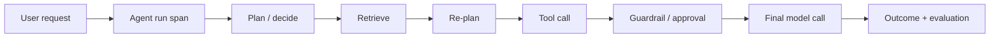

# 2026-08-26 — Agent Observability: Trace Decisions, Not Just LLM Calls

## Why this matters

A normal service trace answers: **where did the time go?** An agent trace must also answer: **why did the system choose this path?**

An agent may retrieve documents, rewrite a query, invoke tools, retry, ask for approval, or stop because a budget was exhausted. If you only trace the LLM API call, the most important behaviour is invisible.

OpenTelemetry's GenAI work now standardizes useful concepts such as agent/workflow identity, retrieval operations, tool execution, token usage and model operations. Treat those conventions as the telemetry vocabulary; add business-level decision attributes around them.

## Mental model: a flight recorder for the agent

Think of an agent run as a distributed transaction with **decisions** between calls.

- **Trace**: one end-to-end agent run.
- **Span**: one meaningful operation, such as retrieval, model inference or tool execution.
- **Event**: an important point inside a span, such as `approval_requested`.
- **Attribute**: structured metadata used to explain or aggregate behaviour.

The important architectural shift is: **instrument the harness, not only the model SDK.** The harness sees decisions that individual tools and model clients cannot see.

## Core components and request flow



A useful trace should let you reconstruct:

`request → decision → retrieval → evidence → decision → tool → approval → outcome`

That is much more useful than `request → LLM → LLM → LLM → response`.

## What should you capture?

Capture **operational facts and decisions**, not unrestricted chain-of-thought.

Useful attributes include agent/workflow/version, model/provider, prompt or skill version, selected tool and reason code, retrieval source/query/document IDs, evidence count or sufficiency result, retry number, approval outcome, token counts, latency/error type, and final evaluation score.

Avoid logging raw prompts, retrieved PII, secrets or full tool payloads by default. OpenTelemetry explicitly warns that GenAI input/output content can contain sensitive information.

## Concrete example: migration agent

Imagine a migration agent converting an integration flow to Spring Boot. It discovers source semantics, retrieves migration rules, generates code, runs tests and requests human approval before committing changes.

A weak production trace says: `LLM call = 8.2s`.

A useful trace says:

`migration-run → retrieve-rule[3 docs] → generate-code → test[failed] → diagnose → retrieve-rule[1 doc] → regenerate → test[passed] → approval[accepted]`

Now you can answer architectural questions: Are retries caused by weak retrieval? Which skill version produces more test failures? Which tools dominate latency? Are agents repeatedly retrieving after sufficient evidence already exists?

## Python implementation

Use OpenTelemetry spans at the harness boundary. Keep model/tool-specific instrumentation underneath it.

```python
from opentelemetry import trace

tracer = trace.get_tracer("migration-agent")


def run_agent(request, state):
    with tracer.start_as_current_span("invoke_agent") as run:
        run.set_attribute("gen_ai.workflow.name", "middleware_migration")
        run.set_attribute("agent.version", "2026.08")

        with tracer.start_as_current_span("retrieval") as span:
            docs = retrieve_rules(request)
            span.set_attribute("retrieval.result_count", len(docs))
            span.set_attribute("retrieval.source", "migration-rules")

        decision = decide_next_step(request, docs, state)
        run.add_event(
            "agent.decision",
            {"action": decision.action, "reason_code": decision.reason_code},
        )

        with tracer.start_as_current_span("execute_tool") as span:
            span.set_attribute("gen_ai.tool.name", decision.tool)
            result = execute_tool(decision)
            span.set_attribute("tool.success", result.ok)

        return result
```

Notice what is **not** stored: hidden reasoning text. Instead, the agent emits a bounded `reason_code`, such as `MISSING_API_MAPPING`, `TEST_FAILURE`, or `EVIDENCE_SUFFICIENT`.

### Java / Go note

The same architecture applies with OpenTelemetry SDKs for Java and Go. Put custom spans around the orchestration/harness layer, while HTTP, database and model instrumentation populate lower-level spans automatically where available.

## Metrics derived from traces

Start with five questions: **success**, **latency**, **cost**, **reliability**, and **behaviour**. A particularly useful architecture metric is **cost per successful task**, rather than token cost alone.

## Common mistakes and failure modes

**Tracing only LLM calls.** You see model latency but lose orchestration behaviour.

**Logging everything.** Raw prompts, retrieved documents and tool arguments can leak PII or secrets and create expensive telemetry.

**Using free-text decision explanations.** They are difficult to aggregate. Prefer stable reason codes plus optional redacted debugging context.

**No version metadata.** Without model, prompt, workflow and skill versions, regressions cannot be correlated to deployments.

**Metrics without traces.** A dashboard may tell you failure rate increased; traces explain which path produced the failures.

**Tracing without evaluation.** Operational success (`HTTP 200`) is not task success. Attach evaluation/outcome signals to the run.

## Enterprise use cases

- **Coding assistants:** correlate repository, skill version, tool sequence, tests and acceptance outcome.
- **Agentic RAG:** observe query rewrites, retrieval sources, evidence sufficiency and citation failures.
- **Migration automation:** compare failure/retry patterns across technologies and migration skills.
- **Customer-service agents:** audit tool use and approvals without unnecessarily storing sensitive conversation content.
- **Platform engineering:** compare multiple agent frameworks through a common OpenTelemetry-based telemetry model.

## Cloud mappings

Keep instrumentation portable and choose the backend separately.

- **AWS:** OpenTelemetry/ADOT → X-Ray or an OTLP-compatible observability backend.
- **Azure:** OpenTelemetry → Azure Monitor / Application Insights.
- **GCP:** OpenTelemetry → Cloud Trace / Cloud Monitoring or an OTLP backend.

The architectural principle is more important than the product mapping: **emit vendor-neutral telemetry from the agent harness.**

## 30–60 minute exercise

Take a simple tool-calling agent, or sketch one with `search_docs()` and `run_test()`.

1. Draw its expected span tree.
2. Add one parent `invoke_agent` span.
3. Add spans around retrieval and tool execution.
4. Add an `agent.decision` event using a small enum of reason codes.
5. Record token counts, result count, retry count and final success.
6. Run one successful and one deliberately failing request and compare the traces.

Do **not** log full prompts. The goal is to see whether you can reconstruct behaviour from structured telemetry.

## What to learn next

Next: **production traces as an evaluation dataset**. The important step is turning failed or unusual traces into reproducible offline test cases rather than treating observability and evals as separate systems.

## Reading

- [OpenTelemetry — Inside the LLM Call: GenAI Observability](https://opentelemetry.io/blog/2026/genai-observability/)
- [OpenTelemetry — GenAI semantic attributes](https://opentelemetry.io/docs/specs/semconv/registry/attributes/gen-ai/)
- [OpenTelemetry — AI Agent Observability](https://opentelemetry.io/blog/2025/ai-agent-observability/)
- [OpenTelemetry — Semantic Conventions](https://opentelemetry.io/docs/concepts/semantic-conventions/)
