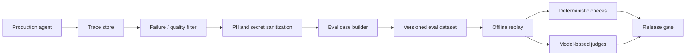

# 2026-08-27 — From Production Traces to Offline Evals

## Why this matters

Yesterday's observability layer tells you **what happened** in an agent run. The next engineering step is to turn important runs into tests so the same failure does not silently return after a prompt, model, tool, retrieval, or skill change.

For conventional software, production defects often become regression tests. Agent systems need the same discipline, but their inputs and outputs are probabilistic and their traces may contain retrieval results, tool calls, approvals, and model decisions. The useful unit is therefore not simply a prompt/response pair: it is an **evaluation case with expected invariants**.

## Mental model: incident → specimen → regression test

Think of a production trace like a flight recorder. You do not replay every flight forever. You select interesting flights, remove sensitive data, preserve the facts that matter, and convert them into simulator scenarios.

- **Trace:** recorded sequence of agent/model/tool/retrieval operations for one request.
- **Eval case:** stable input plus expected properties used to assess a future agent version.
- **Oracle:** rule deciding whether the case passed: deterministic code, reference data, or an LLM judge where needed.
- **Replay:** executing a saved case against a new agent version, normally with side effects stubbed or sandboxed.

## Core components and request flow



A practical flow is: capture traces at the harness boundary; select failures, human corrections, low-rated or unusual runs; sanitize them; extract stable inputs and expected invariants; stub mutable dependencies; replay against a candidate build; and compare results by failure category rather than only one aggregate score.

## Concrete example: migration agent

Suppose a migration agent converts an integration flow into a Spring Boot service. Discovery detects an HTTP listener and database operation, planning selects the right pattern, but generation omits transaction handling and review accepts it. A human catches the semantic mismatch.

Do not create an eval that expects an exact Java file. Preserve architectural invariants instead:

```json
{
  "case_id": "txn-017",
  "input": {
    "source_fixture": "fixtures/order-flow.xml",
    "goal": "migrate preserving transactional semantics"
  },
  "expected": {
    "discovered_capabilities": ["http_listener", "database", "transaction"],
    "plan_requires_transaction": true,
    "generated_code_must_preserve_transaction": true
  }
}
```

This survives model upgrades and prompt changes because it tests **semantic parity**, not wording.

## Python implementation pattern

```python
from dataclasses import dataclass
from typing import Callable

@dataclass
class EvalCase:
    case_id: str
    request: dict
    expected: dict
    tags: list[str]


def promote_trace(trace: dict) -> EvalCase:
    sanitized = redact_sensitive_data(trace)
    return EvalCase(
        case_id=sanitized["trace_id"],
        request=extract_stable_input(sanitized),
        expected=derive_invariants(sanitized),
        tags=["migration", sanitized["failure_stage"]],
    )


def run_case(case: EvalCase, agent: Callable) -> dict:
    result = agent(case.request, tools="stubbed")
    return {
        "capability_recall": check_capabilities(result, case.expected),
        "plan_valid": check_plan(result, case.expected),
        "semantic_parity": check_semantics(result, case.expected),
    }
```

The important architecture choice is `tools="stubbed"`. Offline evaluation should not accidentally update customer records, create cloud resources, commit code, or call unstable external systems.

### Where LLM judges fit

Use deterministic assertions first. Checking whether a migration plan contains a required transaction step should normally be code or schema validation. Use an LLM judge for qualities that genuinely require semantic interpretation. Store the judge model, prompt version and rubric with the result.

## Common mistakes and failure modes

- Saving every trace instead of curating representative cases.
- Persisting raw production traces containing PII, credentials or proprietary data.
- Asserting exact generated text instead of business and architectural invariants.
- Replaying live side effects instead of stubbing, recording/replaying or sandboxing tools.
- Keeping only failures and losing strong successful edge cases.
- Using one overall score rather than retrieval, routing, planning, tool, safety and outcome metrics.
- Letting the same model define and judge everything when deterministic ground truth exists.

## Enterprise use cases

This pattern is useful for coding assistants, migration agents, customer-service agents and RAG systems. Human-corrected code becomes a code-quality regression case; a wrongly routed request becomes a routing case; an unsupported RAG answer becomes a groundedness case; and an unsafe write proposal becomes an authorization/approval case.

At enterprise scale, treat the eval dataset as a governed engineering asset. Version it with agent releases, attach provenance, classify sensitivity, define retention, and make additions reviewable like code.

## Practical implementation guidance

**Python:** JSONL or Parquet is enough initially. Use pytest for deterministic checks and add an eval framework only when it removes real plumbing. Keep schemas explicit with dataclasses or Pydantic.

**Java:** model cases as records/POJOs, use JUnit parameterized tests, and mock tool adapters behind interfaces.

**Go:** table-driven tests map naturally to eval datasets. Put external tools behind interfaces and use fixture implementations during replay.

OpenTelemetry's GenAI conventions are useful because standardized attributes make traces easier to transform consistently across model and framework boundaries. Treat telemetry conventions as interoperability, not as your eval dataset schema.

## Cloud mappings

You do not need a dedicated AI-evaluation service to start. Use object storage for versioned datasets, CI/CD for replay, and the existing telemetry backend for trace selection.

- **AWS:** S3 + CI pipeline + OpenTelemetry backend; add Bedrock evaluation where useful.
- **Azure:** Blob Storage + Azure DevOps/GitHub Actions + Azure Monitor/Application Insights/OpenTelemetry.
- **GCP:** Cloud Storage/BigQuery + Cloud Build/GitHub Actions + Cloud Trace/OpenTelemetry; Vertex AI evaluation can complement custom checks.

Keep the eval case format portable so cloud evaluation products remain replaceable adapters.

## 30–60 minute exercise

Take one agent workflow—preferably migration or RAG—and define **five regression cases** without calling an LLM. For each, record stable input, expected architectural/business invariant, deterministic pass/fail rule, tool dependencies that must be stubbed, and tags such as `retrieval`, `planning`, `tool`, `safety`, or `outcome`.

Then write one Python function that loads the five cases and prints a per-stage scorecard. The goal is to learn to design **testable agent behavior**.

## What to learn next

Next: **eval gates, baseline comparison, acceptable regression budgets, and canary/online evaluation**. This closes the loop from production telemetry → regression dataset → pre-release evidence → production monitoring.

## Reading

1. [OpenTelemetry GenAI semantic attributes](https://opentelemetry.io/docs/specs/semconv/registry/attributes/gen-ai/)
2. [OpenTelemetry trace semantic conventions](https://opentelemetry.io/docs/specs/semconv/general/trace/)
3. [Inside the LLM Call: GenAI Observability with OpenTelemetry](https://opentelemetry.io/blog/2026/genai-observability/)
4. [OpenTelemetry Agent Service demo](https://opentelemetry.io/docs/demo/services/agent/)

---

**Key takeaway:** Observability becomes substantially more valuable when selected production traces are promoted into sanitized, versioned regression cases. Test stable invariants, replay safely, and use deterministic oracles wherever possible.
