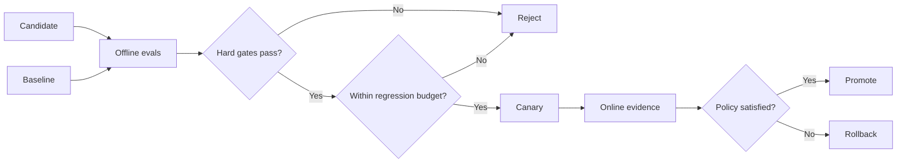

# Eval Release Gates: Stop Agent Regressions Before Production

## Why this matters
Yesterday's topic turned production traces into offline regression cases. The next question is what the delivery pipeline should do when those evals regress. A mature agent platform converts important evaluation results into release policy.

## Mental model: CI tests with a quality budget
Normal software builds combine hard tests with bounded performance tolerances. Agent delivery needs the same structure.

- **Hard gate:** a property that must not regress, such as tool authorization or generated-code compilation.
- **Baseline:** the accepted agent version.
- **Candidate:** the version proposed for release.
- **Regression budget:** maximum tolerated degradation in a graded metric.
- **Canary:** limited production exposure after offline checks pass.

The model can produce behavior and scores, but the delivery system owns release authority.

## Request flow


Run baseline and candidate against the same versioned cases, apply deterministic gates first, compare graded metrics second, then use a canary to validate residual uncertainty.

## Concrete example: migration agent
For an integration-to-Spring-Boot migration agent, a policy could require 100% generated-project compilation, zero forbidden dependencies, at least 98% semantic preservation, no more than a one-point task-success regression, no more than 10% additional tool calls, and bounded execution-cost growth.

Compilation and authorization are hard gates. Task quality, latency, and cost are usually regression-budget metrics.

## Python implementation
```python
from dataclasses import dataclass

@dataclass
class EvalResult:
    compile_rate: float
    policy_violations: int
    semantic_preservation: float
    task_success: float
    avg_tool_calls: float


def release_gate(baseline, candidate):
    failures = []
    if candidate.compile_rate < 1.0:
        failures.append("compile rate below 100%")
    if candidate.policy_violations != 0:
        failures.append("policy violation detected")
    if candidate.semantic_preservation < 0.98:
        failures.append("semantic preservation below 98%")
    if candidate.task_success < baseline.task_success - 0.01:
        failures.append("task-success regression exceeds budget")
    if candidate.avg_tool_calls > baseline.avg_tool_calls * 1.10:
        failures.append("tool-call budget exceeded")
    return failures
```

The important boundary is that this code consumes eval results rather than model reasoning. The release decision remains deterministic and auditable.

### Java and Go note
In Java, represent policy with immutable records and run it as a CI build stage. In Go, a small binary reading versioned JSON results is sufficient. Keep thresholds in version-controlled policy rather than prompts.

## Offline gate versus online canary
Offline evaluation asks whether known behavior regressed. Canary evaluation asks whether the candidate remains acceptable under real production distributions. Use them sequentially: `offline eval -> release gate -> small canary -> online comparison -> promotion`.

## Common mistakes
A single aggregate score can hide serious failures. Absolute thresholds without baseline comparison miss relative regressions. Changing the dataset during comparison invalidates the experiment. Deterministic properties such as compilation, schemas and authorization should not rely on an LLM judge. Cost, latency and critical workload segments should also be evaluated separately.

## Enterprise use cases
Coding assistants can gate compilation, tests, unsafe operations and task completion. Agentic RAG can gate retrieval quality, groundedness, unsupported claims and latency. Customer-service agents can make authorization violations zero-tolerance. Migration automation can require deterministic artifact and parity checks before considering graded semantic quality.

## Practical implementation guidance
Version eval cases, evaluator configuration and release thresholds in source control. Give each candidate an identifier covering model, prompt, skills, tools and retrieval configuration. Run baseline and candidate in the same environment, emit machine-readable results, preserve per-case deltas, and promote only through predefined canary and rollback rules.

AWS CodeBuild/CodePipeline, Azure DevOps or GitHub Actions, and Google Cloud Build can all implement the same pattern; the architectural boundary matters more than the product.

## 30-60 minute exercise
Create `baseline.json` and `candidate.json` for a small agent. Define two zero-tolerance gates, three graded metrics, one cost or latency metric, and one critical workload segment. Implement a Python gate that reports the violated policies. Deliberately introduce three regressions and confirm the pipeline rejects them without asking an LLM whether release should proceed.

## What to learn next
Next: canary and online evaluation for agents—shadow traffic, production sampling, human feedback, rollback signals, and feeding production evidence back into offline regression suites.

## Reading
1. [OpenAI Evals guide](https://platform.openai.com/docs/guides/evals)
2. [Anthropic: Demystifying evals for AI agents](https://www.anthropic.com/engineering/demystifying-evals-for-ai-agents)
3. [Google Cloud Vertex AI evaluation](https://cloud.google.com/vertex-ai/generative-ai/docs/models/evaluation-overview)
4. [Microsoft Azure AI evaluation](https://learn.microsoft.com/en-us/azure/ai-foundry/how-to/develop/flow-evaluate-sdk)
5. [LangSmith evaluation concepts](https://docs.langchain.com/langsmith/evaluation-concepts)

## Architect takeaway
An eval metric becomes operationally meaningful when it has a release consequence. Keep safety and contract invariants deterministic, compare candidates with a frozen baseline, explicitly budget acceptable regressions, and use canaries after the offline gate passes.
