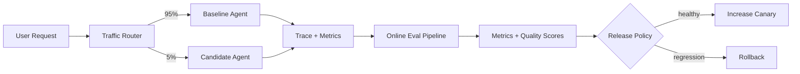

# Online Evals and Canary Releases for AI Agents

## Why this matters
Offline evals tell you whether an agent is ready to ship. Online evals tell you whether it remains effective under real traffic, live tools, changing data, permissions, latency and real user behavior. A **canary release** sends a small controlled percentage of production traffic to a candidate agent version before broad rollout.

For an architect, the distinction is: **offline eval = pre-release quality gate; online eval = production feedback and risk control.**

## Mental model
Treat an agent change like any high-impact distributed-system release:

**offline eval → small canary → observe → compare → promote or rollback**

The model may help measure semantic quality, but deterministic release policy should decide whether traffic expands.

## Core terms
- **Baseline:** current production agent version.
- **Candidate:** new version under evaluation.
- **Canary:** small percentage of real traffic routed to the candidate.
- **Online eval:** evaluation using production interactions or signals.
- **Guardrail metric:** metric that must remain inside a hard boundary.
- **Rollback:** returning candidate traffic to the baseline.
- **LLM judge:** model used to score outputs when deterministic comparison is impractical.

## Request flow


Use two paths. **Synchronous guardrails** run in the request path for conditions that must be blocked immediately. **Asynchronous online evals** inspect sampled traces after completion for quality, groundedness, task success and unexpected behavior.

## Concrete example: migration assistant
Suppose an enterprise migration assistant analyzes legacy integration flows and generates modernization plans. Version `v17` is production; `v18` changes retrieval and planning logic.

After offline evals pass, `v18` receives 5% of eligible traffic. Capture task completion, unsupported tool-call rate, human correction rate, retrieval/token cost, latency, policy violations and sampled semantic quality.

A release policy might require zero critical authorization violations, no more than 2% task-success regression versus `v17`, p95 latency below 12 seconds, and no more than 15% cost increase.

## Python implementation
```python
from dataclasses import dataclass

@dataclass
class Metrics:
    task_success: float
    critical_violations: int
    p95_latency_s: float
    avg_cost: float


def release_decision(baseline: Metrics, candidate: Metrics) -> str:
    if candidate.critical_violations > 0:
        return "ROLLBACK"

    success_regression = baseline.task_success - candidate.task_success
    cost_growth = (candidate.avg_cost / baseline.avg_cost) - 1

    if success_regression > 0.02:
        return "HOLD"
    if candidate.p95_latency_s > 12:
        return "HOLD"
    if cost_growth > 0.15:
        return "HOLD"

    return "PROMOTE"
```

Notice that the LLM does not return `PROMOTE`. Models can score qualitative behavior, but the release controller consumes scores as data and applies explicit policy.

For semantic evaluation, sample production traces instead of evaluating every request:

```python
def should_sample(trace_id: str, rate: int = 10) -> bool:
    return hash(trace_id) % 100 < rate
```

Sanitize sensitive data before sending traces into evaluation pipelines.

### Java and Go
In Java, keep release policy in an ordinary typed service and emit evaluation events through your telemetry/event pipeline. In Go, a small stateless policy service works well. Neither requires an agent framework.

## What should you measure?
1. **Safety and authority:** unauthorized tool calls, approval bypasses, policy violations.
2. **Task outcome:** completion, abandonment, escalation, correction rate.
3. **Quality:** groundedness, correctness, plan validity, code acceptance.
4. **Operational health:** latency, tool errors, retries and timeouts.
5. **Economics:** tokens, model calls, retrieval calls and cost per successful task.

The useful denominator is often **cost per successful task**, not cost per request.

## Common mistakes
- Using averages while ignoring tail latency and workflow-specific regressions.
- Letting an LLM judge directly control rollout.
- Comparing baseline and candidate on materially different traffic.
- Evaluating every trace with an expensive judge model instead of sampling.
- Missing model, prompt, skill, retrieval, tool-schema and harness version metadata.
- Running a canary without predefined rollback conditions.

## Enterprise use cases
Coding-assistant upgrades, retriever/reranker changes, migration agents, customer-service agents with backend tools, skill/tool-schema upgrades, and model-provider migrations all benefit from this pattern.

## Architecture guidance
Treat online evaluation as part of the **agent platform control plane**, not application prompt logic. The runtime emits versioned traces and outcome events. An evaluation pipeline computes metrics. A deployment controller applies release policy. This separation lets the same evaluation infrastructure govern many agents.

A practical rollout ladder is `1% → 5% → 20% → 50% → 100%`, with a minimum observation window and sample count at each stage. High-risk workflows can remain excluded until later stages.

Cloud mappings are conventional: AWS can combine CloudWatch/X-Ray, EventBridge or Kinesis and deployment controls; Azure can use Application Insights/OpenTelemetry, Event Hubs and traffic routing; GCP can use Cloud Trace/Monitoring, Pub/Sub and service traffic splitting. Keep the evaluation schema portable with trace IDs and explicit agent-version attributes.

## 30–60 minute exercise
Choose one agent workflow and design its canary policy. Define a baseline and candidate, five production metrics, two hard rollback conditions, two promotion conditions, a semantic-eval sampling rate and the trace metadata needed to diagnose regression.

Implement `release_decision()` and write at least six tests: healthy promotion, quality regression, safety violation, latency regression, cost regression and insufficient sample size.

## What to learn next
Next: **multi-agent patterns** — when specialist agents improve a system, when they merely increase latency and failure modes, and how to keep orchestration deterministic where possible.

## Reading
- [OpenAI — Evals guide](https://platform.openai.com/docs/guides/evals)
- [OpenAI — Evaluation best practices](https://platform.openai.com/docs/guides/evaluation-best-practices)
- [OpenTelemetry — GenAI semantic conventions](https://opentelemetry.io/docs/specs/semconv/gen-ai/)
- [Google SRE — Canarying Releases](https://sre.google/workbook/canarying-releases/)
- [Microsoft — Safe deployment practices](https://azure.microsoft.com/en-us/blog/advancing-safe-deployment-practices/)
