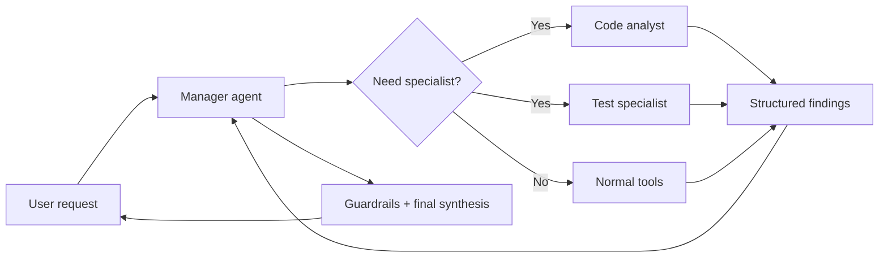

# 2026-08-31 — Multi-Agent Patterns: When Specialists Actually Help

## Why this matters

A multi-agent system is simply an application in which more than one LLM-driven agent participates in completing a request. The important architectural question is not **how many agents can I create?** It is **what boundary justifies another autonomous reasoning loop?**

For most enterprise workflows, start with one agent plus tools. Add another agent only when it creates a clear boundary: isolated context, parallel exploration, or specialist instructions/tools that would make one generalist prompt unwieldy.

## Mental model: a software team, not microservices for prompts

Think of a single agent as a capable engineer with several tools. Do not create a new employee for every function they call.

Create a specialist when you would plausibly assign a distinct work package to another engineer: security review, database analysis, test design, or an independent research stream. The orchestrator owns the overall outcome; specialists own bounded subtasks.

**Tool = capability. Agent = delegated decision-making boundary.**

If the subtask is deterministic, expose a tool. If it requires its own reasoning, context, tool selection, and possibly several steps, a specialist agent may be justified.

## Three patterns to know

1. **Single agent + tools** — one reasoning loop owns the request and invokes deterministic capabilities. This should be your default.
2. **Manager + specialists** — one manager retains control and invokes specialist agents like tools. Specialists return results; the manager synthesizes the final answer.
3. **Handoff** — a routing agent transfers control to a specialist. The specialist becomes responsible for the next part of the interaction.

OpenAI's Agents SDK explicitly distinguishes manager-style orchestration from handoffs: use agents as tools when the manager should retain ownership; use handoffs when the specialist should take over.

## Core components and request flow



The important boundary is the **specialist contract**. A specialist should receive a bounded task and return structured findings rather than an uncontrolled transcript.

## Concrete example: migration assessment

Suppose an agent is assessing a legacy integration application for migration.

A poor design creates agents called `file_reader_agent`, `xml_agent`, `api_agent`, `report_agent`, and `writer_agent`. Most of those are capabilities and should be tools or deterministic code.

A stronger design has one **Migration Manager** and perhaps two genuine specialists:

- **Semantic Analysis Specialist** — understands routes, transformations, error handling, transactions, and external dependencies.
- **Test/Parity Specialist** — independently determines what behavioural evidence is needed to prove the migrated implementation is equivalent.

The independence of the parity specialist is useful because it reduces the risk of the same reasoning process both implementing and approving its own assumptions.

## Python implementation sketch

Keep orchestration explicit before adopting a framework abstraction.

```python
from dataclasses import dataclass

@dataclass
class SpecialistResult:
    specialist: str
    summary: str
    findings: list[str]
    confidence: float

async def analyze_semantics(artifact: str) -> SpecialistResult:
    return SpecialistResult(
        specialist="semantic-analysis",
        summary="Two transactional routes discovered",
        findings=["JMS transaction", "retry policy", "REST dependency"],
        confidence=0.91,
    )

async def design_parity_tests(artifact: str) -> SpecialistResult:
    return SpecialistResult(
        specialist="parity-testing",
        summary="Four behavioural contracts require validation",
        findings=["retry semantics", "rollback", "mapping", "error response"],
        confidence=0.88,
    )

async def migration_manager(artifact: str):
    semantic = await analyze_semantics(artifact)
    parity = await design_parity_tests(artifact)

    if min(semantic.confidence, parity.confidence) < 0.75:
        return {"status": "human_review", "semantic": semantic, "parity": parity}

    return {"status": "ready", "semantic": semantic, "parity": parity}
```

The code looks deliberately ordinary. Multi-agent architecture should not remove normal software-engineering controls. Agent outputs are typed inputs to the next application step.

### Parallel execution

If specialists are independent, execute them concurrently with `asyncio.gather`. Do not parallelize dependent reasoning merely to claim a multi-agent design.

```python
semantic, parity = await asyncio.gather(
    analyze_semantics(artifact),
    design_parity_tests(artifact),
)
```

### Java and Go notes

In Java, model each specialist behind a typed interface returning a record/POJO; use `CompletableFuture` or virtual threads for independent specialists. In Go, use interfaces plus goroutines and `errgroup` for bounded parallel work. The architectural principle is language-independent: the orchestrator owns lifecycle, budgets, authorization, tracing, and result aggregation.

## Manager versus handoff

Use a **manager** when one component must own the final result, apply shared policy, compare specialist outputs, or call several specialists. This fits architecture analysis, research, migration, and code-review workflows.

Use a **handoff** when ownership itself changes. Customer-service triage is the classic example: the router recognizes a billing issue and transfers the conversation to a billing specialist. Handoffs should have explicit routing descriptions and filtered context; forwarding the entire history blindly increases token cost and leaks irrelevant context.

## Common mistakes and failure modes

- **Agent-per-step architecture:** replacing a normal workflow graph with multiple LLM calls increases latency, cost, and nondeterminism without adding reasoning value.
- **Shared giant context:** every specialist receives everything, defeating context isolation and increasing distraction.
- **Unstructured specialist output:** the manager must interpret prose instead of consuming a stable contract.
- **Circular delegation:** agents can repeatedly delegate unless the harness imposes depth, call, token, and time budgets.
- **Duplicated authority:** two agents can perform the same side effect. Keep authorization and irreversible actions in the harness, not in informal agent cooperation.
- **No independent evaluation:** a multi-agent workflow needs routing accuracy, specialist quality, synthesis quality, latency, token cost, and tool-call metrics.

## Enterprise use cases

Multi-agent patterns are strongest where boundaries already exist in the domain: architecture assessment with security and data specialists; migration analysis with semantic and parity specialists; incident investigation with parallel log, deployment, and dependency analysis; due diligence across independent document sets; and customer-service routing where specialists have different policies and permissions.

They are weaker for predictable CRUD workflows, linear approval processes, deterministic transformations, and simple RAG question answering. Those usually need workflows and tools rather than multiple agents.

## Practical implementation guidance

Start with a single-agent baseline and measure it. Introduce a specialist only for a demonstrated failure mode or scaling constraint. Give each specialist a narrow instruction set, minimal context, explicit tools, a typed output schema, and a budget. Keep durable state outside the model. Trace delegation as a first-class event: `manager -> specialist`, input context IDs, tool calls, result schema, latency, tokens, and reason for delegation.

For write operations, the specialist should normally propose an action; the orchestrator applies authorization, guardrails, approval policy, and the actual side effect. This keeps the security boundary deterministic.

Cloud services are not required to implement this pattern. On AWS, Azure, or GCP, treat agents as application components and use the platform's model endpoints, identity, queues/workflows, observability, and isolated execution services where appropriate rather than expecting a cloud-specific multi-agent primitive to solve orchestration design.

## 45-minute design exercise

Take a coding or migration assistant you already understand and draw two architectures: **A: one agent + tools**, and **B: manager + two specialists**. For each specialist in B, write its input schema, output schema, allowed tools, context it must not receive, maximum tool calls, and one measurable reason it improves on A. If you cannot identify a measurable advantage, delete that specialist.

Then define three evals: routing correctness, specialist task success, and end-to-end outcome quality. Add latency and token cost as non-quality metrics.

## What to learn next

Next, study **multi-agent context isolation and contracts**: exactly what context a specialist should receive, how results should be summarized, and how to prevent delegation chains from becoming an expensive shared-chat transcript.

## Reading

1. [OpenAI Agents SDK — Handoffs](https://openai.github.io/openai-agents-python/handoffs/) — concrete distinction between delegation and specialist takeover.
2. [OpenAI Agents SDK — Agent orchestration](https://openai.github.io/openai-agents-js/guides/multi-agent/) — manager versus handoff trade-offs.
3. [OpenAI Agents SDK — Quickstart](https://openai.github.io/openai-agents-python/quickstart/) — minimal routing example and execution model.
4. [Anthropic — Building Effective AI Agents](https://resources.anthropic.com/hubfs/Building%20Effective%20AI%20Agents-%20Architecture%20Patterns%20and%20Implementation%20Frameworks.pdf) — architecture patterns and cases where multi-agent decomposition becomes useful.

---

**Architecture takeaway:** use multiple agents to create meaningful reasoning boundaries, not to imitate a microservice diagram. Start with one agent plus tools; add specialists only for context isolation, parallel independent work, or genuine specialization.
