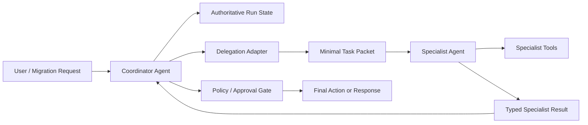

# Multi-Agent Context Isolation and Specialist Contracts

## Why this matters
Yesterday's lesson established a useful default: start with one agent plus tools and introduce specialists only when they create measurable value. The next problem is **context isolation**.

A naive multi-agent implementation forwards the entire conversation, every tool result, and every intermediate artifact to each specialist. In enterprise workflows that increases token cost, distracts specialists, leaks unnecessary data across boundaries, and couples agents to each other's prompt formats.

The goal is not "share context." It is **share the minimum contract required to perform the delegated task**.

## Mental model: a specialist is an internal service
Treat a specialist like a well-designed microservice. The coordinator owns workflow state; a delegation adapter builds a small task packet; the specialist works in isolated model context; it returns a typed result; the coordinator merges that result.

Three terms matter:

- **Run context:** application-owned state such as tenant ID, authorization policy, trace ID, repositories, and service clients.
- **Model context:** information actually sent to the LLM: instructions, task, selected evidence, and relevant history.
- **Specialist contract:** explicit input and output schemas governing delegation.

## Request flow



A task packet normally contains goal, scope, relevant evidence, constraints, and output schema. Do not automatically include the complete transcript.

## Concrete example: migration dependency analysis

```python
from pydantic import BaseModel, Field
from typing import Literal

class DependencyTask(BaseModel):
    flow_name: str
    source_snippet: str
    allowed_dependencies: list[str]
    target_runtime: Literal["spring-boot", "python", "go"]

class DependencyFinding(BaseModel):
    dependency: str
    evidence: str
    confidence: float = Field(ge=0, le=1)

class DependencyResult(BaseModel):
    flow_name: str
    findings: list[DependencyFinding]
    unresolved_questions: list[str]
```

Build specialist input from authoritative state rather than forwarding conversation history:

```python
def build_dependency_task(state, flow) -> DependencyTask:
    return DependencyTask(
        flow_name=flow.name,
        source_snippet=flow.relevant_source,
        allowed_dependencies=state.policy.allowed_dependencies,
        target_runtime=state.target_runtime,
    )
```

Use native structured outputs where your agent framework supports them.

## Handoff versus agent-as-tool
**Handoff** transfers conversation ownership to a specialist. **Agent as tool** keeps the coordinator in control and delegates a bounded task. OpenAI's Agents SDK documents that handoffs normally carry conversation history unless it is filtered, making input filtering an important isolation control.

For architecture analysis, migration planning, compliance checking, and code review, agent-as-tool is often the cleaner default: **handoff transfers ownership; agent-as-tool delegates work.**

## Keep authoritative state outside the prompt

```python
from dataclasses import dataclass

@dataclass
class RunContext:
    tenant_id: str
    trace_id: str
    user_permissions: set[str]
    migration_repo: object
    approval_service: object
```

Do not stringify this object into prompts. Tools receive runtime dependencies from the harness. The LLM sees only values necessary for its current decision. Authorization remains deterministic application logic, not prompt text.

## Context isolation policy

```python
SPECIALIST_POLICY = {
    "dependency_analyzer": {
        "input_fields": ["flow_name", "source_snippet", "allowed_dependencies", "target_runtime"],
        "tools": ["search_repository", "lookup_dependency_catalog"],
        "output_type": "DependencyResult",
        "max_steps": 5,
    }
}
```

This registry also supports tracing, evaluation, and governance.

## Common mistakes and failure modes
1. **Forwarding the whole transcript:** irrelevant context and token growth. Build a fresh task packet.
2. **Passing summaries as facts:** summaries can distort evidence. Pass compact source evidence with provenance for critical claims.
3. **Prose as inter-agent protocol:** use typed schemas instead.
4. **Every tool for every specialist:** use capability-specific tool allowlists.
5. **Confusing context isolation with security isolation:** enforce tenant, filesystem, network, and authorization boundaries outside the LLM.
6. **Unlimited delegation chains:** cap depth, steps, tokens, and allowed delegation paths.

## Enterprise use cases
Useful boundaries include migration discovery/dependency/planning/review specialists; repository explorer/implementation/test/security agents; incident triage with platform specialists; regulated workflows with minimum-data exposure; and enterprise RAG specialists for source code, architecture docs, tickets, and telemetry.

## Practical implementation guidance
Keep domain contracts independent of your agent framework:

```python
from typing import Protocol, TypeVar

I = TypeVar("I")
O = TypeVar("O")

class Specialist(Protocol[I, O]):
    async def invoke(self, task: I) -> O: ...
```

Then orchestration remains deterministic:

```python
async def run_flow_analysis(state, flow):
    task = build_dependency_task(state, flow)
    result = await specialists["dependency_analyzer"].invoke(task)
    if result.unresolved_questions:
        state.review_queue.extend(result.unresolved_questions)
    state.dependency_results[flow.name] = result
```

This lets you replace OpenAI Agents SDK, LangGraph, Semantic Kernel, Google ADK, or a custom loop without changing the domain contract.

**Java:** records + Bean Validation/Jackson schemas work well for task/result contracts. **Go:** explicit structs and narrow interfaces keep specialist implementations bounded.

## Cloud mapping
Cloud services sit around the boundary rather than defining it. AWS Step Functions, Azure Durable Functions, or GCP Workflows can own durable orchestration while model-backed specialists perform bounded reasoning. The workflow system should own authoritative state and policy.

## 30–60 minute exercise
Take a migration workflow with `discovery`, `planner`, `code_generator`, and `reviewer`. Create Pydantic input/output contracts for only the planner. Include discovered components, target constraints, approved technology choices, and relevant source evidence. Return ordered tasks, dependencies, risks, unresolved questions, and confidence.

Then identify which original conversation information the planner truly needs and which information must stay in deterministic runtime state. If the planner still needs the complete transcript, simplify the contract again.

## What to learn next
Next: **delegation governance** — allowed agent-to-agent paths, delegation depth, budgets, approvals, and failure recovery.

## Reading
1. [OpenAI Agents SDK — Handoffs](https://openai.github.io/openai-agents-python/handoffs/)
2. [OpenAI Agents SDK — Context management](https://openai.github.io/openai-agents-python/context/)
3. [Anthropic — Building effective agents](https://www.anthropic.com/research/building-effective-agents)
4. [Anthropic — Effective context engineering for AI agents](https://www.anthropic.com/engineering/effective-context-engineering-for-ai-agents)
5. [Anthropic — How we built our multi-agent research system](https://www.anthropic.com/engineering/multi-agent-research-system)
