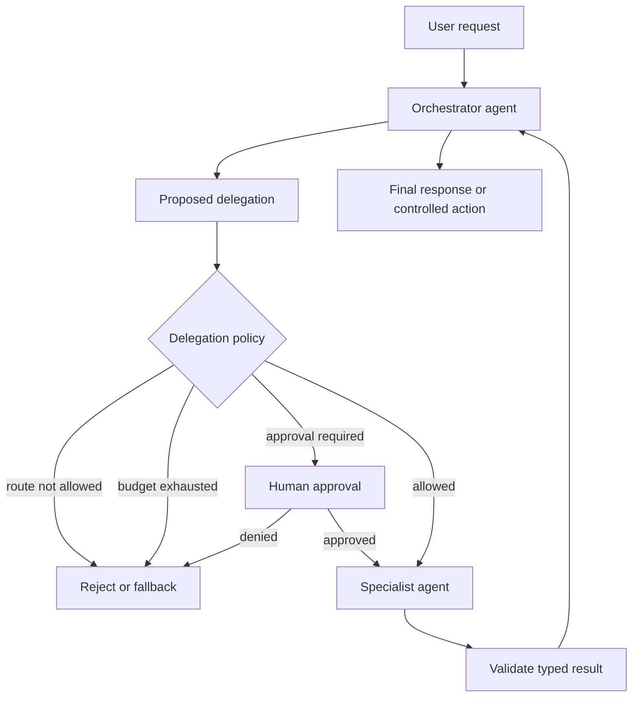

# Delegation Governance: Put Policy Around Agent-to-Agent Handoffs

## Summary
A multi-agent system should not behave like an open chat room where any agent can invoke any other agent indefinitely. Treat **delegation as a governed control-plane operation**: the model may propose *who should act next*, but the harness enforces whether that transition is allowed, affordable, authorized, and safe.

The architectural rule is simple: **LLMs choose within policy; code owns policy.**

## Why this matters
Once you introduce specialist agents, you introduce a new failure surface: delegation itself. A billing agent might invoke a customer-profile agent, which invokes a remediation agent, which invokes billing again. Even if every individual agent is well designed, the system can still produce loops, excessive token spend, privilege escalation, duplicated side effects, or an unclear audit trail.

Frameworks provide handoff and orchestration primitives, but enterprise governance remains your responsibility. OpenAI's Agents SDK supports typed handoff input, authorization logic in `on_handoff`, input filtering, and conditional enablement. Semantic Kernel exposes several orchestration patterns. These are mechanisms; your harness must supply policy.

## Mental model: an API gateway for agent delegation
Think of every agent as an internal service and every handoff as an API call across a trust boundary.

An API gateway does not let a caller invoke arbitrary services simply because it knows their names. It checks routes, identity, authorization, quotas, and policy. Your **delegation controller** should do the same for agent-to-agent transitions.

The model can say: `I need the security specialist.` The controller answers: `Is Planner → Security allowed? Is the caller authorized? Is depth < 3? Is budget available? Does this action require approval?`

## Core components
- **Delegation graph** — explicit allow-list of valid source-agent → target-agent transitions.
- **Delegation contract** — typed task input and typed result expected from the specialist.
- **Run context** — authoritative workflow state such as identity, tenant, correlation ID, budget, and current delegation depth.
- **Budget policy** — limits on turns, tokens, cost, elapsed time, and specialist calls.
- **Authorization policy** — determines whether this user/workflow may invoke the target capability.
- **Approval gate** — pauses before sensitive actions such as production writes or destructive changes.
- **Recovery policy** — deterministic behavior for timeout, refusal, invalid output, or specialist failure.
- **Trace/audit record** — records proposed delegation, policy decision, target, reason, latency, and outcome.

## Request flow


Notice what is *not* delegated to the model: maximum depth, authorization, budgets, and approval rules.

## Concrete example: middleware migration assistant
Suppose a migration orchestrator converts legacy integration flows into Spring Boot services. You have four specialists: `discovery`, `planner`, `codegen`, and `reviewer`.

A sensible graph might allow `discovery → planner → codegen → reviewer`. It should **not** automatically allow `reviewer → codegen → reviewer` forever. If review fails, the harness may permit one bounded repair cycle and then require human intervention.

The reviewer can recommend a repair, but it should not own the retry policy.

## Python implementation: keep policy outside the agents
```python
from dataclasses import dataclass
from typing import Literal

AgentName = Literal["discovery", "planner", "codegen", "reviewer"]

ALLOWED = {
    "discovery": {"planner"},
    "planner": {"codegen"},
    "codegen": {"reviewer"},
    "reviewer": {"codegen"},   # bounded repair only
}

@dataclass
class RunPolicy:
    depth: int = 0
    max_depth: int = 4
    specialist_calls: int = 0
    max_specialist_calls: int = 5
    repair_cycles: int = 0
    max_repair_cycles: int = 1

class DelegationDenied(Exception):
    pass

def authorize_handoff(source: AgentName, target: AgentName, policy: RunPolicy):
    if target not in ALLOWED.get(source, set()):
        raise DelegationDenied(f"route denied: {source} -> {target}")
    if policy.depth >= policy.max_depth:
        raise DelegationDenied("delegation depth exceeded")
    if policy.specialist_calls >= policy.max_specialist_calls:
        raise DelegationDenied("specialist-call budget exceeded")
    if source == "reviewer" and target == "codegen":
        if policy.repair_cycles >= policy.max_repair_cycles:
            raise DelegationDenied("repair budget exceeded")
        policy.repair_cycles += 1
    policy.depth += 1
    policy.specialist_calls += 1
```

The LLM can still decide that `reviewer` should request a repair. But `authorize_handoff()` determines whether the repair is permitted.

### Framework note
If you use OpenAI Agents SDK handoffs, perform authorization before side effects in the handoff callback and use an input filter to control conversation history passed to the receiving agent. The same architectural idea applies to LangGraph edges, Semantic Kernel orchestration, Google ADK delegation, or a custom Python loop: **framework routing is not governance**.

### Java and Go note
In Java, model the delegation graph and policies as normal domain objects/interceptors rather than embedding them in prompts. In Go, a small middleware function around agent invocation works well; pass a typed `RunContext` containing budgets and identity through `context.Context` or an explicit request structure. In either language, keep policy deterministic and unit-testable.

## Common mistakes and failure modes
1. **Putting allowed delegation rules in the system prompt.** A prompt is guidance, not an authorization boundary.
2. **Fully connected agent graphs.** More possible transitions mean more unpredictable paths and harder testing.
3. **No depth limit.** Agent A → B → C → A can consume budget without making progress.
4. **Shared credentials for every specialist.** A read-only analyst should not inherit a production-write token merely because another agent has one.
5. **Retries controlled by the LLM.** Retry count, backoff, and escalation should be harness policy.
6. **Passing the full transcript on every handoff.** This increases cost, leaks irrelevant context, and weakens specialist isolation.
7. **No typed result validation.** A specialist's prose should not silently become authoritative workflow state.
8. **Approval after the side effect.** Approval must occur before a sensitive tool invocation.

## Enterprise use cases
**Migration automation:** allow discovery → planning → execution → review, with a bounded repair loop and human approval before repository merge or deployment.

**Customer service:** triage can delegate to billing or technical support, but only an authorized account-management capability may perform profile changes.

**Security operations:** investigation agents may gather evidence freely within read-only tools, while containment actions require a separate privileged agent plus approval.

**Software delivery:** a coding agent may delegate to test and review specialists, but deployment remains behind deterministic CI/CD and environment policy.

## Practical architecture guidance
Start with a small directed graph, not a generic agent registry. For every edge, define five things: **purpose, input schema, output schema, budget, and authorization requirement**.

Keep identity and workflow state in the harness rather than in model-visible conversation text. Give each specialist the least-privileged tools required for its job. Record every attempted delegation—even denied ones—as trace events. Make failure recovery explicit: fallback to orchestrator, retry once, request approval, or terminate.

Most importantly, test the graph itself. Unit tests should verify forbidden edges, maximum depth, repair-loop limits, budget exhaustion, and approval requirements without calling an LLM.

## Cloud mapping
You usually do not need a special cloud service for delegation policy. Implement it in the application/harness and use cloud primitives around it:

- **AWS:** IAM for tool permissions, Step Functions when deterministic workflow state is useful, CloudWatch/OpenTelemetry for traces.
- **Azure:** Entra ID/RBAC for identity and permissions, Durable Functions for durable deterministic workflows, Azure Monitor/Application Insights for telemetry.
- **GCP:** IAM for permissions, Workflows for durable orchestration, Cloud Trace/Logging or OpenTelemetry for observability.

The agent framework can change; these control-plane concerns should remain portable.

## 30–60 minute design exercise
Take a four-stage migration agent workflow: `discover`, `plan`, `execute`, `review`.

1. Draw the allowed delegation graph.
2. Add one repair edge from `review → execute`.
3. Set maximum delegation depth and maximum repair count.
4. Mark which transitions require human approval.
5. Define a typed input/output contract for the `execute` specialist.
6. Write 5 unit tests for forbidden or exhausted delegation paths.

Stretch goal: add a `DelegationDecision` trace event containing source, target, reason, policy result, depth, and remaining budget.

## What to learn next
Next, move from **delegation governance** to **multi-agent failure recovery and idempotency**: how to resume a partially completed workflow without replaying side effects or losing authoritative state.

## Reading
- [OpenAI Agents SDK — Handoffs](https://openai.github.io/openai-agents-python/handoffs/)
- [OpenAI Agents SDK — Handoff reference](https://openai.github.io/openai-agents-python/ref/handoffs/)
- [Microsoft Semantic Kernel — Agent Orchestration](https://learn.microsoft.com/en-us/semantic-kernel/frameworks/agent/agent-orchestration/)
- [Microsoft Semantic Kernel — Agent Architecture](https://learn.microsoft.com/en-us/semantic-kernel/frameworks/agent/agent-architecture)
