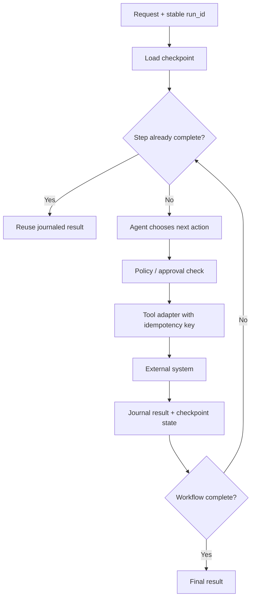

# 2026-09-03 — Durable Agent Workflows: Resume Safely Without Replaying Side Effects

## Why this matters
A normal request handler can often be retried from the beginning. An agent workflow is different: before it fails, it may already have created a ticket, updated a repository, called a migration API, or requested human approval. Blindly rerunning the workflow can repeat those side effects.

For enterprise agents, **recovery is therefore an architecture concern, not merely an LLM retry setting**.

## Mental model: a resumable workflow, not a long chat
Think of the agent as a workflow engine with an LLM making selected decisions. After every important step, the harness records what happened. If the process crashes, it reads that durable state and continues from the next unfinished step.

Three terms matter:
- **Checkpoint** — durable state recording how far the workflow progressed.
- **Idempotency** — executing the same logical operation more than once produces no additional side effect.
- **Side-effect journal** — a record of externally visible actions already attempted or completed.

## Core components and request flow
1. The **harness** receives a workflow request and assigns a stable `run_id`.
2. The planner selects the next step.
3. Before a side-effecting tool executes, the harness derives an **idempotency key** from the run and logical step.
4. The tool adapter checks the journal. If that key already completed, it returns the stored result instead of calling the external system again.
5. The result and updated workflow state are checkpointed.
6. After a crash, execution loads the checkpoint and continues from the next incomplete step.



## Concrete example: middleware migration agent
Assume an agent migrates an integration flow:

`discover -> plan -> generate code -> create branch -> commit -> open pull request`

The process crashes immediately after `create branch` succeeds. A naive retry starts again and may attempt to create the same branch or regenerate inconsistent artifacts. A durable workflow instead stores:

```json
{
  "run_id": "mig-1842",
  "completed_steps": ["discover", "plan", "generate", "create_branch"],
  "artifacts": {"branch": "ai/mig-1842"},
  "next_step": "commit"
}
```

The branch creation tool also receives a key such as `mig-1842:create_branch`. If recovery accidentally invokes it again, the adapter returns the previously created branch rather than creating another external effect.

## A small Python implementation
Keep recovery logic outside the prompt. The model decides *what* action is appropriate; deterministic code decides whether that action has already happened.

```python
from dataclasses import dataclass, field
from typing import Any, Callable

@dataclass
class RunState:
    run_id: str
    completed: set[str] = field(default_factory=set)
    results: dict[str, Any] = field(default_factory=dict)

journal: dict[str, Any] = {}


def execute_once(state: RunState, step: str, fn: Callable[[], Any]):
    key = f"{state.run_id}:{step}"

    if key in journal:
        return journal[key]

    result = fn()
    journal[key] = result          # durable DB in production
    state.completed.add(step)
    state.results[step] = result
    save_checkpoint(state)         # durable store
    return result


def create_branch(state: RunState):
    return execute_once(
        state,
        "create_branch",
        lambda: github_create_branch(f"ai/{state.run_id}")
    )
```

The in-memory dictionary is only illustrative. Production systems need transactional or otherwise durable storage.

### The subtle failure window
There is a dangerous case:

1. external API succeeds;
2. process crashes;
3. journal update never happens.

You cannot solve this with prompting. Prefer one of these patterns:
- send the idempotency key to an API that natively supports idempotency;
- make the operation naturally idempotent, for example `PUT /resource/{stable-id}`;
- reconcile before retrying: query the external system to discover whether the intended effect already exists;
- use a durable execution engine that journals calls and recovery state.

This is the same distributed-systems problem architects already know from message processing and sagas; the agent adds probabilistic decision-making, but does not repeal those rules.

## Retry is not the same as resume
**Retry** repeats a failed operation. **Resume** continues a workflow from persisted progress. For a pure LLM call, retry may be sufficient. For a ten-step migration workflow with GitHub, Jira, deployment, and approval side effects, you normally need resume semantics.

Modern agent runtimes expose pieces of this model. OpenAI's runner can accept resumable run state and bounds execution with `max_turns`. Google ADK's Restate integration journals LLM and tool executions and supports recovery from the last recorded point. The architecture lesson is more important than the specific framework: **durability belongs in the execution layer**.

## Common mistakes and failure modes
- **Restarting the entire agent after any exception.** Safe only when all prior operations are read-only or idempotent.
- **Using conversation history as workflow state.** A transcript is useful context, but it is a poor authoritative record of completed business actions.
- **Letting the LLM decide whether an operation was already executed.** Completion is a deterministic fact; store it explicitly.
- **Generating a new idempotency key on retry.** The key must represent the same logical operation across attempts.
- **Checkpointing only at the end.** Long workflows then lose most of their recoverable progress.
- **Retrying non-retryable errors.** Authorization failures, invalid schemas, policy denials, and rejected approvals usually require correction or escalation.
- **Assuming exactly-once delivery.** Design for at-least-once execution and suppress duplicate effects.

## Enterprise use cases
This pattern matters wherever an agent crosses system boundaries: application modernization, automated remediation, customer-service fulfilment, infrastructure changes, CI/CD assistants, document approval flows, and long-running research agents that invoke paid or rate-limited tools.

For migration automation, make the migration manifest or canonical state the durable source of truth. Store stage status, artifact hashes, validation results, external resource identifiers, and approval state. The LLM can reconstruct reasoning; it should not reconstruct whether production side effects occurred.

## Practical implementation guidance
**Python:** start with a `RunState` model plus a small checkpoint repository backed by PostgreSQL. Wrap every side-effecting tool with an idempotency adapter. Add retry classification: `TRANSIENT`, `PERMANENT`, `REQUIRES_APPROVAL`, and `UNKNOWN`.

**Java:** the same design maps naturally to Spring Boot plus PostgreSQL. Keep workflow state in typed records/entities and use transactional outbox/inbox patterns where messaging is involved. For long-running orchestration, a workflow engine can be cleaner than building recovery semantics into controllers.

**Go:** keep tool adapters small and explicit. Persist state before/after external boundaries, propagate a stable operation key, and make retry policy visible rather than hiding it inside generic HTTP middleware.

A useful rule is: **LLM reasoning may be replayable; business side effects must be deduplicated.**

## Cloud mapping — only where it helps
You do not need a cloud workflow service for the first implementation. When workflows become long-running, approval-heavy, or operationally critical, managed orchestrators can own durable state and retries while the agent performs bounded reasoning steps. Examples include AWS Step Functions, Azure Durable Functions, and Google Cloud Workflows. Keep the LLM behind a task boundary rather than making the entire workflow one opaque model session.

## 30–60 minute exercise
Take a six-stage migration workflow:

`discover -> analyze -> generate -> test -> create PR -> notify reviewer`

Design a `RunState` JSON document containing:
- run ID and current stage;
- completed stages;
- artifact hashes;
- tool side-effect keys;
- external resource IDs;
- retry count and last error;
- approval state.

Then implement `execute_once()` for `create PR`. Simulate a crash after the PR is created but before the next stage begins. Restart the program and prove that only one PR exists.

Bonus: simulate the harder crash between external success and local journal persistence. Add a reconciliation call that searches for the PR using the stable run ID.

## What to learn next
Next, connect durable execution with **compensation and sagas**: when a later agent step fails, which earlier effects should be reversed, which should remain, and which require human intervention?

## Reading
- [Google ADK — Restate durable execution integration](https://google.github.io/adk-docs/integrations/restate/)
- [OpenAI Agents SDK — Running agents and resumable RunState](https://openai.github.io/openai-agents-python/running_agents/)
- [OpenAI Agents SDK — Runner reference and max turns](https://openai.github.io/openai-agents-python/ref/run/)
- [OpenAI Agents SDK — Handoffs](https://openai.github.io/openai-agents-python/handoffs/)
