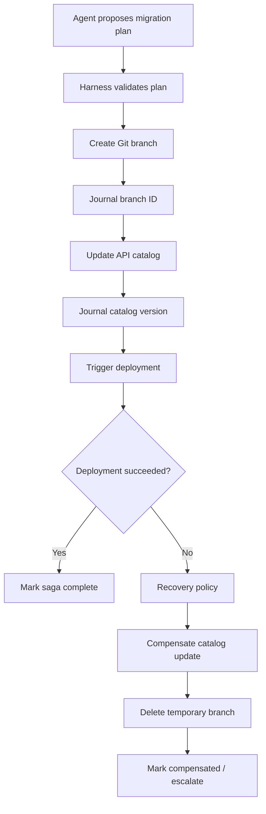

# 2026-09-04 — Compensation and Saga Patterns for Agent Workflows

## Why this matters

An agent that only reads data can usually retry safely. An enterprise agent that **changes** several systems is different. Imagine a migration agent that creates a Git branch, updates an API catalog, opens a change ticket, and triggers a deployment. If step four fails, there is no single transaction that can roll back Git, the catalog, the ticketing system, and the deployment platform together.

The practical answer is usually a **saga**: treat the overall business operation as a sequence of local transactions, and define a compensating action for completed steps that may need to be semantically undone.

## Mental model: a travel itinerary, not one database transaction

Think of a saga like booking a trip. You book a flight, then a hotel, then a rental car. If the rental car cannot be booked, you cannot issue SQL `ROLLBACK` across three companies. You decide whether to keep the first two bookings or cancel them using each provider's cancellation operation.

A **compensating action** is therefore not a technical rollback. It is a new business action intended to neutralize an earlier side effect.

Key terms:

- **Local transaction:** one committed operation in one system, such as creating a Git branch.
- **Saga:** a sequence of local transactions representing one larger business operation.
- **Compensation:** a business operation that semantically reverses or neutralizes an earlier completed step.
- **Point of no return:** a step after which automatic compensation may be unsafe or impossible.
- **Orchestrated saga:** a central workflow component decides the next step and compensation order.

For agentic systems, orchestrated sagas are usually easier to govern because the harness—not the LLM—owns recovery policy.

## Core components and request flow

A robust agent workflow needs five pieces:

1. **Workflow state** — which step is running and which steps completed.
2. **Side-effect journal** — durable records of external mutations and their identifiers.
3. **Idempotency keys** — stable keys that make retries safe.
4. **Compensation handlers** — deterministic functions such as `delete_branch` or `close_change_request`.
5. **Recovery policy** — code deciding retry, compensate, pause for approval, or escalate.



The important boundary is that the LLM can recommend what should happen, but the harness executes only registered recovery transitions.

## Concrete example: migration automation

Suppose an agent migrates an integration flow to a new Spring Boot service:

1. Create target repository branch.
2. Generate migrated code and commit it.
3. Register the candidate API in the internal catalog.
4. Deploy to a test environment.
5. Run parity tests.
6. Promote for human approval.

If parity tests fail, deleting everything may be the wrong response. The generated branch is useful evidence for debugging. The catalog entry, however, may need to be marked `FAILED_VALIDATION` so nobody treats it as deployable.

This demonstrates an important principle: **compensation does not always mean undo**. Sometimes the correct compensation is a state transition that makes the partial result safe and explicit.

## Python implementation shape

Keep compensation metadata next to the step definition rather than asking the model to invent recovery logic after a failure.

```python
from dataclasses import dataclass
from typing import Callable, Any

@dataclass
class SagaStep:
    name: str
    execute: Callable[[dict], Any]
    compensate: Callable[[dict, Any], None] | None

@dataclass
class CompletedStep:
    step: SagaStep
    result: Any


def run_saga(steps: list[SagaStep], ctx: dict):
    completed: list[CompletedStep] = []

    try:
        for step in steps:
            result = step.execute(ctx)
            journal_success(ctx["run_id"], step.name, result)
            completed.append(CompletedStep(step, result))
        mark_complete(ctx["run_id"])

    except Exception as error:
        journal_failure(ctx["run_id"], str(error))

        for item in reversed(completed):
            if item.step.compensate:
                item.step.compensate(ctx, item.result)
                journal_compensation(ctx["run_id"], item.step.name)

        raise
```

This is deliberately simple. Production code also needs persisted workflow state, retry classification, idempotency, compensation idempotency, timeouts, approvals, and observability.

### A safer step contract

A useful production interface is:

```python
class WorkflowStep:
    def execute(self, context, idempotency_key): ...
    def compensate(self, context, execution_record): ...
    def can_auto_compensate(self, execution_record) -> bool: ...
```

The execution record should contain the external resource ID and enough metadata to compensate without asking the model to reconstruct what happened.

### Java and Go notes

In Java, model each workflow step as an interface or sealed hierarchy and persist execution records before advancing the state machine. Spring applications can combine this with transactional outbox patterns when a local database update must reliably produce an external event.

In Go, explicit step structs and functions work well. Pass `context.Context`, make idempotency keys first-class parameters, and persist the saga state before invoking the next side effect.

## Retry, compensate, or escalate?

Do not treat every exception identically.

- **Transient infrastructure error:** retry the same idempotent step.
- **Business rejection:** usually do not retry blindly; compensate or request intervention.
- **Unknown outcome:** query the external system before retrying. A timeout does not prove the operation failed.
- **Irreversible action:** stop before it unless policy and approval permit execution.
- **Compensation failure:** persist it as a first-class workflow state and escalate; never silently continue.

A useful rule is: **reconcile before retry when the outcome is ambiguous**.

## Common mistakes and failure modes

### 1. Assuming compensation equals inverse API call
`create_user` does not necessarily imply `delete_user`. Compliance or audit rules may require deactivation instead.

### 2. Letting the LLM decide arbitrary rollback actions
Recovery changes real systems. Give the model a bounded set of recovery choices and let deterministic policy authorize execution.

### 3. Keeping the journal only in agent context
Conversation history is not durable workflow state. Store external IDs, status, timestamps, and idempotency keys in a database or workflow engine.

### 4. Compensation handlers are not idempotent
Recovery itself can crash. `compensate()` must tolerate being called again.

### 5. Automatically compensating past a point of no return
Sending a customer notification, executing a payment, or deleting production data may require human approval or a different corrective transaction.

### 6. Reversing steps without dependencies
Reverse order is a good default, not a universal law. If steps run in parallel, compensation must respect the dependency graph.

## Enterprise use cases

Saga-style recovery is particularly useful for:

- application and middleware migration agents that modify source control, CI/CD, catalogs, and runtime environments;
- customer-service agents coordinating CRM, billing, fulfillment, and notification systems;
- cloud remediation agents changing infrastructure across multiple control planes;
- software-engineering agents that create branches, issues, pull requests, deployments, and test environments;
- onboarding workflows spanning identity, HR, device management, and access provisioning.

## Practical architecture guidance

For a first implementation, avoid building a generic distributed workflow platform. Start with a small durable state machine:

`PLANNED -> RUNNING -> FAILED -> COMPENSATING -> COMPENSATED`

and add `WAITING_FOR_APPROVAL` when an irreversible or high-impact operation appears.

Persist at minimum:

- `run_id`
- `step_name`
- `attempt`
- `idempotency_key`
- `external_resource_id`
- `status`
- `result_digest`
- `compensation_status`
- timestamps and error classification

For complex, long-running workflows, use a durable workflow engine rather than relying on an in-memory Python loop. The agent can remain responsible for reasoning while the workflow runtime owns timers, retries, checkpoints, and recovery.

### Cloud mappings

Use managed services when the workflow is long-running or operationally critical:

- **AWS:** Step Functions for orchestration; DynamoDB or a relational store for domain state; EventBridge/SQS for asynchronous boundaries.
- **Azure:** Durable Functions for durable orchestration; Service Bus for messaging; Cosmos DB or SQL for domain state.
- **GCP:** Workflows for orchestration; Pub/Sub or Cloud Tasks for asynchronous work; Firestore/Cloud SQL for state.

These services do not remove the need to design compensation semantics. They provide durable execution primitives.

## 30–60 minute exercise

Take a four-step migration workflow:

`discover -> generate code -> create pull request -> deploy test environment`

Design a table with these columns for every step:

- side effect
- idempotency key
- external resource ID
- retry policy
- compensation action
- automatic or approval-required
- point-of-no-return risk

Then write a small Python orchestrator that intentionally fails step four and compensates only the actions you consider safe. Run the compensation twice and verify that the second run causes no additional damage.

## What to learn next

The natural next topic is **workflow reconciliation**: when a tool call times out or an agent crashes, how do you determine what actually happened in the external system before choosing retry, compensation, or continuation?

## Reading

1. [Microsoft Azure Architecture Center — Saga distributed transactions pattern](https://learn.microsoft.com/en-us/azure/architecture/patterns/saga)
2. [AWS Prescriptive Guidance — Saga orchestration pattern](https://docs.aws.amazon.com/prescriptive-guidance/latest/cloud-design-patterns/saga-orchestration.html)
3. [Temporal — Saga / compensating actions](https://docs.temporal.io/encyclopedia/saga)
4. [Google Cloud — Workflows error handling](https://cloud.google.com/workflows/docs/error-types)
5. [AWS Step Functions — Handling errors](https://docs.aws.amazon.com/step-functions/latest/dg/concepts-error-handling.html)
