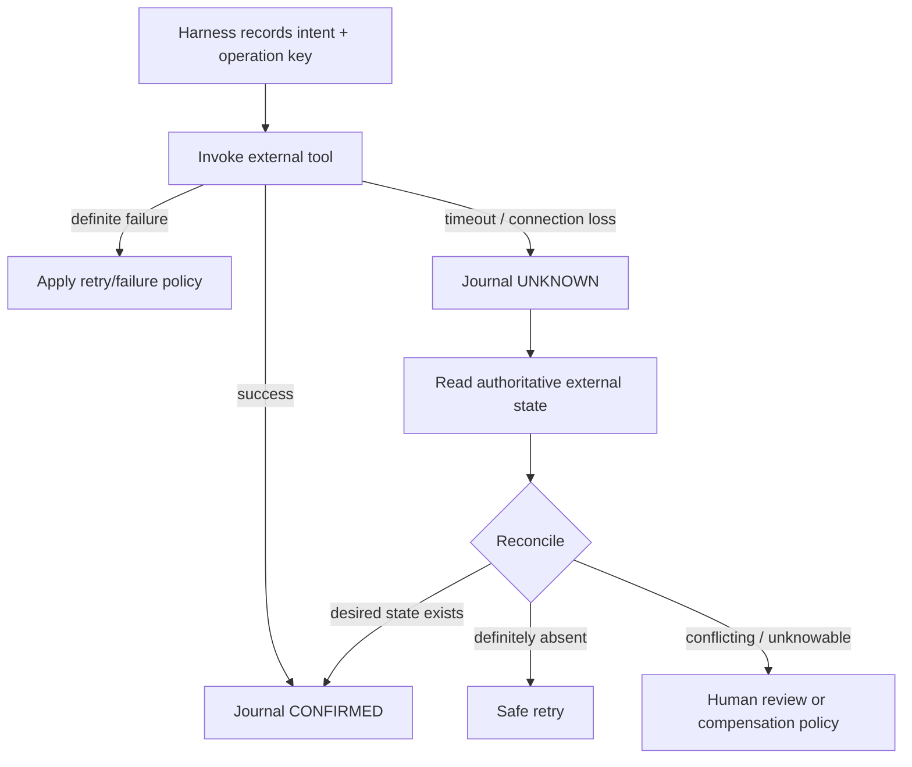

# Workflow Reconciliation: Resolve Ambiguous Tool Outcomes Before Retrying

## Why this matters
Yesterday's saga pattern answered: **what should we undo when a later step fails?** Today we handle an earlier question: **what actually happened?**

An agent calls `publish_api()`. The HTTP connection drops before a response arrives. The harness sees a timeout, but the API catalog may already contain the new version. Blindly retrying can create duplicates; blindly compensating can undo an action that never happened.

This is an **ambiguous outcome**: the caller cannot infer the external system's final state from the transport result alone. Google Cloud Workflows explicitly distinguishes connection failures where no connection was established from connection errors where a message might have reached the endpoint and retrying might not be idempotent.

## Mental model: read before you decide
Think of reconciliation like checking your bank balance after a payment app times out. You do not immediately pay again. You first ask the authoritative system whether the payment exists.

**Command → uncertain result → observe authoritative state → classify → act.**

The **reconciler** is deterministic application code that compares intended state with observed external state. The LLM can help interpret unusual evidence, but it should not guess whether a side effect occurred.

## Core components and request flow
- **Intent record** — what the workflow meant to do, stored before the side effect.
- **Operation key** — stable identifier such as `migration-184:publish:v3` used for correlation and idempotency.
- **Tool adapter** — invokes the external system.
- **Outcome journal** — records known success, known failure, or uncertain outcome.
- **State probe** — read-only query against the authoritative external system.
- **Reconciler** — compares intended and observed state.
- **Policy** — deterministic mapping from classification to continue, retry, compensate, or human review.



## Concrete example: API migration agent
Suppose a migration agent converts a legacy API and publishes version `v3` to an API catalog.

1. Harness persists intent: publish `customer-api:v3`, operation key `mig-184-publish-v3`.
2. `POST /apis/customer-api/versions` times out after 30 seconds.
3. Harness marks the step `UNKNOWN`; it does **not** call POST again.
4. Reconciler calls `GET /apis/customer-api/versions/v3`.
5. If v3 exists with the expected specification hash, mark the original command `CONFIRMED` and continue.
6. If v3 definitely does not exist, retry using the same operation key.
7. If v3 exists but its hash differs, stop: this is a conflict, not a retry case.

The important architectural shift is that **transport status is evidence, not business state**.

## Python implementation sketch
```python
from dataclasses import dataclass
from enum import Enum

class Resolution(Enum):
    CONFIRMED = "confirmed"
    SAFE_TO_RETRY = "safe_to_retry"
    CONFLICT = "conflict"

@dataclass(frozen=True)
class PublishIntent:
    api_name: str
    version: str
    spec_hash: str
    operation_key: str


def reconcile_publish(intent: PublishIntent, catalog) -> Resolution:
    observed = catalog.get_version(intent.api_name, intent.version)
    if observed is None:
        return Resolution.SAFE_TO_RETRY
    if observed.spec_hash == intent.spec_hash:
        return Resolution.CONFIRMED
    return Resolution.CONFLICT


def recover_unknown_publish(intent, catalog, publisher):
    resolution = reconcile_publish(intent, catalog)
    if resolution is Resolution.CONFIRMED:
        return "continue"
    if resolution is Resolution.SAFE_TO_RETRY:
        publisher.publish(intent, idempotency_key=intent.operation_key)
        return "retried"
    raise RuntimeError("External state conflicts with intended publication")
```

Notice what is missing: no LLM call is required for the normal recovery path.

### Java and Go notes
In Java, model the outcome with an enum or sealed hierarchy and persist intent/outcome transactionally using your normal repository layer. In Go, use a small typed state machine and pass `context.Context` through probes and retries. In both languages, keep reconciliation logic pure where possible so it is easy to unit test.

## Common mistakes and failure modes
- **Treating timeout as failure.** A timeout means the caller lacks a result, not necessarily that the operation failed.
- **Retrying non-idempotent writes automatically.** Duplicate tickets, deployments, payments, catalog entries, or profile changes can result.
- **Asking the LLM what probably happened.** The model has no authoritative evidence unless you give it a state probe.
- **Using a weak probe.** Query the system of record, not an eventually stale cache, when correctness matters.
- **Comparing only existence.** Verify version, hash, amount, target environment, or other business invariants.
- **No operation key.** Correlation across intent, command, logs, traces, and external records becomes difficult.
- **Conflating reconciliation and compensation.** Reconciliation determines reality; compensation decides how to repair an already confirmed side effect.

## Enterprise use cases
This pattern is useful wherever agents cross transactional boundaries: API publication, Git pull-request creation, CI/CD deployment, service-ticket creation, customer-profile updates, cloud provisioning, migration cutovers, and data-pipeline registration.

For migration automation, reconciliation is particularly important because an agent often coordinates Git, build systems, API gateways, deployment platforms, and ticketing systems without a shared transaction manager.

## Practical implementation guidance
1. Persist intent **before** invoking a side-effecting tool.
2. Give every important command a stable operation/idempotency key.
3. Classify tool errors into `FAILED`, `CONFIRMED`, and `UNKNOWN`; do not collapse unknown into failed.
4. Define a read-only probe for every high-value write tool.
5. Reconcile using business invariants, not merely HTTP status.
6. Retry only after the reconciler proves absence or the target guarantees idempotency.
7. Route conflicting or unknowable states to explicit approval/escalation.
8. Trace `operation_key`, intended state, observed state, resolution, and recovery action.

### Cloud mappings
**AWS:** Step Functions Standard Workflows preserve successful execution history during redrive and resume from unsuccessful steps. Use service-specific idempotency tokens and authoritative reads around ambiguous writes rather than assuming a failed task means no side effect occurred.

**Azure:** Durable Functions/Durable Task can provide durable orchestration; place reconciliation activities around external writes and keep those activities idempotent where possible.

**GCP:** Workflows documents separate retry predicates for idempotent and non-idempotent HTTP targets. Its error model explicitly warns that a `ConnectionError` can occur after a message may have reached the endpoint, which is exactly the case reconciliation addresses.

## 30–60 minute design exercise
Take one side-effecting tool from an agent you are building—for example `create_pull_request`, `publish_api`, or `deploy_service`.

Design four things:
1. An `Intent` data structure with a stable operation key.
2. A read-only `probe()` that determines authoritative external state.
3. A `reconcile()` function returning `CONFIRMED`, `SAFE_TO_RETRY`, or `CONFLICT`.
4. Five unit tests: confirmed success, definite absence, matching pre-existing state, conflicting state, and probe failure.

Do not call an LLM in the reconciler. If you find you need one, identify precisely which evidence cannot be represented deterministically.

## What to learn next
Next: **tool contracts for reliable agents** — designing every tool with explicit read/write semantics, idempotency, side-effect classification, retry policy, reconciliation probe, and approval requirements so the harness can reason about operations safely.

## Reading
- [Google Cloud Workflows — Workflow errors](https://docs.cloud.google.com/workflows/docs/reference/syntax/error-types)
- [Google Cloud Workflows — Retry predicate for idempotent targets](https://docs.cloud.google.com/workflows/docs/reference/stdlib/http/default_retry_predicate)
- [Google Cloud Workflows — Retry predicate for non-idempotent targets](https://docs.cloud.google.com/workflows/docs/reference/stdlib/http/default_retry_predicate_non_idempotent)
- [AWS Step Functions — Restart executions with redrive](https://docs.aws.amazon.com/step-functions/latest/dg/redrive-executions.html)
