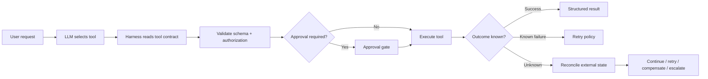

# Reliable Agent Tool Contracts: Make Side Effects Explicit

## Why this matters
An agent becomes operationally risky at the moment it can **do** something: update a customer, create a ticket, push a commit, deploy software, or invoke another system. A function signature tells the model *how to call* a tool, but it does not tell the harness enough about *how safely to operate it*.

A reliable agent therefore needs a **tool contract**: machine-readable metadata describing the tool's inputs, outputs, side effects, retry semantics, authorization requirements, and recovery behavior.

This is the natural next step after idempotency, durable execution, compensation, and reconciliation. Instead of scattering those rules through prompts and orchestration code, attach them to the capability itself.

## Mental model: an enterprise API contract plus an operations runbook
Think of a tool as an internal API with two contracts:

1. **Functional contract** — name, purpose, input schema, output schema.
2. **Operational contract** — read/write behavior, destructive impact, idempotency, timeout, retry, approval, reconciliation, and observability.

The LLM chooses *what capability it wants*. The harness reads the operational contract and decides *whether and how that capability may execute*.

> **LLM chooses intent. Harness enforces execution semantics. Tool performs the side effect.**

## Core components and request flow
A useful contract can describe input/output schemas, effect class, idempotency, approval policy, timeout/retry policy, reconciliation strategy, authorization scope, and observability metadata.



## Concrete example: migration agent publishing an API
Suppose a migration agent converts an integration service and publishes its generated API specification to an enterprise API catalog. A weak definition is only `publish_api(spec_path, api_name)`. The runtime still does not know whether publishing is destructive, repeatable, approval-sensitive, or recoverable.

```python
from enum import Enum
from pydantic import BaseModel

class Effect(str, Enum):
    READ = "read"
    WRITE = "write"
    DESTRUCTIVE = "destructive"

class ToolPolicy(BaseModel):
    effect: Effect
    idempotent: bool
    approval_required: bool
    timeout_seconds: int
    max_retries: int
    reconciliation_tool: str | None = None

PUBLISH_API_POLICY = ToolPolicy(
    effect=Effect.WRITE,
    idempotent=True,
    approval_required=True,
    timeout_seconds=20,
    max_retries=2,
    reconciliation_tool="get_api_version",
)
```

The implementation should accept a stable idempotency key and return structured identifiers:

```python
class PublishRequest(BaseModel):
    api_name: str
    version: str
    spec: dict
    idempotency_key: str

class PublishResult(BaseModel):
    operation_id: str
    api_id: str
    version: str
    status: str
```

The harness then owns deterministic policy:

```python
async def invoke(tool, request, policy):
    authorize(tool, request)
    if policy.approval_required:
        await require_approval(tool, request)
    try:
        return await call_with_timeout(tool, request, policy.timeout_seconds)
    except AmbiguousTimeout:
        if policy.reconciliation_tool:
            return await reconcile(policy.reconciliation_tool, request)
        raise HumanReviewRequired()
```

The LLM never decides, "The timeout probably means it failed, so I'll retry." The harness owns that decision.

## MCP gives us a useful starting vocabulary
The Model Context Protocol defines tool annotations including `readOnlyHint`, `destructiveHint`, `idempotentHint`, and `openWorldHint`. These are useful descriptors for clients deciding how cautiously a tool should be treated.

However, annotations are **hints**, not a security boundary. A production enterprise harness should derive enforcement from trusted configuration, identity policy, and runtime controls rather than trusting arbitrary tool metadata. A practical internal contract can extend that vocabulary with approval, timeout, reconciliation, scopes, data classification, and retry policy.

## Common mistakes and failure modes
- Putting operational rules in the prompt instead of enforcing them in code.
- Assuming HTTP verbs define business idempotency.
- Returning only free-form strings instead of structured results.
- Automatically retrying every exception, including ambiguous write timeouts.
- Trusting tool annotations from an untrusted MCP server.
- Asking for approval without showing the material arguments.
- Omitting stable operation/correlation identifiers needed for reconciliation.

## Enterprise use cases
This pattern is especially valuable for agents that modify systems of record: customer-profile agents, cloud remediation agents, coding assistants that push branches or PRs, migration agents that publish APIs or deploy converted services, service-desk agents, and financial or order-management workflows.

A useful governance model is a **tool registry** where each enterprise capability carries both schema and operational metadata. The harness loads this policy at runtime and applies the same controls regardless of which LLM requested the tool.

## Practical implementation guidance
For Python, Pydantic models work well for typed input/output contracts and policy objects. Decorators can attach policy metadata to ordinary functions:

```python
def governed_tool(*, policy: ToolPolicy):
    def decorator(fn):
        fn.tool_policy = policy
        return fn
    return decorator

@governed_tool(policy=PUBLISH_API_POLICY)
def publish_api(req: PublishRequest) -> PublishResult:
    ...
```

Keep enforcement outside the business function so the normal agent path cannot silently bypass authorization, approval, timeout, tracing, and recovery logic.

**Java:** use records for input/output DTOs and annotations such as `@ToolPolicy(effect=WRITE, idempotent=true)`; enforce with an interceptor or Spring AOP layer.

**Go:** define typed request/result structs and register each function with a `ToolDescriptor`; middleware around the handler enforces authorization, deadlines, approval, and tracing.

## Cloud mapping
Tool governance normally spans identity/IAM, durable workflow engines, API gateways, secret managers, and tracing rather than mapping to one service. AWS Step Functions or durable Lambda patterns can help with retry/checkpoint semantics; Azure Durable Functions provides similar orchestration concepts; GCP Workflows or durable agent runtimes can provide orchestration. Keep the contract itself portable and owned by the agent platform or harness.

## 30–60 minute design exercise
Take five tools from an agent you are building or considering—for example `read_source`, `generate_code`, `run_tests`, `create_branch`, and `deploy_service`.

Create a `ToolPolicy` for each with effect class, idempotency, approval requirement, timeout, retry count, reconciliation method, and required authorization scope.

Then answer one question for every write tool: **If the connection drops immediately after I call it, how will my harness determine whether the side effect actually happened?**

If that answer is unclear, you have found a reliability gap before writing any agent code.

## What to learn next
Next: **tool registry and capability policy layers**—how an enterprise harness discovers tools, filters them by user identity and task, limits the tool surface presented to the model, and prevents capability escalation.

## Reading
1. [Model Context Protocol — Tools specification](https://modelcontextprotocol.io/specification/2025-06-18/server/tools)
2. [MCP — Tool annotations as risk vocabulary](https://blog.modelcontextprotocol.io/posts/2026-03-16-tool-annotations/)
3. [OpenAI Agents SDK — Tools](https://openai.github.io/openai-agents-python/tools/)
4. [OpenAI Agents SDK — Guardrails](https://openai.github.io/openai-agents-js/guides/guardrails/)
5. [AWS Durable Execution — Idempotency and retries](https://docs.aws.amazon.com/durable-execution/patterns/best-practices/idempotency/)
