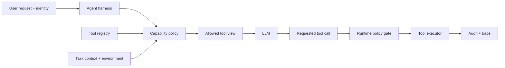

# Enterprise Tool Registries: Give Agents Only the Capabilities They Need

## Why this matters
Yesterday's tool-contract idea answers **what a tool does and how risky it is**. The next architectural question is: **which tools should a particular agent be allowed to see at all?**

If a migration agent receives 80 tools—including production deployment, repository deletion, ticket updates, database writes, and harmless search—the model must reason over unnecessary choices and your security boundary becomes harder to understand. Enterprise systems already solve a similar problem with API gateways and authorization policy: authenticate the caller, evaluate policy, then expose only permitted capabilities.

The same principle applies to agents: **tool discovery is part of authorization, not merely prompt construction.**

## Mental model: an API gateway for agent capabilities
Think of an **enterprise tool registry** as a service catalog plus a policy decision point.

- **Tool registry**: authoritative catalog of available tools and their contracts.
- **Capability**: a specific action the agent can invoke, such as `repo.read_file` or `deployment.promote`.
- **Policy**: deterministic rules deciding whether a capability is available in the current context.
- **Entitlement**: what the authenticated user or workload is permitted to do.
- **Risk metadata**: machine-readable facts such as read-only, destructive, external-network access, approval requirement, and data classification.

The model does **not** receive the complete registry. It receives a filtered capability view for this request.

## Core components and request flow


A robust flow has **two authorization points**:

1. **Discovery-time filtering** — decide which tools are visible to the model.
2. **Execution-time enforcement** — re-check policy immediately before execution.

Why twice? The first reduces attack surface and model confusion. The second is the actual security boundary because identity, arguments, environment, or policy may have changed since the prompt was assembled.

## Concrete example: migration automation
Suppose an enterprise modernization agent is converting a legacy integration application into a Spring Boot service.

During analysis it needs `repo.read_file`, `repo.search`, `architecture.lookup_standard`, and `build.run_tests`. It does **not** need `repo.merge`, `deployment.promote`, or `change_ticket.close`.

During a later approved release stage, `deployment.promote` might become eligible—but only for a release-manager identity, a non-production environment, and an approved change ticket.

The key point is that the same agent implementation can receive different capabilities based on **identity + workflow stage + resource + environment + risk**.

## A small Python implementation
Start with ordinary code. You do not need a policy engine on day one.

```python
from dataclasses import dataclass
from typing import Literal

Risk = Literal["low", "medium", "high"]

@dataclass(frozen=True)
class ToolSpec:
    name: str
    read_only: bool
    destructive: bool
    risk: Risk
    required_role: str | None = None
    allowed_stages: tuple[str, ...] = ()

REGISTRY = {
    "repo.read_file": ToolSpec(
        "repo.read_file", True, False, "low",
        allowed_stages=("discover", "plan", "execute")
    ),
    "build.run_tests": ToolSpec(
        "build.run_tests", False, False, "medium",
        allowed_stages=("execute", "validate")
    ),
    "deployment.promote": ToolSpec(
        "deployment.promote", False, False, "high",
        required_role="release-manager",
        allowed_stages=("release",)
    ),
}

@dataclass(frozen=True)
class RequestContext:
    roles: frozenset[str]
    stage: str
    environment: str


def visible_tools(ctx: RequestContext) -> list[ToolSpec]:
    result = []
    for tool in REGISTRY.values():
        if tool.allowed_stages and ctx.stage not in tool.allowed_stages:
            continue
        if tool.required_role and tool.required_role not in ctx.roles:
            continue
        if ctx.environment == "prod" and tool.risk == "high":
            continue
        result.append(tool)
    return result
```

Pass only `visible_tools(context)` to your model's tool-definition API. Before actually executing a selected tool, evaluate policy again using the concrete arguments and current identity.

### The important architectural separation
```text
Registry:     What capabilities exist?
Policy:       Who may use which capability, when and where?
LLM:          Which allowed capability best advances the task?
Executor:     Is this exact invocation still permitted, and can it run safely?
Audit:        What was offered, selected, approved and executed?
```

The LLM is responsible only for the third decision.

## MCP annotations help—but are not authorization
Model Context Protocol defines tool annotations including `readOnlyHint`, `destructiveHint`, `idempotentHint`, and `openWorldHint`. These are useful inputs to a registry because they create a common vocabulary for tool behavior.

But annotations are **hints**, not a security boundary. Treat metadata from an untrusted tool server as untrusted. Your enterprise registry should enrich trusted tools with organization-owned policy metadata such as data classification, owning team, permitted environments, required scopes, approval class, and network zone.

```yaml
name: customer.update_address
owner: customer-platform
risk: high
data_classification: pii
read_only: false
idempotent: true
required_scopes: [customer.profile.write]
approval: human
allowed_environments: [dev, test, prod]
```

## Common mistakes and failure modes
- **Sending every tool to the model.** More capabilities increase choice complexity and unnecessary blast radius.
- **Using the system prompt as authorization.** “Never call production tools” is guidance, not enforcement.
- **Filtering only once.** Always re-authorize the concrete invocation at execution time.
- **Authorizing the agent but ignoring the user.** Enterprise tools often need both workload identity and end-user authorization context.
- **Trusting self-declared tool metadata.** Registry metadata needs a trusted ownership and onboarding process.
- **Making tool names equal permissions.** Authorization usually needs resource and argument context too.

## Enterprise use cases
**Software modernization:** expose discovery and test tools early; enable repository writes only during execution; enable deployment tools only after approval.

**Customer service:** expose customer-specific read capabilities based on the authenticated customer's identity rather than giving the agent broad CRM access.

**Operations:** an incident agent may read telemetry automatically but require approval before restarting production workloads.

**Developer assistants:** repository access can be filtered by developer entitlement, repository classification, branch protection, and task type.

## Implementation guidance
For a first implementation, keep the registry as version-controlled YAML/JSON and implement filtering in the harness. Make the policy function deterministic and unit-test it heavily. Log both the **offered tool set** and the **executed tool** so you can later answer why a capability was available.

As the number of agents, tools, and policies grows, separate the registry from the harness and introduce a policy decision service. Keep authorization decisions outside the LLM regardless of framework.

For Java, model `ToolSpec` and `RequestContext` as records and keep the policy evaluator as a pure service. For Go, structs plus a small `Allowed(ctx, tool)` function work well; avoid hiding authorization inside tool handlers because discovery-time filtering then becomes difficult.

## Cloud mapping—only where it helps
**AWS:** IAM provides identity/resource policy primitives, while Bedrock AgentCore supports workload identities and Gateway policy controls. Current AgentCore Gateway policy can gate tool calls based on caller, conditions, and arguments.

**Azure/GCP:** use the same architectural split with your enterprise identity provider and policy layer; the important design is not a particular cloud product but the separation of registry, policy decision, enforcement, and audit.

## 30–60 minute exercise
Take five tools from an agent you are building or designing. Create a `tools.yaml` with `name`, `read_only`, `destructive`, `risk`, `required_roles`, `allowed_stages`, and `approval`.

Then write a Python `visible_tools(context)` function and four tests: developer discovery sees only read tools; developer execution sees repository writes but no production deployment; release manager during release sees deployment; high-risk production action remains hidden unless an explicit production condition is satisfied.

Bonus: add `authorize_call(context, tool, arguments)` and demonstrate why it can reject a tool that was previously visible.

## What to learn next
Next, move from **which tools are visible** to **how identity should propagate through an agent tool call**. We will distinguish the end-user identity, agent/workload identity, and downstream API credential—and show why simply giving the agent either the user's token or one powerful service token creates problems.

## Reading
1. [MCP specification — Tools](https://modelcontextprotocol.io/specification/2025-06-18/server/tools)
2. [MCP — Tool annotations as risk vocabulary](https://blog.modelcontextprotocol.io/posts/2026-03-16-tool-annotations/)
3. [AWS — Identity and access management for Amazon Bedrock AgentCore](https://docs.aws.amazon.com/bedrock-agentcore/latest/devguide/security-iam.html)
4. [AWS — AgentCore security and access controls](https://docs.aws.amazon.com/bedrock-agentcore/latest/devguide/harness-security.html)

---
**Architect's takeaway:** The safest tool is often the one the model never sees. Build the model's tool list dynamically from trusted registry metadata and deterministic policy, then enforce authorization again at execution time.
