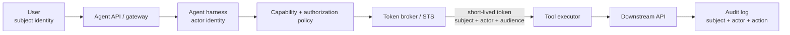

# Identity Propagation in Agent Tool Calls

## Why this matters
Yesterday we restricted **which tools an agent can see**. The next problem starts after the model selects one: **whose authority does the tool use?**

A production agent often has at least two principals. The **subject** is the human or upstream identity on whose behalf work is requested. The **actor** is the agent or workload actually executing the request. If you collapse them into one powerful service credential, the downstream system can no longer reliably answer: *who asked for this, which workload performed it, and was that combination allowed?*

This is especially important for coding and migration agents that may read repositories, create pull requests, update tickets, invoke deployment APIs, or modify cloud resources.

## Mental model: employee plus company badge
Imagine an employee asking a controlled operations desk to perform an action. The desk has its own identity, but the request must still carry the employee's authority.

- **Subject identity**: the user on whose behalf the action is performed.
- **Actor/workload identity**: the agent runtime or service executing the action.
- **Delegation**: the subject permits an actor to exercise a bounded subset of authority.
- **Token exchange**: exchanging an incoming credential for a new credential intended for a particular downstream resource.
- **Scope**: the operations represented by a token.
- **Audience**: the service for which a token is intended.

The architectural rule is: **do not pass a user's broad token through the whole agent. Mint or obtain a short-lived, audience-specific credential at the tool boundary.**

## Core components and request flow


A practical request flow is:

1. Authenticate the user at the agent boundary and validate issuer, audience, expiry, and relevant claims.
2. Authenticate the agent runtime independently using workload identity rather than a stored long-lived secret.
3. Keep both identities in trusted harness state. Do not ask the model to copy or interpret bearer tokens.
4. When the model selects a tool, deterministic policy checks `subject + actor + tool + resource + environment`.
5. The credential broker obtains a short-lived credential scoped to the selected downstream API.
6. The tool executor injects the credential only when making the call.
7. Audit records preserve the user, workload, tool, resource, decision, and resulting operation.

OAuth 2.0 Token Exchange (RFC 8693) explicitly distinguishes delegation from impersonation and defines `subject_token` and `actor_token` concepts for representing the party on whose behalf work occurs and the actor receiving delegated rights.

## Concrete example: migration agent creating a pull request
Assume a modernization agent is migrating a Mule application to Spring Boot. A software architect asks it to create a pull request after tests pass.

Bad design: the agent process holds a shared GitHub token with repository write access. Every user effectively acts as the same machine identity.

Better design:

- the gateway authenticates the employee;
- the runtime has a separate workload identity such as `migration-agent-prod`;
- policy verifies that this employee may modify the target repository and that this workload may use `repo.create_pr`;
- the credential layer obtains a short-lived repository credential with only the required permissions;
- the tool creates the PR;
- audit data records both the requesting user and executing workload.

The LLM decides **that creating a PR is the next useful action**. It does not decide whether the user is authorized, manufacture credentials, or broaden scopes.

## Practical Python shape
Keep credentials out of prompts, model messages, and tool arguments. Pass an opaque execution context to trusted code instead.

```python
from dataclasses import dataclass

@dataclass(frozen=True)
class ExecutionContext:
    subject_id: str
    actor_id: str
    tenant_id: str
    trace_id: str

@dataclass(frozen=True)
class ToolRequest:
    tool: str
    resource: str
    args: dict


def execute_tool(ctx: ExecutionContext, req: ToolRequest):
    decision = policy.authorize(
        subject=ctx.subject_id,
        actor=ctx.actor_id,
        action=req.tool,
        resource=req.resource,
    )
    if not decision.allowed:
        raise PermissionError(decision.reason)

    token = credential_broker.get_token(
        subject=ctx.subject_id,
        actor=ctx.actor_id,
        audience=decision.audience,
        scopes=decision.scopes,
        ttl_seconds=300,
    )

    return tool_registry.execute(
        req.tool,
        args=req.args,
        access_token=token,
        trace_id=ctx.trace_id,
    )
```

The important separation is architectural: `policy` decides permission, `credential_broker` obtains the credential, and `tool_registry` performs the operation. The model receives none of the bearer tokens.

**Java:** model the execution context as an immutable record and use your OAuth/OIDC library plus workload identity integration. Keep token acquisition in an interceptor or tool-execution layer rather than agent prompts.

**Go:** carry trusted identity metadata through `context.Context`, but do not put raw bearer tokens in values passed into model-facing code. Use an `oauth2.TokenSource` or cloud-native credential provider at the outbound client boundary.

## Delegation versus impersonation
The distinction matters for auditability.

**Delegation** means the actor remains identifiable while acting with authority granted by the subject. **Impersonation** means the actor operates as the other identity within the granted context. RFC 8693 describes both semantics; for agent platforms, preserving both identities whenever the downstream identity system supports it usually produces a clearer audit trail.

Do not confuse this with a pure **app-only** operation. A nightly indexing agent may legitimately act only as its workload identity because no end user initiated the action.

## Common mistakes and failure modes
- **One shared super-token for all tools:** simple initially, but destroys least privilege and user-level attribution.
- **Forwarding the incoming user token everywhere:** its audience may be wrong and its permissions broader than the downstream call requires.
- **Putting tokens into the prompt:** model output, traces, logs, or memory can leak credentials.
- **Authorizing only the user:** a compromised or unintended workload may then exercise the user's rights.
- **Authorizing only the workload:** users can indirectly inherit capabilities they should not have.
- **Long-lived credentials:** increase blast radius and make rotation harder.
- **Treating identity metadata supplied by the model as trusted:** `user_id="admin"` in a tool argument is data, not authentication.
- **Losing identity during asynchronous work:** queued or resumable workflows must preserve a verifiable authorization context, not just a username string.

## Enterprise use cases
This pattern appears anywhere an agent crosses a security boundary: coding agents writing repositories, claims agents reading customer records, migration agents changing CI/CD systems, service-desk agents updating tickets, cloud-operations agents modifying infrastructure, and RAG agents retrieving documents subject to user-level ACLs.

For retrieval, the same rule prevents a common security flaw: the vector search must be constrained by authoritative user/tenant entitlements rather than asking the model to filter unauthorized documents after retrieval.

## Cloud mappings
**AWS:** Amazon Bedrock AgentCore Identity provides workload identities and credential providers. Its workload access token can represent both the agent and the end user, while credential providers vend credentials for downstream resources. Keep IAM policies narrow around which workload identities can access each credential provider.

**Azure:** Microsoft Entra's OAuth On-Behalf-Of flow is the direct analogue for a middle-tier service calling a downstream API on behalf of a user. The middle tier exchanges the incoming user access token for a token targeted at the downstream API.

**GCP:** use service accounts/workload identity for the executing workload and short-lived credentials or service-account impersonation where appropriate. Google explicitly recommends caution when a user can impersonate a service account more privileged than the user; audit logs can preserve delegation information.

The products differ, but the architecture is stable: **authenticate subject → authenticate actor → authorize the pair → mint narrow credential → invoke → audit both identities.**

## 30–60 minute design exercise
Take one tool from an agent you are building—for example `create_pull_request`, `deploy_service`, or `update_jira_ticket`—and write a one-page identity contract.

Specify:

1. subject identity and how it is authenticated;
2. workload/actor identity and how it is authenticated;
3. exact authorization inputs;
4. downstream token audience and minimum scopes;
5. maximum credential lifetime;
6. where token exchange occurs;
7. fields recorded in the audit event;
8. behavior when the user session expires while a durable workflow is paused.

Then inspect your current implementation. If the LLM can see a bearer token or the tool runs under a shared high-privilege credential, mark that as the first refactoring target.

## What to learn next
Next: **authorization for long-running agents**—what happens to delegated authority when a workflow pauses for hours, waits for approval, resumes tomorrow, or is picked up by another worker.

## Reading
1. [RFC 8693 — OAuth 2.0 Token Exchange](https://datatracker.ietf.org/doc/html/rfc8693)
2. [Amazon Bedrock AgentCore Identity](https://docs.aws.amazon.com/bedrock-agentcore/latest/devguide/identity.html)
3. [Microsoft identity platform — OAuth 2.0 On-Behalf-Of flow](https://learn.microsoft.com/en-us/entra/identity-platform/v2-oauth2-on-behalf-of-flow)
4. [Google Cloud — Best practices for using service accounts securely](https://cloud.google.com/iam/docs/best-practices-service-accounts)
5. [Google Cloud — Create short-lived credentials for a service account](https://cloud.google.com/iam/docs/create-short-lived-credentials-direct)
