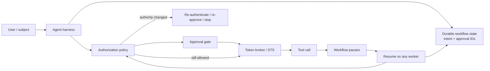

# Long-Running Agent Authorization: Revalidate Authority When Work Resumes

## Why this matters
A normal API request may live for milliseconds. An agent workflow can live for hours or days: it may wait for a reviewer, retry after an outage, or resume on another worker. That creates a security question: **does authority captured at workflow start remain valid when the workflow resumes?**

Usually, it should not.

A user's role may have changed. An approval may have expired. A deployment window may have closed. The original access token may be expired or revoked. The safe design is to persist **authorization intent and evidence**, not a reusable bearer credential, and re-establish authority at the next side-effect boundary.

## Mental model: a travel authorization, not a master key
Think of a long-running agent as an employee travelling through several controlled checkpoints. The workflow record is the **travel itinerary**: who requested the trip, its purpose, allowed destinations, and approvals. It is not the key to every door.

At each checkpoint, security asks again whether the requester is still entitled to the action, the workload is still trusted to act for the requester, the approval is still valid for the exact action, and the current environment and risk are acceptable.

Important terms:
- **Authorization intent**: durable description of what the workflow is allowed to attempt.
- **Authorization evidence**: IDs and immutable facts about the grant or approval, rather than a reusable secret.
- **Revalidation**: checking current policy before a resumed action.
- **Re-authentication**: obtaining fresh proof of identity when required.
- **Credential renewal**: obtaining a new short-lived access token from still-valid authority.

## Core components and request flow


A safe request flow is:
1. Authenticate the subject and the agent workload.
2. Store workflow intent: subject ID, actor ID, requested capability, resource boundary, policy version, approval reference and expiry.
3. Obtain a short-lived, audience-restricted credential only immediately before the tool call.
4. Persist the tool outcome, not the credential.
5. When the workflow resumes, reload durable intent.
6. Evaluate current authorization and approval state again.
7. Mint a fresh credential for the specific downstream audience.
8. Execute only if the new decision permits it.

RFC 9700 recommends restricting access-token privileges and audiences and treats refresh tokens as high-value credentials requiring stronger controls. That makes storing broad refresh tokens in arbitrary workflow checkpoints a poor default.

## Concrete implementation example: migration agent waiting for production approval
Suppose a migration agent analyzes a MuleSoft application, generates Spring Boot code, opens a pull request, and then waits six hours for production deployment approval.

Do **not** serialize a GitHub/cloud access token into `workflow_state.json` so another worker can resume later. Persist a capability record instead:

```python
from dataclasses import dataclass
from datetime import datetime

@dataclass(frozen=True)
class AuthorityIntent:
    subject_id: str
    actor_id: str
    capability: str
    resource: str
    approval_id: str | None
    policy_version: str

async def execute_after_resume(state, policy, approvals, token_broker, deploy):
    intent = AuthorityIntent(**state["authority_intent"])

    decision = await policy.authorize(
        subject=intent.subject_id,
        actor=intent.actor_id,
        capability=intent.capability,
        resource=intent.resource,
        context={"environment": "prod", "time": datetime.utcnow().isoformat()},
    )
    if not decision.allowed:
        return {"status": "blocked", "reason": decision.reason}

    if intent.approval_id:
        approval = await approvals.get(intent.approval_id)
        if not approval.valid_for(intent.capability, intent.resource):
            return {"status": "needs_reapproval"}

    credential = await token_broker.issue(
        subject=intent.subject_id,
        actor=intent.actor_id,
        audience="deployment-api",
        scopes=["deploy:release"],
        ttl_seconds=300,
    )

    return await deploy(release=state["release_id"], credential=credential)
```

The architectural separation is that **durable workflow state identifies authority; the credential broker materializes temporary authority just in time**.

For Java, model the intent as an immutable record and keep token acquisition behind a `CredentialProvider` interface. In Go, pass a request-scoped credential provider into the tool adapter rather than putting tokens into persisted workflow structs.

## Common mistakes and failure modes
- **Persisting access or refresh tokens in checkpoints.** Checkpoint stores often have broader access and longer retention than secret stores.
- **Checking authorization only at workflow start.** A six-hour-old decision may no longer reflect current roles, policy, risk, or resource state.
- **Treating approval as permanent authorization.** Bind approval to action, resource, environment and expiry.
- **Renewing credentials automatically without rechecking policy.** Token renewal and authorization are different decisions.
- **Using the agent's service identity alone.** This loses the end-user authority boundary and weakens auditability.
- **Requiring the human to log in for every resume.** Revalidation does not always require re-authentication; ask for fresh user interaction only when the grant expired, policy requires it, or risk increased.

## Enterprise use cases
This pattern matters whenever an agent crosses time or worker boundaries: production deployment assistants, insurance claims agents waiting for supervisor approval, code-migration pipelines waiting for PR review, procurement agents waiting for spend approval, incident-response agents waiting for a maintenance window, and data agents running multi-hour remediation workflows.

## Cloud mappings
**AWS:** use workload IAM roles and AWS STS temporary credentials rather than long-lived keys. Step Functions supports temporary credentials and service roles; the durable state machine should store authorization context rather than secrets.

**Azure:** the equivalent design uses workload/managed identities and short-lived Microsoft Entra tokens. Keep user consent/delegation and workload identity separate, and reacquire downstream tokens at execution time.

**GCP:** Workload Identity Federation exchanges trusted external credentials for short-lived Google Cloud credentials; service-account impersonation can provide the execution identity. Google recommends dedicated workload identities and cautions against letting a user impersonate a service account more privileged than the user.

## Architecture rule of thumb
For a long-running workflow, divide state into three classes:

| State | Persist? | Example |
|---|---|---|
| Business/workflow state | Yes | release ID, migration stage |
| Authorization evidence | Yes, carefully | subject ID, approval ID, policy decision reference |
| Bearer credentials | Normally no | OAuth access token, cloud STS token |

The resume path should be **load state → reconcile prior effects → revalidate authority → acquire fresh narrow credential → execute**.

## 30–60 minute exercise
Take one agent workflow you already understand, such as `discover → plan → execute → review` for application migration.

Design one pause between `plan` and `execute` and write:
1. The exact authorization intent you would persist.
2. Which approval attributes must be bound to the request.
3. Which facts must be revalidated after a 12-hour pause.
4. Which credential is minted only at execution time and its audience/scope/TTL.
5. What happens if the user's production role was revoked while the workflow was paused.

Then implement a small Python `resume_authorized_action()` function with fake policy, approval and token-broker adapters. No LLM is required for this exercise.

## What to learn next
Next, connect identity and tool policy to **human approval semantics**: how to bind an approval cryptographically or structurally to the exact planned action so that an agent cannot change parameters after approval and still reuse the approval.

## Reading
- [RFC 9700 — OAuth 2.0 Security Best Current Practice](https://www.rfc-editor.org/info/rfc9700)
- [RFC 8693 — OAuth 2.0 Token Exchange](https://datatracker.ietf.org/doc/html/rfc8693)
- [AWS Well-Architected — Use temporary credentials](https://docs.aws.amazon.com/wellarchitected/latest/framework/sec_identities_unique.html)
- [Google Cloud — Authenticate workloads with Workload Identity Federation](https://docs.cloud.google.com/iam/docs/authenticate-with-auth-libraries)
- [Google Cloud — Best practices for service accounts](https://docs.cloud.google.com/iam/docs/best-practices-service-accounts)
