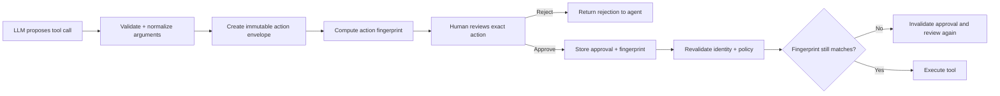

# Approval-Bound Actions: Approve the Exact Tool Call, Not a Vague Intent

## Why this matters

Human-in-the-loop approval sounds simple: the agent proposes an action, a person clicks **Approve**, and execution continues. The dangerous detail is *what exactly was approved*.

If a reviewer approves “deploy the migrated service” but the agent can later change the target environment, artifact version, or deployment parameters, the approval is not a security control. It is merely a conversational signal.

For enterprise agents, approval should be attached to an **immutable action envelope**: the exact tool, arguments, resource, identity, and relevant policy context that the reviewer saw.

## Mental model: a signed change ticket

Think of approval like approving a production change ticket. You would not approve a ticket saying only “change database.” You expect the ticket to identify the database, change, environment, version, and risk. If those details change, the approval should no longer apply.

The same rule should apply to agent tool calls:

**Plan → freeze action → review → approve exact action → revalidate → execute**

An **action envelope** is the canonical representation of the proposed side effect. An **approval binding** connects the human decision to that exact envelope.

## Core components and request flow

1. **Planner** — the LLM decides that a side-effecting tool may be needed.
2. **Tool contract** — validates tool name and typed arguments.
3. **Action normalizer** — converts arguments into one canonical representation.
4. **Action fingerprint** — a cryptographic hash of the canonical action.
5. **Approval record** — stores approver, decision, fingerprint, timestamp, and scope.
6. **Policy engine** — checks whether the action is currently authorized.
7. **Executor** — executes only when the current action still matches the approved fingerprint.



## Concrete example: migration agent publishing an API

Suppose a migration agent has generated a replacement Spring Boot API and wants to publish it to the enterprise API platform.

```json
{
  "tool": "publish_api",
  "arguments": {
    "api": "commission-service",
    "version": "2.3.0",
    "environment": "production",
    "artifact_sha": "9c41...",
    "deprecates": "2.2.1"
  }
}
```

The approval UI should show these concrete values. After approval, the harness must not ask the model to reconstruct the tool call. It should execute the stored, approved envelope.

If the agent subsequently decides version `2.3.1` should be deployed instead, that is a **new action** and needs a new approval.

## Practical Python implementation

A lightweight implementation does not require a sophisticated framework.

```python
from dataclasses import dataclass, asdict
from hashlib import sha256
import json

@dataclass(frozen=True)
class PublishApiAction:
    api: str
    version: str
    environment: str
    artifact_sha: str
    deprecates: str | None = None


def fingerprint(action: PublishApiAction) -> str:
    canonical = json.dumps(
        asdict(action),
        sort_keys=True,
        separators=(",", ":"),
    )
    return sha256(canonical.encode()).hexdigest()


@dataclass(frozen=True)
class Approval:
    action_hash: str
    approved_by: str
    decision: str


def execute(action: PublishApiAction, approval: Approval):
    if approval.decision != "APPROVED":
        raise PermissionError("Action was not approved")

    if fingerprint(action) != approval.action_hash:
        raise PermissionError("Action changed after approval")

    # Re-check authorization and environment policy here.
    return publish_api(action)
```

The important architectural point is that the model does **not** decide whether an approval is still valid. That is deterministic harness logic.

Current OpenAI Agents SDK human-in-the-loop support follows the same broad pattern: a tool call can pause as an interruption, the application approves or rejects that specific pending call, and the same run state is then resumed. The SDK also supports serializing state for longer approval periods.

### Java and Go notes

In Java, model the action as an immutable `record`, serialize it with a deterministic JSON configuration, and hash the canonical representation. Keep approval validation in an application service or policy interceptor rather than in the agent prompt.

In Go, use a typed struct, canonical serialization, and a small middleware layer around tool execution. Avoid passing arbitrary `map[string]any` structures across the approval boundary because canonicalization becomes harder to reason about.

## Approval scope: exact call versus broader permission

Not every approval must be one-call-only. Some systems support “always approve this tool for this run.” That can improve usability, but it changes the security meaning.

Use broader approval only for narrowly scoped, predictable operations. For destructive or externally visible actions—production deployment, payment, customer communication, deletion, entitlement change—prefer approval of the exact call.

**The larger the possible side effect, the narrower the approval scope.**

## Common mistakes and failure modes

- **Approving intent instead of parameters.** “Publish the API” is too broad; show the exact API, version, artifact, and environment.
- **Regenerating arguments after approval.** Never ask the LLM to recreate an approved tool call. Execute the frozen envelope.
- **Trusting only a call ID.** A call ID is useful for correlation, but the approval should also bind to canonical parameters and resource identity.
- **Skipping policy checks after a long pause.** Approval does not guarantee that the user still has permission hours later. Revalidate authorization immediately before execution.
- **Allowing mutable referenced data.** If the action says `artifact=latest`, the underlying artifact can change. Prefer immutable identifiers such as artifact digests or version IDs.
- **Treating approval as input validation.** Approval and validation solve different problems. Validate schemas and guardrails both before review and immediately before execution.

## Enterprise use cases

This pattern is especially useful for production deployment by coding agents, API publication and deprecation, infrastructure changes, customer communications, claims or payment decisions, IAM changes, data deletion, and migration cutover activities.

For migration automation, it creates a clean boundary between **agent autonomy** and **change authority**. The agent can discover, transform, test, and prepare a deployment autonomously while the final production-changing action remains explicitly controlled.

## Cloud mapping

The pattern is mostly application architecture rather than a cloud-specific feature. Use your existing identity, workflow, and audit services: AWS IAM/Step Functions, Azure Entra ID/Durable Functions, or Google Cloud IAM/Workflows can participate in authorization and durable orchestration. The essential control remains the same: persist the approved action independently of the LLM conversation and execute only that immutable action.

## 30–60 minute exercise

Take one side-effecting tool from an agent you are building—for example `create_pull_request`, `deploy_service`, or `publish_api`.

Define a typed action envelope containing every parameter a reviewer should see. Implement deterministic canonical serialization and SHA-256 fingerprinting. Create a mock approval record containing that fingerprint. Then write three tests:

1. unchanged action executes;
2. changed environment is rejected;
3. changed artifact/version is rejected.

Finally, identify which fields must use immutable IDs rather than friendly names such as `latest` or `production-current`.

## What to learn next

Next, connect approval-bound actions to **policy-as-code and risk scoring**: decide which tool calls can execute automatically, which need deterministic policy checks, and which must pause for a human reviewer.

## Reading

- [OpenAI Agents SDK — Human in the loop](https://openai.github.io/openai-agents-python/human_in_the_loop/)
- [OpenAI Agents SDK — MCP approval flow](https://openai.github.io/openai-agents-js/guides/mcp/)
- [Model Context Protocol — Tools specification](https://modelcontextprotocol.io/specification/2025-06-18/server/tools)
- [NIST AI Risk Management Framework](https://www.nist.gov/itl/ai-risk-management-framework)
