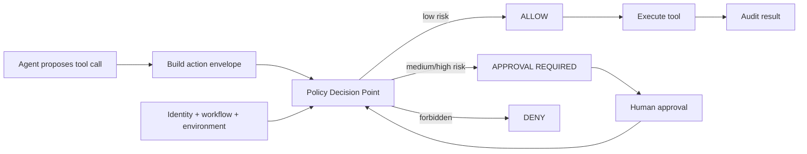

# Policy-as-Code for Agent Actions: Risk Scoring Before Execution

## Why this matters

As agents gain write-capable tools, a prompt such as “be careful with production” is not an enforceable control. The model should propose actions; deterministic software should decide whether those actions are allowed.

**Policy-as-code** means expressing authorization and risk rules as executable, versioned rules. A **Policy Decision Point (PDP)** evaluates facts and returns a decision. A **Policy Enforcement Point (PEP)** is the harness code that enforces that decision.

## Mental model: airport security

The agent is a passenger choosing a destination. The policy engine is security: it does not decide where the passenger wants to go; it decides whether the passenger may cross a controlled boundary.

Use three outcomes: **ALLOW → APPROVAL_REQUIRED → DENY**.

## Core components and request flow

1. Agent/planner proposes a typed tool call.
2. Action envelope captures tool, arguments, target resource and environment.
3. Context supplies trusted user/workload identity and workflow state.
4. Policy engine evaluates rules and calculates risk.
5. Harness/PEP allows, pauses for approval, or denies.
6. Tool executor runs only an authorized action.
7. Audit event records inputs, decision, policy version and result.



## Concrete example: migration agent

A modernization agent can create a branch, modify code, run tests and deploy a migrated service. Reading source code is low risk. Creating a feature branch is usually low risk. Deploying to test is moderate risk. Deploying to production is high risk and requires approval. Deleting a production resource may simply be denied.

The LLM does **not** assign its own risk score. Risk comes from trusted tool metadata plus runtime facts such as environment, data classification and identity.

## Practical Python implementation

```python
from dataclasses import dataclass
from enum import Enum

class Decision(str, Enum):
    ALLOW = "allow"
    APPROVAL = "approval_required"
    DENY = "deny"

@dataclass(frozen=True)
class Action:
    tool: str
    environment: str
    destructive: bool
    changes_external_state: bool


def authorize(action: Action, roles: set[str]) -> Decision:
    if action.environment == "prod" and action.destructive:
        return Decision.DENY
    if action.environment == "prod":
        if "prod-operator" not in roles:
            return Decision.DENY
        return Decision.APPROVAL
    if action.destructive or action.changes_external_state:
        return Decision.APPROVAL
    return Decision.ALLOW
```

Keep this outside the model loop. In production, a shared policy engine such as Open Policy Agent (OPA) is useful when many agents and services consume the same policies. OPA separates policy decision-making from enforcement and evaluates structured input against declarative Rego policies.

A useful policy input document contains subject identity, agent identity, action/tool, resource, environment and workflow stage. Return structured output including `decision`, `reason`, `required_approval` and `policy_version`.

### Java and Go notes

In Java, place the PEP around tool execution using an interceptor/filter. In Go, wrap a `Tool.Execute(ctx, request)` interface with middleware. Keep policy inputs language-neutral JSON so multiple runtimes can use the same PDP.

## Risk scoring without fake precision

Start with deterministic dimensions rather than a model-generated 0–100 score: side effect (read/reversible/irreversible), environment (dev/test/prod), data sensitivity, blast radius and identity. Map combinations to a small set of policy outcomes. Add numeric scoring only when it improves a concrete decision.

## Common mistakes and failure modes

- Asking the LLM whether its own action is safe.
- Treating prompt instructions as authorization policy.
- Trusting model-supplied identity, environment or risk metadata.
- Evaluating policy only during planning rather than immediately before execution.
- Returning only allow/deny when human approval is a legitimate third state.
- Changing policy without versioning decisions for auditability.
- Creating one giant policy file instead of separating authorization, environment and tool-risk concerns.

## Enterprise use cases

**Migration automation:** allow analysis automatically, require approval for repository writes and production deployment.

**Claims agent:** allow reading an assigned claim, require approval above a payment threshold, deny unrelated claims.

**Coding assistant:** allow local tests, require approval for dependency changes, block direct pushes to protected branches.

**Cloud operations agent:** allow diagnostics, require approval for configuration changes, deny destructive production operations outside an incident workflow.

## Where guardrails fit

Guardrails and policy engines are adjacent. Guardrails validate inputs, outputs and tool calls. Policy-as-code answers authorization/risk questions using trusted facts. A tool guardrail can act as the PEP that calls your PDP before execution. The OpenAI Agents SDK supports tool input guardrails immediately before function-tool execution and can also check before approval and re-check before execution.

## 30–60 minute exercise

Extend the Python example into a migration-agent policy matrix. Define `read_repo`, `create_branch`, `modify_code`, `deploy_test`, and `deploy_prod`. Add environment, destructive, data sensitivity and user role. Write at least eight tests asserting ALLOW, APPROVAL_REQUIRED, or DENY.

Then answer: **which input fields are trusted, and which component is authoritative for each one?**

## What to learn next

Next: **risk budgets and execution budgets** — limiting not just whether an action is allowed, but how many tool calls, tokens, dollars, retries, or external changes an autonomous run may consume.

## Reading

1. [Open Policy Agent documentation](https://www.openpolicyagent.org/docs)
2. [OPA policy language / Rego](https://www.openpolicyagent.org/docs/policy-language)
3. [OpenAI Agents SDK — Guardrails](https://openai.github.io/openai-agents-python/guardrails/)
4. [Cedar policy language](https://www.cedarpolicy.com/)
