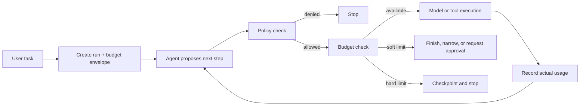

# Agent Execution Budgets: Bound Autonomy Before the Run Starts

## Why this matters

Yesterday's policy layer answered **may this action run?** A second question is equally important: **how much work may this agent consume before it must stop or ask for help?**

An agent can perform only individually permitted actions and still behave badly: loop through 80 model calls, retry a failing deployment repeatedly, burn an unexpected token bill, or modify hundreds of files when the intended migration touched ten.

An **execution budget** is a deterministic limit on resources an agent run may consume. Examples include model turns, tokens, tool calls, elapsed time, retries, monetary cost, and externally visible changes.

## Simple mental model: a corporate travel authorization

Approval to travel does not mean unlimited spending. The employee receives both **permission** and a **budget**: destination, dates, hotel ceiling, airfare ceiling, and expense limits.

**Policy = what the agent may do. Budget = how much of it the run may consume.**

## Core components and request flow

1. The harness creates a budget envelope when the run starts.
2. Before every model or tool operation, it checks the relevant remaining budget.
3. The operation executes only if both policy and budget permit it.
4. Actual consumption is recorded from authoritative runtime data.
5. Near a threshold, the harness can tell the agent to finish, narrow scope, or request approval.
6. At a hard threshold, the harness stops deterministically and checkpoints the run.



## Concrete example: migration agent

Suppose an agent migrates one MuleSoft application to Spring Boot. A reasonable initial run envelope might allow:

- 20 model turns
- 30 tool calls
- 3 retries in total, but no more than 1 retry for a write operation
- 250,000 total tokens
- 45 minutes wall-clock time
- 25 changed files
- 1 deployment to the test environment
- 0 production deployments

These are **harness limits**, not instructions such as "please avoid too many retries" in the system prompt.

## Practical Python implementation

```python
from dataclasses import dataclass

class BudgetExceeded(RuntimeError):
    pass

@dataclass
class Budget:
    max_turns: int = 20
    max_tool_calls: int = 30
    max_retries: int = 3
    max_tokens: int = 250_000
    max_changed_files: int = 25

    turns: int = 0
    tool_calls: int = 0
    retries: int = 0
    tokens: int = 0
    changed_files: int = 0

    def require(self, field: str, amount: int = 1) -> None:
        current = getattr(self, field)
        maximum = getattr(self, f"max_{field}")
        if current + amount > maximum:
            raise BudgetExceeded(
                f"{field} budget exceeded: {current + amount}/{maximum}"
            )

    def consume(self, field: str, amount: int = 1) -> None:
        self.require(field, amount)
        setattr(self, field, getattr(self, field) + amount)

budget = Budget()
budget.consume("turns")
budget.consume("tool_calls")
budget.consume("tokens", amount=8_420)
```

In a real harness, separate **reservation** from **settlement**. Before an expensive operation, reserve enough budget to start it. Afterwards, settle against actual provider usage. This prevents two parallel tool calls from both seeing the same remaining budget.

OpenAI's Agents SDK exposes a `max_turns` safety limit and raises `MaxTurnsExceeded` when a run exceeds it. It also tracks requests and token usage for each run, giving the harness authoritative measurements for token and cost controls. Treat these framework capabilities as inputs to a broader budget policy rather than assuming one turn limit solves the problem.

### Soft limits versus hard limits

A **hard limit** is enforced mechanically: for example, never deploy to production or never exceed 30 tool calls.

A **soft limit** is an early warning. At 80% of the token budget, the harness might add a trusted instruction such as: "Budget is nearly exhausted; summarize findings and stop making exploratory calls." The model can respond intelligently to a soft limit, but only deterministic code should enforce the hard limit.

## What should you budget?

Start with dimensions you can measure reliably:

- **Turns / model requests** — catches reasoning loops.
- **Tokens and cost** — controls model consumption.
- **Tool calls** — catches repetitive agent behavior.
- **Retries** — prevents retry storms.
- **Wall-clock duration** — limits abandoned or stuck runs.
- **Side effects** — changed files, API writes, deployments, tickets created.
- **Blast radius** — resources, repositories, customers, or records touched.

Do not collapse these into one artificial number. Ten read-only searches and ten production mutations are not equivalent even if both equal ten tool calls.

## Common mistakes and failure modes

- Putting budget guidance only in the prompt.
- Limiting tokens but ignoring external side effects.
- Counting all tool calls equally regardless of risk.
- Resetting budgets after agent handoffs or process restarts.
- Allowing retries to bypass the original tool-call budget.
- Checking limits only after an expensive action has completed.
- Using per-agent budgets in a multi-agent run without a parent run budget.
- Silently extending a budget when the agent runs out.

## Enterprise use cases

**Migration automation:** cap changed files, test executions, repository writes, and deployments per migration run.

**Coding assistant:** limit autonomous edits to one repository and a bounded file count; require approval to extend scope.

**Claims agent:** cap records accessed and payments attempted within a case; combine with monetary authorization policy.

**Cloud operations:** limit resource mutations, regions, retries, and incident duration even when individual operations are authorized.

**Agentic RAG:** cap retrieval rounds, documents fetched, reranking calls, and model tokens so iterative retrieval cannot expand indefinitely.

## Java and Go notes

In Java, model the budget as immutable limits plus thread-safe counters and enforce it in interceptors around model/tool execution. In Go, carry a run budget through `context.Context`, but keep mutable accounting in a concurrency-safe run-state object rather than storing mutable counters directly in the context.

For distributed agents, persist counters with the workflow checkpoint. Use atomic conditional updates or reservations so parallel workers cannot overspend the same shared budget.

## Cloud mapping

Cloud-native controls can complement application-level budgets. AWS, Azure, and GCP provide quotas, IAM controls, monitoring, and billing alerts, but those are usually broader infrastructure boundaries. Your agent harness still needs a **per-run semantic budget** such as "this migration may change at most 25 files and deploy once to test."

## 30–60 minute exercise

Extend the Python `Budget` class for a migration agent. Add `test_runs`, `repo_writes`, `deployments`, and `elapsed_seconds`. Then implement:

1. A soft threshold at 80% for tokens and tool calls.
2. A hard stop at 100%.
3. A separate `max_write_retries = 1` rule.
4. Persistence to JSON so a resumed run retains consumed budget.
5. Five tests proving that a handoff or resume cannot reset counters.

Finally decide which limits belong at **run**, **workflow**, **agent**, and **tool** scope.

## What to learn next

Next: **budget-aware planning** — using remaining time, token, and side-effect budgets to choose a smaller viable plan instead of merely stopping when limits are exhausted.

## Reading

1. [OpenAI Agents SDK — Usage](https://openai.github.io/openai-agents-python/usage/)
2. [OpenAI Agents SDK — Running agents and max turns](https://openai.github.io/openai-agents-python/running_agents/)
3. [OpenTelemetry — GenAI semantic conventions](https://opentelemetry.io/docs/specs/semconv/gen-ai/)
4. [AWS Well-Architected — Cost Optimization](https://docs.aws.amazon.com/wellarchitected/latest/cost-optimization-pillar/welcome.html)
