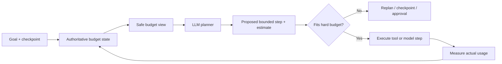

# Budget-Aware Planning: Make the Agent Spend Its Autonomy Deliberately

## Why this matters

Yesterday's execution budget put a hard ceiling on autonomy. A better agent should not simply run at full speed until it hits that ceiling; it should **change its plan as resources become scarce**.

Consider a migration agent asked to convert 40 MuleSoft flows. If only six tool calls and two model turns remain, starting a broad repository analysis is a poor decision. It should instead finish the highest-value in-progress unit, produce a checkpoint, and leave a precise continuation plan.

**Budget-aware planning** means the planner receives a safe summary of remaining resources and chooses a feasible next step. The harness still owns the hard limits.

## Simple mental model: fuel-aware navigation

A navigation system does not merely know that the fuel tank has a maximum capacity. It continuously asks: **given the fuel remaining, which route is still feasible?**

The same separation applies to agents:

- **Budget controller:** authoritative meter and hard stop.
- **Planner:** chooses work that fits the remaining envelope.
- **Executor:** performs the chosen action.

The LLM may reason about the budget, but it must never be the authority that decides whether the budget has actually been exceeded.

## Core components and request flow

1. The harness owns an authoritative `BudgetState`.
2. Before planning, it derives a small model-visible **budget view** such as `NORMAL`, `CONSTRAINED`, or `CRITICAL` plus selected remaining quantities.
3. The planner proposes the next bounded step and estimates its expected consumption.
4. Deterministic code validates whether the proposal fits the remaining hard budget.
5. The executor performs the step.
6. Actual usage—not the model's estimate—is charged to the budget.
7. The next planning cycle sees the updated budget.



## Concrete implementation example: migration agent

Suppose the agent is modernizing integration flows. Its normal plan is discover source artifacts, extract semantics, generate target code, run tests, repair failures, and commit results.

With ample budget it can inspect related flows and run broader tests. Under pressure it should narrow scope:

- **NORMAL:** explore alternatives and run broad validation.
- **CONSTRAINED:** stop optional exploration; finish the current flow and run targeted tests.
- **CRITICAL:** perform no new migration unit; checkpoint state, summarize blockers, and terminate cleanly.

This is different from merely increasing `max_turns`. More turns increase capacity; budget-aware planning changes **behavior as capacity falls**.

## Practical Python pattern

```python
from dataclasses import dataclass
from enum import Enum

class Pressure(str, Enum):
    NORMAL = "normal"
    CONSTRAINED = "constrained"
    CRITICAL = "critical"

@dataclass
class BudgetState:
    turns_left: int
    tool_calls_left: int
    tokens_left: int
    side_effects_left: int

    def pressure(self) -> Pressure:
        if self.turns_left <= 1 or self.tool_calls_left <= 2:
            return Pressure.CRITICAL
        if self.turns_left <= 3 or self.tool_calls_left <= 6:
            return Pressure.CONSTRAINED
        return Pressure.NORMAL

@dataclass
class PlannedStep:
    action: str
    estimated_tool_calls: int
    estimated_side_effects: int


def planner_context(b: BudgetState) -> dict:
    return {
        "budget_pressure": b.pressure().value,
        "turns_left": b.turns_left,
        "tool_calls_left": b.tool_calls_left,
        "side_effects_left": b.side_effects_left,
    }


def validate(step: PlannedStep, b: BudgetState) -> None:
    if step.estimated_tool_calls > b.tool_calls_left:
        raise ValueError("plan exceeds tool-call budget")
    if step.estimated_side_effects > b.side_effects_left:
        raise ValueError("plan exceeds side-effect budget")
```

The planner can return a structured `PlannedStep`, but `validate()` is deterministic. After execution, charge **measured** tool calls and token usage to `BudgetState`; never trust the LLM to report what it consumed.

OpenAI's Agents SDK exposes aggregated per-run request and token usage through the run context, and its runner supports a hard `max_turns` limit. These are useful raw signals for a harness-level controller; budget-aware planning is the layer that decides how to use the remaining capacity intelligently.

### Java and Go notes

In Java, model the budget as an immutable record and place validation in the orchestration service rather than an agent prompt. In Go, pass a small `BudgetView` into planner input while retaining the authoritative counters in the runner; `context.Context` deadlines are useful for the independent wall-clock limit.

## Common mistakes and failure modes

- **Letting the LLM enforce its own budget.** A prompt saying "do not exceed five calls" is guidance, not enforcement.
- **Using estimated cost as actual cost.** Estimates help planning; runtime telemetry performs accounting.
- **Exposing every internal counter.** Give the model only information that improves its decision; keep credentials, policy internals, and mutable enforcement state outside model context.
- **Stopping without a checkpoint.** Budget exhaustion should create a resumable state and concise continuation instructions.
- **Optimizing only tokens.** Tool calls, elapsed time, external writes, retries, and blast radius can be more important than token cost.
- **Starting work that cannot finish.** Validate a proposed step's minimum expected resource need before executing it.

## Enterprise use cases

**Application modernization:** finish one migration unit rather than partially editing many when the run approaches its write budget.

**Claims processing:** when tool capacity is low, stop optional evidence enrichment and complete the current deterministic validation path.

**Coding assistants:** reserve enough budget for tests and a final diff review instead of spending everything on exploratory repository searches.

**Operations agents:** preserve a side-effect reserve for rollback or compensation rather than consuming every permitted write on the forward path.

## Architecture guidance

Treat budgets as part of the harness control plane. A useful production design has three layers:

1. **Hard envelope:** deterministic limits enforced around model and tool execution.
2. **Planning view:** a coarse, model-visible representation of remaining capacity.
3. **Reserve:** capacity unavailable to normal planning and held for cleanup, reconciliation, compensation, or final reporting.

That third layer is easy to miss. If a run has ten write operations available, allocating all ten to forward progress leaves nothing for recovery. Reserve capacity just as distributed systems reserve resources for control-plane operations.

Cloud-specific services are not necessary for the pattern. Use the telemetry, timeout, quota, and identity facilities of your runtime, but keep the budget semantics portable in the agent harness.

## 30–60 minute exercise

Extend yesterday's `BudgetState` with budget pressure and a recovery reserve.

Create three sample states: healthy, constrained, and critical. For each, make a planner choose among `discover_next_flow`, `finish_current_flow`, `run_targeted_tests`, and `checkpoint_and_stop`. Add deterministic tests proving that:

- a plan cannot consume the recovery reserve;
- critical pressure cannot start a new migration unit;
- measured usage is charged even when it exceeds the planner's estimate;
- the run produces a checkpoint before a hard stop.

Do not call an LLM initially. Implement the policy as ordinary Python first, then replace only the planner choice with structured LLM output.

## What to learn next

**Adaptive model and tool selection under budgets:** when should a harness switch to a cheaper model, narrower retrieval, targeted tests, or a human checkpoint rather than merely shortening the plan?

## Reading

- [OpenAI Agents SDK — Usage](https://openai.github.io/openai-agents-python/usage/)
- [OpenAI Agents SDK — Running agents](https://openai.github.io/openai-agents-python/running_agents/)
- [OpenAI Agents SDK — Context management](https://openai.github.io/openai-agents-python/context/)
- [OpenAI Agents SDK — Guardrails](https://openai.github.io/openai-agents-python/guardrails/)
