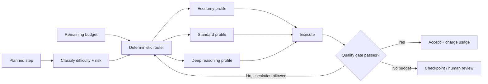

# Adaptive Model and Tool Selection: Spend Intelligence Where It Matters

## Why this matters

Yesterday's budget-aware planner changed *what work* an agent attempts as resources shrink. The next practical step is changing **how expensive each step is**.

A migration agent does not need its strongest reasoning model to list files or summarize compiler output. But choosing a target architecture, repairing a subtle semantic mismatch, or deciding whether generated code is safe to commit may justify more reasoning capacity.

**Adaptive model and tool selection** means the harness chooses an execution profile for each step based on difficulty, risk, and remaining budget. The model may recommend a profile, but deterministic code owns the routing rules and limits.

## Simple mental model: a hospital triage desk

A hospital does not send every patient directly to the most specialized surgeon. Triage routes routine cases to inexpensive capacity and escalates uncertain or high-risk cases to specialists.

- **Router:** triage desk.
- **Execution profile:** model + reasoning level + tool/retrieval policy.
- **Escalation trigger:** evidence that the current profile is insufficient.
- **Quality gate:** objective check before accepting the result.

The goal is not "always use the cheapest model." It is **use the least expensive profile that can reliably satisfy the current step**.

## Core components and request flow

1. The planner proposes a bounded step.
2. Deterministic code classifies the step by task type, risk, and expected complexity.
3. The budget controller supplies remaining token, time, and tool capacity.
4. A router selects an approved execution profile.
5. The step executes with only the tools and retrieval depth allowed by that profile.
6. A quality gate checks the result.
7. Failure may trigger one controlled escalation to a stronger profile; actual usage is charged to the budget.



## Concrete example: integration migration agent

Consider a MuleSoft-to-Spring Boot migration workflow.

**Economy profile:** inventory XML files, classify connector types, summarize deterministic test output. Use a fast model, narrow context, and read-only tools.

**Standard profile:** map a flow to a target Spring Integration/Camel design, generate routine code, or repair straightforward compile failures. Allow repository search and targeted documentation retrieval.

**Deep profile:** resolve ambiguous transaction semantics, concurrency behavior, security-sensitive transformations, or repeated test failures. Use stronger reasoning, broader evidence retrieval, and stricter review gates.

Routing occurs **per step**, not once for the entire agent. A single migration run can legitimately use all three profiles.

## Practical Python pattern

```python
from dataclasses import dataclass
from enum import Enum

class Tier(str, Enum):
    ECONOMY = "economy"
    STANDARD = "standard"
    DEEP = "deep"

@dataclass(frozen=True)
class Step:
    kind: str
    risk: int
    failed_attempts: int = 0

@dataclass(frozen=True)
class Budget:
    tokens_left: int
    tool_calls_left: int

@dataclass(frozen=True)
class Profile:
    tier: Tier
    model: str
    reasoning: str
    retrieval_k: int
    max_tool_calls: int

PROFILES = {
    Tier.ECONOMY: Profile(Tier.ECONOMY, "fast-model", "low", 3, 2),
    Tier.STANDARD: Profile(Tier.STANDARD, "standard-model", "medium", 6, 5),
    Tier.DEEP: Profile(Tier.DEEP, "strong-model", "high", 10, 8),
}

def route(step: Step, budget: Budget) -> Profile:
    if step.risk >= 4 or step.failed_attempts >= 2:
        tier = Tier.DEEP
    elif step.kind in {"design", "generate", "repair"}:
        tier = Tier.STANDARD
    else:
        tier = Tier.ECONOMY

    if budget.tokens_left < 8_000 and tier == Tier.DEEP:
        tier = Tier.STANDARD
    if budget.tool_calls_left <= 2:
        tier = Tier.ECONOMY

    return PROFILES[tier]
```

In production, model names, allowed tools, reasoning settings, retrieval limits, and maximum cost should live in versioned configuration rather than prompts. The OpenAI Agents SDK supports model selection per agent/run and configurable model settings, making this routing layer practical without coupling the planner to one model configuration.

### Java and Go note

In Java, represent profiles as immutable records and implement routing as a pure service before invoking your model client. In Go, use typed structs plus a small policy function. In both cases, keep routing outside LLM-generated control flow so it is testable and auditable.

## What should trigger escalation?

Good triggers are observable rather than model statements such as "this seems hard":

- schema or compilation validation failed;
- expected evidence was not retrieved;
- deterministic checks fall below a threshold;
- two repair attempts failed;
- the action crosses a predefined risk boundary;
- an evaluator detects semantic mismatch.

Escalation should itself consume budget. Otherwise a cheap-first strategy can become more expensive than choosing the correct profile initially.

## Common mistakes and failure modes

- **Routing only by prompt length.** Long input is not necessarily difficult; short security decisions can be high risk.
- **Letting the LLM freely choose any model.** This turns cost and capability governance into a suggestion.
- **Cheap-first retry loops.** Three failed cheap attempts can cost more and add latency than one appropriate call.
- **Changing model without changing context.** Stronger reasoning cannot compensate for missing evidence.
- **Reducing retrieval blindly.** Narrow retrieval saves tokens but can remove evidence needed for correctness.
- **No quality gate.** Without validation, you cannot know when escalation is required.
- **No routing telemetry.** Record selected profile, reason, usage, latency, result, and escalation path.

## Enterprise use cases

- **Migration automation:** cheap inventory and classification; stronger models for semantic transformation and repair.
- **Coding assistants:** lightweight model for navigation and explanation; stronger reasoning for cross-module refactoring.
- **Agentic RAG:** vary retrieval depth and reranking based on query ambiguity and business risk.
- **Claims/case management:** routine information gathering uses a constrained profile; policy interpretation or irreversible actions escalate.
- **Operations agents:** diagnostic reads can be inexpensive; remediation plans receive stronger reasoning plus approval.

## Architecture guidance

Treat execution profiles as an enterprise policy artifact. A useful profile defines the approved model/provider and reasoning configuration, token and timeout limits, permitted tool classes, retrieval strategy, parallelism, quality gate, escalation target, and cost/risk ceiling.

Do not route solely on model cost. Optimize a multi-dimensional objective: **quality, latency, cost, risk, and remaining run budget**.

Cloud mappings are optional here because the pattern belongs primarily in the agent harness. On AWS, Azure, or GCP, use your chosen model gateway/runtime telemetry and policy layer to implement the same profile abstraction rather than embedding provider-specific names throughout workflow code.

## 30–60 minute hands-on exercise

Build a tiny router for a migration assistant. Create 12 sample steps across `inventory`, `design`, `generate`, `test`, and `repair`. Assign each a risk score and failed-attempt count. Define three profiles, route every step, then add two deterministic quality gates: JSON/schema validity and test success. Simulate failures and permit at most one escalation.

Record: step, selected tier, escalation reason, estimated tokens, actual tokens, latency, and final result. Then answer: **which signals were actually useful for routing, and which were merely guesses?**

## What to learn next

Next: **evaluation-driven routing** — using offline eval data to decide which model/profile is good enough for each task class instead of relying on hand-written routing intuition alone.

## Reading

- [OpenAI Agents SDK — Models](https://openai.github.io/openai-agents-python/models/)
- [OpenAI Agents SDK — Model settings](https://openai.github.io/openai-agents-python/ref/model_settings/)
- [OpenAI Agents SDK — Agents and tool choice](https://openai.github.io/openai-agents-python/agents/)
- [Google ADK — Agent Runtime Code Execution](https://google.github.io/adk-docs/tools/google-cloud/code-exec-agent-engine/)
- [Google ADK / Freeplay — Observability and evaluation](https://google.github.io/adk-docs/integrations/freeplay/)
