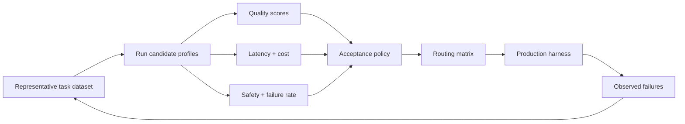

# Evaluation-Driven Routing: Let Evidence Choose the Execution Profile

## Why this matters

Yesterday's adaptive router chose an execution profile from task difficulty, risk, and remaining budget. That is useful, but a rule such as `risk >= 4 -> deep model` is still largely an architectural guess.

**Evaluation-driven routing** replaces that guess with evidence. You run representative tasks through candidate execution profiles, measure the outcomes, and promote the cheapest profile that reliably clears the quality and risk thresholds for that task class.

This is the bridge between **evals** and production agent architecture: eval results stop being a dashboard and become configuration for the harness.

## Simple mental model: performance testing for model choices

When selecting a database configuration, you would not say, "the larger instance feels safer." You define workloads, run benchmarks, measure latency and throughput, and choose a configuration with enough headroom.

Use the same idea for agent execution profiles:

- **Task class**: a repeatable category such as `inventory`, `code_generation`, or `semantic_repair`.
- **Eval dataset**: representative examples with expected outcomes or scoring criteria.
- **Execution profile**: model, reasoning level, retrieval policy, and tool limits evaluated together.
- **Quality gate**: the minimum acceptable score for deployment.
- **Routing policy**: deterministic mapping from task class to the cheapest profile that passes its gates.

The key point is that you are evaluating the **profile**, not merely the model.

## Core components and request flow

1. Partition production work into meaningful task classes.
2. Build a small but representative offline eval dataset for each class.
3. Run every approved execution profile against the same examples.
4. Score correctness, task completion, safety, latency, and cost.
5. Apply task-specific acceptance thresholds.
6. Select the least expensive profile with sufficient reliability margin.
7. Publish the result as versioned routing configuration.
8. At runtime, the harness uses that configuration; it does not ask the LLM which model it prefers.
9. Feed production failures back into the offline dataset.



## Concrete example: migration automation

Suppose a MuleSoft-to-Spring Boot migration agent has three task classes:

- `inventory`: identify flows, connectors, and dependencies.
- `generate`: create routine Spring Boot integration code.
- `semantic_repair`: resolve behavioral mismatches after tests fail.

And three profiles:

- **Economy**: fast model, low reasoning, narrow retrieval, read-heavy tools.
- **Standard**: stronger model, medium reasoning, repository search, targeted documentation retrieval.
- **Deep**: strongest reasoning profile, broader evidence retrieval, larger tool budget.

Your offline results might look like this:

| Task class | Economy pass rate | Standard pass rate | Deep pass rate | Required |
|---|---:|---:|---:|---:|
| inventory | 98% | 99% | 99% | 95% |
| generate | 78% | 94% | 97% | 92% |
| semantic_repair | 51% | 82% | 95% | 93% |

The routing decision becomes straightforward:

- `inventory -> economy`
- `generate -> standard`
- `semantic_repair -> deep`

This is stronger than routing by vague difficulty labels because the decision is tied to measured behavior on your workload.

## What should you measure?

Do not reduce routing to one generic "quality score." Different task classes need different gates.

For migration automation, useful metrics include task success, schema validity, compile/test pass rate, semantic parity, tool correctness, unsafe action rate, latency, and cost per successful task.

For subjective dimensions such as explanation quality, use a calibrated model-based judge or human review. For code compilation, schema validation, and tests, prefer deterministic evaluators.

## Practical Python pattern

Keep the evaluation result separate from runtime code. Produce a routing matrix as a build artifact.

```python
from dataclasses import dataclass

@dataclass(frozen=True)
class EvalResult:
    task_class: str
    profile: str
    pass_rate: float
    unsafe_rate: float
    p95_latency_ms: int
    avg_cost_usd: float

THRESHOLDS = {
    "inventory": {"pass_rate": 0.95, "unsafe_rate": 0.001},
    "generate": {"pass_rate": 0.92, "unsafe_rate": 0.001},
    "semantic_repair": {"pass_rate": 0.93, "unsafe_rate": 0.0001},
}

PROFILE_ORDER = ["economy", "standard", "deep"]

def choose_profile(task_class: str, results: list[EvalResult]) -> str:
    gate = THRESHOLDS[task_class]
    candidates = {r.profile: r for r in results if r.task_class == task_class}

    for profile in PROFILE_ORDER:
        r = candidates[profile]
        if r.pass_rate >= gate["pass_rate"] and r.unsafe_rate <= gate["unsafe_rate"]:
            return profile

    raise RuntimeError(f"No approved profile for {task_class}")
```

A production version should also enforce minimum sample size, confidence intervals, latency limits, and cost ceilings. The important architectural separation is:

**evaluation pipeline -> approved routing configuration -> runtime harness**.

Do not make production requests rerun the entire evaluation decision.

### Add a reliability margin

If Standard scores 92.1% and your threshold is 92%, routing all production traffic to Standard is fragile. Small dataset changes or model updates can push it below the gate. Use a margin, or for critical tasks require the lower confidence bound to clear the threshold.

### Java and Go note

In Java, make the routing matrix immutable configuration loaded by the harness, and keep the eval runner in a separate build/test module. In Go, serialize the approved matrix to versioned JSON or YAML and load it into a small typed routing service. Neither runtime should depend directly on notebooks or evaluation SDKs.

## Offline evals versus runtime routing

Evaluation-driven routing is primarily an **offline** control loop. You should know which profiles are approved before serving production traffic.

Online telemetry still matters. It detects drift: rising retries, lower test pass rates, longer latency, or new task patterns. But do not let a noisy production metric immediately rewrite routing rules. Treat changes like software releases: evaluate, review, version, deploy, and roll back if necessary.

## Common mistakes and failure modes

- **Evaluating only generic benchmarks.** A model that scores well on coding benchmarks may still fail your integration-migration semantics.
- **Evaluating the model but not the profile.** Retrieval depth, tools, prompts, reasoning settings, and context construction can change results materially.
- **Using one threshold for every task.** Inventory extraction and transaction-semantic repair have different risk profiles.
- **Optimizing average score only.** Tail failures can dominate enterprise risk.
- **Ignoring sample size.** A 100% pass rate on five examples is weak evidence.
- **Training on your eval set.** Repeatedly tuning prompts against the same small dataset causes overfitting.
- **Ignoring model updates.** Re-run routing evals when models, prompts, tools, retrieval, or harness logic change.
- **Using an uncalibrated LLM judge as truth.** Compare judge scores with human labels before trusting them for important gates.
- **Routing solely on cost per call.** Measure cost per successful task, including retries and escalations.

## Enterprise use cases

- **Migration factories:** select profiles separately for discovery, transformation, test repair, and semantic validation.
- **Coding assistants:** use lightweight profiles for navigation but measured stronger profiles for cross-module changes.
- **Agentic RAG:** choose retrieval depth, reranking, and model tier based on measured answer quality by query class.
- **Claims processing:** evaluate routine extraction separately from policy interpretation and payment-changing actions.
- **Operations agents:** benchmark diagnostic planning separately from remediation planning, with stricter safety gates for write operations.

## Practical architecture guidance

Start small. You do not need thousands of examples to make routing more evidence-based than hand-written intuition.

For each important task class, begin with 20-50 carefully chosen cases covering normal, boundary, and known-failure scenarios. Prefer deterministic graders wherever possible. Add human-reviewed examples for ambiguous semantic judgments. Record every evaluation with the exact model version, prompt/harness version, tool set, retrieval configuration, dataset version, and evaluator version.

A useful routing registry entry can look like:

```yaml
task_class: semantic_repair
profile: deep-v3
eval_dataset: migration-repair-v7
pass_rate: 0.956
minimum_required: 0.93
max_unsafe_rate: 0.0001
approved_at: 2026-09-15
```

The registry becomes part of your release evidence.

## Cloud mappings

Use managed evaluation services when they reduce plumbing, but keep your evaluation schema portable.

- **GCP:** Vertex AI Gen AI evaluation can evaluate generative applications and agents, store per-example and aggregate metrics, and support model-based evaluation.
- **AWS:** Bedrock evaluation capabilities can be used for model/application comparison; keep your routing matrix outside provider-specific runtime code.
- **Azure:** Azure AI evaluation tooling can participate in the same offline pipeline; publish only the approved profile mapping to the serving harness.

The architectural pattern is more important than the specific evaluation service.

## 30–60 minute hands-on exercise

Create an evaluation matrix for a small coding or migration assistant.

1. Define three task classes: `explain`, `generate`, and `repair`.
2. Write 10 representative examples for each.
3. Define Economy, Standard, and Deep profiles.
4. Choose one deterministic metric per class: required facts present, unit tests passed, or repair test passed.
5. Run or simulate the three profiles and calculate pass rate, average latency, and cost per successful task.
6. Set a minimum pass rate for each task class.
7. Generate a JSON/YAML routing matrix selecting the cheapest passing profile.
8. Add one difficult example that breaks the chosen profile and decide whether to improve the profile, split the task class, or escalate that case.

The design question to answer is: **what evidence would make you comfortable downgrading a production task from Deep to Standard?**

## What to learn next

Next: **routing drift and continuous evaluation** — detecting when a previously approved execution profile is no longer good enough because the workload, model, prompt, retrieval corpus, or tools changed.

## Reading

- [Google Cloud — Evaluate agents with Vertex AI](https://docs.cloud.google.com/vertex-ai/generative-ai/docs/agent-engine/evaluate)
- [Google Cloud — View and interpret Gen AI evaluation results](https://docs.cloud.google.com/vertex-ai/generative-ai/docs/models/eval-python-sdk/view-evaluation)
- [Google Cloud — Evaluate a judge model](https://docs.cloud.google.com/vertex-ai/generative-ai/docs/models/evaluate-judge-model)
- [OpenAI — Models and model selection](https://platform.openai.com/docs/models)
- [Anthropic — Prompting best practices and model migration considerations](https://docs.anthropic.com/en/docs/build-with-claude/prompt-engineering/prompt-templates-and-variables)
